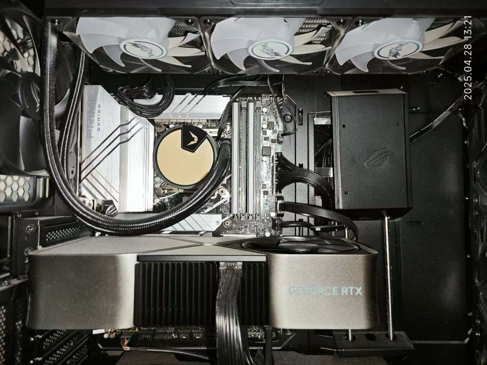

# 硬件相关知识

计算机可以分为**硬件**和**软件**两部分。硬件是指计算机的物理部件，如中央处理器（CPU）、内存、硬盘、显示器等；软件是指计算机上运行的程序和操作系统，如Windows、Linux、macOS等操作系统，以及Google Chrome、Microsoft VS Code、Tencent QQ等应用程序。

计算机的硬件，也可以叫做设备，可以简单分为两类：一类叫做**主机设备**，是计算机用来进行计算等工作的设备；另一类叫做**外设设备**（也可以叫做输入输出设备），是计算机与外界进行信息交互的设备。通常说来，前者是藏在机箱里看不见的，后者是我们能够直接看见的。

## CPU

CPU是计算机的最核心部件，它从存储设备读取指令和数据，并且执行这些指令。尽管现代处理器对代码和数据会有不同的处理，但是从程序员视角来看，其本质上都以二进制存储。代码由一条一条的指令组成，CPU 按照顺序一条一条执行从存储设备中读取的指令（至少从软件和程序员等使用者的视角看是这样），指令可以是修改 CPU 的状态，进行运算，或者是从其他硬件读取信息或者输出信息。如果希望进一步学习CPU如何运作等相关知识，可以参考著名的教材《CSAPP》，也可以修习《计算机系统导论》（ICS）这门课。

## 内存

内存是计算机的临时存储器，它用于存储正在运行的程序和数据。它能够被CPU直接访问，因此速度较快。对于程序员而言，内存可以被抽象为一堆连续的存储单元，每个存储单元都有一个唯一的地址；执行程序时，程序的一部分或者全部被放进内存中，CPU就在内存中找寻需要的数据或者指令，如同在排列整齐的书架上寻找需要的书籍。

现代计算机内存读写速度很快，但是已经跟不上CPU的速度，因此又引入了高速缓存来加速内存的读写速度。高速缓存是内存和CPU之间的一个小型存储器，它存储了最近使用的数据和指令，以便CPU可以更快地访问它们。在断电以后，内存中存储的数据会丢失，因此内存也被称为是易失性的存储器。

!!! note
    上述文本中的“内存”指的是“随机存取存储器”（RAM）。这里的“随机”指的是可以在任意时刻访问任意地址，而不是“顺序存取”的存储器（例如磁带）。同时，“内存”这个词在部分语境下存在不同的含义，例如在BIOS语境下的“内存”指的是“只读存储器”（ROM），在移动设备（手机）等语境下的“内存”指的是“闪存”，这实际上是外存。

## 外存

外存是现代计算机的主要存储设备，用于存储操作系统、应用程序和数据等内容。其读写速度往往比内存慢得多，但是它的存储容量更大且往往是非易失的（相对内存而言）。

现代计算机的主要外存设备是硬盘。硬盘可以分为机械硬盘（HDD）和固态硬盘（SSD）。机械硬盘使用磁头在旋转的磁盘上读取和写入数据，而固态硬盘使用闪存芯片来存储数据。固态硬盘的读写速度比机械硬盘快得多，现在价格也便宜得多，但是使用寿命较短，且因为电荷流失等问题无法接受长期不通电等情况，不适宜作为长期存档介质（个人使用寿命和HDD无明显差异，基本都能用到彻底换机），除非花高价买高端的企业级SSD，但仍需定期通电。

除硬盘外，还有其他外部存储设备。例如：
- U盘：一种小型的闪存存储设备，通常通过USB接口连接到计算机上。虽然和SSD都使用闪存颗粒，但是SSD通过主控优化、多通道技术等实现更高的性能，U盘则只用于低成本的便携存储。
- 光盘：一种使用激光读取和写入数据的存储介质。常见的光盘有CD、DVD和蓝光光盘，现在常用于单次写入的存档等。缺点是容易划伤和损坏，且信息密度低，读写速度慢。
- 磁带：一种使用磁性材料存储数据的介质，通常用于备份和存档。磁带的读写速度极为缓慢（和倒带速度成正比）且需要专门的设备来读写，设备价格昂贵，维护成本高。其优点是可靠性高，存储密度高。
- 软盘：一种老古董，使用磁性材料存储数据。现在软盘因为存储容量小、速度慢、易损坏等缺点，已经被淘汰了。

!!! note
    现代Windows系统的计算机中盘符默认从C开始而不是从A开始，正是因为AB盘符是给软驱用的；但是硬盘盘符从C开始的传统保留了下来，成为Windows的一个标志性特征。虽然现代的Windows系统允许手动分配盘符（如将C盘强行分配盘符A），但这样会导致系统不稳定，极不建议这么做。

!!! tip
    **硬盘有价，数据无价。**请务必定期备份数据！

## 显卡

显卡是计算机的图形处理器，它用于处理图形和视频数据。显卡可以加速图形渲染，提高游戏和视频播放的性能。显卡通常有自己的内存，用于存储图形数据，被称为“显存”。

对于现在AI时代而言，显卡因为有着良好的并行特性，成为了深度学习的首选硬件之一。显卡的计算能力通常用“浮点运算每秒”（FLOPS）来衡量，通常情况下，显卡在机器学习等需要大量并行的简单计算工作上，表现远好于CPU。

## 主板、电源

主板是一块电路板，将所有的硬件设备连接起来。主板上的芯片组负责协调各个硬件之间的通信。同时，主板还有一系列外部接口，用于连接外部设备。

电源是计算机的电源供应器，它不参与数据存储与运算等操作，但能够为计算机的各个部件提供所需的稳定工作电压和电流。优质的电源能够避免计算机在运行过程中出现故障，延长计算机的寿命。

## 输入输出设备

输入输出设备指的是计算机与外界进行信息交互的设备。输入设备用于将用户的输入转换为计算机可以理解的格式，而输出设备则将计算机处理后的数据转换为用户可以理解的格式。

最古老的输入设备是拔插电缆，后来变成打孔纸带；现代常见的输入设备包括键盘、鼠标、扫描仪、麦克风等；现代常见的输出设备例如显示器、打印机、音响等。
