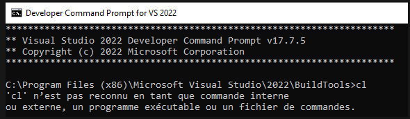
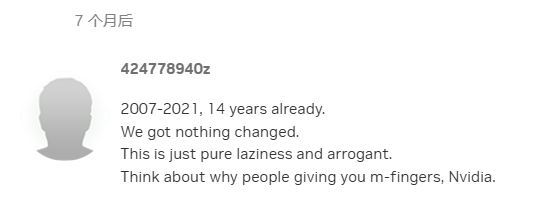

# 神经网络和机器学习

目前人工智能算是一个大潮流了：从今年年初的DeepSeek-R1到最近的GPT-5、Sora2等一众高性能的人工智能工具，在多个领域取得了令人瞩目的成果。而为了理解这些工具的工作原理，我们要把目光投向神经网络和机器学习：这是当今人工智能工具的祖先，也是直到现在他们的核心。

!!! note

    本章内容完全基于笔者个人在学习和科研中的理解进行总结，难免有疏漏和错误或者跳跃之处，敬请谅解。如有兴趣深入学习，建议参考相关教材和文献。

    另外，本章节是很“数学”的，建议读者先学会高等数学和线性代数的一些内容，再来阅读本章内容会更好。

## 从最简单的神经元说起

### 0-1二分类问题

假设我们现在有一百万个图片，每张图片上面都是一个手写数字，要么是0、要么是1。这些图片的大小都是28x28像素，每个像素是黑白两色（0表示白色，1表示黑色）。现在希望把这些图片分开。

一个最简单的手段就是：找一群无所事事的大学生，让他们每人看一堆图片并分类，按0和1分两堆。这样就能把图片分开了。但是这样显然是很低效的。有没有一种自动化的手段呢？

我们试着变换一下思路：假设每一个像素点都是一个变量 $x_i$，那么每一个图片就可以表示为一个向量 $\mathbf{x}=(x_1, x_2, \ldots, x_{784})$，其中 $784=28\times 28$。那么，我们会在784维空间中得到一百万个点，每个点对应一张图片。现在似乎依然没有解决问题。

但是，**如果0和1的写法确实是有区别的，那么这一堆点在直觉上应该显然是呆在这个784维空间的不同区域的**。这也是神经网络的基本假设：**不同类别的数据在高维空间中是可以被划分开的**。那么，我们确实可以试着找一个“超平面”，或“线”，把这些点分开（或大多数点分开）。换言之：

$$0 = \mathbf{W}^T \mathbf{x} + b$$

显然这是一个超平面方程；只要试图找到对于所有类别为0的点，使得$ f(\mathbf{x}) < 0$，而对于类别为1的点，使得$f(\mathbf{x}) > 0$即可。
!!! tip

    如果还是不能理解，可以考虑二维空间中的例子：假设我们有一堆点在平面上，有些点是红色的，有些点是蓝色的。我们希望找到一条直线，把红色的点和蓝色的点分开。这个直线的方程可以写成：
    $$0 = W_1 x_1 + W_2 x_2 + b$$
    高中应该都学过解析几何，我们可以轻易地看出这是一个直线方程。而我们希望对于所有红色的点，使得 $f(\mathbf{x}) < 0$，而对于蓝色的点，使得 $f(\mathbf{x}) > 0$。这就是一个简单的二分类问题。

    但是上述方程比较臃肿，因此我们写出两个向量：$\mathbf{W} = (W_1, W_2)$ 和 $\mathbf{x} = (x_1, x_2)$，那么上述方程就可以简化为：
    $$0 = \mathbf{W}^T \mathbf{x} + b$$
    学习过线性代数的同学应该能看出来这个方程和上述直线的“一般式”方程是等价的。因而，我们可以把这个例子推广到更高维的空间中去。

    如还是不能理解，可以思考三维空间内怎么表示一个平面方程。

那么我们的任务就变成了：**找到一组权重 $\mathbf{W}$ 和偏置 $b$，使得这个超平面能把大多数点分开**。而我们上述提出的这个方程，实际上就是最简单的神经元——线性神经元的工作原理。

### 怎么求解？

现在的问题是：我们怎么找到这组权重 $\mathbf{W}$ 和偏置 $b$ 呢？$\mathbb{R}$是一个连续的空间，暴力枚举根本行不通。但问题可不是仅凭“瞪眼”就能瞪出来的：要过河，总得先下水再研究怎么过去。

于是我们随机生成了一组权重 $\mathbf{W}$ 和偏置 $b$，并计算了所有点的$f(\mathbf{x})$。显然大概率不可能一下就分类对了，肯定有大量是分错了的。这时候，我们就“摸着石头过河”，让这个超平面朝着正确的方向“扭一点”，让它的分类结果比先前更好一点，这就是“学习”的过程。

那有学习就得有评价，怎么评价这个学习是好的还是坏的呢？我们需要进行一些“打分”：对于每一个点，我们都知道它的真实类别 $y$，而我们也可以通过$f(\mathbf{x})$来预测它的类别 $\hat{y}$。那么，我们就可以定义一个损失函数 $L(y, \hat{y})$，来衡量预测值和真实值之间的差距。比如说，最简单的0-1损失函数：
$$
L(y, \hat{y}) = 
0,  \text{如果 } y = \hat{y}  , 1,  \text{如果 } y \neq \hat{y}

$$
这个损失函数的意思是：如果预测正确，损失为0；如果预测错误，损失为1。然后，我们可以计算所有点的总损失：
$$J(\mathbf{W}, b) = \sum_{i=1}^{N} L(y_i, \hat{y}_i)$$
其中 $N$ 是点的总数。我们的目标就是最小化这个总损失 $J(\mathbf{W}, b)$，通过调整 $\mathbf{W}$ 和 $b$ 来实现更好的分类效果，只需要让这个损失函数的值成为全局最小[^1]即可。

我们知道，为了找到一个函数的最小值，可以对它求导，然后让导数为0，解出变量的值。但是上述损失函数显然不是一个性质很好的函数，无法直接求导。于是，我们引入了一个更平滑的损失函数，比如说均方误差（MSE）：
$$L(y, \hat{y}) = (y - \hat{y})^2$$
这样，我们就可以对总损失 $J(\mathbf{W}, b)$求导，得到梯度：
$$\nabla J(\mathbf{W}, b) = \left( \frac{\partial J}{\partial \mathbf{W}}, \frac{\partial J}{\partial b} \right)$$

但是就算这个函数能直接求导也不是很容易求出解析解的，这玩意维数可太高了。问题似乎又遭遇到了瓶颈。于是我们被迫寄希望于数学家，然后发现牛顿已经在几百年前发明了一种求解方程的办法：牛顿迭代法。

回忆一下这个方法的基本路径：求方程 $f(x) = 0$ 的解。我们从一个初始猜测 $x_0$ 出发，计算函数值 $f(x_0)$ 和导数 $f'(x_0)$，然后用切线来近似函数在这个点附近的行为。切线的方程是：
$$y = f(x_0) + f'(x_0)(x - x_0)$$
我们希望找到切线与$x$轴的交点，这个交点给出了一个新的猜测 $x_1$：
$$x_1 = x_0 - \frac{f(x_0)}{f'(x_0)}$$
然后，我们重复这个过程，直到收敛到一个解。

而我们的上述问题是为了求解导数等于零，所以可以把上述问题重新写成
$$x_{n+1} = x_n - [\nabla^2 J(x_n)]^{-1} \nabla J(x_n)$$
这是牛顿迭代法在多维空间优化问题的推广形式，其中 $\nabla^2 J(x_n)$ 是损失函数的海森矩阵（Hessian matrix），表示二阶导数信息。这个方法就是大名鼎鼎的**牛顿优化法**，它可以帮助我们找到损失函数的极小值，从而优化神经元的权重和偏置。

然后问题又来了：仅上述一个最简单的题，一共有784个权重和1个偏置，一共785个变量。计算海森矩阵的开销是非常大的，尤其是当数据量很大时，计算梯度和海森矩阵的代价会变得非常高昂，算海森矩阵的逆更是难上加难。

于是我们被迫重新回到牛顿优化法的最终结论，然后突然发现：**其实我们并不需要精确地计算海森矩阵的逆**，只要知道梯度的方向就行了。于是，我们可以简化更新公式为：
$$x_{n+1} = x_n - \eta \nabla J(x_n)$$
其中 $\eta$ 是一个小的正数，称为**学习率**。而上式便是更加大名鼎鼎的**梯度下降法**的更新公式。虽然上述方法显然是没有牛顿法快的，但是计算量可是小多了！这里的$x$可以替换为任何变量，比如说我们的权重 $\mathbf{W}$ 和偏置 $b$。

由此，我们直接看出学习率的大小会对这个收敛的速度和效果产生什么影响：学习率调得大，每次更新的步伐就大，收敛快但可能会错过最优解；学习率调得小，每次更新的步伐就小，收敛慢但更稳定。较为古典的机器学习是把该数值设定成一个较小的常数，而现代的深度学习则会动态调整这个数值，比如说使用Adam优化器等。

上述算法的一个新的问题是：我们每次都要计算所有点的梯度，这样计算量还是很大。于是，我们引入了**随机梯度下降法**（SGD）：每次只随机抽取一小部分数据（称为一个mini-batch），计算这个mini-batch的梯度，然后更新权重和偏置。这样，虽然每次更新的方向可能不完全准确，但整体上仍然朝着最小化损失函数的方向前进，而且计算效率大大提高。

于是我们得以对最初的问题进行解决：写一个类似的程序，然后先抽取10000张给几个大学生分类（打标签），然后用这些数据分成两组，一组喂给神经元进行训练，另一组则用来测试这个神经元“确实在学会分类”。经过训练，我们会得到一个模型（实际上就是一个权重向量和一个偏置），然后我们就可以用这个模型对剩下的99万个图片进行分类。这样，我们就实现了一个简单的机器学习任务。

!!! tip

    有的同学也可能会思考：为什么不画一个曲面来分开这些点呢？答案是：理论上是可以的。不过，我们还是先看看二维平面上的二次曲线方程：
    $$0 = Ax_1^2 + Bx_2^2 + Cx_1 x_2 + D x_1 + E x_2 + F$$
    这个方程的系数一共有6个。三维空间中的二次曲面方程的系数是$6+3+1=9$个。而784维空间中的二次超曲面方程的系数数量是一个非常大的数字，计算和存储的开销会非常大。

    另一方面，这个东西如果梯度下降，那么损失函数的形状会非常复杂，可能会有很多局部极小值，导致优化过程变得非常困难。因此，虽然理论上可以使用更复杂的模型来拟合数据，但在实际应用中，简单的线性模型反而更容易训练和优化。

## 多层神经网络

### 新的问题：MNIST-10

现在的问题又来了。假设我们现在有一百万个图片，每张图片上面都是一个手写数字，可能是0到9中的任意一个数字。这些图片的大小都是28x28像素，每个像素是黑白两色（0表示白色，1表示黑色）。现在希望把这些图片分成10类。

我们刚刚解决了上述0-1分类问题，已经形成路径依赖的我们直接进行一个向量化，把这一百万个图片表示为一个784维空间中的一百万个点。然后，我们试图找一个超平面把这些点分开。但是问题来了：**我们现在有10个类别，而一个超平面只能把空间分成两部分**。这显然是不够的。

或许有的人会思考：直接弄一大堆超平面不就行了？比如说，弄9个超平面，每个超平面负责把一个类别和其他类别分开。这样就能把10个类别分开了。理论上这是可行的，但是问题是：**这些超平面之间是相互独立的**，它们并没有协同工作来优化整体的分类效果。这样一来，整体的分类效果可能并不好，所以路径依赖肯定是有问题的，我们需要新的思路。一个容易想到的思路是把独立求解的多个方程合并成一个方程组，也就是：
$$

\mathbf{W}_0^T \mathbf{x} + b_0 = 0  , \mathbf{W}_1^T \mathbf{x} + b_1 = 0  , \mathbf{W}_2^T \mathbf{x} + b_2 = 0  , \vdots  , \mathbf{W}_9^T \mathbf{x} + b_9 = 0

$$
这个还是太难看了，我们利用一些线性代数的知识，把它写成矩阵形式：
$$\mathbf{W}^T \mathbf{x} + \mathbf{b} = \mathbf{0}$$

上述$\mathbf{b}$和$\mathbf{0}$是两个10维向量，而$\mathbf{W}$是一个784x10的矩阵。这个方程的意义是：对于每一个类别 $i$，我们都有一个对应的线性函数：
$$f_i(\mathbf{x}) = \mathbf{W}_i^T \mathbf{x + b_i}$$
其中 $\mathbf{W}_i$ 是矩阵 $\mathbf{W}$ 的第 $i$ 列，$\mathbf{b}_i$ 是向量 $\mathbf{b}$ 的第 $i$ 个元素。然后，我们可以通过计算所有类别的函数值，来预测图片的类别：
$$\hat{y} = \arg\max_{i} f_i(\mathbf{x})$$
也就是说，我们选择函数值最大的类别作为预测结果。

实际上，只要我们懂一点线性代数，我们就能把上述二分类问题的方程改写成这个方程。在上述二分类问题中，我们有一个权重向量 $\mathbf{W}$ 和一个偏置标量 $b$，而在这个多分类问题中，我们有一个权重矩阵 $\mathbf{W}$ 和一个偏置向量 $\mathbf{b}$。这里的权重矩阵 $\mathbf{W}$ 的每一列对应一个类别的权重向量，而偏置向量 $\mathbf{b}$ 的每个元素对应一个类别的偏置。换句话说，这玩意实际上是把10个二分类器“拼”成了一个多分类器，但这个方法和上述“分成9个独立超平面”的方法不同：这里的权重矩阵和偏置向量是一起优化的，从而实现协同工作。

那剩下的问题直接进行一个路径依赖：定义损失函数，寻找损失函数最小值；在这个过程中使用梯度下降来优化权重矩阵和偏置向量。这里的损失函数可以使用交叉熵损失函数（Cross-Entropy Loss）：
$$L(y, \hat{y}) = -\sum_{i=1}^{C} y_i \log(\hat{y}_i)$$
其中 $C$ 是类别数，$y_i$ 是真实类别的独热编码（one-hot encoding），$\hat{y}_i$ 是预测类别的概率。通过最小化这个损失函数，我们可以优化模型的分类性能。

### 多层神经网络和激活函数

但是新的问题接踵而至：上述模型只有一层，本质上依然是个“超级线性分类器”，哪怕我们用了一大堆花里胡哨的东西把它包装起来，最终本质上还是在784维空间画超平面。这就带来一个非常尴尬的事实：有的事情根本不是画几条线就能搞定的，**如果数据本身并不是线性可分的，那么无论我们怎么优化这个模型，最终的分类效果都不会很好**。就像同样是写一个字，对单层模型而言它只会“数数”，看到这些格子黑、那些格子白，然后就知道这是个4；但一旦这些像素格子换了个顺序、转个圈、加点噪声，这个模型就完全懵了。

这时候，多层神经网络的价值就体现出来了：它不是一上来就“划线”，而是先让前几层把原始像素“捏”成更高级的“抽象特征”，先让数据在隐藏空间里变得“更容易分”，最后再画直线——这就从“根本分不开”变成了“稍微努努力就能分开”。所以，不是多层更“酷”，而是没有多层就“完不成任务”。单层模型在MNIST-10上也许能混个80%准确率，看起来“还行”，但只要你把数字稍微倾斜、加点噪点、笔画连笔，它立刻崩给你看。而深层的意义就在于：它自己学会了一套“预处理语言”，把原始像素翻译成“形状”，再翻译成“数字”——这是单层模型永远做不到的。

但是，直接将两个线性变换堆在一起，又会发生什么呢？我们试着对以下两个线性变换进行叠加：
$$

f_1(\mathbf{x}) = \mathbf{W}_1^T \mathbf{x} + \mathbf{b}_1  , f_2(\mathbf{y}) = \mathbf{W}_2^T \mathbf{y} + \mathbf{b}_2

\Rightarrow
f(\mathbf{x}) = f_2(f_1(\mathbf{x})) = \mathbf{W}_2^T (\mathbf{W}_1^T \mathbf{x} + \mathbf{b}_1) + \mathbf{b}_2 = (\mathbf{W}_2^T \mathbf{W}_1^T) \mathbf{x} + (\mathbf{W}_2^T \mathbf{b}_1 + \mathbf{b}_2)
$$
我们惊奇的发现这依然是一个线性变换！继续推广，我们得到一个令人失望的结论：**无论我们堆叠多少层线性变换，最终的结果仍然是一个线性变换**，就像对一个图像进行多次旋转和平移，最终仍然可以用一个旋转和平移来表示，单纯的多层线性分类器永远不会比单层线性分类器更强大。

为了解决这个问题，我们为什么不直接把“划线”从直线变成曲线呢？但是这个问题已经讨论过并被否定了。于是我们想了想，既然目的是“引入非线性”，还不能画曲线，那我为什么不在每一层的线性变化之后“加点非线性”呢？这样一来，整体上就不是线性的了。

因此，我们可以在每一层的线性变换之后，添加一个非线性函数，称为**激活函数**（Activation Function）。这样，每一层就不再是一个简单的线性组合，而是：
$$\mathbf{z}^{(l)} = \mathbf{W}^{(l)} \mathbf{a}^{(l-1)} + \mathbf{b}^{(l)}$$
$$\mathbf{a}^{(l)} = \sigma(\mathbf{z}^{(l)})$$
不要小看这个$\sigma$，它可是神经网络的灵魂所在，是“能画曲线”的关键：让网络真正有了非线性表达能力、叠出了复杂性，而不是做无用功。激活函数让原本线性不可分的数据在隐藏空间被逐步扭曲、拉伸、压缩，最终变得线性可分。

最常见的老将是Sigmoid函数：
$$\sigma(x) = \frac{1}{1 + e^{-x}} \qquad \frac{d\sigma}{dx} = \sigma(x)(1 - \sigma(x))$$
它能把输入映射到$0$到$1$之间，适合二分类任务。但这东西有个大问题：当输入值很大或很小时，梯度会变得非常小，导致**梯度消失**问题，使得网络难以训练。它的另一个问题是，输出不是中心化的（即均值不为0），这会影响后续层的训练效率。于是还有一种改进版的Tanh函数：
$$\sigma(x) = \tanh(x) = \frac{e^{x} - e^{-x}}{e^{x} + e^{-x}} \qquad \frac{d\sigma}{dx} = 1 - \sigma(x)^2$$
它把输入映射到$-1$到$1$之间，中心化效果更好，但同样存在梯度消失的问题。

另一位常见的战士是ReLU函数（Rectified Linear Unit）和他的兄弟Leaky ReLU：
$$\sigma(x) = \max(0, x)$$
$$\sigma(x) =  x,  \text{if} x > 0  , 0.01x,  \text{if} x \leq 0 $$
它在正区间保持线性，在负区间输出0或接近0，计算简单且能有效缓解梯度消失问题，但可能导致“神经元死亡”，即某些神经元永远不激活。

于是最近的工作有GELUs、Swish等，都是在尝试找到更好的激活函数，以提升神经网络的性能和训练稳定性。

### 正向传播和反向传播

于是我们现在得到了一个多层神经网络模型。我们就考虑一个最简单的三层模型：输入层-sigmoid-隐藏层-sigmoid-输出层。假设输入层有784个神经元，隐藏层有128个神经元，输出层有10个神经元。那么，我们可以定义以下变量：
- 输入层的激活值：$\mathbf{a}^{(0)} \in \mathbb{R}^{784}$
- 隐藏层的权重矩阵：$\mathbf{W}^{(1)} \in \mathbb{R}^{128 \times 784}$
- 隐藏层的偏置向量：$\mathbf{b}^{(1)} \in \mathbb{R}^{128}$
- 隐藏层的激活值：$\mathbf{a}^{(1)} \in \mathbb{R}^{128}$
- 输出层的权重矩阵：$\mathbf{W}^{(2)} \in \mathbb{R}^{10 \times 128}$
- 输出层的偏置向量：$\mathbf{b}^{(2)} \in \mathbb{R}^{10}$
- 输出层的激活值：$\mathbf{a}^{(2)} \in \mathbb{R}^{10}$

这玩意也太多了。我们要怎么才能把这些东西联系起来呢？容易想到只需要一步步来就可以了，因此，我们从输入层开始，进行**正向传播**（Forward Propagation）：
$$

\mathbf{z}^{(1)} = \mathbf{W}^{(1)} \mathbf{a}^{(0)} + \mathbf{b}^{(1)}  , \mathbf{a}^{(1)} = \sigma(\mathbf{z}^{(1)})  , \mathbf{z}^{(2)} = \mathbf{W}^{(2)} \mathbf{a}^{(1)} + \mathbf{b}^{(2)}  , \mathbf{a}^{(2)} = \sigma(\mathbf{z}^{(2)})

$$
这样就最终计算出了输出层的激活值 $\mathbf{a}^{(2)}$，也就是模型的预测结果。

当然，仅正向传播是仅能做到“预测”，或“应用”的，是“用理论指导实践”。我们还需要“学习”、需要“反思”，需要“用实践修正理论”，优化权重和偏置，使得模型的预测结果更准确。为此，我们需要计算损失函数，并通过**反向传播**（Backward Propagation）来计算梯度，从而更新权重和偏置。

刚刚提到，为了让学习可以量化，我们需要定义一个损失函数。对于多分类问题，常用的损失函数是交叉熵损失函数：
$$L(y, \hat{y}) = -\sum_{i=1}^{C} y_i \log(\hat{y}_i)$$
其中 $C$ 是类别数，$y_i$ 是真实类别的独热编码（one-hot encoding），$\hat{y}_i$ 是预测类别的概率。

那么反向传播就是这样的。首先，对于一个线性层，我们有$\mathbf{y} = \mathbf{W}\mathbf{x} + \mathbf{b}$，那么损失函数对权重矩阵和偏置向量的梯度可以通过链式法则计算出来：
$$

\frac{\partial L}{\partial \mathbf{W}} = \frac{\partial L}{\partial \mathbf{y}} \cdot \frac{\partial \mathbf{y}}{\partial \mathbf{W}} = \frac{\partial L}{\partial \mathbf{y}} \cdot \mathbf{x}^T  , \frac{\partial L}{\partial \mathbf{b}} = \frac{\partial L}{\partial \mathbf{y}} \cdot \frac{\partial \mathbf{y}}{\partial \mathbf{b}} = \frac{\partial L}{\partial \mathbf{y}}  , \frac{\partial L}{\partial \mathbf{x}} = \frac{\partial L}{\partial \mathbf{y}} \cdot \frac{\partial \mathbf{y}}{\partial \mathbf{x}} = \mathbf{W}^T \cdot \frac{\partial L}{\partial \mathbf{y}}

$$
这里为什么要计算x呢？因为我们要把梯度传递给前一层，以便继续计算。如果仅有单层那么就不需要了。我们这样计算是为了统一反向传播的过程，使其都能归结于$\partial L / \partial \mathbf{y}$的计算。

把这三个东西带入梯度下降的更新公式，我们就能更新权重矩阵和偏置向量：
$$

\mathbf{W}_{n+1} = \mathbf{W}_{n} - \eta \frac{\partial L}{\partial \mathbf{W}}  , \mathbf{b}_{n+1} = \mathbf{b}_{n} - \eta \frac{\partial L}{\partial \mathbf{b}}

$$
这里的$\eta$是学习率。这个就是通用的反向传播公式，可以应用于任何线性层。

那现在的问题就变成怎么计算$\partial L / \partial \mathbf{y}$了。对于输出层，我们可以直接计算这个梯度，因为我们有损失函数和预测结果。而对于隐藏层，我们需要通过链式法则，把输出层的梯度传递回来：
$$

\frac{\partial L}{\partial \mathbf{z}^{(2)}} = \frac{\partial L}{\partial \mathbf{a}^{(2)}} \cdot \sigma'(\mathbf{z}^{(2)})  , \frac{\partial L}{\partial \mathbf{a}^{(1)}} = (\mathbf{W}^{(2)})^T \cdot \frac{\partial L}{\partial \mathbf{z}^{(2)}}  , \frac{\partial L}{\partial \mathbf{z}^{(1)}} = \frac{\partial L}{\partial \mathbf{a}^{(1)}} \cdot \sigma'(\mathbf{z}^{(1)})

$$
这里的$\sigma'$是激活函数的导数。既然隐藏层算了这三个东西，那么就可以再次带回上一个线性层，继续计算梯度，直到传递到输入层为止。

看起来很复杂，但实际上就是不断重复上述过程：计算每一层的梯度，然后传递给前一层。这样，我们就能通过反向传播算法，计算出所有权重矩阵和偏置向量的梯度，从而更新它们，使得模型的预测结果更准确。这也是理论和实践相互指导、相互促进的过程。

### 正则化

我们终于写好了一个神经网络，可以进行分类任务了。但是，新的问题又来了：假设我们训练好了这个模型，在训练集上达到了99%的准确率，但是在测试集上只有80%。这显然是不行的，我们希望模型在未见过的数据上也能有良好的表现。

在训练的时候，我们可能会发现以下四种情况：
- 模型在训练集和测试集上的准确率都随着训练的继续不断提高，且两者有一定的差距，但差距不大。这种情况说明模型在学习，并且有一定的泛化能力。
- 模型在训练集上的准确率不断提高，但在测试集上的准确率开始下降，说明模型过拟合了训练数据，失去了泛化能力。
- 模型在训练集和测试集上的准确率都很低，说明模型欠拟合，无法捕捉数据的复杂性。
- 模型在训练集上的准确率很高，但在测试集上的准确率也很高，说明数据太少了，应该增加数据量。
上述的第二项就是我们要解决的问题：**过拟合**。过拟合是指模型在训练数据上表现很好，但在未见过的数据上表现很差。

一个非常常见的笑话：在不限制规律复杂度的情况下，任何找规律题目的答案都可以是42，因为~~42是宇宙的终极答案~~因为拉格朗日插值多项式可以完美拟合任何有限数据集，或者说总能找到一个k次多项式$f(x)$，使得$f(x+1)=42$。但是这样的高阶多项式会剧烈震荡，在训练数据点之间的区域表现很差，且系数往往也非常大，导致数值不稳定。

为了防止模型真去插值（实际上这反而是非常常见的现象），我们需要引入一些**正则化**（Regularization）技术，来限制模型的复杂度，从而提高其泛化能力。

最常见的正则化有两种：L2正则化（Ridge Regression）和L1正则化（Lasso Regression）。L2正则化通过在损失函数中添加权重的平方和来惩罚大权重：
$$J(\mathbf{W}, b) = \sum_{i=1}^{N} L(y_i, \hat{y}_i) + \lambda \|\mathbf{W}\|_2^2$$
其中 $\lambda$ 是正则化参数，控制惩罚的强度，该正则化鼓励权重趋近于零，但不会完全为零，从而防止过拟合。

L1正则化则通过添加权重的绝对值和来实现：
$$J(\mathbf{W}, b) = \sum_{i=1}^{N} L(y_i, \hat{y}_i) + \lambda \|\mathbf{W}\|_1$$
L1正则化有助于产生稀疏的权重矩阵，从而实现特征选择。

另一个常用的正则化技术是**Dropout**，它通过在训练过程中随机丢弃一部分神经元来防止过拟合。具体来说，在每次训练迭代中，以一定概率$p$将一些神经元的输出设为零，从而迫使网络学习更加鲁棒的特征表示。

正则化往往会导致测试集误差降低，但训练集误差增加。这是因为正则化限制了模型的复杂度，使其无法完全拟合训练数据，但提高了其在未见过数据上的表现。

### 归一化

在训练神经网络时，输入数据的分布对模型的训练速度和效果有很大的影响。如果输入数据的各个特征具有不同的尺度，模型可能会更难收敛，甚至陷入局部最优解，产生诸如梯度爆炸、梯度消失、学习率难以调整等问题。

为了缓解这些问题，我们通常会对输入数据进行**归一化**（Normalization）处理，使得各个特征具有相似的尺度。

#### 批量归一化

批量归一化（Batch Normalization）是一种在训练过程中对每个小批量数据进行归一化的方法。具体来说，对于一个小批量数据，我们计算每个特征的均值和标准差，然后使用这些统计量对数据进行归一化：
$$\hat{x}_i = \frac{x_i - \mu_B}{\sqrt{\sigma_B^2 + \epsilon}}$$
其中 $\mu_B$ 和 $\sigma_B^2$ 分别是小批量数据的均值和方差，$\epsilon$ 是一个很小的常数，防止除零错误。归一化后的数据再通过一个线性变换进行缩放和平移：
$$y_i = \gamma \hat{x_i} + \beta$$
其中 $\gamma$ 和 $\beta$ 是可学习的参数。

换句话说，对于线性层，批量归一化的过程可以表示为把$N \times D$的输入矩阵$\mathbf{X}$，变成$\hat{\mathbf{X}}$，然后再进行线性变换：
$$

\mu_B = \frac{1}{N} \sum_{i=1}^{N} \mathbf{X}_i  , \sigma_B^2 = \frac{1}{N} \sum_{i=1}^{N} (\mathbf{X}_i - \mu_B)^2  , \hat{\mathbf{X}}_i = \frac{\mathbf{X}_i - \mu_B}{\sqrt{\sigma_B^2 + \epsilon}}  , \mathbf{Y}_i = \gamma \hat{\mathbf{X}}_i + \beta

$$

而对于卷积层（卷积层见下文），批量归一化的过程稍有不同，因为卷积层的输出是一个四维张量（批量大小、高度、宽度、通道数）。在这种情况下，我们是对$N$，$H$，$W$三个维度进行归一化，算均值和方差，然后对每个通道进行缩放和平移。

批量归一化在卷积里极为常用，又稳又快还能折叠权重，是现代神经网络的标配。但在线性层中因为样本量较少，批量归一化的效果并不理想，反而可能引入噪声。

#### 层归一化

层归一化（Layer Normalization）是一种对每个样本的所有特征进行归一化的方法。具体来说，对于一个线性层，我们是把$N\times D$的输入矩阵$\mathbf{X}$，对每一行进行归一化：
$$

\mu_i = \frac{1}{D} \sum_{j=1}^{D} \mathbf{X}_{ij}  , \sigma_i^2 = \frac{1}{D} \sum_{j=1}^{D} (\mathbf{X}_{ij} - \mu_i)^2  , \hat{\mathbf{X}}_{ij} = \frac{\mathbf{X}_{ij} - \mu_i}{\sqrt{\sigma_i^2 + \epsilon}}  , \mathbf{Y}_{ij} = \gamma \hat{\mathbf{X}}_{ij} + \beta

$$

类似的，在卷积层中，层归一化也是对每个样本的$C$，$H$，$W$三个维度进行归一化，和$N$无关。

层归一化在RNN等序列模型中非常常用，因为它不依赖于批量大小，适合处理变长序列数据。但在卷积层中，层归一化的效果并不如批量归一化好。且层归一化计算量较大，训练速度较慢。

### 数据清洗和数据增强

虽然上述方法能够在一定程度上缓解过拟合问题，但数据本身的质量和数量也是影响模型泛化能力的重要因素。一般在训练之前，我们还需要对数据进行**数据清洗**和**数据增强**，以提高数据的质量和多样性。

#### 数据清洗

数据清洗是指对原始数据进行预处理，去除噪声和异常值，填补缺失值，从而提高数据质量。常见的数据清洗方法包括：
- 去除重复数据：删除数据集中重复的样本，避免模型过拟这些样本。
- 处理缺失值：对于缺失的数据，可以选择删除含有缺失值的样本，或者使用均值、中位数、众数等方法进行填补。
- 去除异常值：使用统计方法（如Z-score）识别并删除异常值，防止其对模型训练产生负面影响。
数据清洗能够提高数据的质量，从而提升模型的训练效果和泛化能力。

#### 数据增强

数据增强是指通过对原始数据进行各种变换，生成新的样本，从而增加数据量和多样性。常见的数据增强方法包括：
- 图像翻转：水平翻转或垂直翻转图像，增加数据的多样性。
- 图像旋转：随机旋转图像一定角度，模拟不同视角下的图像。
- 图像裁剪：随机裁剪图像的一部分，增强模型对局部特征的鲁棒性。
- 图像缩放：随机缩放图像大小，模拟不同距离下的图像。
- 添加噪声：在图像中添加随机噪声，提高模型对噪声的鲁棒性。
数据增强能够有效增加训练数据的多样性，防止模型过拟合，提高泛化能力。

## 更复杂的网络结构：卷积、池化和残差

### 卷积层

学完了刚刚的理论知识，我们高高兴兴地把多层神经网络堆积起来，这个确实能很好地解决MNIST-10这种简单的分类问题。

然后我们现在又要引入新的问题了：假设我们现在有一百万个图片（同学们估计要吐槽了），每张图片上面都是一个物体的照片，可能是猫、狗、车、飞机等多种类别。这些图片的大小都是256x256像素，每个像素是RGB三色。那么，我们希望把这些图片分成多个类别。这个数据集就是CIFAR-10数据集，该数据集依然是一个10分类问题，但是图片的复杂度远高于MNIST-10。

我们试着用刚刚的知识解决一下这个问题吧。首先向量化：$\mathbf{x} \in \mathbb{R}^{256 \times 256 \times 3}$，也就是一个196608维的向量。然后堆叠多层神经网络，进行分类。

我估计大多数人看到196608就已经吓跑了。实际上计算机也是这样，你让他找一个196608维空间的超平面把这些点分开，计算量简直爆炸。更要命的是，这些图片的像素排列顺序是有意义的：相邻的像素往往属于同一个物体的一部分，而远离的像素则可能属于不同的物体。如果我们把图片向量化，那么这种空间结构信息就丢失了，模型很难捕捉到这些重要的特征。

那有没有什么办法能够在保留图像信息的同时，还能压低计算量？

我们知道，一个图是一个二维矩阵（加上颜色通道），而我们可以使用**卷积操作**（Convolution Operation）来提取图像的局部特征。卷积操作通过一个小的滤波器（Kernel）在图像上滑动，计算局部区域的加权和，从而提取边缘、纹理等特征。

换句话说，如果用Python从头写一个卷积操作，大概是这样子的：
```python
import numpy as np
def conv2d(image, kernel, stride=1, padding=0):
    # 添加零填充
    if padding > 0:
        image = np.pad(image, ((padding, padding), (padding, padding), (0, 0)), mode='constant')

    # 获取图像和核的尺寸
    img_h, img_w, img_c = image.shape
    k_h, k_w, k_c = kernel.shape

    # 计算输出尺寸
    out_h = (img_h - k_h) // stride + 1
    out_w = (img_w - k_w) // stride + 1

    # 初始化输出特征图
    output = np.zeros((out_h, out_w, k_c))

    # 执行卷积操作
    for y in range(out_h):
        for x in range(out_w):
            for c in range(k_c):
                region = image[y*stride:y*stride+k_h, x*stride:x*stride+k_w, :]
                output[y, x, c] = np.sum(region * kernel[:, :, c])

    return output
```

这里的image是输入图像，kernel是卷积核，stride是步幅，padding是填充。这个函数会返回卷积后的特征图。

这个步长是很容易理解的：假设步长是2，那么每次卷积核滑动2个像素，而不是1个像素。这样一来，输出的特征图尺寸会更小，计算量也会减少，但丢失的信息也会更多。而padding似乎不是很好理解，我们可以把它想象成在图像的边缘添加一些额外的像素，通常是0值的像素。这样做的目的是为了让卷积核能够更好地处理图像的边缘信息，避免边缘信息被忽略，另一方面也是为了和stride配合，防止没办法整除的问题。

一般的，卷积核有一个尺寸和一个滤波器数量。比如说，一个$3\times 3$的卷积核意味着它会在图像上滑动$3\times 3$的区域进行卷积操作，而滤波器数量决定了输出特征图的深度。假设我们有32个滤波器，那么输出特征图的深度就是32。这个滤波器是随机初始化的，然后通过训练来学习最优的滤波器参数，从而提取有用的特征。换句话说，卷积学的就是这些滤波器参数。

我们很容易得到输出特征图的尺寸。假设输入图是$H_i \times W_i \times C_i$，卷积核是$K_h \times K_w$，步长是$s$，填充是$p$，卷积核数量是$K$，那么输出特征图的尺寸就是：
$$H_o = \frac{H_i - K_h + 2p}{s} + 1$$
$$W_o = \frac{W_i - K_w + 2p}{s} + 1$$
$$C_o = K$$

这样的一层“卷积层”，可以学习的参数数量是：
$$\text{参数数量} = K_h \times K_w \times C_i \times K + K$$
这里的$K$是卷积核的数量，最后的$+ K$是每个卷积核对应的偏置项。

### 池化层

卷积层虽然能够提取图像的局部特征，但输出的特征图仍然可能非常大，计算量依然很高。为了解决这个问题，我们引入了**池化层**（Pooling Layer），它通过对特征图进行下采样，减少特征图的尺寸，从而降低计算量。

池化和卷积的操作类似，也是通过一个小的窗口在特征图上滑动，但池化操作不是计算加权和，而是取窗口内的最大值（最大池化）或平均值（平均池化）。这样一来，池化层能够保留重要的特征，同时减少特征图的尺寸。

也很容易得到池化层的输出尺寸。假设输入特征图是$H_i \times W_i \times C_i$，池化窗口是$P_h \times P_w$，步长是$s$，那么输出特征图的尺寸就是：
$$H_o = \frac{H_i - P_h}{s} + 1$$
$$W_o = \frac{W_i - P_w}{s} + 1$$
$$C_o = C_i$$

池化层没有可学习的参数，因为它只是对输入特征图进行简单的下采样操作，不涉及权重和偏置的更新。

通过卷积层和池化层的组合，我们可以构建一个强大的卷积神经网络（Convolutional Neural Network, CNN），它能够有效地处理图像数据，提取有用的特征，并进行分类任务。最经典的CNN莫过于只有七层的LeNet-5了，它在手写数字识别任务上取得了非常好的效果，奠定了CNN在计算机视觉领域的基础。它的组成是：
- 输入层：$32 \times 32$的灰度图像。
- 卷积层1：6个$5 \times 5$的卷积核，步长为1，输出特征图尺寸为$28 \times 28 \times 6$。
- 池化层1：$2 \times 2$的最大池化，步长为2，输出特征图尺寸为$14 \times 14 \times 6$。
- 卷积层2：16个$5 \times 5$的卷积核，步长为1，输出特征图尺寸为$10 \times 10 \times 16$。
- 池化层2：$2 \times 2$的最大池化，步长为2，输出特征图尺寸为$5 \times 5 \times 16$。
- 全连接层1：将特征图展平为400维向量，连接120个神经元。
- 全连接层2：连接84个神经元。
- 输出层：连接10个神经元，对应10个类别。

而之后的AlexNet、VGG等网络则在LeNet-5的基础上进行了改进和扩展，取得了更好的性能。

### 卷积层和池化层的反向传播

刚刚我们已经知道这两个东西是怎么计算的了，那么我们现在要做的就是反向传播。卷积层和池化层的反向传播和线性层类似，但有一些特殊之处。

对于卷积层，我们需要计算损失函数对卷积核和输入特征图的梯度。假设输入特征图是$\mathbf{X}$，卷积核是$\mathbf{K}$，输出特征图是$\mathbf{Y}$，那么损失函数对卷积核和输入特征图的梯度可以通过链式法则计算出来：
$$

\frac{\partial L}{\partial \mathbf{K}} = \frac{\partial L}{\partial \mathbf{Y}} * \mathbf{X}  , \frac{\partial L}{\partial \mathbf{X}} = \frac{\partial L}{\partial \mathbf{Y}} * \mathbf{K}_{\text{rotated}}

$$
这里的$*$表示卷积操作，$\mathbf{K}_{\text{rotated}}$是卷积核旋转180度后的结果。

对于池化层，反向传播相对简单。假设输入特征图是$\mathbf{X}$，输出特征图是$\mathbf{Y}$，那么损失函数对输入特征图的梯度可以通过以下方式计算出来：
$$

\frac{\partial L}{\partial \mathbf{X}}[i, j, c] =

\frac{\partial L}{\partial \mathbf{Y}}[m, n, c],  \text{if } (i, j) \text{ is the max position in the pooling window}  , 0,  \text{otherwise}


$$
这里的$(m, n)$是池化窗口在输出特征图中的位置，而$(i, j)$是池化窗口在输入特征图中的位置。也就是说，只有在池化窗口内取到最大值的位置，梯度才会传递回来，否则梯度为0。

### 残差块

在2015年以前，神经网络的层数非常浅。著名的GoogleNet也只有22层，而VGGNet也只有19层。那为什么不能堆叠更多的层数呢？原因很简单：随着层数的增加，训练变得越来越困难，梯度消失和梯度爆炸问题变得更加严重，导致模型难以收敛。于是就导致了一个问题：堆料还不如不堆。

但在2015年，He等人提出了**残差网络**（Residual Network, ResNet），成功地训练了一个深达152层的神经网络，并在ImageNet竞赛中取得了冠军，且鲁棒性非常强，基本上吊打了先前所有的模型。为了理解该模型的核心思想，我们需要先了解**残差块**（Residual Block）。

深度网络一旦层数多，就会出现优化退化问题：随着网络深度的增加，训练误差反而增大，导致模型性能下降。

而残差层就是基于解决上述问题提出的：把直接拟合$H(x)$的问题，转化为拟合残差函数$F(x) = H(x) - x$的问题。

乍一看这并没有什么区别。但是实际上，这样做直接解决了上述问题：只要$F(x)=0$，那么就相当于恒等映射，换言之网络随时可以把这玩意“跳过”，从而避免了深层网络的退化问题，让优化器做的至少不会比浅层网络更差。

假设输入是$\mathbf{x}$，输出是$\mathbf{y}$，那么残差块的计算过程是：
$$

\mathbf{y} = \mathbf{x} + F(\mathbf{x}, \mathbf{W})

$$
其中$F(\mathbf{x}, \mathbf{W})$表示残差函数，通常是由两层或三层卷积层组成的非线性变换。这样直接把梯度传递给输入$\mathbf{x}$，从而缓解了梯度消失问题，于是大家终于可以随心所欲地堆叠更多的层数了。

### 残差块的反向传播

残差块的反向传播过程如下：
$$

\frac{\partial L}{\partial \mathbf{x}} = \frac{\partial L}{\partial \mathbf{y}} \cdot \left(1 + \frac{\partial F(\mathbf{x}, \mathbf{W})}{\partial \mathbf{x}}\right)

$$
这里的$1$来自于恒等映射部分，确保了梯度能够直接传递给输入$\mathbf{x}$，从而缓解了梯度消失问题。

于是，把很多残差块串起来，就得到了残差网络。残差网络通过引入残差块，成功地训练了非常深的神经网络，极大地提升了模型的性能和鲁棒性。从此，网络越深效果越好就成了现实，深度学习正式迈入了“深度时代”。

而ResNet迄今为止依然是计算机视觉领域的基石，很多后续的网络结构都是在ResNet的基础上进行改进和扩展的，例如DenseNet、ResNeXt等。

## 另一番光景：循环神经网络

前面我们介绍的神经网络和卷积神经网络，都是针对静态数据设计的，比如图像、表格数据等。然而，在很多实际应用中，数据是有时间序列性质的，比如语音、文本、视频等。这时候，我们需要一种能够处理序列数据的神经网络结构，这就是**循环神经网络**（Recurrent Neural Network, RNN）。

### 朴素的循环神经网络

循环神经网络通过引入循环连接，使得网络能够记住之前的状态，从而捕捉序列数据中的时间依赖关系。具体来说，RNN在每个时间步$t$，不仅接收当前输入$\mathbf{x}_t$，还接收前一时间步的隐藏状态$\mathbf{h}_{t-1}$，并计算当前的隐藏状态$\mathbf{h}_t$：
$$

\mathbf{h}_t = \sigma(\mathbf{W}_{xh} \mathbf{x}_t + \mathbf{W}_{hh} \mathbf{h}_{t-1} + \mathbf{b}_h)

$$
这里，$\mathbf{W}_{xh}$是输入到隐藏状态的权重矩阵，$\mathbf{W}_{hh}$是隐藏状态到隐藏状态的权重矩阵，$\mathbf{b}_h$是偏置向量，$\sigma$是激活函数。

RNN的输出可以通过当前的隐藏状态计算得到：
$$

\mathbf{y}_t = \mathbf{W}_{hy} \mathbf{h}_t + \mathbf{b}_y

$$
这里，$\mathbf{W}_{hy}$是隐藏状态到输出的权重矩阵，$\mathbf{b}_y$是偏置向量。

RNN的训练过程同样使用反向传播算法，但由于RNN的循环结构，反向传播需要通过时间展开（Backpropagation Through Time, BPTT）来计算梯度。具体来说，我们需要将RNN在时间维度上展开成一个深度网络，然后对每个时间步的参数进行梯度计算和更新。具体过程比较复杂，我们这里就不展开细说了。

### 改进的RNN：LSTM和GRU

然而，RNN在处理长序列时，容易出现梯度消失和梯度爆炸问题，导致模型难以训练。为了解决这个问题，研究人员提出了长短期记忆网络（Long Short-Term Memory, LSTM）和门控循环单元（Gated Recurrent Unit, GRU）等改进的RNN结构，这些结构通过引入门控机制，有效地缓解了梯度消失问题，使得模型能够捕捉更长时间的依赖关系。

LSTM通过引入三个门控单元（输入门、遗忘门、输出门）来控制信息的流动，从而有效地捕捉长时间的依赖关系。具体来说，LSTM在每个时间步$t$，计算以下内容：
$$

\mathbf{f}_t = \sigma(\mathbf{W}_{xf} \mathbf{x}_t + \mathbf{W}_{hf} \mathbf{h}_{t-1} + \mathbf{b}_f)  , \mathbf{i}_t = \sigma(\mathbf{W}_{xi} \mathbf{x}_t + \mathbf{W}_{hi} \mathbf{h}_{t-1} + \mathbf{b}_i)  , \mathbf{o}_t = \sigma(\mathbf{W}_{xo} \mathbf{x}_t + \mathbf{W}_{ho} \mathbf{h}_{t-1} + \mathbf{b}_o)  , \mathbf{c}_t = \mathbf{f}_t \odot \mathbf{c}_{t-1} + \mathbf{i}_t \odot \tanh(\mathbf{W}_{xc} \mathbf{x}_t + \mathbf{W}_{hc} \mathbf{h}_{t-1} + \mathbf{b}_c)  , \mathbf{h}_t = \mathbf{o}_t \odot \tanh(\mathbf{c}_t)

$$
这里，$\mathbf{f}_t$是遗忘门，控制前一隐藏状态$\mathbf{h}_{t-1}$的信息保留程度；$\mathbf{i}_t$是输入门，控制当前输入$\mathbf{x}_t$的信息写入程度；$\mathbf{o}_t$是输出门，控制当前隐藏状态$\mathbf{h}_t$的信息输出程度；$\mathbf{c}_t$是细胞状态，存储长期记忆；$\odot$表示逐元素乘法。

GRU则是LSTM的简化版本，只有两个门控单元（重置门和更新门），计算过程略。

循环神经网络及其变种在自然语言处理、语音识别等领域取得了显著的成功，成为处理序列数据的主流方法。然而，随着Transformer等新型架构的出现，RNN在某些任务上的优势逐渐被削弱，但其基本思想和技术仍然对深度学习的发展产生了深远的影响。

### Transformer：一拍脑袋的新思路

提到这个名词，大家大概很容易想起一篇震惊世界的论文：《Attention Is All You Need》。这篇论文提出了一种全新的神经网络架构——Transformer，彻底改变了自然语言处理领域的格局。而这个论文的标题也被广泛引用、致敬甚至调侃，成为了深度学习领域的经典之一，后续很多论文也模仿这种命名风格。

但是值得注意的是，Transformer架构目前的原理尚不清楚，大家现在目前依然处于“知其然而不知其所以然”的阶段，甚至上述论文的作者也承认他们并不完全理解为什么Transformer能够如此有效地工作，“注意力机制”也很难被称作是一个良好的解释。但就是这一拍脑袋的新思路，成为了现在LLM如此蓬勃发展的基石。

#### 自注意力机制

Transformer的核心思想是**自注意力机制**（Self-Attention Mechanism）。自注意力机制允许模型在处理输入序列的每个位置时，动态地关注序列中的其他位置，从而捕捉长距离的依赖关系。具体来说，给定一个输入序列$\mathbf{X} = [\mathbf{x}_1, \mathbf{x}_2, \ldots, \mathbf{x}_n]$，自注意力机制通过计算查询（Query）、键（Key）和值（Value）来实现注意力的计算：
$$

\mathbf{Q} = \mathbf{X} \mathbf{W}_Q  , \mathbf{K} = \mathbf{X} \mathbf{W}_K  , \mathbf{V} = \mathbf{X} \mathbf{W}_V

$$
这里，$\mathbf{W}_Q$、$\mathbf{W}_K$和$\mathbf{W}_V$是可学习的权重矩阵。然后，注意力得分通过以下公式计算：
$$

    \text{Attention}(\mathbf{Q}, \mathbf{K}, \mathbf{V}) = \text{softmax}\left(\frac{\mathbf{Q} \mathbf{K}^T}{\sqrt{d_k}}\right) \mathbf{V}

$$
这里，$d_k$是键的维度，用于缩放点积，防止数值过大导致梯度消失。这样避免了RNN中的序列计算问题，使得Transformer能够并行处理整个输入序列，大大提高了训练效率。

#### 多头注意力机制

上述公式看起来确实很优雅、很美妙，但单一视角下的注意力机制可能无法捕捉到输入序列中的多样化信息。为了解决这个问题，真正“一拍脑袋”的东西——**多头注意力机制**（Multi-Head Attention Mechanism）被提出了，核心理论是把一个头拆成多个头，每个头学习不同的注意力表示，从而捕捉输入序列中的多样化信息，然后再把多个头拼回去（一般是8个头）。

非常神奇的是，当把头拆成8个以后，模型既能在不同子空间学到“主谓一致”，又能顺手抓住“指代消解”，好像一只章鱼用八根触角同时阅读一句话。至于为什么8个头恰好够用、更多或者更少为什么反而不行，没人能说清楚，但这玩意确实好用！总不能是“八仙过海，各显神通”吧？

#### 位置编码

但自注意力机制对顺序没有任何感知，无论输入是“天上下雨”还是“雨下上天”，算出来的注意力权重是一模一样的。为了把“位置”这个信息加回去，Transformer引入了**位置编码**（Positional Encoding）。位置编码通过为每个位置添加一个独特的向量，使得模型能够感知序列中各个元素的位置关系。但这依然是“一拍脑袋”的设计。具体来说，位置编码可以通过以下公式计算：
$$

\text{PE}(pos, 2i) = \sin\left(\frac{pos}{10000^{2i/d_{model}}}\right)  , \text{PE}(pos, 2i+1) = \cos\left(\frac{pos}{10000^{2i/d_{model}}}\right)

$$
这里，$pos$是位置索引，$i$是维度索引，$d_{model}$是模型的维度。通过这种方式，位置编码为每个位置生成一个独特的向量，从而使得模型能够感知序列中各个元素的位置关系。

正余弦交替，波长呈几何级数递减，既保证任意两个位置能被唯一区分，又方便模型通过线性组合外推到更长句子。这一招看似"手工特征工程"，却意外好使；后来也有人尝试把位置信息直接交给网络自学（Learnable Positional Embedding），结果在超长文本上还不如正余弦稳健。你说这是为什么呢？好吧，我也不知道。

#### 花非花，雾非雾

那现在头也拆成了8个，位置也贴进去了，Transformer一路高歌猛进，在各个NLP任务上痛击其余所有模型，成为了新的王者，于是现在NLP领域的排榜几乎全是Transformer内战。然而回到刚开始那一句“知其然而不知其所以然”，Transformer的成功依然是一个谜：
- 注意力权重就能解释了吗？权重高未必因果大、低也不代表无关，注意力权重和模型决策之间并没有严格的对应关系，几轮LayerNorm和Feed Forward之后，原始的注意力权重早就被混合稀释了，连可读的语义都剩不下，这上哪去解释？
- 探针实验表明，有的头专职语法，有的头喜欢实体，但一旦把这些头初始化再重新训练，模型依然能收敛，说明这些头并没有“天生”就该负责某些任务，功能分工是后天习得的，并非设计使然。
- 更大胆的消融实验表明，即使一口气删了一半的头，模型性能也仅仅是慢慢上升。但如果把某几个特定的权重矩阵（比如Value矩阵）冻住，性能就会大幅下降，说明Transformer的成功并非单靠注意力机制，而是多种因素共同作用的结果。我们现在连谁是“关键先生”都说不清楚。
于是一篇又一篇论文试图解释Transformer的成功，但至今仍没有一个统一的理论框架能够完全解释其工作原理，大概这就是新时代的盲人摸象：你看像柱子，我看像绳索，但模型心里想的可能是“钝角”。

十年前，RNN的梯度消失是无法避免的深渊；五年前，Transformer架构架了座桥，大家一拥而上，发现深渊之后竟然是一篇辽阔的未知大陆，但尽头依然迷雾重重。或许真正的解释需要等到下一个“一拍脑袋”的家伙：“嘿，要不我们试试这个？”这不禁让我想起普朗克是怎么凑出黑体辐射公式的：凑出公式只需要“一拍脑袋”，但解释为什么这个公式对，却花了几十年时间，才有了量子力学的诞生。而真正的科研，或许就是在无数个“一拍脑袋”中找到那些真正能用的点子，并穷尽一生去解释这些点子的过程吧。

## 缺少数据的做法：对抗学习和强化学习

上述几个学习：CNN、RNN、Transformer，都是属于监督学习（Supervised Learning）的范畴，即通过大量标注数据来训练模型。在大多数情况下，标注的数据是很容易获得的，即使是现在网上也有很多数据集可以直接下载使用。但在某些情况下，标注数据是很难获得的，甚至是无法获得的（例如自动驾驶中的场景数据）。这时候，我们需要引入其他的学习范式，例如**对抗学习**（Adversarial Learning）和**强化学习**（Reinforcement Learning），这些训练仅需要更少的数据，甚至不需要标注数据，就能训练出强大的模型。

### 对抗学习

对抗学习来自2014年Ian Goodfellow等人在酒吧吵架时的灵感爆发。目前该领域已经养活了半个生成式AI圈，目前很多的AI绘图、文本生成模型，都是基于对抗学习的思想来训练的。对抗学习的核心思想是通过两个模型的对抗训练来提升生成模型的性能：
- **生成器G**：把随机噪声z变成伪造数据G(z)，试图欺骗判别器，让其认为这些数据是真实的。至于这个到底是什么，可以是图片、文本、音频等任何形式的数据，甚至蛋白质结构也行。
- **判别器D**：试图区分真实数据和生成器生成的伪造数据。

这两个东西组合在一起，就叫做~~一对苦命鸳鸯~~GAN，生成对抗网络。

用数学语言来说，生成器和判别器的目标是相互对立的。生成器的目标是最大化判别器对伪造数据的误判概率，而判别器的目标是最小化对真实数据和伪造数据的误判概率。这个过程可以通过以下损失函数来表示：
$$

\min_G \max_D V(D, G) = \mathbb{E}_{\mathbf{x} \sim p_{data}(\mathbf{x})}[\log D(\mathbf{x})] + \mathbb{E}_{\mathbf{z} \sim p_{\mathbf{z}}(\mathbf{z})}[\log(1 - D(G(\mathbf{z})))]

$$
这里，$p_{data}(\mathbf{x})$是真实数据的分布，$p_{\mathbf{z}}(\mathbf{z})$是随机噪声的分布，$D(\mathbf{x})$是判别器对输入数据$\mathbf{x}$的输出概率，$G(\mathbf{z})$是生成器对随机噪声$\mathbf{z}$的生成数据。

通俗翻译：D拼命把$\log$两项都搞大，G拼命把第二项搞小。D越厉害，G就越难骗过D，于是G就得学会生成更逼真的数据来欺骗D。这个过程就像是一场猫捉老鼠的游戏，D和G不断地相互提升，最终达到一个平衡状态：G的假货能以假乱真，而D也无法分辨真假。

而训练流程也很简单，交替进行以下两个步骤：
- 固定生成器，训练判别器，使其能够更好地区分真实数据和伪造数据。
- 固定判别器，训练生成器，使其能够生成更逼真的数据来欺骗判别器。
实际代码把G和D交替更新或按1比k的比例更新。

上述GAN被称作香草味GAN（Vanilla GAN），后来又出现了很多改进版本，例如DCGAN、WGAN、CycleGAN等，这些版本在生成质量、训练稳定性等方面都有所提升。

而现在GAN的“假货”已经包罗万象，从AI绘图（如DALL·E、Stable Diffusion等）到文本生成（如GPT系列）再到音频合成（如WaveGAN等），无所不包，无所不能。对抗学习通过这种“你来我往”的训练方式，使得生成模型能够不断提升其生成能力，最终达到以假乱真的效果。

### 强化学习

如果说对抗学习是“尔虞我诈”，那么强化学习就是“知行合一”。强化学习的核心思想是通过与环境的交互来学习最优策略，从而最大化累积奖励。具体来说，强化学习包括以下几个关键要素：
- **状态s**：当前环境是什么（游戏画面、股票价格等）。
- **动作a**：智能体可以采取的行动（移动、买卖等）。
- **奖励r**：智能体采取某个动作后获得的反馈（分数、利润等）。
- **策略$\pi$**：智能体根据当前状态选择动作的规则。
- **转移P**：环境状态的变化规律。

在强化学习中，智能体通过观察当前状态$s_t$，根据策略$\pi$选择一个动作$a_t$，然后执行该动作，环境会反馈一个奖励$r_t$，并转移到下一个状态$s_{t+1}$。这个过程不断重复，智能体通过不断地与环境交互，学习如何选择最优的动作。

或者说，在强化学习中，智能体完全没有任何“猜标签”的过程，而是试图最大化长期累积奖励（游戏得分、投资回报等）。智能体通过不断地试错，逐渐学会在不同状态下选择最优的动作，从而实现其目标。数学上，强化学习的目标是最大化累积奖励的期望值，通常表示为：
$$

J(\pi) = \mathbb{E}\left[\sum_{t=0}^{\infty} \gamma^t r_t\right]

$$
这里，$\gamma$是折扣因子，用于权衡当前奖励和未来奖励的重要性。这个数值通常设定在0到1之间，越接近1表示越重视未来的奖励。

#### Q学习
这是最朴素的强化学习算法：当状态、动作不太多的时候，可以直接维护一张表格，记录每个状态-动作对的价值（Q值）。智能体在每个时间步选择一个动作，然后根据环境反馈的奖励和下一个状态，更新对应的Q值。具体来说，Q学习的更新公式如下：

$$

Q(s_t, a_t) \leftarrow Q(s_t, a_t) + \alpha \left[r_t + \gamma \max_{a'} Q(s_{t+1}, a') - Q(s_t, a_t)\right]

$$
这里，$\alpha$是学习率，控制Q值更新的步长；$r_t$是当前奖励；$\gamma$是折扣因子；$\max_{a'} Q(s_{t+1}, a')$表示在下一个状态$s_{t+1}$下选择的最优动作的Q值。这个被叫做贝尔曼最优方程。但是高维状态用这个就完蛋了，表格根本存不下。

#### DQN
这是最经典的强化学习算法之一。DQN通过引入深度神经网络来近似动作价值函数（Q函数），也就是用网络$Q(s, a; \theta)$来表示状态-动作对的价值，其中$\theta$是神经网络的参数。DQN通过与环境交互，收集状态、动作、奖励和下一个状态的数据，然后使用这些数据来训练神经网络，使其能够更准确地估计Q值。DQN的训练过程包括以下几个步骤：

- 经验回放：将智能体与环境交互过程中收集的数据存储在一个经验回放缓冲区中，然后从中随机采样一批数据来训练神经网络，打破数据之间的相关性，提高训练稳定性。
- 目标网络：引入一个目标网络$Q'(s, a; \theta^-)$，其参数$\theta^-$定期从主网络$\theta$复制过来，用于计算目标Q值，减少训练过程中的震荡。
- 损失函数：使用均方误差（Mean Squared Error, MSE）作为损失函数，来衡量当前Q值和目标Q值之间的差异。具体来说，损失函数定义为：
$$

    L(\theta) = \mathbb{E}_{(s_t, a_t, r_t, s_{t+1}) \sim D} \left[\left(r_t + \gamma \max_{a'} Q'(s_{t+1}, a'; \theta^-) - Q(s_t, a_t; \theta)\right)^2\right]

$$
这里，$D$表示经验回放缓冲区中的数据分布。
DQN已经在49款Atari[^2]游戏中取得了超越人类水平的表现，成为强化学习领域的一个重要里程碑。

#### 策略梯度方法
这是另一类强化学习算法，直接优化策略$\pi(a|s; \theta)$，而不是估计Q值。策略梯度方法通过计算策略的梯度来更新参数$\theta$，使得累积奖励最大化。具体来说，策略梯度的更新公式如下：

$$

\theta \leftarrow \theta + \alpha \nabla_\theta J(\pi)

$$
这里，$\alpha$是学习率，$\nabla_\theta J(\pi)$是策略的梯度。常见的策略梯度方法包括REINFORCE算法和Actor-Critic方法。前者通过采样轨迹来估计策略梯度，而后者则结合了值函数的估计，提高了训练效率和稳定性。

#### 教师-学生强化学习
这是近年来兴起的一种强化学习方法，结合了监督学习和强化学习的优势。教师-学生强化学习通过引入一个教师模型，指导学生模型的学习过程，从而提高训练效率和性能。具体来说，教师模型通过提供额外的监督信号，帮助学生模型更快地收敛到最优策略。这种方法在一些复杂任务中取得了显著的效果，例如AlphaGo和AlphaStar等。最近这个强化学习方法在机械臂灵巧手抓握中也取得了重要成果。

### 两条道路的融合

近年来，对抗学习和强化学习的结合也成为了一个研究热点。例如，在生成对抗网络中引入强化学习的思想，使得生成器能够通过与环境的交互来提升其生成能力；或者在强化学习中引入对抗学习的机制，使得智能体能够更好地适应复杂的环境。这些方法在一些实际应用中取得了显著的效果，展示了对抗学习和强化学习结合的潜力。

总的说来，如果把CNN、RNN等都叫做“闭卷笔试”的话，那对抗学习就是面试（只不过面试官也是你自己），而强化学习则和考试毫无关系，就像野外生存一样，没有目标，只有活下去的本能。而当标签昂贵、环境复杂时，这两种学习范式无疑是非常有价值的工具。

## 实践：PyTorch中的高级神经网络模块

在前面的章节中，我们介绍了神经网络的基本概念和原理。现在，我们将介绍如何在PyTorch中使用高级神经网络模块来构建和训练神经网络模型。PyTorch提供了丰富的模块和函数，使得我们能够方便地实现各种神经网络结构。

PyTorch和TensorFlow的一个重要区别在于，PyTorch采用动态计算图（Dynamic Computation Graph）的方式，这使得我们可以在运行时动态地构建计算图，从而更灵活地实现复杂的神经网络结构。而TensorFlow则采用静态计算图（Static Computation Graph），需要先定义好计算图，然后再进行计算。也正因此，PyTorch的代码更接近于传统的Python编程风格，更易于调试和理解，更常见于研究领域；而TensorFlow则更适合于大规模生产环境，更常见于工业界。不过近年来PyTorch也隐隐有一统江湖的趋势。

### 使用nn.Module构建神经网络

在PyTorch中，神经网络模型通常通过继承`nn.Module`类来构建。我们可以定义一个新的类，重写`__init__`方法来定义网络的层，并重写`forward`方法来定义前向传播的计算过程。下面是一个简单的示例，展示如何构建一个包含两个全连接层的神经网络：
```python
import torch
import torch.nn as nn
import torch.nn.functional as F

class SimpleNN(nn.Module):
    def __init__(self, input_size, hidden_size, output_size):
        super(SimpleNN, self).__init__()
        self.fc1 = nn.Linear(input_size, hidden_size)
        self.fc2 = nn.Linear(hidden_size, output_size)

    def forward(self, x):
        x = F.relu(self.fc1(x))
        x = self.fc2(x)
        return x

    def backward(self, loss):
        loss.backward() # 这里调用自动求导，无需手动实现反向传播

# 创建模型实例
model = SimpleNN(input_size=784, hidden_size=128, output_size=10)
```
在这个示例中，我们定义了一个名为`SimpleNN`的神经网络类，包含两个全连接层。前向传播过程中，我们使用ReLU激活函数对第一层的输出进行非线性变换。

而在反向传播过程中，我们只需调用`loss.backward()`，PyTorch会自动计算梯度，无需手动实现反向传播算法，这是非常人性化的一个设计。

### 模型的训练和评估

在构建好神经网络模型后，我们需要进入训练循环来优化模型的参数。训练循环通常包括以下几个步骤：
- 前向传播：将输入数据传递给模型，计算输出。
- 计算损失：使用损失函数计算模型输出与真实标签之间的差异。
- 反向传播：计算损失函数对模型参数的梯度。
- 更新参数：使用优化器更新模型参数。

下面是一个简单的训练循环示例：
```python
import torch.optim as optim

# 定义损失函数和优化器
criterion = nn.CrossEntropyLoss()
optimizer = optim.SGD(model.parameters(), lr=0.01)
# 训练模型
model.train()  # 切换到训练模式
for epoch in range(num_epochs):
    for inputs, labels in train_dataloader:
        optimizer.zero_grad()  # 清零梯度
        outputs = model(inputs)  # 前向传播
        loss = criterion(outputs, labels)  # 计算损失
        loss.backward()  # 反向传播
        optimizer.step()  # 更新参数
```
在这个示例中，我们使用交叉熵损失函数和随机梯度下降（SGD）优化器来训练模型。每个epoch中，我们遍历数据集，进行前向传播、计算损失、反向传播和参数更新。

而对模型的评估通常在训练完成后进行，我们可以使用验证集或测试集来评估模型的性能。评估过程通常包括前向传播和计算准确率等指标：
```python
# 评估模型
model.eval()  # 切换到评估模式
correct = 0
total = 0
with torch.no_grad():  # 禁用梯度计算
    for inputs, labels in test_dataloader:
        outputs = model(inputs)
        _, predicted = torch.max(outputs.data, 1)
        total += labels.size(0)
        correct += (predicted == labels).sum().item()
print('Accuracy: {:.2f}%'.format(100 * correct / total))
```
在评估过程中，我们使用`model.eval()`切换到评估模式，并使用`torch.no_grad()`禁用梯度计算，实际是冻住模型参数，防止验证集和测试集数据泄漏到训练过程中。

### 使用预定义的神经网络模块和优化器等

PyTorch的`torch.nn`模块提供了许多预定义的神经网络层和模块，如卷积层、池化层、批量归一化层等。我们可以直接使用这些模块来构建复杂的神经网络结构，而无需从头实现每个层。例如，我们可以使用`nn.Conv2d`来定义卷积层，使用`nn.MaxPool2d`来定义池化层：
```python
class ConvNet(nn.Module):
    def __init__(self):
        super(ConvNet, self).__init__()
        self.conv1 = nn.Conv2d(in_channels=3, out_channels=16, kernel_size=3, stride=1, padding=1)
        self.pool = nn.MaxPool2d(kernel_size=2, stride=2, padding=0)
        ...
    def forward(self, x):
        x = self.pool(F.relu(self.conv1(x)))
        ...
```
此外，PyTorch还提供了多种优化器，如Adam、RMSprop等，我们可以根据需要选择合适的优化器来训练模型：
```python
optimizer = optim.Adam(model.parameters(), lr=0.001)
```

而LSTM甚至Transformer等复杂模块也都被封装好了，直接调用即可：
```python
self.lstm = nn.LSTM(input_size=128, hidden_size=256, num_layers=2, batch_first=True)
self.transformer = nn.Transformer(d_model=512, nhead=8, num_encoder_layers=6, num_decoder_layers=6)
```

### 数据加载和预处理

在训练神经网络模型之前，我们需要准备好数据集，并进行必要的预处理。PyTorch提供了`torch.utils.data`模块，用于方便地加载和处理数据集。我们可以使用`Dataset`类来定义自定义数据集，并使用`DataLoader`类来批量加载数据。下面是一个简单的数据加载和预处理示例：
```python
from torch.utils.data import Dataset, DataLoader
from torchvision import transforms

class CustomDataset(Dataset):
    def __init__(self, data, labels, transform=None):
        self.data = data
        self.labels = labels
        self.transform = transform

    def __len__(self):
        return len(self.data)

    def __getitem__(self, idx):
        sample = self.data[idx]
        label = self.labels[idx]
        if self.transform:
            sample = self.transform(sample)
        return sample, label
# 定义数据预处理
transform = transforms.Compose([
    transforms.ToTensor(),
    transforms.Normalize((0.5,), (0.5,))
])
# 创建数据集和数据加载器
dataset = CustomDataset(data, labels, transform=transform)
dataloader = DataLoader(dataset, batch_size=32, shuffle=True)
```

尽管如此，对于诸如MNIST-10等著名数据集，PyTorch的`torchvision.datasets`模块已经封装好了，我们只需一行代码就能搞定：
```python
from torchvision import datasets
mnist_dataset = datasets.MNIST(root='./data', train=True, download=True, transform=transform)
```
`download=true`参数会自动帮你下载数据集，非常方便。

### 模型保存和加载

有时候，我们需要保存训练好的模型，以便在之后进行评估或部署。PyTorch提供了简单的接口来保存和加载模型参数。我们可以使用`torch.save`函数来保存模型的状态字典（state dict），并使用`torch.load`函数来加载模型参数。下面是一个简单的示例：
```python
# 保存模型
torch.save(model.state_dict(), 'model.pth')
# 加载模型
model = SimpleNN(input_size=784, hidden_size=128, output_size=10)
model.load_state_dict(torch.load('model.pth'))
model.eval()  # 切换到评估模式
...
```

通过使用PyTorch中的高级神经网络模块，我们可以方便地构建、训练和评估各种神经网络模型。丰富的预定义模块和函数使得我们能够专注于模型设计和优化，而无需过多关注底层实现细节，从而大大提高了开发效率。

## CUDA-C和GPU编程简介

CUDA-C是一种用于在NVIDIA GPU上进行并行计算的编程语言。使用CUDA-C实现神经网络可以显著提高计算速度，特别是在处理大规模数据集和复杂模型时。

对于习惯了C++和Python等高级语言的读者来说，CUDA-C的语法和编程模型可能会显得有些陌生，因为CUDA-C实际上是调用了NVIDIA的GPU计算API，需要手动管理内存和线程等底层细节，这实际上是个C，因此对于笔者这种习惯于C++的OOP、泛型、STL等特性的程序员来说，写CUDA-C代码简直是一种比写C更痛苦的体验——我已经好久好久没见过这么多裸指针和手动内存管理了。不过，正因为如此，CUDA-C能够提供更高的性能和更细粒度的控制，这对于高性能计算任务来说是非常重要的。

CUDA-C要写好，首先要熟悉C、GPU的计算模型和多线程并发编程。关于C和多线程，我们在前面的章节已经介绍过了（但我在多线程章节里讲的是CPU多线程，用的例子也是现代C++写的，从没讲过C写多线程怎么写），这里我们主要介绍GPU的计算模型。

GPU的计算模型与CPU有很大的不同。GPU采用的是SIMD（Single Instruction, Multiple Data）架构，能够同时处理大量的数据并行计算。GPU中的计算单元被称为“线程块”（Thread Block），每个线程块包含多个线程（Thread）。线程块之间可以并行执行，而线程块内的线程可以通过共享内存进行通信和协作。因此我们很容易就能看出，GPU是天生比CPU更适合大规模并行计算的。

在CUDA-C中，我们可以使用`__global__`关键字来定义一个GPU内核函数（Kernel Function），该函数将在GPU上并行执行。内核函数中的每个线程可以通过内置变量 `threadIdx` 和 `blockIdx` 来获取自己的线程索引和块索引，从而实现数据的并行处理。下面是一个简单的CUDA-C内核函数示例，展示如何在GPU上进行向量加法：
```c
__global__ void vectorAdd(const float* A, const float* B, float* C, int N) {
    int i = blockIdx.x * blockDim.x + threadIdx.x;
    if (i < N) {
        C[i] = A[i] + B[i];
    }
}
```
在这个示例中，我们定义了一个名为`vectorAdd`的内核函数，用于将两个向量A和B相加，并将结果存储在向量C中。每个线程通过计算自己的全局索引`i`来处理对应的向量元素。

为了给CUDA-C编写内核函数，我们还得手动管理GPU内存的分配和释放，这就更让人头疼了。我们需要使用`cudaMalloc`函数来分配GPU内存，使用`cudaMemcpy`函数来在主机（CPU）和设备（GPU）之间传输数据，最后使用`cudaFree`函数来释放GPU内存。下面是一个完整的CUDA-C程序示例，展示如何在GPU上进行向量加法：
```c
#include <stdio.h>
#include <cuda.h>
__global__ void vectorAdd(const float* A, const float* B, float* C, int N) {
    int i = blockIdx.x * blockDim.x + threadIdx.x;
    if (i < N) {
        C[i] = A[i] + B[i];
    }
}

int main() {
    int N = 1<<20; // 向量大小
    size_t size = N * sizeof(float);
    float *h_A, *h_B, *h_C; // 主机内存
    float *d_A, *d_B, *d_C; // 设备内存

    // 分配主机内存
    h_A = (float*)malloc(size);
    h_B = (float*)malloc(size);
    h_C = (float*)malloc(size);

    // 初始化输入向量
    for (int i = 0; i < N; i++) {
        h_A[i] = static_cast<float>(i);
        h_B[i] = static_cast<float>(i);
    }

    // 分配设备内存
    cudaMalloc((void**)d_A, size);
    cudaMalloc((void**)d_B, size);
    cudaMalloc((void**)d_C, size);

    // 将输入向量从主机复制到设备
    cudaMemcpy(d_A, h_A, size, cudaMemcpyHostToDevice);
    cudaMemcpy(d_B, h_B, size, cudaMemcpyHostToDevice);

    // 启动内核函数
    int threadsPerBlock = 256;
    int blocksPerGrid = (N + threadsPerBlock - 1) / threadsPerBlock;
    vectorAdd<<<blocksPerGrid, threadsPerBlock>>>(d_A, d_B, d_C, N);

    // 将结果从设备复制到主机
    cudaMemcpy(h_C, d_C, size, cudaMemcpyDeviceToHost);
    printf("Result[0]: %f\n", h_C[0]);

    // 释放设备内存
    cudaFree(d_A);
    cudaFree(d_B);
    cudaFree(d_C);

    // 释放主机内存
    free(h_A);
    free(h_B);
    free(h_C);

    return 0;
}
```
在这个示例中，我们首先分配了主机和设备内存，然后将输入向量从主机复制到设备，启动内核函数进行向量加法，最后将结果从设备复制回主机。最后，我们释放了设备和主机内存。

但是说实话，我看到这么多裸指针和malloc/free就已经头大如斗了。为了在GPU上运算，CUDA-C不接受塞struct，代码可读性和可维护性极差，真是让一个现代C++程序员痛不欲生。更别提调试了，CUDA-C的调试工具远不如CPU端的成熟，调试起来非常麻烦。


*该法语的意思是“未能找到cl.exe”。截图日期：2024年10月*

不接受C++特性也使得NVIDIA论坛下不乏批评的声音：


*NVIDIA论坛。截图日期：2024年10月*

但极其矛盾的是，为了追求极致的性能，很多高性能计算任务还是不得不使用CUDA-C（甚至更底层的PTX汇编）。很多深度学习框架的底层实现也使用CUDA-C来实现，尤其是在深度学习领域，很多底层库（如cuDNN、TensorRT等）都是基于CUDA-C实现的，以充分利用GPU的计算能力。所以这个大家就见仁见智了，如果你对性能有极高的要求，并且愿意忍受编程复杂性，那么CUDA-C是一个不错的选择；但如果你更关注开发效率和代码可维护性，那么使用高级框架（如PyTorch、TensorFlow等）可能更合适，这些框架已经封装好了底层的CUDA-C实现，让我们能够专注于模型设计和训练，而无需过多关注底层细节。

## 计算机视觉简介

计算机视觉，指的是让计算机“看懂”图像和视频内容的技术。它涵盖了图像处理、模式识别、机器学习等多个领域，旨在使计算机能够自动分析和理解视觉信息。计算机视觉的应用非常广泛，包括人脸识别、自动驾驶、医疗影像分析、安防监控等。

计算机视觉的核心任务包括三个：图像分类、目标检测和图像分割。图像分类我们已经在上文中介绍过了，CNN和残差网络在这个任务表现良好。目标检测是指在图像中识别出多个目标，并给出它们的位置和类别。常见的目标检测算法包括R-CNN、YOLO和SSD等。图像分割则是将图像划分为多个区域，每个区域对应一个特定的对象或背景。常见的图像分割算法包括FCN、U-Net和Mask R-CNN等。

### 目标检测

目标检测最大的难点在于，同一个图片中可能有多个不同的目标，这些目标的大小、位置和类别都可能不同。为了解决这个问题，目标检测算法通常采用两阶段或单阶段的方法。两阶段方法首先生成一组候选区域，然后对每个候选区域进行分类和位置回归。单阶段方法则直接在图像上进行分类和位置回归，从而实现更快的检测速度。前者的主要代表是R-CNN系列，后者的主要代表是YOLO系列。

#### 原始的RCNN

原始的R-CNN（Regions with CNN features）算法包括以下几个步骤：
- 使用选择性搜索（Selective Search）算法生成一组候选区域。
- 对每个候选区域进行裁剪和缩放，然后使用预训练的CNN提取特征。
- 使用支持向量机（SVM）对提取的特征进行分类。
- 使用线性回归器对候选区域的位置进行微调。
#### Fast R-CNN

Fast R-CNN对原始R-CNN进行了改进，主要包括以下几个方面：
- 直接在整个图像上运行CNN，生成一个特征图。
- 使用RoI Pooling层从特征图中提取候选区域的特征。
- 使用一个全连接层同时进行分类和位置回归。
#### Faster R-CNN

Faster R-CNN进一步改进了Fast R-CNN，主要引入了区域建议网络（Region Proposal Network, RPN），用于生成候选区域。Faster R-CNN的主要步骤包括：
- 使用RPN在特征图上生成候选区域。
- 使用RoI Pooling层从特征图中提取候选区域的特征。
- 使用一个全连接层同时进行分类和位置回归。

#### YOLO
YOLO（You Only Look Once）是一种单阶段目标检测算法，能够在单次前向传播中同时进行分类和位置回归。YOLO的主要思想是将图像划分为一个网格，每个网格负责预测该区域内的目标。YOLO的主要步骤包括：

- 将图像划分为SxS的网格。
- 对每个网格预测B个边界框和对应的置信度。
- 对每个边界框预测C个类别的概率。
YOLO算法的优点在于速度非常快、网络小，适合实时应用，但在检测小目标和密集目标时表现较差。YOLO系列算法也在不断发展，性能不断提升。

### 图像分割

图像分割是计算机视觉中的另一个重要任务，旨在将图像划分为多个区域，每个区域对应一个特定的对象或背景。图像分割可以分为语义分割和实例分割两种类型。语义分割关注的是每个像素所属的类别，而实例分割则不仅关注类别，还需要区分同一类别的不同实例。这个任务被称作Segmentation。

图像分割目前的做法是使用纯卷积网络（Fully Convolutional Network, FCN）来实现。FCN通过将传统的全连接层替换为卷积层，使得网络能够接受任意大小的输入图像，并输出与输入图像大小相同的分割图。FCN的主要步骤包括：
- 使用卷积层和池化层提取图像的特征。
- 使用上采样层将特征图恢复到与输入图像相同的大小。
- 使用像素级分类器对每个像素进行分类。

其中这个上采样层是一个我们没见过的层，叫做反卷积层（Deconvolutional Layer）或者转置卷积层（Transposed Convolutional Layer）。它的作用是将低分辨率的特征图恢复到高分辨率，从而实现图像的分割。反卷积层通过学习一组可训练的滤波器，将输入特征图进行上采样，生成更大的输出特征图。

假设输入特征图的大小为$(H_{in}, W_{in})$，滤波器的大小为$(K_h, K_w)$，步幅为$(S_h, S_w)$，填充为$(P_h, P_w)$，则输出特征图的大小$(H_{out}, W_{out})$可以通过以下公式计算：
$$

H_{out} = (H_{in} - 1) \times S_h - 2P_h + K_h  , W_{out} = (W_{in} - 1) \times S_w - 2P_w + K_w

$$
通过调整滤波器的大小、步幅和填充，我们可以控制输出特征图的大小，从而实现不同的上采样效果。

## 练习

!!! question "练习"
    **机器学习实操**

    这些练习旨在帮助你巩固和应用所学的机器学习知识，但是需要一定的算力。如果你没有合适的硬件，可以考虑使用Google Colab等云端平台来完成这些练习。
    - **单层线性分类器**：用MNIST-10数据集为蓝本，从中抽出0和1两个数字作为所有的数据。划分训练集、测试集，并用PyTorch完成一个线性分类器。准确度尽量达到99%以上。
    - **多层神经网络**：用MNIST-10数据集的全部数据。划分训练集、测试集，并用PyTorch完成一个多层神经网络分类器（至少包含一个隐藏层）。准确度尽量达到80%以上。
    - **卷积神经网络**：用MNIST-10数据集的全部数据。划分训练集、测试集，并用PyTorch完成一个卷积神经网络分类器（至少包含两个卷积层和两个池化层）。准确度尽量达到95%以上。可以参考LeNet-5架构。特别说明：不要连续使用多个线性层，一定要在这些线性层之间加入非线性激活函数（如ReLU）。
    - **残差网络**：用CIFAR-10数据集的全部数据。划分训练集、测试集，然后实现：VGG、ResNet、ResNeXt三种架构的卷积神经网络分类器。比较它们的准确度和训练时间。可以参考相关论文中的架构设计。
    - **Transformer文本分类器**：用IMDb电影评论数据集（影评文本和正负标签）完成一个文本分类任务。实现一个基于Transformer架构的文本分类器，并与传统的RNN或LSTM模型进行比较。评估它们在准确度和训练时间上的表现差异。
    - **对抗学习**：实现一个简单的生成对抗网络（GAN），用于生成手写数字图像。使用MNIST-10数据集中的0作为训练数据，设计一个生成器和一个判别器，并训练它们进行对抗学习。观察生成的图像质量，并尝试调整网络架构和超参数以提升生成效果。理论上说，经过大量训练，生成器大概会生成非常以假乱真的“0”。如果计算资源充足，可以尝试更多的数字类别，或者使用更复杂的数据集，如CIFAR-10等。
    - **强化学习**：魔塔是一个经典的游戏，规则可以参考网上的介绍。我们可以使用经典的50层魔塔作为环境，使用DQN算法训练一个智能体来玩这个游戏。实现DQN算法，并与传统的Q学习算法和搜索算法进行比较。评估它们在游戏中的表现和学习效率。50层魔塔的状态空间和动作空间都比较大，训练可能需要较长时间和较强的计算资源，如果难以完成，可以仅训练其完成前十层。也可以尝试其他状态空间较小的游戏，如Flappy Bird、杀戮尖塔等。

!!! success "答案"

    在这里，我们仅试着完成第一题的解答，其他题目留给读者自行完成。

    ```python
    import torch
    import torch.nn as nn
    import torch.optim as optim
    from torchvision import datasets, transforms
    from torch.utils.data import DataLoader, SubsetRandomSampler
    import numpy as np

    # 数据加载和预处理
    transform = transforms.Compose([
        transforms.ToTensor(),
        transforms.Normalize((0.5,), (0.5,))
    ])

    # 只选择数字0和1
    full_dataset = datasets.MNIST(root='./data', train=True, download=True, transform=transform)
    indices = np.where((full_dataset.targets == 0) | (full_dataset.targets == 1))[0]
    subset_dataset = torch.utils.data.Subset(full_dataset, indices)

    # 划分训练集和测试集
    num_samples = len(subset_dataset)
    indices = list(range(num_samples))
    np.random.shuffle(indices)
    split = int(np.floor(0.2 * num_samples))
    train_indices, test_indices = indices[split:], indices[:split] # 80%训练，20%测试
    # 在划分训练和测试集后一定不要把这两个集合混在一起
    # 否则就是数据泄漏，测试集准确率会虚高

    train_sampler = SubsetRandomSampler(train_indices)
    test_sampler = SubsetRandomSampler(test_indices)

    train_loader = DataLoader(subset_dataset, batch_size=64, sampler=train_sampler)
    test_loader = DataLoader(subset_dataset, batch_size=64, sampler=test_sampler)

    # 定义线性分类器
    class LinearClassifier(nn.Module):
        def __init__(self):
            super(LinearClassifier, self).__init__()
            self.fc = nn.Linear(28*28, 2)  # 输入28x28，输出2类
            # 这里之所以敢于这么写，是因为模型的输入和输出维度是确定的
            # 在实际的操作中这里往往是把参数写在构造函数的参数里传进来的
            # 大家实际操作一定不要写这样的Magic Number

        def forward(self, x):
            x = x.view(-1, 28*28)  # 展平输入
            x = self.fc(x)
            return x

        def backward(self, loss):
            loss.backward()  # 自动求导

    # 创建模型实例
    model = LinearClassifier()
    criterion = nn.CrossEntropyLoss() # 虽然交叉熵是多分类损失函数，但也能用在二分类上，实际上退化为逻辑回归
    optimizer = optim.SGD(model.parameters(), lr=0.01) # 这里用经典的SGD，不使用动量等技巧，也不用Adam等复杂优化器

    # 训练模型
    def train_model(model, epochs, train_loader, criterion, optimizer):
        model.train()
        for epoch in range(epochs):  # 训练10个epoch
            for inputs, labels in train_loader:
                optimizer.zero_grad()  # 清零梯度
                outputs = model(inputs)  # 前向传播
                loss = criterion(outputs, labels)  # 计算损失
                model.backward(loss)  # 反向传播
                optimizer.step()  # 更新参数
            print(f'Epoch {epoch+1}, Loss: {loss.item()}')

    # 评估模型
    def eval_model(model, test_loader):
        model.eval()
        correct = 0
        total = 0
        with torch.no_grad():
            for inputs, labels in test_loader:
                outputs = model(inputs)
                _, predicted = torch.max(outputs.data, 1)
                total += labels.size(0)
                correct += (predicted == labels).sum().item()
        accuracy = 100 * correct / total
        print(f'Accuracy: {accuracy:.2f}%')
        return accuracy

    if __name__ == '__main__':
        train_model(model, epochs=10, train_loader, criterion, optimizer)
        eval_model(model, test_loader)
    ```

[^1]: 可能不是0，因为数据本身可能有噪声或者不可分的情况
[^2]: Atari是雅达利公司在1970年代末至1980年代初推出的一系列家用电子游戏机，标志着电子游戏产业的兴起。
