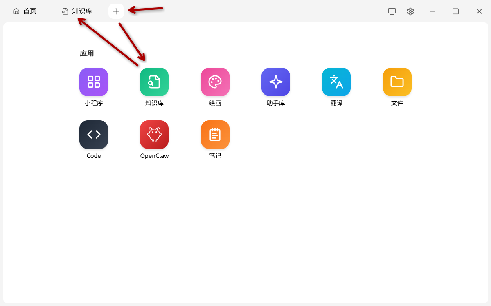
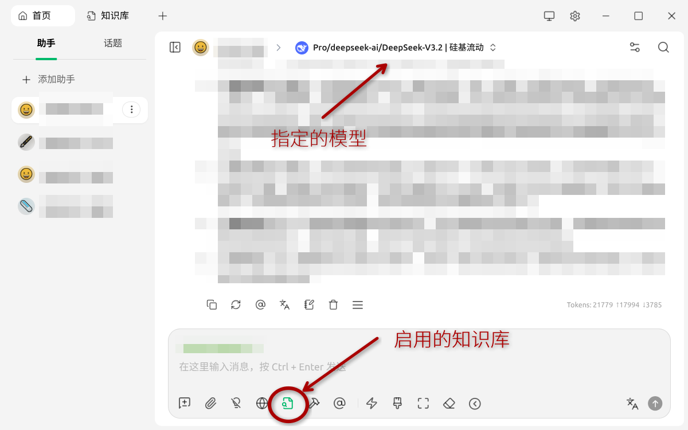

# 搜索和信息获取

在大学，上课和课本固然是一种重要的信息获取方式。但是课程和课本本身由于是静态的，往往无法及时更新最新的信息；然而对计算机科学等发展迅速、信息爆炸、对技术要求较高的科目，仅凭借课本等静态资源显然是远远不够的。因此，我们需要借助其他的方式来获取信息。

## 搜索

### 搜索引擎的选择

国内最常见的搜索引擎是百度。但是当我们在百度搜索相关内容时，第一页往往会被大量的广告占据。这显然并不是我们想要的结果。其他的国内搜索引擎都或多或少有相关的问题，因此并不好用。

由于现在大多数新购整机都预装了 Windows 正版系统，因此基本上都自带一个内置浏览器 Microsoft Edge。Edge 的默认搜索引擎是必应（Bing），在搜索的时候我们可以在页面顶端发现“国内版”和“国际版”的选项，前者会优先搜索国内网站，而后者则会显示全球的搜索结果。我们看到，在使用国内版搜索时，仍然会出现少量的广告和不相关的内容，但是相对百度而言，必应的搜索结果要好得多。在使用国际版搜索的时候，必应的搜索结果会更好。

因此，不使用特殊方式上网的情况下，如果我们要搜索的信息**非中文社区独有**，我们更推荐使用必应的国际版搜索引擎。在该课程中不将涉及任何特殊上网方式的教学。

!!! note
    细心的同学可能会发现，我们从国内网络访问 Bing，无论是国内版还是国际版，网址都是 `cn.bing.com`。而真正的 Bing 网址是 `www.bing.com`。有条件能够访问这一网址的同学可以使用这个 Bing。

### 搜索技巧

有时候我们搜索的时候无法搜索到想要的信息。这时候我们需要使用一些技巧。

**关键词搜索**是最常见的搜索技巧之一。我们使用完整句子进行搜索的时候，搜索引擎会利用语言模型将其拆分成多个关键词进行搜索，而语言模型总会导致一定的偏差。因此，我们可以一步到位，使用关键词进行搜索。例如，我们如果想要搜索“我怎样改善睡眠质量”，可以把它拆分成“改善睡眠 / 方法”关键词进行搜索；如果需要进一步约束（例如我希望方法快速起效），可以搜索“改善睡眠 / 方法 / 快速”。

**使用英文**是另一个常见的搜索技巧。中文互联网的一大特点是信息向应用内部收缩，形成无法被搜索引擎检索到的“深网”，导致中文开放互联网的信息量小于英文开放互联网的信息量。使用英文搜索的另一个原因是英语依然是世界上最通用的语言，尤其在技术、科学等领域，大部分的文献、资料、教程、说明等都是用英文写的；相关领域的研究材料往往也先以英文发表。因此我们在搜索的时候，使用英文搜索往往能够得到更好的结果。

即便英文水平一般的同学也不必担心。我们可以使用翻译软件（例如微软翻译、有道翻译等）将中文翻译成英文，然后再进行搜索。

**使用高级搜索选项**也是一种搜索技巧，最常见的高级搜索选项有：

- 使用引号将关键词括起来，这样搜索引擎就会强制将其视为一个整体进行搜索，而不是将其拆分成多个关键词。依然以改善睡眠为例，可以使用“如何改善睡眠质量”进行搜索；另一方面，使用引号还会强制搜索引擎搜索含该关键词本身的内容，而不是其同义词或者近义词，甚至不出现。例如，当我搜索“deepseek api”时，会搜索到许多不含 api 的结果。但是假如我搜索“`deepseek "api"`”，则会强制搜索引擎搜索含有 api 的结果。
- 使用减号将不需要的关键词排除在外。例如，我们想要改善睡眠，但是不想看到关于药物的信息，可以使用“改善睡眠 / 方法 / 快速 / -药物”进行搜索，这样搜索引擎就会把含有药物的信息排除在外。
- 使用 `site:` 限制搜索范围。例如，我们如果想要搜索“如何改善睡眠质量”，但是只想看到来自知乎的信息，可以使用“改善睡眠 / 方法 / 快速 / site:zhihu.com”进行搜索。
- 使用 `filetype:` 限制搜索结果的文件类型。例如，我们如果想要搜索“机器学习”的 PDF 文档，可以使用“机器学习 / filetype:pdf”进行搜索。这样的搜索可以方便地寻找文献等。

另，特定的搜索工具也可以帮助我们搜索一些特定的信息，例如 Google 学术和微软学术可以高速查找论文和引用；GitHub Code Search 可以帮助我们搜索 GitHub 上的代码片段；Google Lens、Bing Visual Search 等可以帮助我们通过图片搜索相关信息。

**判断信息的可靠性**虽然不属于搜索技巧，但也是一个非常重要的技能。我们在搜索到信息的时候，往往需要判断其可靠性。我们可以从以下几个方面来判断信息的可靠性：

- 来源：信息的来源是否可靠？是否来自权威机构、专家或者知名网站？
- 时间：信息是否及时？是否过时？
- 评价：其他人对该信息的评价如何？是否有很多人认可？
- 完整性：信息是否完整？是否有遗漏？
- 可验证性：信息是否可以被验证？是否有相关的证据？

## 信息平台

除了使用搜索引擎在信息平台上搜索以外，我们还可以直接在相关的或者其他著名的信息平台上面寻找相关信息。

### 官方文档、Wiki、论坛

如果我们希望获取某软件等的信息，最好的地方往往是其官方文档；对于类似于 Arch Linux 这种纯由社区维护的项目，其官方 Wiki 与论坛也是获取信息的最佳选择之一。官方文档虽然可能存在晦涩、难懂、省略等问题，但是往往依然是最权威、最全面的文档，这将会是你学习一门新技术的最佳选择。

如果你在请求问题的时候，遇到了诸如“RTFM（Read The F\*\*king Manual）”的回应，这说明回答者认为你需要搜索官方文档和使用手册。当然在这种情况下，**他大概率是对的，你应该去读一读。**同样道理的还有 STFW（Search The F\*\*king Web）和 RTFSC（Read The F\*\*king Source Code）。而往往通过这种方式搜索信息，你能够学到的内容比直接告诉你答案要多得多。

### Stack Overflow

堆栈溢出（Stack Overflow）是一个程序员问答网站，专门用于解决编程和技术问题。它是一个社区驱动的网站，用户可以在上面提问和回答问题。堆栈溢出有一个强大的搜索功能，可以帮助用户快速找到相关的问题和答案。从我的个人使用体验而言，这东西有点像百度贴吧和知乎的结合体，且专业性比两者都要强得多。

### GitHub

GitHub 是一个代码托管平台，用户可以在上面存储和分享代码。GitHub 上有很多开源项目，用户可以在上面找到相关的代码和文档。GitHub 还提供了一个强大的搜索功能，可以帮助用户快速找到相关的项目和代码。同时，GitHub 也是一个非常重要的开源社区，当你对某个项目有疑问或者发现 Bug 的时候，你可以对该项目提出 Issue，只要项目没“死”，总会有人告诉你答案；当你想要为某一项目做出贡献的时候，你可以 Fork 该项目，然后提交 Pull Request。

### Wikipedia

维基百科是一个自由的百科全书，用户可以在上面找到各种各样的信息。维基百科是一个社区驱动的网站，用户可以在上面编辑和修改条目。维基百科的内容是由志愿者编写和维护的，因此它的准确性和可靠性可能较低，不过它仍然是一个非常有用的信息来源。维基百科的搜索功能也很强大，可以帮助用户快速找到相关的条目。

### 其他著名博客和教程

**W3Schools** 提供了许多关于开发的教程，内容覆盖了 HTML、CSS、JavaScript、SQL 等多个领域。国内也有类似的网站，例如菜鸟教程、W3School 等，只是内容丰富程度上较为逊色。

**OI Wiki、CTF Wiki、HPC Wiki** 是一些关于算法、数据结构、编程竞赛等方面的 Wiki，适合对这些领域感兴趣的同学使用。它们的内容覆盖了算法、数据结构、编程竞赛等多个领域。这些 Wiki 则是由在相关领域耕耘多年的选手前辈们维护的，内容质量较高。

**CS 自学指南**是由信科的一位学长发起、旨在帮助计算机专业的同学自学计算机科学的一个项目。它的内容覆盖了计算机科学的各个领域，包括计算机网络、操作系统、编译原理等。它的内容质量较高，适合对计算机科学感兴趣且希望自学的同学使用。

### 国内优质平台

我们一般认为国内能够算上优质平台的有：博客园、哔哩哔哩、知乎、简书。这些平台普遍是免费的，你可以找到许多关于技术、编程、科学等方面的文章和视频。它们的内容质量参差不齐，也不乏卖课的（例如我曾经在 B 站看到过“预测 2025 年将会淘汰的编程语言：C/C++、Java、C#、Golang、Python”等视频，当然这显然是胡扯），但是它们仍然是一个非常有用的信息来源。我们在接受信息的时候，仍然需要判断其可靠性。

!!! note
    CSDN 上虽然也有不少信息，但是该平台质量较低，商业化程度较高。这导致在该平台寻找信息的时候，我们必须在海量的 AI 水文、抄袭博客、低质付费文字、商业广告等无用信息中找到夹缝中的少数高质量文章，这是一件极为痛苦的事情。虽然在少数情况下我们最终能够找到一些有用的信息，但是**高质量的平台能节约鉴别信息的精力**。

## LLM、VLM和提示词工程

现在，大语言模型（Large Language Model，LLM）已经广泛地投入了使用，无论是 ChatGPT、Claude、Gemini 等国外著名 LLM，还是国内的 DeepSeek、Kimi、通义千问等 LLM，都已经投入了广泛应用。LLM 使得我们获取信息的方法变得更加简单高效，我们可以把它们当作一个搜索引擎来使用。

部分 LLM 支持多模态，能够处理文本、图像等多种输入，这些 LLM 也被称作是 VLM。它们在处理图像和文本的时候，能够提供丰富的信息和更好的交互体验，有广泛的应用。

### 选择LLM

市面上有许多 LLM 可供选择，不同的 LLM 在性能和擅长用途上都有所不同。为了帮助我们选择合适的 LLM，我们可以参考一些主流的 LLM 评测榜单。这些榜单通过标准化的测试来评估不同模型的性能，为我们提供了有价值的参考。

以下是一些推荐的适合初学者大致了解情况的 LLM 评测榜单：

- **综合性能榜单**：[Artificial Analysis LLM Leaderboard](https://artificialanalysis.ai/leaderboards/models) 是一个综合性的 LLM 性能排行榜。它从多个维度评估模型解决问题的能力，包括数学能力、推理能力、知识水平、代码能力等，适合用于了解一个模型的综合实力。榜单中还包含了各项具体测试的分数和排名，帮助我们更好地比较不同场景下模型的性能。
- **模型幻觉评估**：[HHEM Leaderboard](https://vectara-leaderboard.hf.space/)（Hughes Hallucination Evaluation Model, HHEM）是一个专门评估 LLM“幻觉”程度的榜单。LLM 的幻觉指的是模型会生成一些看似合理但实际上是错误的或者无中生有的信息。这个榜单对于那些对信息准确性要求较高的应用场景非常有参考价值。
- **上下文性能评估**：[Context Arena](https://contextarena.ai/) 和 [Fiction.liveBench](https://fiction.live/stories/Fiction-liveBench-May-22-2025/oQdzQvKHw8JyXbN87) 这两个榜单专注于评估模型处理长上下文的能力。如果你的应用需要处理大量的文本，例如长篇文档分析或者需要模型记住很长的对话历史，那么这两个榜单的结果会很有帮助。

需要强调的是，我们应该理性看待这些 LLM 榜单。榜单的排名是基于特定的测试集和评估方法得出的，不一定能完全反映模型在所有场景下的表现。因此，在选择 LLM 时，除了参考榜单，我们还应该结合自己的具体需求、应用场景和预算来进行综合考量。最好的方法是亲自试用几个排名靠前的模型，感受它们的实际表现。

### 使用LLM的基本原则

LLM 目前依然只是一个按照概率分布生成文本的模型，而不是一个真正“理解”语言的东西；它的输出是基于统计数据和模式，而不是基于对世界的真正理解。而这个概率除了受到语法、语义等语言学因素的影响和模型本身的影响以外，还受到输入的 Prompt（提示词）的影响，因此我们可以通过优化 Prompt 来在不改进模型性能的条件下尽量优化 LLM 的输出。这个领域被称为“提示词工程”（Prompt Engineering）。

具体来说，我们要遵循以下原则：

- 具体性：使用 LLM 的时候提问应该极为具体，避免使用模糊、省略的语言或者关键字。例如我们如果想要获取改善睡眠质量的信息，应该使用“如何改善睡眠质量”而不是“改善睡眠”等关键字组合。
- 明确性：在使用 LLM 的时候，我们的 Prompt 应该明确无歧义。这在 LLM 上面有一个专门的课题叫做 WSD（消歧）。例如“Have a friend for dinner”，我们应该明确地解释成“treat your friend to dinner”或者“Eat your friend”，而不是让 LLM 去猜。与之类似的是我们可以在 Prompt 中规定其输出格式，例如提供一个示例，这对获得期望的输出非常有效。
- 简单化：目前的 AI 依然缺乏处理复杂问题的能力。当我们提出一个复杂的问题时，LLM 往往会混乱，进而得出错误答案。这时，我们可以采用分治思想，把一个大问题分成多个小问题，然后让 LLM 分别解决这些小问题，然后合并答案。

!!! warning
    使用 LLM 非常利于我们学习计算机相关知识。但是，部分同学会将作业和代码一股脑地扔给 LLM 让其完成，然后自己甚至连理解一遍代码的含义都不去做。这样的行为不仅是对课程不负责任，也是对自己的工程能力不负责任。我们鼓励同学们多使用 LLM 学习计算机等相关知识，但是对于代码为主（而不是结果为主）的工程和作业，要尽可能地减少让 LLM 生成大段大段的代码。

### LLM的局限性

LLM 虽然强大，但是它仍然有一些局限性，主要集中在**信息滞后**与**幻觉**两大方面。

目前，LLM 依然使用的是 Transformer 架构[^1]，这使得它的知识库是静态的。LLM 在训练完成之后，其知识库就不会再更新了。这就导致了 LLM 无法获取最新的信息。虽然有些 LLM 会定期更新其知识库，但是更新的频率往往较低，且更新的内容也有限。因此，LLM 对于截止日期之后的信息往往无法提供准确的答案。而幻觉的来源也很简单：毕竟现在的 LLM 依然只是在做猜词游戏而已，犯错误非常正常。

所以说，虽然我们将 LLM 作为一个获取知识的渠道并把它当作一个“超级搜索引擎”来使用，但是我们依然要对其输出内容进行验证，尤其是在其知识库截止日期后的内容：LLM 对于一个它不知道的问题往往不会回答“不知道”，而是胡编一个答案出来。在学术上，这往往是不可忍受的，例如 LLM 会编造不存在的论文，因此在学术场景下使用 LLM 来进行资源粗略搜索、辅助阅读文献乃至资源整理时，务必慎之又慎。

因此，我们在使用 LLM 的时候，仍然需要保持批判性思维。如果我们希望获取一些旧而笼统的信息，使用 LLM 能提高我们的搜索效率，并且答案往往是可信的；如果我们希望获取一些新信息或者较为精确的信息，使用 LLM 是显著不如搜索的。


### 提示词工程简介

提示词工程指的是优化 LLM 的输入提示词（Prompt）以获得更好的输出结果的过程。提示词工程的目标是通过调整输入提示词的内容、格式和结构，使得 LLM 能够更准确地理解用户的意图，从而生成更符合预期的输出。

提示词（Prompt）是指输入给 LLM 的文本。一般情况下，提示词分为系统级提示词和用户级提示词两种，系统级提示词规定了 LLM 的行为和输出格式等内容，而用户级提示词则是用户输入的具体问题和请求。一般情况下，系统级提示词我们是不可见也无法修改的，而用户级提示词则是我们可以修改的。因此，下文中提到的提示词，如非特别说明，均指用户级提示词。

#### 角色-任务-约束-范式

我们通过明确角色、任务和约束来指导 LLM 生成更符合预期的输出。比如说：

```text
你是一个科普作家。你要给初中学生科普“熵”是什么。你需要使用通俗易懂的语言，避免使用专业术语，并且要举例说明。请用不超过200字的篇幅来解释。
```

以上 Prompt 仅包含四句话，但是非常有效地指导了 LLM 的输出。我们可以看到，以上 Prompt 明确了角色（科普作家）、任务（给初中学生科普“熵”）、约束（通俗易懂、避免专业术语、举例说明、篇幅不超过 200 字）和范式（使用自然语言）。这种方法可以帮助 LLM 更好地理解用户的意图，从而生成更符合预期的输出。

我们一般把以上提示词称为“角色-任务-约束-范式”，简称 RTCP。在提示词工程上，上述方法满足“少样本提示”和“角色扮演提示”的定义。

#### 思维链和零样本思维链

思维链指的是模型将问题分解成多个子问题，并逐步解决每个子问题的过程。思维链可以帮助模型更好地理解问题，并生成更符合预期的输出。举例：

```text
小明有10个苹果，他吃掉了一个苹果，他又吃掉了2个苹果，他现在有几个苹果？
```

这样手动加入思维链可以显著增强模型的推理能力。另一种方式是零样本思维链，也就是说：

```text
...正常的Prompt...

请逐步推理。
```

“请逐步推理”这五个字[^2]可以激活模型的内部推理能力。零样本思维链在 2022 年被发现，现在已经被广泛应用于提示词工程中。

#### 举例提示

举例提示指的是在提示词中提供一些示例来指导模型的输出。举例提示可以帮助模型更好地理解用户的意图，并生成更符合预期的输出。例如：

```text
...正常的Prompt...

你应输出如下格式的内容：
...格式说明...

例如：
...示例内容...
```

#### 自洽采样和反思提示

有时候，我们可以多次访问 LLM。这时候，我们可以使用自洽采样和反思提示的方法，来优化 LLM 的输出。

自洽采样指的是在同一个问题上反复询问多次，之后对多次回答进行统计分析，取其中相同结果最多的结果（或者结果的均值、中位数等统计量）为最终的结果。这样可以减少模型的随机性和不确定性，提高输出结果的可靠性。这比贪心采样（指取一次输出）效果好许多，有效提高了模型的输出质量。

反思提示指的是对于有上下文的模型，使用模型的输出作为下一次输入的一部分，并让模型反思它的输出是不是有不合理之处（例如“请分析以上证明过程有无循环论证？”）。这样可以在一定程度上规避错误，提高模型的输出质量。

#### 上下文工程

上下文工程指的是利用 LLM 对上下文的处理方式来确定 LLM 的输出。有时候我们的 Prompt 非常长，或者包含了大量的信息，这时候 LLM 可能会忽略掉一些重要的信息，导致输出结果不符合预期。为了避免这种情况，我们可以使用上下文工程来优化 Prompt。我们最常见的两个方式是：

- 关键信息放开头：LLM 在处理信息的时候有着显著的首因效应（或者中间丢失效应）。我们可以尽可能地把关键信息放在提示词的开头，这样可以提高模型对关键信息的关注度和处理能力。
- 分块摘要：对于超级长的 Prompt，我们可以将其分成多个块，然后对每个块进行摘要。这样可以减少模型对信息的处理负担，提高模型的输出质量。一般以 32k Token[^3] 为界限进行分块，可以利用模型对每一块进行适当的摘要然后直接将摘要作为输入，或者在每一块的开头添加摘要信息。这样可以提高模型对信息的处理能力和输出质量。

### Cherry Studio

Cherry Studio 是一个支持多模型的 LLM 助手，方便我们使用 LLM。它提供了一个简单易用的界面，可以让我们轻松地使用 LLM 进行各种任务。Cherry Studio 支持多种 LLM，包括 ChatGPT、Claude、Gemini 等。它还提供了一个强大的提示词编辑器，可以帮助我们优化提示词，提高输出质量。

为了使用 Cherry Studio，我们应当持有一个 API Key。API Key 通常需要在模型厂商处购买或者申请才能获得。在获得 API Key 之后，我们可以在 Cherry Studio 的设置界面下，找到 Key 对应的模型提供商，然后启用该模型提供商并输入 Key 即可。Cherry Studio 默认启用硅基流动的模型，但是并不包含 Key，因此如果我们不使用硅基流动模型则可以将其关闭。不过一般情况下硅基流动确实是最常见的模型提供商，基本提供了国内所有的开源模型，价格也相对公道。

Cherry Studio 界面的左侧是 Agent 和助手列表，可以使用其提供的 Agent[^4] 和助手[^5] 模板来快速构建自己的 Agent 或助手并使用。

在 Cherry Studio 中，Agent 和助手的 System Prompt 对用户可见且可以修改，我们可以在这里添加自己的 RTCP 类提示词（你是一袋猫粮...）。右侧则和网页版的 LLM 界面极其相似，可以与 LLM 进行对话，输入提示词并获取输出结果。

Cherry Studio 还支持为一个特定话题提供提示词，我们也可以把它理解成一种特殊的 System Prompt。我们可以在这里为一个特定的话题提供一些提示词，这些提示词会在每次与 LLM 进行对话的时候自动添加到提示词的开头，这样可以提高模型对该话题的关注度和处理能力。

另外，也可以在这里做一些高级设置，例如调整温度（Temperature）等参数。温度参数控制了模型输出的随机性，温度越高，输出越随机；温度越低，输出越确定。一般情况下，我们可以将温度设置为 0.7，这样可以在保证输出质量的同时，增加一定的多样性。

#### 知识库

知识库是 Cherry Studio 提供的重要功能之一。它可以理解为一个可以存储和管理信息的地方，我们可以把一些重要的信息或者资料存储在知识库中，然后在使用 LLM 的时候，可以直接从知识库中调用这些信息，这样可以提高模型的输出质量和效率。

要创建一个知识库，首先要打开知识库界面，选择左侧的“添加”按钮，输入知识库的名称并分配对应的嵌入模型[^6]和重排模型[^7]，按预算将知识库的请求文档片段数量[^8]设置为一个合适的值（例如 10），然后点击“创建”按钮即可。创建完成之后，我们就可以在知识库中添加文档了。我们可以直接上传文件，或者直接输入文本来添加文档。添加完成之后，我们就可以在使用 LLM 的时候，从知识库中调用这些信息了。

这比直接把这些信息或文件放在提示词中要好得多。其原因有二：

- 超出最大上下文长度：LLM 在处理信息的时候有一个最大上下文长度的限制，如果我们把大量的信息或者文件直接放在提示词中，可能会超出这个限制，导致模型无法处理这些信息或者文件；即使一次没有超出这个限制，随着多轮对话的进行，LLM 会忘记之前的信息或者文件。
- 信息的结构化：嵌入模型和重排序模型会辅助主要模型将知识库里的信息进行处理和检索，这样可以提高模型对这些信息的理解和利用能力，从而提高输出质量；而如果我们直接把这些信息或者文件放在提示词中，模型可能无法有效地处理和利用这些信息或者文件。

在与 LLM 进行对话的时候，也可以将特定的、较为重要的信息添加到知识库中，防止超出最大上下文长度导致 LLM 忘记这些信息。




## 提问的艺术

当上述方法全部失败的时候，我们还有最后一个方法：可以抱大佬大腿，或者说向有经验的前辈提问和讨教。

除了抱身边大佬大腿以外，一个最传统的方式是，你可以在上述提到的平台或者其他技术社群上提问相关内容。你可以得到来自不同人的回答，这样你就有概率能够得到更多的帮助。当然，收集到的信息也相对良莠不齐，信息的价值需要自行甄别。同时，你的贴子和问答也会被其他人看到，一定程度上也可造福后人。例如，你可以在 Stack Overflow 上提出相关技术问题。

另一个方法是在 GitHub 上发布相关的 Issue，这样项目的维护者就会看到你的问题，并提出相关的解答；有时候也有可能是项目本身的问题。这也能够帮助到以后的用户。

!!! warning
    Issue 并不总是一个问答平台，而是一个问题追踪平台。Issue 的主要目的是追踪项目中的 Bug 和功能请求，而不是用来提问和讨论。因此，在使用 GitHub Issue 提问之前，我们需要确认项目是否欢迎在 Issue 区提问。

部分项目有专门的论坛或渠道反馈交流问题，有的甚至 feature request 也在论坛上，而 issue 是专门用来留作 bug 追踪的。在这些项目的 issue 区提问是不被欢迎的，会被认为在浪费维护者的时间。我们建议在联系维护者之前，确认项目是否欢迎在 issue 区提问，或者自己遇到的问题确实是项目的 bug。有的项目会在 README 或官网里面说明，有的会在提交 issue 的要求选择模板或进入外部链接提交问题。如果不确定是项目本身的问题，也不建议在 open issues 超过一千的项目里面提问，维护者处理这么多 issue 已经够忙的了。

在提问的时候，应该遵照以下的原则：

- 礼貌与尊重：没有人有义务解答你的问题，解决问题也许会耗费不少的时间和精力，大多数人解答问题往往只是出于本能的善意。礼貌的表达不仅能促使他人更愿意帮助你，还能建立良好的沟通氛围。当下互联网环境下，其实这一点的重要性远超想象。
- 增加有用信息：缺乏相关信息会让帮助你的人有心无力。程序崩溃有许多可能情况，不同的情况往往对应着不同的解决方案。如果能够在问题描述中增添足够的有用信息（例如列出错误代码），就会为解决问题增添巨大的可能性。
- 减少无用信息：部分人在提问的时候总会无意识地强调与问题无关的东西。这种内容往往会显著地降低信息密度，招致人的反感与厌恶。一个更常见的例子是在社群中发送大段语音而不是文字。
- 明确化你的描述：有时，我们的描述会出现歧义或者不明确的现象，例如“直面天命”这个短语对于没有关注或者没有游玩过《黑神话·悟空》的人而言容易导致迷惑。在这种情况下，使用更为具体的“游玩《黑神话·悟空》”等称谓更加合适。
- 列出你失败的尝试：这不仅表现出你为了自己解决自己遇到的问题所付出的努力，也能够显著地减少重复劳动与受到类似 STFW 等回复。

一个较好的提问例子是：

“我的电脑突然蓝屏了，我的蓝屏时候遇到的代码是 XXXXXXXX，是在游玩《黑神话·悟空》的时候突然蓝屏的。我上网搜索了代码相关的错误信息，尝试了网上可能有用的 A 方法和 B 方法，但都没有奏效。能麻烦你帮我看看吗？拜托了，非常感谢！”

除此之外，当你需要展示代码的时候，应当尽可能使用文字而不是附带图片。这在 GitHub、知乎等平台上尤其重要，因为其支持 Markdown 语法，可以让代码容易阅读。对于飞书、钉钉等工作软件，它们也支持代码块，因此要尽可能地使用代码块来展示代码。但是，对于 QQ 和微信等软件，它们不支持 Markdown 语法，且在聊天框下直接粘贴代码会导致代码完全无法阅读，此时可以使用截图工具来保证代码的可读性。

**一定要截图，而不是拍屏！**拍屏往往会因为光线、角度等问题导致无法阅读，这显得极其不专业且令人恼火。在 Windows 系统中，我们可以使用 `Win+Shift+S` 快捷键来截图，或者使用自带的截图工具等；对于 macOS 系统，我们可以使用 `Command+Shift+4` 快捷键来截图。如果你使用 QQ 或者微信，也可以使用其自带的截图工具来截图。

[^1]: 一种由 Google 于 2017 年提出的神经网络结构。通俗地说，它像一位“同时浏览整页文字、迅速找出词与词之间关系”的超级阅读者；学术上，它用“多头自注意力机制”并行捕捉文本中任意两个位置之间的依赖，取代了传统的逐字或逐句顺序处理。
[^2]: Let's think step by step 也是五个词。真是巧合。
[^3]: Token 是一段文本被切分后的最小处理单元，一般一个单词是一个 Token，单个汉字在 0.3 到 0.5 Token 之间。
[^4]: Agent 可以理解为一种有主观能动性、能根据用户的要求，运用提供的多种工具（例如搜索工具、计算工具等）来完成任务的智能体。
[^5]: 助手可以理解为一种没有主观能动性、只能根据用户输入的提示词来回答问题的智能体。
[^6]: 嵌入模型指的是一种将文本转换为向量的模型，这些向量可以用来表示文本的语义信息；通俗地说就是让文本变成 LLM 能够理解的形式。
[^7]: 重排序模型指的是一种根据相关性对文本进行排序的模型，这些模型可以帮助我们在知识库中找到最相关的信息。
[^8]: 请求文档片段数量指的是在使用 LLM 的时候，从知识库中调用的文档片段的数量，这个数量越多，模型能够获取的信息就越多，但是也会增加模型的处理负担和响应时间，也会增加耗费的 tokens 数量，因此需要根据实际情况来设置这个数量。
