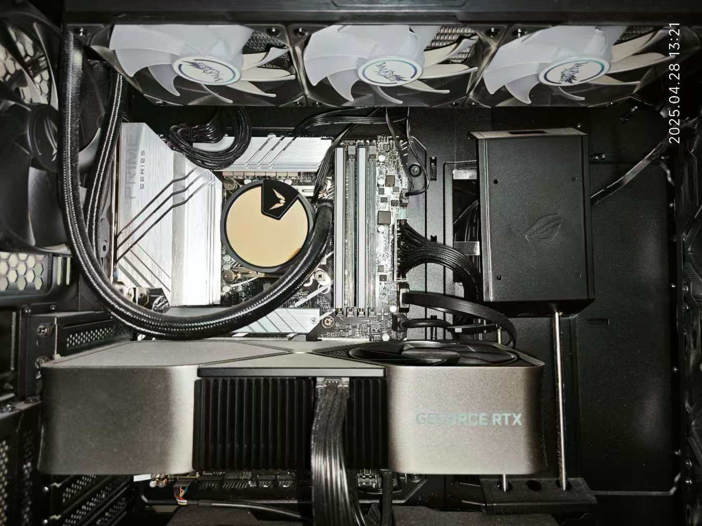
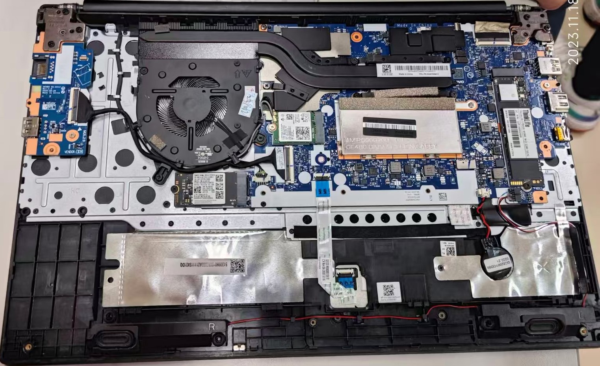
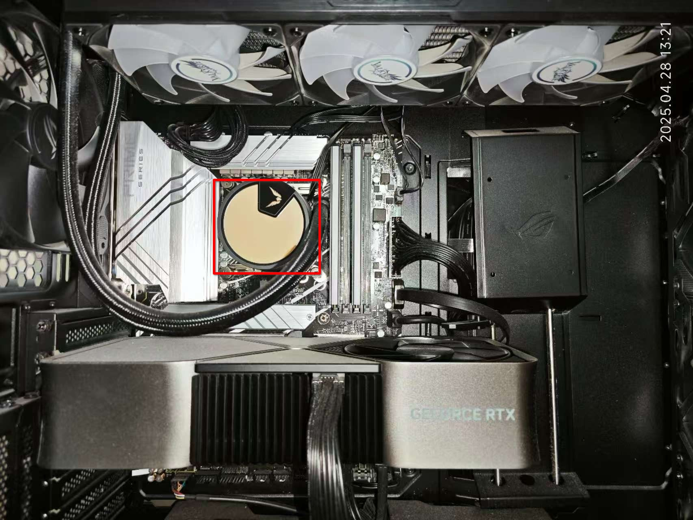
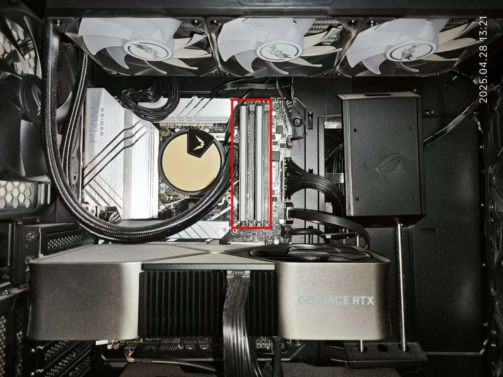
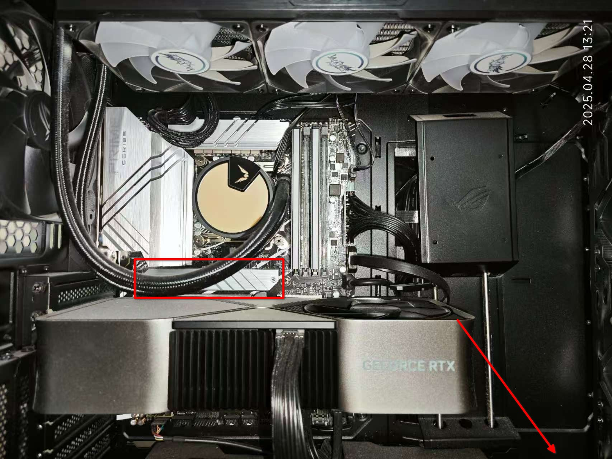
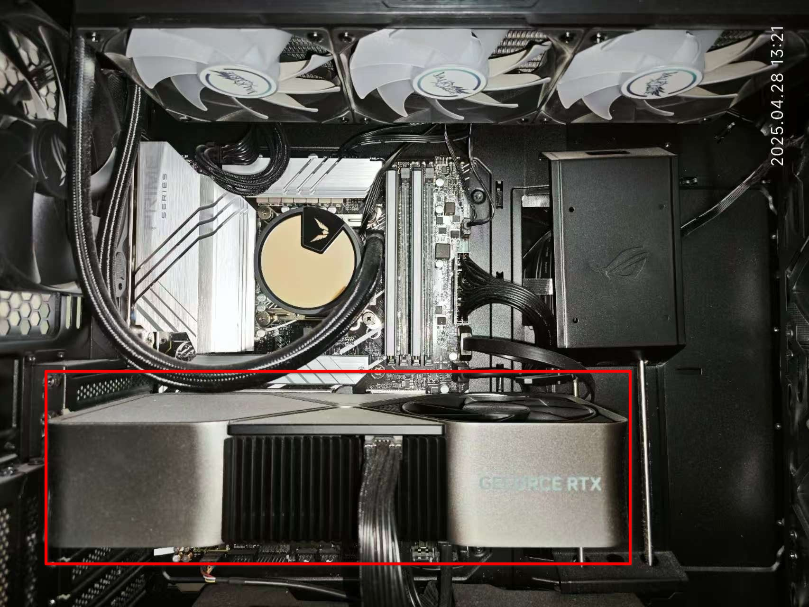

# 计算机的硬件、购机与验机

在大学，计算机是最重要的文具，没有之一。在PKU，天天和计算机打交道的信科院同学就不用说了，其他学院的同学们也离不开计算机：数院的同学们需要用计算机做数值计算和数据分析，物院的同学们需要用计算机做模拟和实验控制，化院的同学们需要用计算机做分子建模和数据处理，工学院的同学们需要用计算机做设计和仿真，甚至文科院的同学们也需要用计算机写论文和做数据可视化。而就在不学习的时候，计算机也是相当重要的娱乐和社交工具。因此，拥有一台合适的计算机对于大学生活来说是非常重要的。本节就会带着大家一起了解一下，如何选购和验收一台适合自己的计算机。

!!! info "阅读材料"
    **计算机发展简史**

    自古以来，人类不断探索怎样高效地计算。上古时期，人们使用算盘、算筹帮助运算；而18世纪，查尔斯·巴贝奇设计的“差分机”“分析机”一般认为是机械计算机的雏形。

    现代计算机的理论灵魂来自阿兰·图灵，他在1936年提出“图灵机”模型，明确了“可计算问题”与“不可计算问题”的界限[^1]，为计算机科学奠基。而冯·诺依曼则通过提出程序与数据共存的存储结构，将计算机带入现实，这一“冯·诺依曼架构”至今仍是主流。第一台通用电子计算机ENIAC于1946年诞生，采用电子管实现高速计算，标志着电子计算机时代的开启。此后，晶体管、集成电路和微处理器相继问世，计算机不断向小型化、高性能演进，并借图形界面与互联网普及至千家万户。如今，计算机已融入生活各个角落，并在人工智能、云计算等新技术推动下持续发展。

## 现代计算机的硬件

无论是日常使用计算机，还是购买计算机，我们都需要对计算机的硬件有一个初步的了解。

计算机是一个相当复杂的系统，分为**硬件**和**软件**两大部分。硬件是指计算机的物理部件，如中央处理器（CPU）、内存、硬盘、显示器等；软件是指计算机上运行的程序和操作系统，如Windows、Linux、macOS等操作系统，以及Google Chrome、Microsoft VS Code、Tencent QQ等应用程序。

计算机的**硬件**，也可以叫做**设备**，可以简单分为两类：一类叫做**主机设备**，是计算机用来进行计算等工作的设备；另一类叫做**外设设备**（也可以叫做**输入输出设备**），是计算机与外界进行信息交互的设备。通常说来，前者是藏在机箱里看不见的，后者是我们能够直接看见的。

一个计算机的主机设备如图所示。下面将会逐个介绍这些设备。

*一台台式计算机的主机设备*

*一台笔记本计算机打开后盖的样子*

### 中央处理器（CPU）

CPU是计算机的最核心部件，它从存储设备读取指令和数据，并且执行这些指令。尽管现代处理器对代码和数据会有不同的处理，但是从程序员视角来看，其本质上都以二进制存储。代码由一条一条的指令组成，CPU 按照顺序一条一条执行从存储设备中读取的指令（至少从软件和程序员等使用者的视角看是这样），指令可以是修改 CPU 的状态，进行运算，或者是从其他硬件读取信息或者输出信息。

衡量CPU的性能有很多指标，最常见的两个是主频和核心数。主频指的是CPU每秒钟能够执行多少个指令，单位是GHz（千兆赫兹）；核心数指的是CPU内部有多少个独立的处理单元，能够同时处理多少个任务。一般来说，主频越高、核心数越多，CPU的性能就越强。

CPU是计算机工作时的主要热量来源之一，因此必须有一个散热器来帮助CPU散热。一般情况下散热器也会连接到主板上（主板的知识将在后面介绍），由主板控制风扇的转速以调节散热效果。也有的CPU性能很高，风冷无法满足散热需求，这时就需要使用水冷散热器来帮助散热。为了保证接触良好，CPU和散热器之间往往会涂抹导热介质（例如硅脂、垫片、液态金属等）来提高散热效率。

*CPU，但这实际上是水冷散热器，CPU压在散热器下面*

### 内存（RAM）

内存是计算机的临时存储器，它用于存储正在运行的程序和数据。它能够被CPU直接访问，因此速度较快。对于程序员而言，内存可以被抽象为一堆连续的存储单元，每个存储单元都有一个唯一的地址；执行程序时，程序的一部分或者全部被放进内存中，CPU就在内存中找寻需要的数据或者指令，如同在排列整齐的书架上寻找需要的书籍。

现代计算机内存读写速度很快，但是已经跟不上CPU的速度，因此又引入了高速缓存来加速内存的读写速度。高速缓存是内存和CPU之间的一个小型存储器，它存储了最近使用的数据和指令，以便CPU可以更快地访问它们。在断电以后，内存中存储的数据会丢失，因此内存也被称为是易失性的存储器：这是因为，内存使用的DRAM颗粒是用电容存储电荷的，而电容几毫秒就漏光了，所以必须上电、不停刷新才能保持数据；一旦断电，电容漏光，数据就没了。

!!! note
    上述文本中的“内存”指的是“随机存取存储器”（RAM）。这里的“随机”指的是可以在任意时刻访问任意地址，而不是“顺序存取”的存储器（例如磁带）。同时，“内存”这个词在部分语境下存在不同的含义，例如在BIOS语境下的“内存”指的是“只读存储器”（ROM），在移动设备（手机）等语境下的“内存”指的是“闪存”，这实际上是外存。

内存的性能主要由容量和频率决定。容量指的是内存能够存储多少数据，单位是GB（千兆字节）；频率指的是内存每秒钟能够传输多少数据，单位是MHz（兆赫兹）。一般来说，容量越大、频率越高，内存的性能就越强。

*内存条，这里是两条DDR5，每条16GB*

### 外存

外存是现代计算机的主要存储设备，用于存储操作系统、应用程序和数据等内容。其读写速度往往比内存慢得多，但是它的存储容量更大且往往是非易失的（相对内存而言）。

现代计算机的主要外存设备是硬盘。硬盘可以分为机械硬盘（HDD）和固态硬盘（SSD）。机械硬盘使用磁头在旋转的磁盘上读取和写入数据，而固态硬盘使用闪存芯片来存储数据。固态硬盘的读写速度比机械硬盘快得多，现在价格也便宜得多，但是使用寿命较短，且因为电荷流失等问题无法接受长期不通电等情况，不适宜作为长期存档介质[^2]，除非花高价买高端的企业级SSD，但仍需定期通电。

除硬盘外，还有其他外部存储设备。例如：

- U盘：一种小型的闪存存储设备，通常通过USB接口连接到计算机上。虽然和SSD都使用闪存颗粒，但是SSD通过主控优化、多通道技术等实现更高的性能，U盘则只用于低成本的便携存储。
- 光盘：一种使用激光读取和写入数据的存储介质。常见的光盘有CD、DVD和蓝光光盘，现在常用于单次写入的存档等。缺点是容易划伤和损坏，且信息密度低，读写速度慢。
- 磁带：一种使用磁性材料存储数据的介质，通常用于备份和存档。磁带的读写速度极为缓慢（和倒带速度成正比）且需要专门的设备来读写，设备价格昂贵（一次性投入几万）。其优点是容量大、寿命长，且磁带本身非常便宜，适合长期冷数据归档。
- 软盘：一种老古董，使用磁性材料存储数据。现在软盘因为存储容量小、速度慢、易损坏等缺点，已经被淘汰了。

!!! note
    现代Windows系统的计算机中盘符默认从C开始而不是从A开始，正是因为AB盘符是给软驱用的；但是硬盘盘符从C开始的传统保留了下来，成为Windows的一个标志性特征。虽然现代的Windows系统允许手动分配盘符（如将C盘强行分配盘符A），但这样会导致系统不稳定，极不建议这么做。

!!! warning
    **硬盘有价，数据无价。**请务必定期备份数据，尤其是重要数据。

| 设备 | 读写延迟 | 常见存储容量 | 价格（每GB） |
| --- | --- | --- | --- |
| CPU Cache L1 | 1ns | 几十KB | 买不到，折合至少60万元 |
| CPU Cache L2 | 3-5ns | 几百KB-几MB | 同上 |
| CPU Cache L3 | 10-20ns | 几MB-几十MB | 同上 |
| DDR5 RAM | 80-100ns | 几十GB | 约300元 |
| NVMe SSD | 10-100μs | 几百GB-几TB | 不到1元 |
| SATA SSD | 100-200μs | 几百GB-几TB | 不到0.5元 |
| HDD | 平均10ms | 几百GB-几十TB | 约0.1到0.2元 |
| 蓝光光盘 | 100ms | 25GB-100GB | 约0.3元 |
| USB 3.2 | 1-10ms | 几GB-几TB | 约0.5元 |
| 磁带 | 秒，甚至分钟级 | 几TB-几十TB | 约0.05元 |

*这台计算机有一个SSD（框选的），还有一个HDD（箭头指向的，没有拍进来）*

### 显卡

显卡是计算机的图形处理器，它用于处理图形和视频数据。显卡可以加速图形渲染，提高游戏和视频播放的性能。显卡通常有自己的内存，用于存储图形数据，被称为“显存”。

对于现在AI时代而言，显卡因为有着良好的并行特性，成为了通用深度学习的主流硬件之一。显卡的计算能力通常用“浮点运算每秒”（FLOPS）来衡量，通常情况下，显卡在机器学习等需要大量并行的简单计算工作上，表现远好于CPU。而在一些特殊的计算任务上，FPGA和ASIC等硬件则有着更好的表现，而部分嵌入式或边缘计算场景往往更偏好NPU或TPU等专用芯片。显卡的另外一个重要的性能指标是“显存”，即显卡自带的内存容量，显存越大，显卡能够处理的图形数据就越多。

!!! tip
    从上述例子中我们可以看到，CPU、GPU、TPU等的通用性是依次降低的，而在特定任务上的性能则是依次提升的。这种“专用性换取性能”的设计思路，是计算机体系结构中的一个重要原则，其一个重要体现就是软件硬件化，这也是近些年来兴起的“硬件加速器”设计思路的基础。

*显卡，这里是一块NVIDIA的RTX 4080*

### 主板

主板是一块电路板，将所有的硬件设备连接起来。主板上的芯片组负责协调各个硬件之间的通信。同时，主板还有一系列外部接口，用于连接外部设备。在上述硬件插图中，整个绿色的电路板就是主板。

### 电源

电源是计算机的电源供应器，它不参与数据存储与运算等操作，但能够为计算机的各个部件提供所需的稳定工作电压和电流。优质的电源能够避免计算机在运行过程中出现故障，延长计算机的寿命。在上述硬件插图中，电源没有拍摄进来，但通常位于机箱的一角，通常是一个银色或黑色的盒状物体。

### 输入输出设备

输入输出设备指的是计算机与外界进行信息交互的设备。输入设备用于将用户的输入转换为计算机可以理解的格式，而输出设备则将计算机处理后的数据转换为用户可以理解的格式。

最古老的输入设备是拔插电缆，后来变成打孔纸带；现代常见的输入设备包括键盘、鼠标、扫描仪、麦克风等；现代常见的输出设备例如显示器、打印机、音响等。

## 买计算机的一些理论

### 获取机器的途径

一般情况下，我们有两种途径获取一台计算机：要么直接购买整机（笔记本或者整机台式机），要么购买零部件组装一台计算机（往往是台式机）。前者的优点是简单方便；后者的优点是性价比高且高度可定制，缺点是需要一定的组装技术与经验，并对计算机的基本硬件知识有一定的了解。

其实希望购买零配件组装整机的人往往是对计算机性能提出更高要求的人，尤其是在游戏、图形设计、视频编辑等领域。令人哭笑不得的一点是，虽然自己配置的组装机在价格上往往比同配置的整机更贵（硬件的零售价肯定比整机组装厂拿货的批发价要高），但如果一点组装机的知识都不了解的话，即使是购买整机也大概率是会被商家狠狠“宰”的。

### 购买机器的原则

购买机器有两项不成文的原则。

- **买新不买旧**：计算机的更新换代非常快，旧机器的性能往往无法满足新软件的需求，甚至可能无法运行新操作系统。旧机器的硬件也可能存在兼容性问题，导致无法使用最新的软件和驱动程序。一般只考虑近两年上架的产品。
- **确定型号和参数**：在购买之前，我们非常建议先确定好型号和参数，不能使用任何描述性的语言来作为购买依据，例如“Intel 12代高性能处理器”是描述性的，实际上对应的型号可能是 i7-12700H或者N5095，这两个CPU性能差距有七倍。

### 笔记本电脑的简单分类

笔记本电脑可以简单分类为以下几类：

- **轻薄本**：轻薄本是指重量轻、厚度薄的笔记本电脑，通常用于日常办公、学习和娱乐。它们通常配备低功耗处理器，续航时间较长，但性能相对较弱。
- **游戏本**：游戏本通常配备了高性能处理器和独立显卡，能够运行大型游戏和图形密集型应用。它们通常较重，续航时间较短，但性能强大。很多人反映，背着这玩意去教室困难，请谨慎选择。
- **全能本**：全能本是指兼顾轻薄和性能的笔记本电脑，通常配备中高功耗处理器和独立显卡，能够满足日常办公、学习和娱乐的需求，同时也具备一定的游戏性能，属于一种折中方案。

由于苹果系列产品的特殊性，这里单独介绍。笔者从未用过任何苹果系列产品，因此本段直接摘抄自2024年LCPU计算机导购手册，仅供参考。

> MacBook在保持了轻薄的同时，拥有动辄十小时的超长续航和较强的性能。在习惯了 macOS 操作逻辑之后，使用MacBook会获得极流畅舒服的体验，如果你恰好拥有其他苹果设备构成生态，也会使得工作效率大幅提升。作为类UNIX系统，macOS在编程开发时配置环境较为容易。对于音视频编辑的工作，MacBook也有较大优势。
>
> 对于学生党来说，苹果最大的缺点其实是贵，同时游戏体验一般。且少数特定软件在苹果的 macOS 上支持不佳，因此选购MacBook前务必向学长学姐打听好软件支持。就统计来看，各种专业的绝大多数必备软件都是支持的，个别研究方向可能出现此问题。就信科来看，计算机专业常用开发工具几乎都有 macOS支持，电子专业则有部分Windows独占软件，不能运行在MacBook上，这建议提前确认。另一方面，有不少信科同学在使用MacBook配置编程环境时遇到了一些麻烦，所以一定要做好功课。
>
> 推荐选择苹果官网作为MacBook的购买渠道，除了可以自定义配置以外，进行学生认证后可以获得优惠、并有礼品赠送（通常是耳机），价格几乎是全网最低。而且，即使是拆封激活后也可以可以七天无条件免费退货，有购物保障。
>
> 选购 MacBook 时主要的定制参数就是内存和硬盘，这里就涉及到苹果最大的问题：内存和硬盘很贵，由于内存和硬盘都无法扩展，建议至少选配 16GB 统一内存和 512GB 固态硬盘。如果提高配置之后预算超过上限，建议选购Windows本。
>
> 同时，M1、M2芯片的MacBook Air/Pro均仅支持至多一块外接显示器，只有M1 Pro/Max、M2 Pro/Max才支持多块屏幕，如有相关需求需要在选购时注意。

### 奸商常见套路

奸商常见套路有以下几种：

- 模糊配置：没有写明具体配置，尤其是采用“描述性语言”而不是具体型号，消费者完全无法判断性能与实际价格。最经典套路莫过于“i9**级**”处理器等，采用这种称谓的基本可以认为是洋垃圾：如果真是i9这种先进处理器，为什么还要用这个模棱两可的“级”字呢？
- 偷梁换柱：跟你说是配置A的电脑，实际卖给你的是配置B的电脑，消费者不知不觉就上了套。对此，我们在到货后可以使用一些工具（如AIDA64、CPU-Z等）来检查电脑的具体配置，确保与商家所说的一致。
- 突然缺货：等你咨询完准备下单之后，突然跟你说你要的那款没货，然后让你换成所谓同等价位实际却差很远的电脑。对此，我们建议在购买前先确认好库存情况，避免被套路；即使真出现了这种情况，我们不买就是了。

对此，我们建议尽可能地去官网或者大平台（京东自营、天猫旗舰店）购买，避免去小商家购买，谨防上当受骗。

## 整机（笔记本）

我们这里不考虑台式机整机的购买，仅讨论笔记本整机的购买。这里为大家推荐一个较为专业客观的公众号：**笔吧测评室**，该公众号会对市面上大部分主流笔记本进行测评，并给出购买建议，大家可以参考其内容来选择适合自己的笔记本电脑。

### 品牌的选择

购买整机首先要面对的是品牌。联想、戴尔、惠普、华硕、宏基、苹果、微软 Surface、华为、小米、荣耀、雷蛇、微星、技嘉、神舟、机械革命、机械师、雷神、炫龙、火影、吾空、未来人类……名字多得像超市货架上的零食。

一般有以下两个思路：

- **只看御三/四家**：联想、华硕、惠普。它们的产品线丰富，覆盖了从入门级到高端级的各个价位段，售后服务也相对完善。以上三家市场占有率高，售后网点多，配套驱动更新及时且长期维护，虽然贵一些，但是适合不想折腾的人。除此之外，苹果、荣耀两家的产品也相当值得考虑。
- **只看性价比**：神舟、机械革命、火影、吾空、未来人类，同配置常常比御三家便宜一两千，但售后依赖返厂，品控如同抽盲盒。如果不介意折腾且运算有限，可以考虑这些品牌。

### 线上购买

线上购买渠道不少，主要有这四种：京东、天猫、官网、拼多多百亿补贴。从品控方面来看，一般认为京东自营大于天猫旗舰店，约等于官网，大于拼多多百亿补贴。

百亿补贴便宜是真便宜，翻车是真翻车，水深得很。要是贸然入坑，一定要做好功课，到货以后也要录开箱视频+查SN+七天无理由退货。

### 线下购买

**如果你确实需要这本手册，那么我非常不建议你去线下任何门店购买任何计算机！**

线下主要有品牌直营店、授权专卖店、电脑城、商超等。一般前两个渠道售后服务较好，但是价格往往比线上购买高一些，好处是能够当场验机并激活常用软件等。

电脑城水最深，包括并不限于转型机、展示机、矿机翻新、贴标内存，防不胜防。新手极不建议去趟浑水（可以去试试手感，但是不要买；熟人带路也不能买，**坑的就是熟人**！）。

## 组装机

组装机的购买非常复杂，不仅需要购买各个硬件部件，还需要进行组装和调试。对于没有经验的用户来说，组装机可能会遇到很多问题，因此我们建议新手用户尽量选择购买整机。但相当多情况下，笔者建议在宿舍装一台台式机，尤其是要进行机器学习、图形设计、视频编辑等高性能计算任务或高性能游戏时，台式机的性价比和性能优势非常明显，使用体验也显著高于游戏本。

组装机小白有一个误区：先选CPU再选别的。这并不合适。因为 CPU 的选择会影响主板的选择，而主板又会影响内存、显卡等其他部件的选择。因此，建议先确定自己的需求，再根据需求来选择合适的 CPU、主板、内存、显卡等。

正确的顺序是：**需求优先；先定机箱体积，再买核心配件（CPU、主板、内存、显卡），再买其他设备**。

需求基本上分为以下四类：办公学习（按5000元预算）、全能甜点（按8000元预算）、游戏发烧（按12000预算）、生产力设备（按20000预算）。预算仅供参考，实际价格会根据当年推荐配置和市场行情有所浮动。低于5000元的配置不建议购买组装机，用这个钱购买整机需求肯定够了。

一般购买配件可以根据下面的简单指南参考进行购买。有时候有特别需求则另当别论，例如需要做数据处理的同学们应该需要巨大的内存等。一般的，我建议按以下顺序购买配件，但**不要只图便宜**，否则安装和使用的时候会很遭罪。还有，有部分部件（如内存）在台式机上和笔记本上并不通用，请务必注意区分。

### 机箱

虽然机箱连计算机的组成部分都不是（机箱确实不参与任何计算任务），但非常残酷的一点是，必须先按你桌子的空间大小选定机箱体积，否则买回来的机箱放不下就完蛋了。笔者购买计算机时就犯了这个毛病，最终被迫和机箱挤挤，于是一挤就是两年。

机箱的体积一般分为四种：全塔、中塔、MATX、ITX。其尺寸分别为：

- 全塔（Full Tower）：高度通常在60厘米以上，宽度和深度也较大，适合需要安装大量硬件和散热设备的用户。
- 中塔（Mid Tower）：高度通常在45-60厘米之间，宽度和深度适中，是最常见的机箱类型，适合大多数用户。
- MATX（Micro ATX）：高度通常在35-45厘米之间，宽度和深度较小，适合空间有限的用户，但扩展性较差。
- ITX（Mini ITX）：高度通常在25-35厘米之间，宽度和深度非常小，散热和风道都非常难做，非常不建议新手入坑。

实际机箱体积应查看具体型号的尺寸参数。

### CPU和主板

建议购买板U一体的CPU和主板套装，避免兼容性问题，还节省资金。

目前电脑主流 CPU 主要有 Intel 和 AMD两种，当前两者芯片势均力敌，都可以放心选择。Intel名声较大，多年以来在市场占有率上有着巨大的优势；AMD在2017 年提出新架构以后，性能突飞猛进，“AMD性能差” 已成为错误认知。需要声明的是，**计算机性能瓶颈并不完全由CPU决定**，如果买了一个非常高端的CPU，但是其他配件（如内存、显卡等）跟不上，那就堪比“吕布骑狗”，不能发挥出CPU的全部性能。当然反之也一样。

不买板U套装的情况下，可以买散片CPU，比盒装CPU便宜得多。当然，散片风险也大一些。而这时候，则需要注意主板的CPU插槽：英特尔和AMD的CPU插槽不兼容，必须注意区分。

在购买主板的时候，需要注意区别以下内容：内存插槽（DDR4、DDR5）、主板尺寸（ATX、MATX、ITX）。此外，还需要注意主板的扩展性，例如是否有足够的PCIe插槽、M.2插槽等。

### 显卡

显卡市场基本上是英伟达、AMD、Intel三足鼎立。英伟达的性能和市场占有率目前来看依然最高，尤其在硬件光追、机器学习等领域，英伟达的显卡几乎是最好的选择。一般预算充足的情况下，选购英伟达的显卡是较为稳妥的选择。AMD性价比高，但是硬件光追和生产力依然不如英伟达。Intel在显卡方面是新兴厂家，剪视频很不错，且自从驱动稳定后主流 1080p/2K 游戏已能胜任，但光追与兼容性仍逊于 N 卡，尝鲜可入，求稳还是选英伟达或者AMD。

显卡有公版和非公版之分。以英伟达为例，所有的英伟达系列显卡的芯片都是由英伟达设计、生产的，但是显卡的非核心部分可以由不同的厂商设计和生产。完全由英伟达制造的显卡被称为公版显卡，而华硕、技嘉、微星等厂商可以从英伟达购买芯片，然后设计自己的外观、散热、供电等，被称为非公版显卡。非公版显卡通常会在特定的方面比公版显卡更优化，但是版本也更多，仅微星一家就有SUPRIM、GAMING TRIO、VENTUS等系列。由于各种原因，我们基本上是很难买到公版显卡，而非公版显卡就成了一个不错的选择。

二手显卡风险巨大，非常不建议去趟浑水。一般认为，30系早期批次基本上默认矿卡，后期改版矿卡风险降低，但是仍需仔细甄别；40系无矿潮需求，矿卡概率低一些，但是也需要做好甄别。（除非你认识买家！）另一方面，淘宝上所谓的“电竞显卡”店往往是丐版贴牌，慎入。

### 内存和外存

25年DDR5是主流。一般盯着32GB 6000MHz CL30的套装买就可以了。高端的处理器可以冲6800MHz，但是这同时依赖于主板和调参。

不建议购买DDR4，目前很多新主板已经没有DDR4插槽了。

存储方面，SSD的速度和容量是关键。QLC便宜，但是掉速严重。系统盘建议TLC，仓库盘可以选择QLC。机械硬盘除非需要超大容量（4TB以上）或者长期归档，否则不建议买，一定要买的话盯着CMR盘买，一般西数、希捷这两家就行。SMR叠瓦盘别碰。

### 电源

在确定上述几个配件之后，选购电源。电源的瓦数是最重要参数，应至少是上述核心配件瓦数总和的1.5倍，再加上100瓦余量。出于节能、散热等方面考虑，尽可能购买金标以上的电源，且电源品牌一定要选大厂（海盗船、振华、鑫谷、安钛克、酷冷至尊等），稳定的电源能够有效保护计算机硬件的安全。另外，尽量买全模组电源，方便理线。

### 散热器

CPU散热器主要取决于CPU的功耗，一般CPU越高端散热需求就越高。高端的CPU尽可能上水冷散热，中端可以塔式风冷，低端则可以使用盒装自带的散热器。当然如果你是散片CPU则不附带散热器，必须另行购买。**不能不购买散热器！也不能使用手机散热器替代计算机散热器！**

除了散热器，还有散热介质。散热介质一般涂抹或粘贴在CPU表面，保证CPU和散热器之间良好的热传导。常见的散热介质有硅脂、导热垫片、液态金属三种。高端硅脂大概20块钱一管，非常便宜，对于绝大多数人而言完全足够使用。导热垫片性能稍差，一般用于笔记本电脑。液态金属的导热性能最好，但是风险高、价格昂贵，且需要平放CPU才能使用，因此不建议小白使用。

涂抹硅脂非常简单，几乎“随便涂”。常见的涂抹方法有米粒法、十字法、涂满法等。不必追求涂抹的完美均匀，只要估计能够覆盖整个CPU表面就可以了，等到压上散热器的时候硅脂就会被自动挤平。不要用太多硅脂，防止压上散热器的时候溢出并流到主板上，谨防短路。**只要你把散热器从CPU上拿下来，就必须重新涂抹散热介质！**

### 显示器

显示器**对使用者而言**是整个计算机中最重要的部分之一，毕竟这玩意是我们天天盯着看的东西，真正直接影响所有使用体验：一个糟糕的显示器完全能够抵消一块4090带来的快乐！所以我非常非常建议大家不要在显示器上过于节省预算。

显示器主要有以下几个参数需要注意：

#### 尺寸与分辨率

一般来说，显示器的尺寸以对角线长度来表示，单位是英寸。分辨率则是指屏幕上像素点的数量，常见的有 1080p、2K、4K 等。为了定义屏幕的清晰度，我们引入一个概念：PPI（Pixels Per Inch），即每英寸的像素点数。PPI 越高，屏幕越清晰。具体的公式这里不赘述了，我们可以使用这个[工具](https://config.net.cn/tools/PixelToPpi.html)来计算 PPI。

| 对角线 | 分辨率 | 近似 PPI | 推荐视距 | 典型用途 |
| --- | --- | --- | --- | --- |
| 24英寸 | 1920x1080 | 92 | 60–70 cm | 办公、网课、MOBA |
| 27英寸 | 2560x1440 | 109 | 65–75 cm | 全能甜点 |
| 27英寸 | 3840x2160 | 163 | 55–65 cm | 代码、设计、4K 影音 |
| 32英寸 | 3840x2160 | 138 | 70–80 cm | 剪辑、影视后期 |
| 34英寸 | 3440x1440 | 110 | 65–75 cm | 带鱼屏游戏、股票 |

经验法则：1080p 别超过 24英寸，否则PPI太低，内容将非常模糊，对眼睛完全就是一种折磨。27英寸屏幕起步 2K；4K 最好 27–32英寸，否则缩放比例尴尬。带鱼屏（21:9）优先 3440x1440，2560x1080 纵向 PPI 太低。

#### 刷新率

刷新率指的是显示器每秒钟能够更新的画面数量，单位是赫兹（Hz）。一般的，人类看到的显示屏至少得90Hz以上，看起来才足够舒服。

- 60 Hz：办公、影音足够，不过现在已经很低端了。
- 75–100 Hz：轻度电竞、日常使用，预算友好，且非常流畅。
- 144–165 Hz：FPS 玩家黄金档，显卡吃到 RTX 4060 以上即可跑满。
- 240 Hz 及以上：CS2、APEX 职业选手专属，钱包与显卡双重考验。

!!! warning
    高刷必须搭配 DP1.4 或 HDMI 2.1 线，否则 1080p 240 Hz 只能缩到 144 Hz。

#### 面板技术

面板技术指的是显示器使用什么类型的材料进行显示。主要有以下几种，其中IPS、VA、TN 是液晶面板（LCD）技术，OLED 是有机发光二极管技术，Mini-LED 是一种新型的背光技术。

| 面板 | 优点 | 缺点 | 适合人群 |
| --- | --- | --- | --- |
| IPS | 颜色准、可视角度大 | 普遍漏光 | 设计、办公、全能 |
| Fast IPS | 1 ms GTG、高刷 | 对比度一般 | 电竞、兼顾创作 |
| VA | 高对比度、色彩艳 | 响应慢、拖影 | 影音、单机 3A |
| TN | 极快响应、便宜 | 可视角度渣 | 纯 FPS 硬核玩家 |
| OLED | 无限对比、极快响应 | 烧屏风险、贵 | 影音发烧、HDR 游戏 |
| Mini-LED | 高亮度、多分区背光 | 光晕、价高 | HDR 剪辑、次旗舰电竞 |

避坑提醒：

“IPS 级别”不等于IPS，可能是廉价 AHVA。这是老生常谈的问题了，建议避坑。

VA 曲面屏 27英寸 以下意义不大，32英寸 以上才显沉浸。

OLED 面板长期显示静态内容易烧屏，建议隐藏任务栏 + 黑色壁纸。新型OLED面板通过像素刷新技术大幅降低了烧屏风险，但仍然需要注意，建议启动系统的屏保功能等。

#### 色彩与亮度

色域、色准一般用户基本上不需要考虑。对于板绘画师、视频剪辑师等专业用户来说，色域和色准则是非常重要的，这边更推荐有相关爱好的同学们咨询业内大佬，我就不在这里班门弄斧了。

亮度比较重要，尤其是对画面有追求的用户而言，带HDR的显示器几乎是必备。一般SDR 250 nit 起步，HDR400 认证只是“能亮”；真想 HDR 观影选 HDR600 以上 + 分区背光或 OLED。

#### 接口与线材

- DP1.4：现代主流接口，支持 2K 165 Hz / 4K 144 Hz 10bit 无压缩。
- HDMI 2.1：主机党接 PS5/XSX 4K 120 Hz 必须。
- Type-C：65–90 W 反向供电 + DP Alt-mode，笔记本外接一条线搞定。
- USB-B 上行口：老式 KVM 或显示器集成 USB Hub 时才会用到。

线材别图便宜：2K 165 Hz 以上务必买 VESA 认证 DP1.4 线（10-20 元杂线会黑屏）；HDMI 2.1 认准超高速认证（48 Gbps）；Type-C 线看 E-Marker 芯片，标 100 W 却只支持 60 Hz 的比比皆是。

### 其他配件

其他配件主要包括键盘、鼠标、音箱等。键盘和鼠标的选择主要取决于个人喜好和使用习惯，可以根据自己的需求选择合适的键盘和鼠标。音箱则可以根据自己的预算和需求选择合适的音箱。笔者并不是这方面的专家，建议大家参考一些专业的评测和推荐。

很多人喜欢使用机械键盘，机械键盘有着良好的手感和耐用性，但价格昂贵、噪音较大，在宿舍使用这个可能会影响他人休息，这是需要注意的地方。

## 验机

不论是整机还是组装机，收到（组装完）机器都要进行验机，确保机器没有问题再开始使用，如有问题则应尽快联系商家进行退换。

### 通电之前

在这段时间中，我们应当检查包装盒是否完好无损，是否有明显的撞击痕迹等。然后，把计算机拿到手中，检查机身是否完好、是否有磕碰、划痕，配件（如电源适配器、数据线等）是否齐全。如果是请别人代为组装的组装机，还需要检查各个硬件部件是否安装牢固、连接正确。

如果发现有明显的损坏痕迹或缺件，应联系商家进行处理。建议拍摄一段开箱视频，确保在出现问题时有证据证明机器在运输过程中没有被损坏。尤其是二手交易，更要拍摄清晰的开箱视频，避免日后纠纷。

### 通电

在确认机器外观完好无损之后，我们可以进行通电测试。插上电源，检查电源适配器是否工作、电脑是否上电。如果是笔记本电脑，还需要检查电池是否充电正常。

然后开机。不要先进系统，一定要先进入 BIOS/UEFI 界面，检查 CPU、内存、硬盘等硬件信息是否正确，确认没有硬件故障；再检查风扇转速、温度等参数，确保散热系统工作正常。最后，检查硬盘通电次数和电池循环次数，一般小于10次可以接受，过高则可能是翻新机。如是二手交易则无需检查硬盘通电次数和电池循环次数。进入上述界面的方法因主板不同而有所区别，不过大多数主板都是F2或Delete键，具体参见主板或机器说明书，也可以留意开机时的提示信息。

### 进系统

下一步，进入系统。在这个过程中务必不要连接网络，防止系统驱动更新、激活等操作影响退换货。Windows[^3]新机器默认情况下需要注册微软账户，不联网无法完成系统初始化。这时，可以在该初始化界面按下 `Shift+F10` 打开命令行，输入 `OOBE\BYPASSNRO`，然后重启电脑。这样就可以跳过联网注册微软账户的步骤。而在最新的Windows[^4]系统中，已经不支持上述本地账户登录手段了。对此，只能退而求其次，使用WinPE等工具临时验机。

现在，我们可以使用一些工具来检查硬件信息，例如 CPU-Z、GPU-Z、CrystalDiskInfo 等，确保硬件信息与商家所说的一致。然后，可以使用一些压力测试工具来测试 CPU、内存、显卡等硬件的稳定性，例如 Prime95、MemTest86、FurMark 等，确保硬件没有问题。这个也可以使用“图吧工具箱”。

然后验证屏幕，检查坏点、漏光、刷新率、色域等参数，确保屏幕没有问题。具体方法如下：

- 坏点：使用纯色图片，红绿蓝白黑共五张，肉眼距离 50 cm 观察。国标允许 3 个以内坏点，超过即退换。
- 漏光：全黑图，手机夜景模式拍照，四角漏光若呈“黄雾”可接受，“白雾”则太严重。
- 刷新率、色域：[UFO Test](https://www.testufo.com/) 网站跑 144/165/240 Hz，看是否掉帧；DisplayCAL 校色仪验证色域覆盖与 ΔE。

!!! warning
    长时间盯着UFO Test网站可能导致眩晕，建议晕车的同学谨慎使用。

!!! warning
    在创建Windows账户的时候，本地账户和微软远程账户没有什么过大的区别。微软账户会得到一些额外的服务，例如云服务等，但是这也可能面临一些隐私问题；本地账户则完全在本地使用，隐私性更好一些。

    但是有一点是确定的：在创建账户的时候，用户名一定要使用英文和数字，不能使用中文，否则可能会导致某些软件无法正常安装和运行，例如GCC等，这会在之后带来很多不必要的麻烦。

另外，保修政策要看清：

- 全国联保 != 全球联保。留学生买美版 ThinkPad 回国，坏了要送香港修。
- 上门服务 != 免费上门服务。戴尔 ProSupport 可以第二天上门，但那是你多花 800 块买的。
- 意外险 != 全保。液体泼溅、跌落、电涌，有的意外险只赔一次，第二次自费。

最后，建议大家在验机完成、发现问题之后，尽快联系商家进行退换货处理，避免超过退换货期限。一般情况下，商家会提供7天无理由退货和15天换货的服务。

自此，购买计算机的方法和注意事项已经介绍完毕。当然，在你的大学四年之间，计算机的更新换代会极为迅速；而且真买了一台超高配置的笔记本电脑也很难保证能够使用四年：即使是没有出现故障，笔记本电脑的性能也会因为电池老化、硅脂干涸等问题而逐渐下降；笔记本电脑的维修和养护也是一个很大的难题。台式机可能会好一些，至少能够方便地更换零部件，但是也需要定期清灰、保养等。学校会定期组织计算机维修和养护的活动，同学们可以多多参加。

希望同学们都能够买到一台称心如意的计算机，享受计算机带来的乐趣和便利。

[^1]: 一般认为，如果一个问题的解法可以被形式化为一个算法，那么这个问题就是可计算的；否则就是不可计算的。很多问题是可计算的，但也有一些问题（如停机问题：是否存在一个算法，能够判断任意程序在任意输入下是否会停止运行）是不可计算的。
[^2]: 个人使用寿命和HDD无明显差异，基本都能用到彻底换机。
[^3]: 主要是Win11。对Win10的支持于2025年10月14日终止。
[^4]: 指的是Windows 11 Beta Build 26120.6772 版和 Windows 11 Dev Build 26220.6772 版及其以后的版本。
