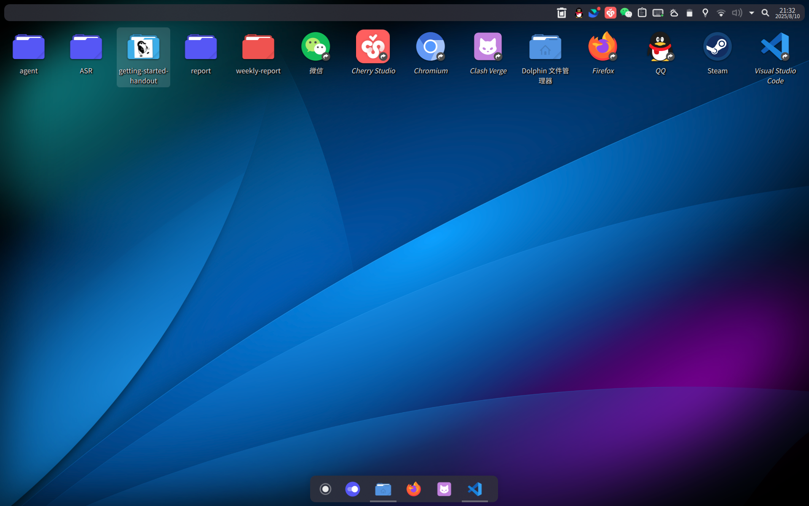

# 系统安装、基础配置和软件生态


**软件**指的是计算机中运行的程序和数据的集合，是计算机系统中不可或缺的一部分。没有软件，计算机硬件将无法发挥其功能。

在获得一台计算机之后，我们需要安装操作系统（Operating System, OS）才能使用它。操作系统是管理计算机硬件和软件资源的核心软件，它为其他软件提供了运行环境和接口。没有操作系统，用户无法与计算机进行交互，其他软件也无法运行。因此，安装一个合适的操作系统是使用计算机的第一步，只有安装了操作系统，我们才能使用它。常见的操作系统有Windows、macOS和各种Linux发行版。选择合适的操作系统取决于你的需求和硬件兼容性。我们也需要驱动软件来确保计算机的各个硬件组件能够正常工作，以及应用软件来实现具体的功能。

如你买的是有操作系统的计算机，则跳过本章前半部分，直接从系统基础配置章节开始即可；如你买的是裸机（裸机即没有预装操作系统的计算机），则需要按照以下步骤安装操作系统。如希望重装系统，也可以参考以下步骤进行操作，但请注意备份重要数据。

本章中如果有任何你不理解的指令，**请先照做**，不要自作主张更改步骤，以免导致之后不必要的麻烦。随着你对计算机的了解加深，你会逐渐理解为什么让你这么做。

## 操作系统安装


### 选择操作系统


操作系统是计算机的大脑皮层，它负责管理计算机的硬件和软件资源，有着最高的权限。操作系统提供了一个用户界面，使用户可以与计算机进行交互。我们可以认为操作系统是连接现代软件和硬件的桥梁。目前，常见的操作系统有Windows、macOS、Linux等。

- **Windows** 目前占有市场份额最大的操作系统。它由微软公司开发，广泛应用于个人计算机。Windows以其易用性和兼容性而闻名，广泛支持各种软件和硬件设备，但是缺点是在多数开发场景中的配置非常复杂，但是通过WSL2等工具也可以弥补一部分，且对于游戏开发等场景Windows仍是首选（主要是因为新游戏几乎都需要先适配Windows）。另一方面，Windows的安全性相对较低，容易受到病毒和恶意软件的攻击。
- **macOS** 苹果公司开发的操作系统，专门用于苹果的计算机产品。macOS以其优雅的界面和强大的功能而闻名，同时安全性相当高。缺点也很明显，macOS的硬件和软件生态系统相对封闭，且只能在苹果的硬件上运行，因此价格较高。
- **Linux** 一个开源的操作系统，它是一个类UNIX操作系统。其学习曲线陡峭，至今在传统个人计算机市场的占有率仍然远低于Windows和macOS，但在服务器和嵌入式系统使用一直占据主导地位。Linux的开源特性使得它可以被自由修改和分发，因此有很多不同的Linux发行版，例如Ubuntu、Debian、Arch等。


几个系统的比较见下表：

| 操作系统 | Windows | macOS | Linux |
| --- | --- | --- | --- |
| 使用难度 | 简单 | 简单 | 较复杂 |
| 价格 | 收费 | 收费 | 免费 |
| 硬件兼容性 | 高 | 低 | 中高到极高 |
| 软件生态 | 丰富 | 不太丰富 | 丰富 |
| 安全性 | 较低 | 高 | 高 |
| 系统级可定制性 | 较低 | 较低 | 高 |
| 社区支持 | 强 | 一般 | 强 |
| 适用场景 | 办公、游戏 | 设计、开发 | 服务器、开发 |


对于计算机新手，我们推荐使用Windows和macOS系统作为操作系统，这是因为它们提供了友好的用户界面和丰富的软件支持，适合初学者使用。对于希望深入学习计算机的初学同学，我们推荐使用Linux系统的发行版Ubuntu，因为它具有和Windows与macOS类似的图形界面，并具有良好的社区支持和丰富的学习资源。对于希望进阶的同学，我们推荐使用Arch Linux，它是一个轻量级的Linux发行版，具有高度的可定制性和灵活性。



*一台假装自己是macOS的Arch Linux机器*


### 准备工作


在安装操作系统之前，我们要准备以下内容：
- 另一台计算机（用于下载操作系统镜像文件和制作启动盘）
- 一个足够容量的U盘（通常8GB及以上）
- 操作系统镜像文件（ISO格式）
- Rufus、Ventoy等启动盘制作工具


操作系统镜像文件可以去各大操作系统官网下载安装。例如，Windows可以从微软官网下载，Ubuntu等Linux发行版可以从其官方网站下载。如公司或学校提供了特供版（如PKU有Windows各版本的镜像），则使用这些特供版本较好，不必担心激活等问题（正版Windows需付费，盗版Windows可能存在安全隐患，但上述特供版是正版授权、无需额外付费的）。

Rufus、Ventoy等启动盘制作工具可以从其官方网站下载。Rufus适合制作单一操作系统的启动盘，而Ventoy则支持在同一U盘中放置多个操作系统镜像，启动时选择需要安装的系统。这些启动盘制作工具有一个就行。

### 制作启动盘


以Rufus为例。Ventoy的使用方法类似，可以参考其官网说明。

1. 将U盘插入上述“另一台计算机”。
1. 打开Rufus软件，选择你的U盘作为“设备”。
1. 点击“选择”按钮，选择下载好的操作系统镜像文件（ISO格式）。
1. 保持其他选项默认，点击“开始”按钮，等待制作完成。


在这个过程中，U盘上的数据会被清除，请确保U盘中没有重要数据。

### 调整BIOS设置


现在，我们需要进入待安装系统的计算机（以下简称“目标计算机”）的BIOS设置，以便从U盘启动。首先，插上上述制作好的启动盘U盘。

打开你的目标计算机，并在启动时按下特定的按键，这个案件随着不同的主板而不同，常见的有F2、F10、Delete等。具体按键可以参考主板说明书或网上搜索你的主板型号加上“进入BIOS按键”。通常来说，不停地反复按上述按键总能蒙对。

然后，关闭“安全启动”（Secure Boot）选项。这个选项通常在“Boot”或“Security”标签下。关闭后，找到“Boot Priority”或“Boot Order”选项，将U盘设置为第一启动项。保存设置并退出BIOS，重新启动计算机（不要拔掉U盘）。

### 安装操作系统


安装操作系统的过程目前已经相当视窗化、自动化，只要我们安装的不是类似Arch Linux这种非常折腾的系统，一般只需要按照屏幕上的提示操作即可。

整个安装过程大概包括以下几个步骤：
1. 选择语言、时间和键盘布局。
1. 选择安装类型（通常选择“自定义安装”或“全新安装”）。
1. 分区（如果是新硬盘，可以选择自动分区；如果是已有数据的硬盘，建议先备份数据，然后删除所有分区，重新分区）。
1. 选择安装位置（选择刚才分区的主分区）。
1. 输入用户信息（用户名、密码等）。
1. 等待安装完成，期间计算机会自动重启几次。


在现代计算机中，如果使用的是SSD，则不要对硬盘分很多个区，一般分1个主要分区即可（EFI、系统保留分区等不算在内）。如果使用的是HDD，则建议分多个区，例如一个系统区（C盘，Win11下不低于200GB）和一个数据区（D盘），以便日后管理数据。现代计算机大多是SSD，HDD已经较少见。

在上述输入用户信息的步骤中，请务必牢记：**请设置不含空格的英文用户名**，否则会导致后续使用中出现各种问题。笔者推荐设置密码，以防止他人未经授权使用你的计算机。

## 系统基础配置


### 驱动程序


驱动程序是操作系统和硬件之间的桥梁，它负责将操作系统的指令转换为硬件可以理解的语言。驱动程序通常由硬件制造商提供，并且在操作系统安装和更新时自动安装和更新。驱动程序的作用是使操作系统能够正确地识别和使用硬件设备，所以一定要安装齐全，否则可能会导致硬件无法正常工作。

如果是整机，厂商一般会提供一个软件，可以自动检测并安装所需驱动程序。请务必运行该软件，确保所有驱动程序均已安装。如果是裸机（例如组装机），请前往各硬件厂商官网，下载并安装主板、显卡、声卡等硬件的驱动程序。网卡驱动程序比较麻烦，如果发现计算机启动后无法联网，请先使用另一台计算机下载网卡驱动程序，拷贝到U盘，再插入目标计算机安装。现在的驱动程序往往是自解压的，只需要双击这些文件即可简单的安装。

我们不推荐使用诸如驱动精灵等第三方驱动安装软件。

安装完毕驱动程序后，建议重启计算机以确保驱动程序生效。

### 安装常用应用软件


应用软件指的是我们具体用于实现某一功能的工具。这类软件有很多，我们常用的通讯软件QQ、微信等，浏览网页的Chrome、Edge等，都是应用软件。应用软件在日常生活中常常被简称为“软件”。

根据你的需求，安装一些常用软件。例如：
- 浏览器（如Google Chrome、Mozilla Firefox）
- 办公软件（如Microsoft Office、WPS）
- 压缩软件（如7-Zip）
- 媒体播放器（如VLC Media Player）


现代计算机的安全性相当高，Windows自带的Windows Defender防病毒软件已经足够应付大部分威胁，如果我们不经常下载来路不明的软件或访问可疑网站，一般不需要额外安装第三方杀毒软件。而Linux、macOS系统则因为其高安全性，一般也不需要安装杀毒软件。杀毒软件会导致系统变慢，且可能与其他软件冲突，除非真的有必要，否则不建议安装。

我们将以MS Office软件为例，介绍如何在Windows系统中安装常用软件。Office是一个非常常用的办公软件套装，包含Word、Excel、PowerPoint等组件，但需要付费购买正版授权才能使用全部功能。整机大多预装了Office且已经激活（这些都算在计算机的售价里了），但裸机则需要自行安装和激活Office。

1. 打开浏览器，访问Microsoft Office官网，下载Office安装程序。PKU提供了正版Office的下载和激活方式，这里可以前往[北京大学正版软件](https://software.pku.edu.cn)网站获取（需要北京大学的统一身份认证账号）。
1. 运行下载的安装程序，按照提示完成安装。PKU提供的是一个ISO镜像，我们需要右键该文件，选择“装载”，然后运行其中的安装程序，完成安装。
1. 安装完成后，打开任意Office组件（如Word），根据提示输入激活密钥进行激活。如果是PKU提供的Office，则可以按照网站上的说明进行激活，在笔者的印象中是下载一个小工具，在校园网环境下运行该工具即可完成激活。
1. 现在你可以开始使用Office了。


有些软件在安装时可能会允许你将该软件加入到系统的PATH环境变量中，我非常建议大家这么做。

!!! tip
    “环境变量”可以简单地理解为“让计算机知道这玩意在哪里”。这个问题暂时略过，之后的章节会有讨论。


### Linux和mac上的软件安装


在Linux和Mac OS上一般不建议使用安装包来安装软件，这是因为可能导致依赖问题。Linux和Mac OS都有自己的包管理器，建议使用包管理器来安装软件。

例如，在arch linux下，我们可以使用pacman包管理器来安装软件，例如安装git：
```bash
sudo pacman -S git
```

不懂命令可以先不去理解这个，本节其他命令也是如此。

在Windows中，包管理器的使用不普遍。虽然有一个官方的包管理器winget，但是支持的软件包较少，且无法自动管理依赖（但也基本够用）；还有一些例如Chocolatey、Scoop等第三方包管理器。除此以外，使用MSYS2、Cygwin等类UNIX环境也可以从某种程度上当成包管理器使用。例如后文讲的安装GCC的过程，我们就是使用MSYS2来安装的，比下载预编译版本简单许多。

比方说，在Windows上想要安装git，我们可以使用winget来安装：
```bash
    winget install Microsoft.Git 
```

这条命令会自动下载并安装git，并且将其添加到系统的PATH环境变量中，方便我们在命令行中使用git命令，省去了在网上查找安装包、下载安装包、运行安装包等繁琐的步骤。

不会用终端？没关系，后面讲了怎么用这玩意。

但也有例外，例如miniconda等软件，官方推荐的安装方式就是下载安装包[^1]。

而mac有着自己的app store，可以直接在app store中搜索并安装软件。笔者本人从没用过苹果系列产品，因此对其细节完全不清楚，建议参考网上的相关教程。


### 实用软件推荐


在学习和工作中，我们常常需要一些实用的软件来提高效率。以下是笔者个人推荐的一些实用软件，以供同学们参考。这些软件中有些是免费的，有些是收费的，具体使用时请注意软件的授权和使用条款。同时，为了防止功能冗余，我们非常建议每类软件只安装**一个**（尤其是播放器和杀毒软件！）。

- 下载器类
  - Internet Download Manager（IDM）：一个极为强大的收费下载软件，可以显著加速下载速度，并支持断点续传等功能。遗憾的是，它不支持磁力链接和BT下载。
  - Free Download Manager（FDM），一个免费的下载软件，界面友好且现代，且支持磁力链接和 BT 下载。
  - 比特彗星（BitComet）：一个免费且经典的BT下载软件，支持磁力链接和BT下载。
  - qBittorrent：免费且开源的 BT 下载软件。
  - Motrix：一个免费且开源的下载软件，支持HTTP、FTP、磁力链接和BT下载。
  - wget：一个老牌、免费的命令行下载工具，支持HTTP、HTTPS和FTP下载。它可以通过命令行参数来控制下载行为，适合有一定技术基础的用户使用。具体使用见`sec:web-get`。
  - Aria2：一个免费的命令行下载工具，支持HTTP、FTP、磁力链接和BT下载。它可以通过命令行参数来控制下载行为，适合有一定技术基础的用户使用。

- 浏览器类
  - Google Chrome：一个免费的浏览器，基于Chromium内核。
  - Mozilla Firefox：一个免费的浏览器，基于Gecko内核。
  - 油猴：一个浏览器扩展，可以让用户自定义网页的样式和功能。它可以通过安装脚本来实现各种功能，例如广告拦截、界面美化等。油猴支持多种浏览器，包括Chrome、Firefox等。这里推荐一个链接：[PKU-Art](https://github.com/zhuozhiyongde/PKU-Art)，它可以给你一个风格现代、足够好看的教学网。

- 压缩与解压缩类
  - 7-Zip：一个免费且强大的开源老牌压缩软件，支持多种压缩格式，包括7z、zip、rar等。它的压缩率高（7z格式压缩号称全球第一压缩率），速度快，功能强大。
  - NanaZip：在 7-Zip 基础上提供更现代化的界面（Windows 11 风格），并增加对 ZStd、LZ4 等压缩算法的编解码支持。此外，它使用 MSIX 打包，因此可上架 Microsoft Store，且可以在 Windows 11 的默认右键菜单中直接使用，而无需打开扩展右键菜单。

- 播放器类
  - VLC Media Player：一个免费的开源播放器，支持众多音频和视频格式。
  - MPV：免费且开源的播放器，支持格式众多。可以使用命令行、脚本或着色器来精细地控制播放器行为，但上手难度较高。
  - PotPlayer：另一个免费的播放器。

- 杀毒软件类（Mac和Linux因为其高安全性，通常不需要安装杀毒软件）
  - Windows Defender：Windows系统自带的杀毒软件，功能强大，查杀率接近100%，已经和老牌专业杀软（卡巴斯基、BitDefender等）不相上下，能够有效地保护常规情况下计算机免受病毒和恶意软件的侵害。但是误报率较高，可能会误报一些正常的软件为病毒。
  - 火绒：一个免费的国产杀毒软件，误报率很低，界面友好，适合普通用户使用。然而，火绒的杀毒能力要低一些。

- 其他
  - Everything：一个免费的文件搜索工具，能够快速地搜索计算机上的文件。它的搜索速度极快，支持多种搜索方式，包括模糊搜索、正则表达式搜索等。
  - Wallpaper Engine：一个收费的动态壁纸软件，能够让你的桌面变得更加美观。它支持多种动态壁纸，包括视频壁纸、动画壁纸等。
  - Rufus：一个免费的U盘制作工具，能够将ISO镜像文件写入U盘，制作成可启动的U盘。它支持多种操作系统的ISO镜像，包括Windows、Linux等。
  - Ventoy：一个开源的u盘启动工具，能够使多个ISO镜像共存于U盘，而不必格式化U盘，选择从其中的一个镜像启动。它能使多个镜像文件和U盘其他文件共存，是装机盘和资料盘合一的好工具。
  - UltraISO：一个收费的光盘镜像制作工具，能够创建、编辑和转换光盘镜像文件。它支持多种光盘格式，包括ISO、BIN、CUE等。
  - VMware/VirtualBox：两个免费的虚拟机软件，能够在计算机上创建虚拟机，运行其他操作系统，可以用于测试软件、学习操作系统等。
  - Cherry Studio：一个LLM管理器，能够帮助你使用各种LLM来简单地创建Agent，来辅助你的开发和生活。
  - Zotero：一个免费的文献管理软件，能够帮助你管理和组织你的文献资料。它支持多种文献格式，包括PDF、Word等，并且可以与浏览器集成，方便地从网页上导入文献资料。它也能兼任PDF阅读器的职责。
  - Foxit Reader：一个免费的PDF阅读器，功能强大，界面友好。


### 怎样卸载软件


我们不推荐反复装卸软件，因为这可能会导致系统不稳定或者软件残留。但是有些时候，我们认为某个软件长期内不会再需要了，且磁盘空间告急，这时我们应该考虑将其卸载。

计算机小白最喜欢做的一件事是把桌面上的快捷方式移动到回收站，这是非常错误的做法。快捷方式只是指向软件的一个链接，删除快捷方式并不会卸载软件本身。对计算机半懂不懂的人喜欢找到软件的安装目录，直接删除软件的文件夹，这也是错误的做法。因为对于许多软件而言，这样做会导致软件的注册表项和其他配置文件残留在系统中，可能会导致系统不稳定或者软件无法正常工作。

正确的做法有两种：要么使用计算机自带的“程序与功能”界面删除软件，要么使用软件自带的卸载程序（通常命名为uninstall.exe或者类似名称）。某些软件可能会在安装时提供一个卸载程序，我们可以在开始菜单或者软件的安装目录中找到它。使用这些方法可以确保软件被完全卸载，留下的残留文件也较少。如要彻底删除残留文件，可以使用一些专业的卸载工具，例如Geek等。

另，用包管理器安装的软件，最好也用包管理器卸载。例如上文提到的winget安装git，我们可以使用以下命令来卸载git：
```bash
    winget uninstall Microsoft.Git
```

而在Linux上则类似的用包管理器卸载，例如在Arch Linux上卸载GCC：
```bash
    sudo pacman -R gcc
```


#### 进阶：SHA256校验


SHA256校验是一种常用的文件完整性校验方法。它可以帮助我们验证下载的软件包是否被篡改或者损坏。通常情况下，软件的官方网站会提供一个SHA256校验值，我们可以使用SHA256校验工具来计算下载的软件包的SHA256值，然后将其与官方网站提供的SHA256值进行比较。如果两个值相同，则说明下载的软件包是完整的，没有被篡改或者损坏；如果两个值不同，则说明下载的软件包可能被篡改或者损坏，建议重新下载。

常见的SHA256校验工具有很多，例如Windows自带的CertUtil工具、Linux和macOS自带的sha256sum工具等。使用这些工具非常简单，只需要在命令行中输入相应的命令即可。例如，在Windows中，我们可以使用以下命令来计算文件的SHA256值：
```bash
    certutil -hashfile path\to\file SHA256
```

你需要把 `path\to\file` 替换成你要计算SHA256值的文件的路径。在Linux和macOS中，我们可以使用以下命令来计算文件的SHA256值：
```bash
    sha256sum path/to/file
```


当然，如果从官网下载，则基本上不会有问题，毕竟官网大概率是不会篡改自己的软件的。但如果真的从其他网站下载，则建议进行SHA256校验。但如果你搞了个盗版软件，那校验就多余了（因为肯定篡改了），这也是盗版软件的风险所在（谁知道在破解的同时有没有给你塞点别的东西进去）。

### 进阶：利用任务管理器监测和管理进程


“进程”，可以通俗的理解为“正在运行的软件”。有些软件在运行时会占用较多的系统资源，导致计算机变慢或者卡顿。我们可以使用任务管理器来监测和管理进程。

在Windows中，我们可以按下 `Ctrl+Shift+Esc`[^2] 或者 `Ctrl+Alt+Del` ，然后选择“任务管理器”来打开任务管理器。在任务管理器中，我们可以看到当前正在运行的进程，以及它们占用的系统资源（CPU、内存、磁盘等）。如果发现某个进程占用过多的系统资源，我们可以选择该进程，然后点击“结束任务”来终止该进程。

任务管理器还可以监测计算机的运行情况，例如CPU使用率、内存使用率、磁盘使用率等。这一点非常实用，例如在机器学习中，我们可以通过任务管理器来监测GPU的使用情况，从而了解代码写没写错：如果学习速度特别慢，GPU使用率特别低，那么很可能是代码写错了，导致GPU没有被充分利用。

## 进阶：安装 Arch Linux


对于希望深入学习计算机的同学，我们推荐使用Arch Linux作为操作系统。Arch Linux是一个轻量级的Linux发行版，具有高度的可定制性和灵活性。安装Arch Linux需要一定的Linux基础知识和命令行操作能力，但通过安装过程，你可以深入了解Linux系统的工作原理和配置方法。

安装Arch需要对Linux系统有相当的了解，否则完全无法理解安装过程中的每一步骤；安装该系统也是一个非常折腾的过程，如果你不是很熟悉Linux系统或者不爱折腾，不必阅读这一节，直接跳过即可。

### 前置操作


在安装archlinux之前，我们首先要做一些前置的工作。我们需要一个U盘和一个archlinux的iso映像，并使用Rufus等工具将iso映像烧录到U盘中；另一方面，我们在安装整个系统的时候需要保证机器一直联网。

之后，在关机状态下，插上U盘，进入你计算机的BIOS环境，并选择你的启动方式为“从U盘启动”、关闭安全启动、调整启动模式为 UEFI。此三者缺一不可。另外，请确保你的计算机一直有网络连接；如果使用无线网络，务必保证你的无线网络名称和密码均不含特殊字符（如汉字）。

!!! note
    有少数奇葩的主板里面，安全启动[^3]被设置为开启，却不存在关闭它的选项，但系统主板内置有 Windows 系统的公钥证书签名，使其只能加载 Windows，其它系统（包括 archlinux）一律不予加载。用户不能关闭它，还没法换系统，实在让人无语。如果你正好是这样的电脑，不妨在虚拟机里尝试下 archlinux 吧！


### 开始安装


#### 进入安装环境


在跳出的选项框中，选择第一项，进入安装环境。之后，该安装环境就会自动给你加载一些内容。不需要管这些内容具体是什么，一路确认到命令行界面，此时你的用户是 `root@ archiso` ，终端是zsh。从这一步开始，到安装完成为止，你的这个U盘就一定要一直插在电脑上。

#### 禁用reflector服务


这个服务主要是用于自行更新mirrorlist的。mirrorlist是软件包管理器 pacman 的软件下载渠道；也许它是一个很好的工具，但是在国内的特殊网络环境下，这个东西反而成了累赘，不妨禁用之。因此，这个东西一定要在联网之前搞。

```bash
  systemctl stop reflector.service # 禁用reflector服务
```


#### 联网


我们使用 `iwctl` 来联网：

```bash
iwctl # 进入交互式命令行
device list # 列出无线网卡设备名，比如无线网卡看到叫 wlan0
station wlan0 scan # 扫描网络
station wlan0 get-networks # 列出所有 wifi 网络
station wlan0 connect wifi-name # 进行连接，注意这里无法输入中文。回车后输入密码即可
exit # 连接成功后退出
```


可以使用 `ping` 等工具来检查是否联网了。在Linux下 `ping` 必须按下 `Ctrl+C` 终止输出。

#### 同步时间


我们使用 `timedatectl` 来同步系统的时间。这一步是必要的，这是因为 Linux 很多加密校验（HTTPS、GPG）依赖正确时间。如果时间差太多，证书会被判定过期。

```bash
timedatectl set-ntp true
```


#### 检查是不是国内源


```bash
vim /etc/pacman.d/mirrorlist
```


检查有没有熟悉的pku.edu.cn和隔壁镜像。如果没有，说明你的reflector服务禁用晚了，不过并非不能解决，只需要在开头加上相关镜像就行了。不要在这一步添加社区源（例如archlinuxcn）。

#### 分区与格式化


这两个操作对数据很危险！不要把含有重要数据的盘当作目标盘。

`lsblk` 命令可以帮助我们确定我们要把archlinux安装在哪里。一般有两种硬盘编号，要么是走SATA协议的sdx，其中x是字母；要么是走NVME协议的nvmexn1，其中x是数字。我们可以通过观察磁盘的大小、已存在的分区情况等判断。下文统一使用sda作为磁盘编号，请根据你自己的实际情况更改磁盘编号。

```bash
cfdisk /dev/sda
```


我们要分出三个区：EFI用来启动（如果做双系统时已有一个EFI分区，则无需）；Swap用于临时存储（至少给到你物理内存的60%以上）、不活跃页交换和休眠；文件分区（使用Btrfs文件系统，不需要多个文件分区了）。

先创建Swap分区：选中FreeSpace，再选中操作New，再按回车，这样就能创建一个新的分区了。在按下回车后会提示输入分区大小，我们正常输入就可以了；单位可以自行输入。之后在新创建的分区上选中操作Type并按下回车，选择Linux Swap项目，按下回车以修改分区为swap格式。

再创建一个分区，操作类似之前的，只不过这次需要的分区格式是Linux File System。

最后，应用分区表的修改。选中操作Write，并回车，输入yes,再回车，确认分区操作。

分区完成后，可以再使用 `lsblk` 命令复查分区情况。

现在，我们需要格式化各种分区。我们假设EFI分区是sda1，Swap分区是sda2，Btrfs分区是sda3。

```bash
  mkfs.fat -F32 /dev/sda1
  mkswap /dev/sda2
  mkfs.btrfs -L myArch /dev/sda3 # -L操作是指定盘符用的
  mount -t btrfs -o compress=zstd /dev/sda3 /mnt # 挂载分区
  btrfs subvolume create /mnt/@ # 创建 / 目录子卷
  btrfs subvolume create /mnt/@home # 创建 /home 目录子卷
  umount /mnt # 卸载分区以便于之后的挂载操作
```


#### 挂载分区


挂载分区有顺序性，需要从根目录开始挂载：

```bash
mount -t btrfs -o subvol=/@,compress=zstd /dev/sda3 /mnt # 挂载 / 目录
mkdir /mnt/home # 创建 /home 目录
mount -t btrfs -o subvol=/@home,compress=zstd /dev/sda3 /mnt/home # 挂载 /home 目录
mkdir -p /mnt/boot # 创建 /boot 目录
mount /dev/sda1 /mnt/boot # 挂载 /boot 目录
swapon /dev/sda2 # 挂载交换分区
```


用 `df -h` 命令和 `free -h` 来复查挂载情况。

#### 安装系统


现在终于到了最重要的一步：安装系统了。我们使用 `pacstrap` 来安装最基础的包和功能性软件。

```bash
pacstrap /mnt base base-devel linux linux-firmware btrfs-progs
pacstrap /mnt networkmanager vim sudo zsh zsh-completions # zsh也可以换成bash，但是不建议新手换这个。
```


倘若提示GPG证书错误，用以下命令更新一下密钥环：

```bash
pacman -S archlinux-keyring
```


然后经过一系列安装时信息的刷屏，就安装好了。之后，我们利用 `genfstab` 命令来根据当前挂载情况生成并写入fstab文件[^4]即可。

```bash
  genfstab
```


#### 换根，以及一些基础设置


接下来，我们需要从安装介质中切出，进入新系统的目录下。

```bash
  arch-chroot /mnt
```


现在可以发现命令行的提示符颜色和样式发生了改变。我们现在可以设置主机名和时区了：
```bash
  vim /etc/hostname
```

输入你喜欢的主机名称，当然这里也不要包含特殊字符以及空格。

下一步，设置 `/etc/hosts` ：
```bash
  vim /etc/hosts
```

保证里面有以下内容：
```bash
127.0.0.1   localhost
::1         localhost
127.0.1.1   myarch.localdomain myarch
```


再下一步，设置时区和硬件时间：
```bash
  ln -sf /usr/share/zoneinfo/Asia/Shanghai /etc/localtime
  hwclock --systohc
```

这里没有北京，只有上海，所以不要傻傻的找北京了！

使用vim或者nano编辑/etc/locale.gen，去掉 en_US.UTF-8 UTF-8 以及 zh_CN.UTF-8 UTF-8 行前的注释符号，并保存。之后用 `locale-gen` 命令来生成locale[^5]。

```bash
  locale-gen
```


下一步运行以下命令来设置默认locale：
```bash
  echo 'LANG=en_US.UTF-8'  > /etc/locale.conf
```

我们不建议在这一步设置任何中文的locale，会导致tty乱码。

现在为root用户设置密码：
```bash
  passwd root
```

根据提示操作即可。注意输入密码时不会显示，不要以为键盘坏了。

最后，安装CPU微码：
```bash
pacman -S intel-ucode # Intel
pacman -S amd-ucode # AMD
```

CPU微码是厂商发布的CPU补丁，它们在启动早期加载，使用软件来修复硬件缺陷。

#### 作引导


引导是让主板和系统内核沟通的桥梁，系统的启动依赖于引导。

第一步，装包：
```bash
  pacman -S grub efibootmgr os-prober
```

os-prober是为了能够引导Windows系列系统而不得不装的一个东西。如果不需要Windows系统，完全可以不安装之。但是，前两个还是要装的。

下一步，把grub安装到EFI分区：
```bash
  grub-install --target=x86_64-efi --efi-directory=/boot --bootloader-id=ARCH
```


然后，对开机指令进行一些微调，以加快速度：
```bash
  vim /etc/default/grub
```

主要是对GRUB_CMDLINE_LINUX_DEFAULT进行修改：去掉最后的 quiet 参数（这样可以在启动的时候就把内核日志打出来，便于排错）；把 loglevel 的数值从 3 改成 5，方便排错；加入 nowatchdog 参数，这可以显著提高开关机速度。

如果需要引导Windows系列系统，则不得不添加新的一行：
```bash
  GRUB_DISABLE_OS_PROBER=false
```


最后，生成配置文件：
```bash
  grub-mkconfig -o /boot/grub/grub.cfg
```


#### 完成基础安装


输入以下命令以完成安装：
```bash
exit # 退回安装环境
umount -R /mnt # 卸载新分区
reboot # 重启
```

计算机关闭后，立刻拔掉U盘，进入引导界面，然后选择archlinux。

登录系统需要输入用户名和密码。在这时，我们还没有创建任何账户，因此只有一个root。输入用户名root，以及你的密码，即可进入系统。

为了保证这玩意能够自动联网，可以使用
```bash
systemctl enable --now NetworkManager # 设置开机自启并立即启动 NetworkManager 服务
nmcli dev wifi list # 显示附近的 Wi-Fi 网络
nmcli dev wifi connect "<Your_Wifi>" password "<your_password>" # 连接指定的无线网络
ping 8.8.8.8 # 测试网络连接
```


最后，安装并运行fastfetch：
```bash
  pacman -S fastfetch
  fastfetch
```

看着显示出的Arch徽标，我们终于可以长舒一口气：安装Arch Linux的过程终于结束了。当然，这个系统肯定很难日常使用，还需要一些后续配置，例如安装视窗等。之后的各种配置实际上都是在已经有的内容上继续开枝散叶，和现代Windows有显著的不同：现代Windows的视窗实际上已经紧紧地和系统内核绑定在一起了，而Linux的视窗只是个软件罢了！

#### 创建非根用户


根用户的权限太高了，他本身就是系统。这导致其自由度太高、安全度太低，几乎毫无容错。因此，有必要创建一个非根用户。

先做一点准备工作：使用vim或者nano编辑一下 `~/.bash_profile` 文件：
```bash
  vim ~/.bash_profile
```

向其中加入以下内容：
```bash
  export EDITOR='vim'
```

这样就会显式地制定编辑器为vim，保证部分情况下不会出错。

然后就可以添加用户了：
```bash
  useradd -m -G wheel -s /bin/bash myusername
```

你可以把myusername改为你喜欢的名字，但是同样不能包含空格和特殊字符。这个wheel是一个特殊的用户组，可以使用sudo提权。你可以使用以下命令设置新用户的密码：
```bash
  passwd myusername
```

再下一步，编辑sudoers文件：
```bash
  EDITOR=vim visudo # 这里需要显式的指定编辑器，因为上面的环境变量还未生效
```

找到这一行，把前面的注释符号#去掉：
```bash
  #%wheel ALL=(ALL:ALL) ALL
```

保存并退出就可以了。现在你就有了一个非根用户。

#### 开启多个库的支持


编辑这个文件：
```bash
  vim /etc/pacman.conf
```

然后去掉 `[multilib]` 一节中所有内容的注释即可。这样可以开启32位库的支持。

然后在文档结尾处加入下面的文字来添加中国社区源：
```text
[archlinuxcn]
Server = https://mirrors.ustc.edu.cn/archlinuxcn/$arch # 中国科学技术大学开源镜像站
Server = https://mirrors.tuna.tsinghua.edu.cn/archlinuxcn/$arch # 清华大学开源软件镜像站
Server = https://mirrors.hit.edu.cn/archlinuxcn/$arch # 哈尔滨工业大学开源镜像站
Server = https://repo.huaweicloud.com/archlinuxcn/$arch # 华为开源镜像站
```


保存并退出上述文件，然后使用以下命令刷新数据库并更新系统：
```bash
  pacman -Syyu
```


### 配置视窗，以及后续内容


通过以下的命令安装视窗相关的软件包：
```bash
  pacman -S plasma-meta konsole dolphin
```

安装完成之后，运行以下命令：
```bash
  systemctl enable sddm
```

之后重启电脑就行。输入你新创建的非根用户的密码，然后回车，就可以登录桌面了。

值得注意的是，这时尚未安装任何显卡驱动。如果你在进入桌面环境时遭遇闪退、花屏等异常情况，建议尝试安装相应的显卡驱动。这里我就不提了，感兴趣的同学可以自行查找相关资料进行了解。

之后，可以做一些很好的操作，例如使用 `Ctrl+Alt+T` 打开Konsole（不是Console，这个是一个终端模拟器）。连接一下网络，然后安装一些基础功能包：
```bash
sudo pacman -S sof-firmware alsa-firmware alsa-ucm-conf # 声音固件
sudo pacman -S ntfs-3g # 使系统可以识别 NTFS 格式的硬盘
sudo pacman -S adobe-source-han-serif-cn-fonts wqy-zenhei # 安装几个开源中文字体。一般装上文泉驿就能解决大多 wine 应用中文方块的问题
sudo pacman -S noto-fonts noto-fonts-cjk noto-fonts-emoji noto-fonts-extra # 安装谷歌开源字体及表情
sudo pacman -S firefox chromium # 安装常用的火狐、chromium 浏览器
sudo pacman -S ark # 压缩软件。在 dolphin 中可用右键解压压缩包
sudo pacman -S packagekit-qt6 packagekit appstream-qt appstream # 确保 Discover（软件中心）可用，需重启
sudo pacman -S gwenview # 图片查看器
sudo pacman -S archlinuxcn-keyring # cn 源中的签名（archlinuxcn-keyring 在 archlinuxcn）
sudo pacman -S yay # yay 命令可以让用户安装 AUR 中的软件（yay 在 archlinuxcn）
```


之后，如同root账户一样，配置其默认编辑器即可。

#### 配置中文环境


首先应当配置系统为中文。打开 `System Settings > Language and Regional Settings > Language > Add languages` ，找到并加入简体中文，然后拖拽到最上面一位，保存并退出设置。重启电脑就可以生效了。

现在该配置汉语输入法了：
```bash
sudo pacman -S fcitx5-im # 输入法基础包组
sudo pacman -S fcitx5-chinese-addons # 官方中文输入引擎
sudo pacman -S fcitx5-anthy # 日文输入引擎
sudo pacman -S fcitx5-pinyin-moegirl # 萌娘百科词库。二刺猿必备（archlinuxcn）
sudo pacman -S fcitx5-material-color # 输入法主题
```

下一步，创建以下文件，然后编辑这个文件：
```bash
  vim ~/.config/environment.d/im.conf
```

向文件中加入这些内容并保存退出，以修正输入法的一些错误：
```text
# fix fcitx problem
GTK_IM_MODULE=fcitx
QT_IM_MODULE=fcitx
XMODIFIERS=@im=fcitx
SDL_IM_MODULE=fcitx
GLFW_IM_MODULE=ibus
```

之后，打开系统设置-区域和语言，找到输入法一项，运行fcitx。之后，点击添加输入法，找到拼音输入（或者你喜欢的输入），将其添加为拼音输入法。

现在重启电脑就可以输入中文了。

### 总结


上面的过程就是从头安装ArchLinux的全过程了。实际上我们可以看到，上述过程总体上大概可以分为四部分：
1. 准备工作：准备好安装介质（这里是U盘）、改BIOS设置、联网等。
1. U盘根阶段：从U盘启动，进入Linux的安装环境；准备硬盘（分区、格式化、挂载等）；安装基础系统。
1. 机器根阶段：从U盘 `chroot` 到新的系统，安装剩余的软件包，配置系统（主机名、时区、locale等）；做启动引导。
1. 后续的各种配置。

实际上几乎所有的系统安装过程都可以大致分为这四个部分。只不过不同的系统在细节上有不同，而且许多系统会把这些步骤都封装好，用户只需要简单地点击几下就可以完成安装。

### 进一步学习


一般说来，能独立的安装好Arch Linux并能进行日常维护、找到性能瓶颈（例如谁在偷吃CPU）并解决问题、熟练使用各种命令行工具，就可以算是一个合格的Linux中级用户了。当然，如果你想更进一步，以下这些题目可以作为你的思考和实践方向：
1. 一些常用命令背后是什么？查看诸如 `ls` 、 `cp` 、 `mv` 等的源代码，尝试修改它们以添加新功能，或仅让它们的输出更美观。
1. Linux内核的基本结构和工作原理，例如进程管理、内存管理、文件系统等。
1. Linux的部署，例如用ansible等工具实现自动化安装和配置，理解声明式系统（如NixOS、Guix等）的原理和优势，并尝试使用它们。
1. Linux的安全机制，例如SELinux、AppArmor等。
1. 试着定制你的系统，创作出好玩的工具，并写PKGBUILD文件打包成AUR包，发布到AUR上。

[^1]: 实际上得到的是一个 `.sh` 脚本），然后运行安装脚本进行安装
[^2]: 这三个键得一起按，下同。
[^3]: 安全启动指的是主板在这种情况下只信任微软签名的bootloader。Arch自带的bootloader没有微软签名，因此会被拒绝执行。
[^4]: 该文件用来定义磁盘分区。它是 Linux 系统中重要的文件之一。
[^5]: 这个文件决定了软件使用的语言、书写习惯、字符集等
