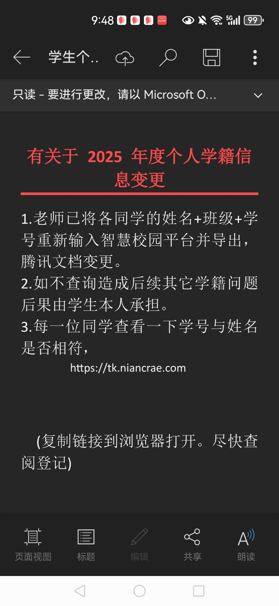
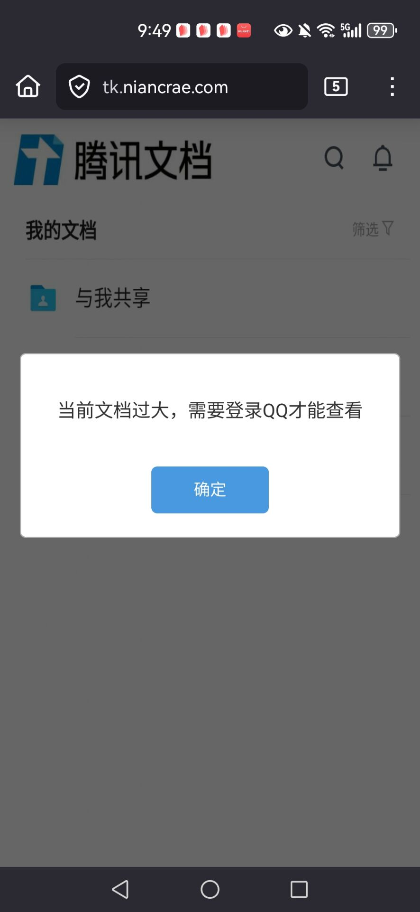

# 初步使用计算机

在开始使用计算机之前，我们需要了解一些基本的计算机使用知识。这些知识包括如何使用键盘和鼠标，如何管理文件和目录，操作系统的日常维护，网站资源的获取，以及常见问题的排查和解决等。关于具体软件怎么使用（如MS Office使用方式等），我们不在本书中赘述，因为这些软件的使用方式千差万别，且变化较快，建议同学们通过网络搜索相关教程来学习。

!!! tip
    新手不要过分担心搞坏电脑或损坏文件！弄坏是正常的，软件坏了就重装系统，硬件坏了就修理，文件坏了就尝试恢复或重做。只有多犯错、多试错，才能更深入地理解“这些操作不能做”“这样做会怎么样”“这个东西是干什么的”等等。笔者也弄坏过好多次电脑，导致的后果包括并不限于系统崩溃、数据损坏，甚至还有一次搞坏了内存条子。

    但是也正是在如此多的试错和反思中，我才逐步理解了计算机的工作原理，学会了如何管理文件和目录，学会了如何使用操作系统，学会了如何排查和解决问题。就是这样，在不断的试错中，我们才能真正逐步理解计算机相关的知识，最终从“什么都不会的小白”变成“见怪不怪的老手”，最终变成能独立解决问题的高手。

    所以，不要害怕犯错，勇敢地去尝试吧！

## 善用键盘

我们早就知道如何使用键盘了，几乎所有人都会使用键盘来进行文字输入等操作。但是键盘上还有一些较为特殊的按键，它们虽然不具体对应某一个字符，但是却能帮助我们更高效地和计算机交互。

### 高效打字

虽然很多人都会打字，但是打字的效率却参差不齐。除了使用上述的修饰键和特殊按键以外，我们还可以通过一些方法来提高打字效率。

首先，实际上打字是有一个正确的姿势的。这个姿势要求两只手的食指分别放在键盘的F和J键上，这两个键被叫做“基准键”。在漫长的使用过程中，可能基准键会随着习惯而有所偏移（例如笔者的习惯是将D和H作为基准键，这样比较灵活的右手会辐射更大的范围），这并不需要纠正，因为习惯下来也没什么大问题。但是不管怎么样，最终**你十个手指当中的大多数在打字过程中要动起来**，而不是二指禅，这样才能显著提高打字效率。

另外，打字是一个熟练工作，只有多练习才能提高打字速度和准确率。打字较快的人大多数都会盲打，也就是在打字的时候眼睛仅盯着输入法选字窗口，而不看键盘。这样可以减少眼睛在键盘和屏幕之间的移动，提高打字效率。我们推荐使用一些打字练习软件，例如TypingClub、Keybr、金山打字通等，来提高打字速度和准确率。

有些人会问五笔和拼音哪个打字更快。实际上，五笔的极限速度要高于拼音，对于打字员等专业人士而言，他们打字的时候眼睛只看着手写或打印的纸张，屏幕和键盘都不看；他们和抄写一样，直接复制字形并打出编码，因此五笔的速度会更快一些。但是，五笔是违反人语言习惯的输入法：我们在写东西的时候，往往是先想到词语的发音，然后再想到字形，而五笔则是直接根据字形来输入，这对于大多数人而言并不自然。另外，五笔需要背诵编码（王旁青头戋五一，土士二干十寸雨……），版本甚至不统一，这对于大多数人而言也是一个负担；而拼音大多数人小学都学习过，不需要额外的学习成本。

因此，对于大多数人而言，拼音输入法更为合适。另外，随着技术的不断进步，现代的大多数输入法连接了网络，能够通过用户的上文推测下文大概是什么词语，从而提高了输入效率，可以媲美甚至超越五笔的极限速度。另外，还有“双拼”等介于拼音和五笔之间的输入法，虽能提高打字速度，但一样需要背诵编码。

目前大多数输入法都有特殊的输入功能，例如按下u即可进入生僻字输入模式，可以用于输入一些不常用的汉字；按下v可以输入英文符号等。我们建议同学们阅读自己使用的输入法的帮助文档，了解这些特殊功能，从而提高边界条件下的输入效率。

### 修饰键等特殊按键

键盘上除了字母、数字和标点符号等常用按键以外，还有一些特殊按键。这些按键通常不会直接输入字符，而是用于控制计算机的操作。常见的特殊案件有修饰键和功能键两大类。

修饰键是一种特殊的按键，它们通常不会单独使用，而是与其他按键组合使用，以实现更多的功能，这些组合按键就叫做“快捷键”。常见的修饰键有以下几种：

- `Ctrl`（Control）：控制键，通常用于执行各种命令和操作。
- `Alt`（Alternate）：替换键，通常用于切换窗口、菜单等。这个键在macOS中被叫做 `Option` 键。
- `Shift`：换档键，通常用于输入大写字母和特殊符号。
- `Win`（Windows键）：Windows徽标键，通常用于打开开始菜单、切换窗口等。这个键仅在Windows系统中存在，在Linux中被叫做 `Super` 或 `Meta` 键，在macOS中被叫做 `Command` 键。
- `Fn`（Function）：功能键，通常用于切换键盘的功能模式，例如调整音量、亮度等。这个键不是每一个键盘上都有。

除修饰键和字母、数字外，还有一些特殊按键。这些功能键也可以帮助我们高效地和计算机交互。

- `Esc`（Escape）：退出键，通常用于退出当前操作或者关闭窗口等。
- `Tab`（Tabulator）：制表键，通常用于切换输入焦点或者插入制表符等。
- `Caps Lock`：大写锁定键，按下后可以输入大写字母，按下再次取消。
- `PrtScn`（Print Screen）：打印屏幕键，通常用于截取屏幕内容。在不同的计算机上也有不同的名字。
- `Pause Break`：暂停键，通常用于暂停程序的执行。在现代计算机上，这个键很少使用。
- `Scroll Lock`：滚动锁定键，通常用于锁定滚动功能。在现代计算机上，这个键很少使用。

一开始的键盘是为了和终端（黑窗口）交互的，为了操作光标，因此也有着一些光标控制键：

- 方向键（上下左右箭头）：用于控制光标的移动。
- `Home`：光标移动到行首。
- `End`：光标移动到行尾。
- `Page Up`：向上翻页。
- `Page Down`：向下翻页。
- `Delete`：删除键，通常用于删除光标后的字符，与 `Backspace` 正好相反，后者用于删除光标前的字符。
- `Insert`：插入键，通常用于切换插入模式和覆盖模式。

### 快捷键

使用快捷键可以减少鼠标操作的频率。以下是来自Windows的常用快捷键：

| 快捷键 | 功能 |
| --- | --- |
| `Ctrl+C` | 复制 |
| `Ctrl+V` | 粘贴 |
| `Ctrl+Z` | 撤销 |
| `Ctrl+Y` | 重做 |
| `Ctrl+A` | 全选 |
| `Ctrl+Alt+Del` | 打开任务管理器 |
| `Ctrl+S` | 保存当前文档或文件 |
| `Ctrl+P` | 打印当前文档或文件 |
| `Ctrl+F` | 查找文本或内容 |
| `Alt+F4` | 关闭当前窗口 |
| `Alt+Tab` | 迅速切换窗口 |
| `Win+R` | 打开运行窗口 |
| `Win+E` | 打开文件资源管理器 |
| `Win+D` | 显示桌面 |
| `Win+L` | 锁定计算机 |
| `PrtScn` | 截图（全屏） |
| `Alt+PrtScn` | 截图（当前窗口） |
| `Win+Shift+S` | 截图（自定义区域） |

除了上述快捷键以外，在其他的软件中也有着自己特定的快捷键。例如在浏览器中，`Ctrl+T` 可以打开一个新的标签页，`Ctrl+W` 可以关闭当前标签页，`Ctrl+Shift+T` 可以重新打开上一个关闭的标签页等。这些快捷键可以帮助我们更高效地使用计算机。

## 文件、目录及其管理

### 理解文件和目录

文件和目录是计算机中最重要的概念之一，它们用于存储和组织计算机中的数据。

如果把硬盘看作一个图书馆，那么文件就可以看作是图书馆中的一本书。目录则可以理解为图书馆的房间、书架等，以及图书馆本身，用于组织和分类图书馆中的书籍。假如我想找到一本书，首先要知道它在哪个图书馆，其次是在哪个房间、哪个书架的哪个位置。这样就能够使用统一的方式来找到一本特定的书。

在任何计算机系统中，文件都可以看作是一些数据块。文件可以是文本文件、图片文件、音频文件、视频文件等。每一个文件都有一个唯一的名称，用于标识该文件。现代文件系统的文件名通常由字母、数字和特殊字符组成。在Windows上，文件名不区分大小写；在Linux和mac OS上，文件名区分大小写。

### 文件的大小

既然文件是一些数据块，那么就可以度量其大小。现代计算机使用二进制来表示数据，规定一个二进制位为1比特（bit），8个二进制位为1字节（Byte）。一个数据块占了多少二进制位，就可以说这个文件的大小是多少比特，或者占了比特数除以8的字节数。

在计算机上为了方便读取，之后的数据大小单位以$2^{10}=1024$为倍数递增，即1KiB=1024B，1MiB=1024KiB，1GiB=1024MiB，1TiB=1024GiB。[^1]另外一套单位系统以1000为倍数递增，也就是1KB=1000B，1MB=1000KB，1GB=1000MB，1TB=1000GB。这种标定方式便于硬件的生产，因此通常由硬件厂商使用，我们在日常生活中看到的硬盘、U盘等存储设备的容量使用的就是这种方式。因此购买的硬盘，计算机认为的容量会比标定容量小一些，例如一个标定1TB的硬盘：

$$
1TB = 1000^{12} B = \frac{1000^{12}}{1024^{4}} TiB \approx 0.9095 TiB = 931.32 GiB
$$

于是计算机会认为这个硬盘只有约0.91TiB的容量：在Windows上，显示为931GB[^2]；在Linux和macOS上，显示为931GiB。这是正常现象，没有人偷你的硬盘空间！

上述1000GB硬盘被称作“非足容硬盘”。而“足容硬盘”则是1024GB硬盘（不是GiB！），于是这个就在计算机上显示为953.67GiB，似乎也没“足”。一般机械硬盘都是非足容硬盘，而固态硬盘则有不少是足容硬盘，主要原因是便于制作：机械硬盘的容量是通过物理结构决定的，而固态硬盘则是通过芯片来决定的，芯片的容量往往是2的幂次方。

!!! warning
    有些无良卖家会使用这种单位：32Gb U盘，然后买到手发现只有4GB。这是因为该厂商使用了Gb（Gbit）而不是GB（GByte）来混淆视听，也就是32Gb=4GB，他甚至还没说谎，买家也只能打落牙齿往肚子里吞了。因此，购买存储设备时请务必注意单位究竟是什么。

### 目录结构与路径

在Windows系统中，每一个硬盘[^3]都是一个“根”目录，相当于图书馆本身。每一个根目录都有一个盘符，例如C盘、D盘等。每一个根目录下可以有多个子目录，这些目录往往表现为文件夹的形式；每一个子目录下又可以有多个子目录，最终形成树状结构。每一个目录下可以有多个文件（相当于图书馆中的书籍）。对于一个特定的文件，从根目录到所在地的路径是唯一的，例如 `C:\Users\username\Documents\file.txt`。这个完整写出来的路径叫做**绝对路径**，它唯一地标识了一个文件的位置。

有时候，我们在图书馆找书的时候，知道同类的书籍往往放在一起。例如我们已经知道了这个书架上有某书第一卷，我们也知道同一个书架上还有第二卷，这时候就不需要再从图书馆的根目录开始找了，而是可以直接从这个书架上找。这时候我们可以说，第二卷的路径**相对于第一卷的路径**在同一个目录下。这个相对于某个目录的路径叫做**相对路径**，它并不是唯一的，因为它依赖于当前所在的目录。举个例子，假如某文件 `file1` 在某目录下，同目录下还有一个 `file2`，那么 `file2` 相对于 `file1` 的路径就是 `file2`。如果该目录下还有一个子目录 `dir`，该子目录下有一个 `file3`，那么 `file3` 相对于 `file1` 的路径就是 `dir\file3`。

有些时候，相对路径可能会跨目录，这时候就需要向上一级等操作。这时候，就可以使用 `..` 来表示上一级目录，使用 `.` 来表示当前目录。例如，假如某文件 `file1` 在某目录下，该目录的上一级目录下有一个 `file2`，那么 `file2` 相对于 `file1` 的路径就是 `..\file2`。同样，如果该目录的上级目录下还有一个子目录 `dir`，该子目录下有一个 `file3`，那么 `file3` 相对于 `file1` 的路径就是 `..\dir\file3`。

### 文件的扩展名

扩展名是文件名中最后一个点后面的部分，例如 `file.txt` 的扩展名是 `txt`。扩展名可以帮助操作系统识别文件的类型，并选择合适的程序来打开它。在Windows上，文件的扩展名往往是必须的，否则操作系统不能识别文件的类型。

在Windows系统中，文件的扩展名通常是隐藏的。如果你想查看文件的扩展名，可以在文件资源管理器中点击“查看”菜单，然后选择“文件扩展名”选项。这样就可以看到所有文件的扩展名了。为了方便维护目录等，笔者建议同学们选择显示扩展名。

| 常见文件类型 | 常见扩展名 |
| --- | --- |
| 文本文件 | .txt, .md, .log |
| 文档文件 | .doc(x), .xls(x), .ppt(x), .pdf |
| 图片文件 | .jpg, .jpeg, .png, .gif, .bmp, .svg |
| 音频文件 | .mp3, .wav, .flac, .aac |
| 视频文件 | .mp4, .avi, .mkv, .mov |
| 压缩文件 | .zip, .rar, .7z, .tar, .gz |
| 可执行文件 | .exe, .bat, .sh |
| 代码文件 | .c, .cpp, .py, .java, .js, .html, .css |

*常见文件类型及其扩展名*

一般情况下，虽然文件的类型差不多，但是其扩展名不同也往往代表着其数据的存储是按照不同的方式进行的。例如，`bmp` 文件是“位图”，存储的是每一个像素的颜色信息；而 `jpg` 文件则是经过压缩的，存储的是图像的整体信息。对于同一张图片，`bmp` 文件往往会比 `jpg` 文件大得多。如果我们试图将一个 `bmp` 文件改名为 `jpg`，那么这个文件的扩展名变了，但是**其内部数据并没有变**，因此这个文件仍然是一个 `bmp` 文件，只不过扩展名变了而已。此时，如果我们使用图片查看器打开这个文件，图片查看器会根据扩展名来判断文件类型，认为它是一个 `jpg` 文件，但是实际上它是一个 `bmp` 文件，因此图片查看器可能无法正确地打开它。因此，技术人说的“一类文件”往往不是按文件的性质分类的，而是按文件的扩展名（数据的存储方式）分类的。

### 文件的链接（快捷方式）

有时候，我们可能会需要在不同的目录中使用同一个文件或目录，这时候就可以使用文件的链接。文件的链接类似于图书馆中的索引卡片，它指向某个文件的位置，而不是文件本身。

上述建立链接的方式叫做软链接（符号链接）。与之相对的是硬链接，硬链接是指多个文件名指向同一个文件的数据。硬链接的创建和管理比较复杂，一般不建议初学者使用。

### 文件的基本操作

文件的基本操作包括创建、删除、重命名、复制、移动、链接和运行。

在Windows系统下，创建、删除、重命名操作都可以通过文件资源管理器提供的右键菜单来完成。

复制指的是把一个文件的内容原模原样地写到一个新的文件中，两个文件互不影响；而移动指的是把一个文件从一个位置移动到另一个位置，原位置的文件会被删除。复制和移动操作都可以通过文件资源管理器提供的右键菜单来完成。复制后需要粘贴才能完成，而移动则是直接拖拽文件到目标位置即可（或者剪切后粘贴）。

链接在Windows下被叫做“创建快捷方式”，可以通过右键菜单来完成。运行指的是打开一个文件或者程序，可以通过双击文件来完成（或者右键菜单选择“打开”）。

### 更改文件的类型

有时候，我们可能会需要更改文件的类型。直接更改扩展名并不能改变文件的类型，因此我们需要使用专门的软件或者网站来帮助我们转换文件的类型。

以下是几个常见的手段：

- 格式工厂：一个免费的多功能文件转换软件，支持音频、视频、图片、文档等多种格式的转换。但是现在已经不更新了。
- 网页：有很多在线文件转换网站，支持多种格式的转换，使用方便，无需安装软件。
- 专业软件：有些专业软件自带文件转换功能，例如Adobe Acrobat可以将PDF文件转换为Word、Excel等格式，Microsoft Word可以将文档转换为PDF等格式。

一般而言，只要记得别手动给扩展名删了或改了就行！上述方法其实完全可以信赖其正确性。

### 文件的打开方式

对于任何文件，我们往往需要读取其中的数据，这个文件才有意义；至于这个数据是怎么展示的则另当别论。因此，我们需要一些软件来帮助我们打开文件。

在Windows系统中，文件往往有一个默认的打开方式，这个打开方式由文件的扩展名决定。例如，`.txt` 文件默认使用记事本打开，`.jpg` 文件默认使用照片查看器打开。有些时候安装了一些软件后，文件的默认打开方式可能会被更改。例如，安装了某个图片编辑软件后，`.jpg` 文件的默认打开方式可能会被更改为该软件。

在一些情况下，我们可能会需要临时或永久更改某一类文件或者某一个文件的打开方式。我们可以右键点击文件，然后选择“打开方式”选项，选择一个合适的软件来打开该文件，也可以选择“选择其他应用”之后寻找指定的软件。如果我们想要永久更改某一类文件的默认打开方式，只需要在“选择其他应用”菜单勾选“始终使用此应用打开 `.扩展名` 文件”选项即可。

值得注意的是，软件本身并不需要扩展名才能打开文件。软件打开文件时总是按照自己的方式来处理数据，因此很多时候即使扩展名是错误的或者没有扩展名，如果指定了正确的软件，软件仍然可以正确地打开文件。

### 文件的压缩与解压

有时候文件占据了过大的空间，或者因为文件数量太多而不便于传输和管理，这时候我们可以使用文件压缩工具来将文件进行压缩。文件压缩工具可以将多个文件或者目录打包成一个文件，并且可以对文件进行压缩，以减少文件的大小。常见的文件压缩格式有 `.zip`、`.rar`、`.7z` 等。

笔者个人推荐使用 `7z` 压缩软件来压缩和解压文件。它是一个经典的开源软件，支持多种压缩格式，并且具有较高的压缩率。一般情况下，在我们安装了 `7z` 软件之后，右键点击文件或者目录，就可以看到“添加到压缩文件”选项，点击该选项即可将文件或者目录进行压缩。对于压缩文件，我们也可以右键点击，然后选择“解压到当前目录”选项，或者选择“解压到 `文件名`\`”选项，将文件解压到指定的目录中。

不同的压缩参数会产生不同的效果。把固实数据大小开大则会提高压缩率[^4]，但会牺牲压缩和解压的速度；勾选了分卷，则会将压缩文件分割成多个小文件，便于诸如 `FAT32` 等不支持大文件的文件系统存储；使用内存和CPU则显著影响了压缩的速度；不同的压缩算法则会影响压缩率和速度的平衡。一般情况下，默认参数已经足够好用了，软件本身也提供了多种预设参数供我们选择。

至于压缩成的文件格式，笔者比较推荐使用 `zip` 格式，其兼容性最好；如果对压缩率有较高要求，可以使用 `7z` 格式。不建议使用 `rar` 格式，因为它是一个专有格式，虽然压缩率不错，但是不够开放。

!!! warning
    有些软件的可执行文件和附带文件是通过压缩包分发的；有些文件也是通过压缩包传输的。在这种情况下，我们一定要先解压文件，再使用文件，而不是在压缩包中直接使用文件，这样可能会导致文件无法正常工作。

那么怎么压缩呢？单击右键，选择“7z > 添加到压缩文件...”即可。如果计算机是Windows11，没有这个选项，则先单击“显示更多选项”，然后再选择“7z > 添加到压缩文件...”即可。之后，我们可以选择压缩格式、压缩等级、分卷大小等参数，然后点击“确定”按钮即可开始压缩文件。

现代计算机硬盘空间一般都充裕，压缩文件大多是为了整合小文件为一个大文件，便于发走的。如果我们没有勾选分卷，我们得到的一般是1个大文件，直接发送即可；如果我们勾选了分卷，我们得到的则是多个小文件，这时候我们需要将这些小文件全部发送给对方，对方才能正确地解压文件。“分卷”和硬盘没有关系！它只是把一个大文件拆成了多个小文件而已。

### 进阶：高效的文件管理

从一大堆文件中快速找到我们想要的文件是一个非常重要的技能。

一个常用的手段是使用搜索功能。Windows文件资源管理器提供了搜索功能，可以帮助我们找到文件。我们可以在文件资源管理器的右上角输入关键词，文件资源管理器会自动搜索当前目录及其子目录中的文件，并显示匹配的结果。然而，文件管理器的搜索面对大量文件时效率很低。这时候，我们可以使用一些第三方的搜索工具，例如Everything、Listary等。这些工具可以快速索引计算机中的文件，并提供快速的搜索功能。它们通常比文件资源管理器的搜索功能更快、更强大。

另一个常用的手段是养成良好的存储习惯，将相关的文件放在一起，使用有意义的文件名和标签、分类等工具。Windows没有内置的标签功能，但我们可以使用一些第三方的标签工具，例如TagSpaces、FileMeta等。对于大量的文件，我们可以使用自动化脚本来帮助我们管理文件，例如使用Python脚本来批量重命名文件、移动文件等。在Windows上，一个最简单的批量处理文件的方式是使用PowerShell脚本或旧式风格的批处理脚本（.bat文件）。这些脚本可以帮助我们自动化一些重复性的任务，提高工作效率。

例如，我们希望把某目录下的许多图片都改名为“图片1.jpg”、“图片2.jpg”等等。我们可以使用以下PowerShell脚本来实现：

```powershell
$i = 1
Get-ChildItem -Path "C:\path\to\your\images" -Filter *.jpg | ForEach-Object {
    $newName = "图片$i.jpg"
    Rename-Item $_.FullName -NewName $newName
    $i++
}
```

当然用Python也行：

```python
import os

path = r"C:\path\to\your\images"
files = [f for f in os.listdir(path) if f.endswith('.jpg')]
for i, file in enumerate(files, start=1):
    new_name = f"图片{i}.jpg"
    os.rename(os.path.join(path, file), os.path.join(path, new_name))
```

使用这些工具可以帮助我们更高效地管理文件，避免手动操作的繁琐和错误。

## 校内网络配置指南


*北京大学土豆大棚（划去）校园网机房*

### 有线连接PKU校园网

我们可以通过有线连接PKU校园网的方式来联网。在宿舍或者有网线接口的地方，我们可以将网线插入计算机的接口，这样就可以直接连接到校园网和互联网。

校园网的网络安全比较一般，建议购买一个路由器，连接到网线接口上，然后通过路由器连接到计算机。这样可以提高网络的安全性和稳定性。

### 无线连接PKU校园网

你可以在支持无线网络的设备WLAN列表中找到以下和北京大学有关的无线网络：

- PKU：不安全，不建议使用。
- PKU Secure：采用IEEE 802.1x技术，能为用户提供较为安全的加密链路连接，一般情况下建议使用这个网络。
- PKU Visitor：访客网络，学生不需要使用这个。
- My BJMU：北大医学部的无线网络。
- eduroam：全球教育科研网络，该网络可以在全球许多高校使用。

具体怎样连接PKU Secure网络，请参考[PKU Secure连接指南](https://its.pku.edu.cn/setting_6.jsp)；使用eduroam的同学也可以参考[eduroam连接指南](https://its.pku.edu.cn/service_1_eduroam.jsp)。

### 校外连接北大内网：北大VPN

为方便北京大学校园网用户在校外（家中、出差或国外）访问校园网资源，计算中心提供了VPN服务，可安全地接入校园网，如同在校内一样方便地访问学校全部的内网资源与服务（如校内门户、电子期刊数据资源等）。

具体怎样操作是一件比较复杂的事情，建议参考[北京大学VPN](https://its.pku.edu.cn/service_1_vpn.jsp)的指南进行操作，这里就不赘述了。

### 北大网盘

北大网盘是北京大学为师生提供的云存储服务，用户可以通过北大网盘存储、共享和管理文件。北大网盘提供了大容量的存储空间，并支持多种文件格式的上传和下载。

具体的使用可以参照[北大网盘指南](https://its.pku.edu.cn/service_1_webdisk.jsp)进行操作。

### PKU腾讯会议教育版

为了解决腾讯会议教育版资源紧张、预约繁琐的问题，计算中心上线了“腾讯会议预约申请”系统。

具体使用可以参照[腾讯会议教育版指南](https://its.pku.edu.cn/service_1_webex.jsp)进行操作。

!!! warning
    腾讯会议教育版只用于学习和工作用途，临时、小规模或其他用途的会议请使用个人账号。

### 北大邮箱及其在第三方客户端的配置（以OutLook为例）

北京大学为每一个新生都提供了一个北大邮箱。新生的邮箱服务一般由网易提供，地址是 `<学号>@stu.pku.edu.cn`。学校的部分重要通知会发送到该邮箱上，请同学们注意查收。

方便起见，我们往往习惯于将邮箱配置到第三方客户端（如Outlook、Thunderbird等）上，以便于管理和使用。我将以Outlook为例，介绍如何配置北大邮箱。

首先，打开Outlook，点击“文件”菜单，然后选择“添加账户”。在弹出的窗口中，选择“手动进行配置”。下文使用IMAP-SMTP协议进行配置。

|  | `pku.edu.cn` | `stu.pku.edu.cn` |
| --- | --- | --- |
| IMAP服务器 | `imap.pku.edu.cn` | `imaphz.qiye.163.com` |
| IMAP端口 | 993 | 993 |
| SMTP服务器 | `smtp.pku.edu.cn` | `smtphz.qiye.163.com` |
| SMTP端口 | 465 | 994 |

在进行正确的配置之后，Outlook会自动连接到北大邮箱服务器，此时会提示你输入用户名和密码。用户名一般是你的邮箱地址，密码则是来自特定客户端的授权码。对pku.edu.cn用户而言，授权码需在北大邮箱中获取，详见[通知原文](https://its.pku.edu.cn/announce/tz20250702100126.jsp)；对stu.pku.edu.cn用户而言，密码应在网易邮箱客户端中获取（登录网易邮箱网页客户端后，`设置>客户端设置>客户端授权密码`）。输入正确的用户名和密码后，Outlook会自动连接到北大邮箱服务器，并开始同步邮件。

## 计算机的日常维护与安全

### 字体的安装与管理

在Windows系统中，字体管理器可以通过控制面板中的“字体”选项来访问。用户可以将字体文件拖放到该窗口中来安装字体，或者右键点击字体文件并选择“安装”来安装字体。卸载字体也可以通过右键点击字体文件并选择“删除”来完成。用户还可以通过该窗口来预览字体文件，并查看字体的详细信息，例如字重、样式、版本等。

### 计算机的日常维护

计算机的维护是一个非常重要的环节。我们需要定期对计算机进行清理和维护，以保证计算机的正常运行。

#### 保持更新系统的习惯

计算机在运行过程中，操作系统和软件会不断地更新，以修复漏洞、提高性能和增加新功能。我们应该定期检查系统和软件的更新，并及时按需要安装它们。

对于一些重要的更新（例如安全更新等），我们应该立即安装，这是因为此类更新通常是为了修复一些新近发现的漏洞和问题，如果不及时安装，可能会导致计算机被攻击或者出现其他问题。而对于一些不重要的更新（例如功能更新等），我们可以根据自己的需要选择安装。

!!! warning
    虽然我们提倡保持更新，但是在生产类环境中，贸然更新可能会导致系统不稳定或软件不兼容。因此，在生产环境中，我们应该在更新之前进行充分的测试，确保更新不会影响系统的正常运行，或者使用虚拟机等隔离环境运行生产用代码。

#### 定期备份数据

定期备份数据是保护计算机数据安全的重要措施。我们可以使用外部硬盘、云存储等方式备份数据，以防止信息泄露或者重要文件丢失。数据备份的频率可以根据数据的重要性和变化频率来决定。

数据备份有一个重要的原则：**3-2-1备份法则**。即：至少保留三份数据备份，存储在两个不同的介质上，其中一份存储在异地。例如，我们可以在本地硬盘上存储一份数据备份，在外部硬盘上存储一份数据备份，并将另一份数据备份存储在云端。这样，即使其中一份甚至两份损坏或者丢失，我们也可以通过其他方式恢复数据。

#### 定期清理系统

定期清理系统可以提高计算机的性能和安全性。我们可以使用一些系统清理工具，删除不必要的文件、缓存和临时文件等，以释放磁盘空间和提高系统性能。我们推荐使用系统自带的清理工具，例如Windows的磁盘清理工具、macOS的存储管理工具等。如果较为富裕，也可以使用一些知名的清理软件，例如CCleaner等（免费版已经足够好用了）。

我们不推荐使用360等软件：360软件比较臃肿，不易关闭和移除，且会显著拖慢系统速度。曾有笑话：如何判断你需不需要360？答：如果你不会卸载360，那你就需要360。

除此之外，休眠文件、系统还原点等也会占用大量磁盘空间。我们可以根据自己的需要，选择是否保留这些文件。

!!! warning
    清理系统和减肥差不多，同样需要**缓慢、谨慎、循序渐进**地进行，不要一口气删除大量内容，如果必要还应预先备份或者创建系统还原点等。

#### 碎片整理

在计算机使用过程中，如果使用机械硬盘，文件的删除和修改会导致磁盘上的数据变得零散，从而影响计算机的性能。我们可以使用碎片整理工具，定期对磁盘进行碎片整理（即重排文件使其连续），以部分提高磁盘的读写速度。

直接使用Windows自带的碎片整理工具即可。对于固态硬盘，碎片整理并不会提高性能，反而会缩短使用寿命，因此不建议对SSD进行碎片整理。

### 网安相关知识

#### 网络的风险

虽然互联网的出现给我们带来了便利，但也带来了很多风险。部分人心术不正，使用互联网进行诈骗、盗窃、敲诈勒索等违法犯罪活动；而他们使用的主要手段是不定向的网络攻击，例如钓鱼、木马和病毒等。

钓鱼指的是使用伪造的网页、邮件等方式，诱骗用户输入个人信息，例如用户名、密码、银行卡号等。其目的通常是获取用户的私人信息，以方便对其进行后续的诈骗、勒索等活动。



*钓鱼邮件*



*伪造的登录页面*

*钓鱼攻击示例，右侧这个页面的域名显然不是qq的域名，其界面也被不合理地拉伸了，属于典型的钓鱼页面。该钓鱼页面会诱骗用户输入QQ账号和密码，从而窃取用户的账号信息。*

木马这个词来源于神话中的“特洛伊木马”，原指在一只巨大的木马中藏匿士兵，诱骗敌人打开城门进而发动攻击。现在的木马指一种恶意软件，它伪装成合法的软件或者捆绑在合法软件中，诱骗用户安装。一旦安装，木马就可以在用户不知情的情况下，窃取用户的个人信息、打开端口等。例如，一种最古老且经典的木马是FTP木马，它会在用户的计算机上打开一个FTP端口，允许攻击者远程访问用户的计算机。

蠕虫指的是一种自我复制的恶意软件，它可以在计算机之间传播。蠕虫通常利用计算机系统的漏洞进行传播，一旦感染了一个计算机，就会自动复制自己并传播到其他计算机。蠕虫通常会消耗计算机的资源，导致计算机变得缓慢或者崩溃。一个很经典的蠕虫是“小邮差”，它通过发送带毒邮件进行传播，会占满计算机的网络带宽；一旦感染了计算机，就会自动发送带毒邮件给其他计算机。

病毒指的是一种恶意软件，它可以在计算机之间传播。病毒通常依附在合法的软件中进行传播。病毒通常会破坏计算机的文件、数据等，导致计算机无法正常工作。一个很经典的病毒是“CIH”，它会在每年的4月26日感染计算机，并破坏计算机上的所有文件。它与蠕虫的区别是，病毒不能自己传播，只能依附于其他软件传播；而蠕虫可以自我复制。

被上述恶意软件感染后，计算机会变得不稳定、产生额外的资源开销，甚至导致计算机崩溃、数据破坏，造成经济或其他损失。君子爱财取之有道，我们应该遵纪守法，不要为了炫耀技术或者获取经济利益而制作这些恶意软件。

!!! tip
    实际上，现代计算机的安全性比几十年前的DOS时代要高太多了。DOS时代的计算机没有用户权限管理，任何程序都可以对系统进行修改，因此病毒、木马等恶意软件肆虐，其种类也是多种多样；而现代计算机有严格的用户权限管理，普通软件无法随意修改系统文件；现代操作系统的安全性也相当完善，能够有效地防止恶意软件的攻击，恶意软件仅能通过特定的漏洞进行攻击，且这些漏洞往往会被迅速修补。只要我们按时更新系统和软件，保持良好的上网习惯，坚持从官方下载正版软件，基本上就不会被恶意软件感染，不必过于担心、束手束脚，大多数情况下也不需要一直挂着除了自带的杀毒软件（Windows Defender、XProtect等）以外的第三方杀毒软件。

#### 从根源断绝问题

为了防止计算机受到感染和破坏，最简单的方式是从根源上解决问题。我们在日常使用网络的时候，应该遵循以下原则：

**不浏览不安全网页**：在浏览网页的时候，若不能确定安全性，则尽量避免浏览不明链接、下载不明文件；如果确实需要下载软件，应该到官方网站上下载。

**识别伪造网站**：当一个网站需要你输入个人信息时，应该仔细检查该网站的安全性；钓鱼网站通常会伪装成合法网站，例如使用HTTPS协议、与合法网站相似的域名等。我们可以通过查看浏览器地址栏中的锁图标、检查网站的证书、观察域名是否正确等方式来判断网站的安全性。北京大学计算中心每年都会主动制作钓鱼网站，测试本校教职工和学生抗钓鱼的能力。虽然被计算中心骗了是一件不太光彩的事情，也总比被其他人骗了好，至少不会损失钱财。

**保持系统和软件的更新**：系统和软件的更新有一大部分是安全更新。定期更新软件可以阻止恶意软件利用漏洞进行攻击。

**保持杀毒软件的自动检测功能开启**：这类检测功能可以帮助我们初步检测计算机上的恶意软件。虽然有时候存在令人诟病的误报，但是它们仍然是我们保护计算机的一道重要防线。

**使用密钥代替密码**：密钥是一种更安全的身份验证方式，它可以防止密码被窃取。除了常用的公钥-私钥对，密钥还可以是USB设备、手机等。使用密钥可以防止密码被窃取和破解。目前一些技术网站已经支持使用密钥登录，例如GitHub、Google等。而我们在登录远程服务器的时候，也建议使用密钥而非密码登录。

**使用强密码并定期更换**：如果不得不使用密码登录，建议使用复杂的密码，并定期更换密码。复杂的密码应该包含字母、数字和特殊字符，并且长度至少为8位。我们也可以使用密码管理器（例如BitWarden）来生成和管理复杂的密码。

**定期备份数据**：定期备份数据可以防止数据丢失和损坏。数据备份有一个321原则：3份数据，2种介质，1个异地备份。也就是说，我们应该至少有3份数据备份，其中2份存储在不同的介质上（例如移动硬盘和云存储），1份存储在异地（例如云存储）。这样，即使我们的数据损坏了，也可以迅速恢复来减少损失。

**善用沙箱**：沙箱是一种虚拟化技术，可以将应用程序隔离在一个独立的环境中运行。这样可以一定程度上防止恶意软件对计算机造成损害。我们可以使用虚拟机、Docker等工具来创建沙箱环境，对于不能确定安全性的程序可以在此类环境中运行。

#### 亡羊补牢，为时未晚

如果发现自己被钓鱼，应该紧急冻结相关账户并迅速更改密码，防止进一步的经济损失。在接下来的一个月到数个月中务必慎之又慎，你的信息可能已经被泄露，招致电信诈骗的概率显著增高。

如果发现自己的计算机感染了木马、病毒、蠕虫等，此事比被钓鱼更加严重。你应该依次执行以下内容：

- **立即结束进程**：如果你能定位具体是哪一个软件正在搞破坏，可以使用任务管理器结束该进程。不过大多数情况下我们无法确定具体是哪一个进程出问题，此时忽略这一步即可。
- **立即断网**：这是一种负责任的行为，可以防止病毒进一步扩散。仅在软件层面上切断网络并不足够，如果你的计算机使用有线网络应该拔掉网线，以防止恶意进程重新连接网络。
- **立即查杀**：你可以运行杀毒软件的查杀功能，如是旧种类的病毒，杀毒软件应对起来不会太难。
- **立即上报**：如果杀毒软件查杀失败，应该立即上报相关部门。这可能意味着新型病毒的出现，上报有关部门有利于他们做出迅速反应，可以减少损失。
- **立即重装系统**：彻底重新格式化硬盘并重装系统可以彻底地清除残留的病毒文件。这是没有办法的办法，但却是最有效的。

### 进阶：软件版权和开源协议

计算机道德是双向的：我们不仅需要保护自己的计算机和数据安全，也需要尊重他人的劳动成果和数据安全。有时候我们认为稀松平常的事情，“不上秤不到四两，上秤一千斤都打不住”：比如说用爬虫爬取IEEE论文，可能就会被IEEE警告；或者在GitHub上上传了一些别人写的GPL代码，也有可能被GitHub报DMCA警告。因此我写了本节，以提醒同学们规避风险。

可以简单地把软件分为两类：商业软件和开源软件。不少商业软件都是收费的，例如Windows、MS Office、Adobe Photoshop等；而开源软件则是免费的，例如Linux、Vim、GCC等。软件也是“数字作品”，自然是受版权法保护的。

商业软件一般遵循专有许可证，例如微软的Windows、Office等。这些软件的源代码是保密的，用户只能使用软件的二进制文件，也不能随意修改和分发软件。这类许可证一般被叫做Copyright。对于此类软件的盗版，即使是个人使用也面临侵权风险；如果是把它用于商业则风险更大，可能面临严厉的惩罚。

而与Copyright相对应的也有Copyleft，即开源许可证。开源许可证允许用户自由地使用、修改和分发软件，但是需要遵守一些规定。常见的开源许可证有GPL、MIT、Apache等。这些许可证一般要求用户在分发软件时附带原始许可证，并且在修改软件时注明修改内容。

以 GPL（GNU General Public License）为例，它是最具代表性的 Copyleft 许可证之一。GPL 的核心思想是：任何人都可以自由地使用、修改和再发布软件，但如果将修改后的版本公开发布（例如发布到网上或提供给他人使用），那么整个衍生作品也必须以 GPL 许可证发布。这意味着，基于 GPL 代码开发的软件也必须开源，从而确保“自由”能够延续下去。这种“传染性”特征使得 GPL 在开源社区中备受推崇，但也引发了一些商业公司的顾虑。

除了GPL以外，还有以下这些常见的开源许可证：

- MIT：MIT许可证是一种非常宽松的开源许可证，允许用户几乎无限制地使用、修改和分发软件。唯一的要求是必须在软件中包含原始许可证和版权声明。MIT许可证非常适合那些希望最大限度地推广其软件的开发者。
- Apache：Apache许可证也是一种宽松的开源许可证，允许用户自由地使用、修改和分发软件。与MIT许可证类似，Apache许可证要求用户在分发软件时附带原始许可证和版权声明。此外，Apache许可证还包含了一些专利授权条款，允许用户在某些情况下使用专利技术。
- BSD：BSD许可证是一种宽松的开源许可证，允许用户自由地使用、修改和分发软件。与MIT许可证类似，BSD许可证要求用户在分发软件时附带原始许可证和版权声明。BSD许可证有多个版本，最常见的是3-Clause BSD和2-Clause BSD。
- MPL：MPL（Mozilla Public License）是一种中等宽松的开源许可证，允许用户自由地使用、修改和分发软件。与GPL不同，MPL允许用户将修改后的代码与闭源代码混合使用，但要求对修改过的文件进行开源。MPL适合那些希望在保护部分代码的同时，仍然参与开源社区的开发者。

值得一提的是，开源并不等于“没有限制”。虽然用户可以自由使用、修改和分发软件，但必须遵守相应的开源许可证条款。违反这些条款，比如未按要求附带许可证、未注明修改内容，或者将 GPL 代码用于闭源商业软件，都可能构成侵权行为，甚至引发法律诉讼。

而实际上，同学们并不要那么担心：大多数开源许可证都比较宽松，允许用户自由地使用、修改和分发软件和代码，例如：

- 仅调用LGPL代码库：不需要开源自己的代码，这是因为LGPL（Lesser General Public License）允许在闭源软件中使用其代码库，只要不修改LGPL代码本身即可。但GPL则不允许这样做。
- 照抄MIT代码段：允许照抄，但需要附带原始许可证和版权声明。
- 把GPL二进制放Docker：允许，但整个镜像得跟着GPL走，也就是说你得开源Dockerfile和所有修改过的文件。

## 进阶：正确且高效地获取网站资源

在学习和工作中，我们常常需要从网站上获取一些资源，例如图片、视频、文档等。然而，在部分网站上，想直接下载这些资源并不容易。我们可以使用一些工具和方法来帮助我们获取这些资源。

### 网站抓取

一个最常规的方法是使用网站抓取工具，例如HTTrack、wget等。这些工具可以帮助我们下载整个网站或者部分网站的内容，并且可以设置一些选项，例如下载深度、文件类型等。wget是非常老牌的网站抓取工具，我将在这里介绍它的基本用法。

wget的基本语法如下：

```bash
wget [选项] [URL]
```

URL是要下载的资源的地址，选项是对下载过程的补充说明。实际上这个选项才是重头戏。以下是一些常用的选项：

- `-r`：递归下载，即下载整个网站或者部分网站的内容。
- `-l <深度>`：设置下载的深度，例如 `-l 2` 表示下载两层目录。
- `-A <文件类型>`：设置要下载的文件类型，例如 `-A jpg,png` 表示只下载jpg和png格式的文件。
- `-P <目录>`：设置下载的目录，例如 `-P /home/user/downloads` 表示将下载的文件保存到指定目录。
- `-c`：断点续传，即如果下载过程中断，可以从中断的地方继续下载。
- `-e robots=off`：忽略网站的robots.txt文件，强制下载所有内容。该选项可能会违反网站的使用条款，请谨慎使用。
- `-q`：安静模式，不显示下载过程中的信息。
- `-O <文件名>`：将下载的内容保存为指定的文件名。

例如，某网页地址为 <http://example.com/files.html>，该网页上有很多文件的链接，我们想要下载所有的PDF文件，可以使用以下命令：

```bash
wget -r -l 1 -A pdf -P ./downloads http://example.com/files.html
```

该命令会递归下载该网页上的所有PDF文件，并将其保存到当前目录下的downloads文件夹中。

另一个简单的使用例子是下载单个的文件：

```bash
wget --show-progress -P ~/Downloads http://example.com/data_clip.zip
```

一般情况下我个人习惯使用 `--show-progress` 来显示下载进度，且不使用 `-q` 来隐藏下载信息，这样可以方便地查看下载的进度和状态。

wget适用于抓取网站的静态资源，例如图片、文档等。然而，现在很多网站都是动态的，例如Bilibili的播放页面的工作原理是：首先加载一个HTML页面，然后通过JavaScript代码从服务器获取视频的真实地址，在这个过程中还需要进行鉴权等操作。对于这种网站，wget这种静态抓取工具就不能使用了。对此，应使用更激进的手段，如爬虫等。也可以使用专门的下载工具（例如youtube-dl、yt-dlp、IDM的浏览器插件），这些工具可以帮助我们获取动态网站的资源。

### 浏览器开发者模式

现代浏览器都提供了开发者模式，可以帮助我们查看网站的源代码、网络请求等信息。我们可以通过按下 `F12` 键或者右键点击页面选择“检查”来打开开发者模式。在开发者模式中，我们可以查看网站的HTML代码、CSS样式、JavaScript代码等内容，还可以查看网络请求，找到资源的真实地址。另外，还可以输入一些JavaScript代码来帮助我们调试。这个功能难度比较大，建议有兴趣的同学自行学习。

[^1]: Windows系统中的KB指的实际上是KiB，这个是Windows本身的问题！而Linux和macOS则会正常显示KiB等。
[^2]: 这里是因为Windows用错了单位！问题已经很多年了。
[^3]: 实际上往往是硬盘分区。在旧的计算机中，也往往叫做驱动器或卷。初学者暂时不必纠结这些概念，只需要知道有这个东西就好了。
[^4]: 压缩率是指压缩后的文件大小与原文件大小的比值，压缩率越高，说明压缩效果越好。
