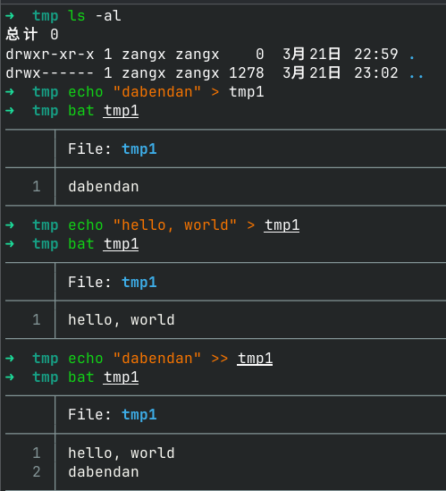
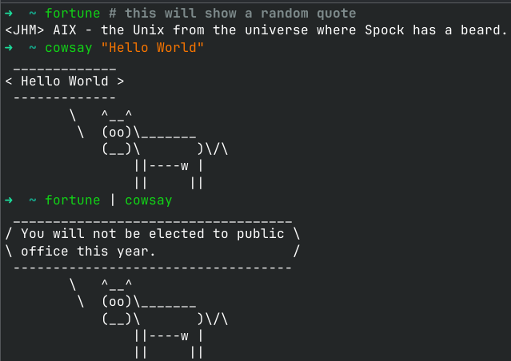
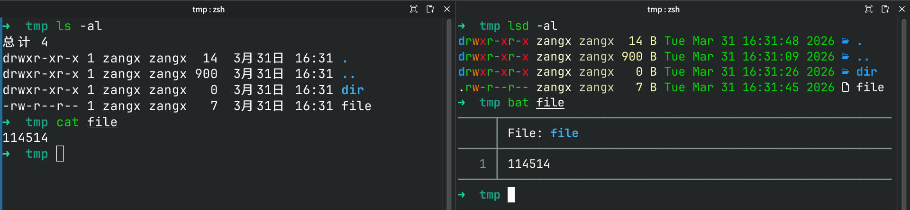

# 终端101

在计算机的世界里，图形化界面（GUI）无疑是最直观、最易上手的交互方式。我们可以通过鼠标点击图标、菜单等元素来完成各种操作，而不需要记忆复杂的命令和语法。然而，图形化界面并不是唯一的交互方式：我们使用GUI，实际上是在使用程序员预先抽象好的交互逻辑。如果遇到一些复杂的任务，例如"从许多文件中快速找到特定的内容然后在它们的末尾都加上其修改日期"，此时使用GUI则会非常繁琐。难道只能坐等程序员更新软件吗？显然不是。我们可以使用另一种交互方式：命令行界面（CLI），也就是我们常说的"终端"或者"控制台"。不要害怕这个东西！影视剧等作品经常将终端描绘成黑客专用工具，实际这玩意远远没有那么可怕。它只是一个工具，和图形界面（GUI）一样，都是用来和计算机交互的手段而已。

因为CLI直接与操作系统交互，能够提供更高的灵活性和效率。通过终端，我们可以直接输入命令来完成各种操作，例如文件管理、软件安装、系统配置等。虽然CLI的学习曲线较陡峭，需要记忆大量的命令和参数，但是一旦掌握了它，我们就能够更高效地使用计算机，甚至可以实现一些图形化界面无法完成的任务。

在Windows上，只需要按下 `Win+R` ，然后输入 `cmd` ，按下回车键即可打开命令提示符（CMD）；在macOS上，可以通过"应用程序"中的"实用工具"文件夹找到"终端"应用程序；在Linux上，可以通过按下 `Ctrl+Alt+T` 快捷键或者在应用程序菜单中找到"终端"应用程序来打开终端。

!!! tip "提示"
    terminal、shell、CLI、console等术语严格说来是不同的概念，但是在大多数技术交流时几乎完全不作区分，可以随便混用。其具体定义是：

    - **terminal（终端）**：最初指的是连接到大型计算机的物理设备，现在通常指的是提供命令行界面的软件。
    - **shell（外壳）**：指的是提供命令行界面的程序，它解释用户输入的命令并将其传递给操作系统执行。
    - **CLI（命令行界面）**：指的是通过命令行与计算机交互的界面。
    - **console（控制台）**：最初指的是计算机的物理控制台，现在通常指的是提供命令行界面的软件，类似于terminal。

    那为什么这四个东西合流了呢？因为现代计算机中，这些概念往往是重叠的。例如，我们使用的terminal实际上就是console（但是在古老的计算机中，console和terminal是不同的东西，前者是管理员用的物理设备，而后者是用户用的物理设备）；而这玩意通常包含一个shell，并提供一个CLI界面。你看，区别起来是不是就毫无意义了？因此，在大多数情况下，我们可以将这些术语视为同义词，互换使用。

    但是有些时候，这些东西也是不得不区分的，例如下文在介绍不同的shell时，我们就必须区分，因为这涉及到其具体功能（解释命令）。与之类似的，与GUI、TUI对应的只能是CLI，这涉及到其交互方式。又比如，Linux上的终端模拟器（例如GNOME Terminal、Konsole等）都是terminal，而不能说这些东西是shell或CLI。console仅在Windows语境下与terminal有区分，因为console在Windows语境下指的就是CMD.exe，而terminal则可以是Windows Terminal、PowerShell等，但console和terminal却往往都翻译成终端……真是一笔烂账。其他语境下则可以混用。

**我非常建议读者跟着下文实操！**

## 选择Shell

Shell是终端中的一个重要组件，它负责解释用户输入的命令并将其传递给操作系统执行。不同的操作系统有不同的默认shell，例如Linux和macOS默认使用bash或者zsh，而Windows默认使用CMD或者PowerShell。

对于Linux和macOS，常见的shell有以下几种：

|  | **bash** | **zsh** | **fish** |
| --- | --- | --- | --- |
| 定位 | 通用，默认 | 高度定制 | 易用、美观、现代化 |
| 兼容性 | POSIX标准兼容 | 大多数兼容bash | 不兼容bash，自成一套 |
| 上手难度 | 中等 | 中等偏高 | 非常简单 |
| 自动补全 | 仅有基础功能 | 需配合插件 | 开箱即用 |
| 语法高亮 | 没有 | 有插件 | 默认有 |
| 可定制性 | 较低 | 非常高 | 较高 |
| 脚本通用性 | 几乎全通用 | 高 | 低 |
| 资源占用 | 非常低 | 取决于插件 | 较低 |

*表：常见的Linux/macOS Shell对比*

我们推荐使用zsh或者fish。关于zsh怎么安装插件的问题，可以参考网上的各种教程，例如Oh My Zsh等。

对于Windows，默认的终端是CMD，其风格太老了，基本与现代开发脱节，不建议使用。我们建议使用PowerShell。PowerShell的命令统一采用的是动词-名词的格式，和Linux Shell的简单缩写形式有很大的不同。这是因为PowerShell的设计理念是模仿C#的"对象"，而不是Linux Shell的文本流。不过也正因此，PowerShell本身就是一门完备的语言，功能非常强大，在处理复杂的任务上更为简单。

!!! warning "警告"
    Windows上自带的那个默认的"PowerShell"和我们从MS Store上安装的PowerShell不是一个东西。前者是Windows PowerShell，基于.NET Framework，版本最高为5.1；而后者是PowerShell Core，基于.NET Core，版本从6开始。两者在语法和功能上有一些差异。我们推荐使用PowerShell Core，因为它是跨平台的，并且得到了微软的持续支持和更新，而微软也推荐使用后者。

除了这些以外，如果不希望使用Windows的原生shell，也可以使用诸如Cygwin、MSYS2等类UNIX环境，来获得类似Linux的终端体验。有些教程会让你使用git bash，这东西是一个精简版MSYS2，主要用于Git操作，功能非常有限，不建议长期使用。

## 怎样使用终端？

### 命令的基本结构

一般情况下，一条命令满足以下结构：

```bash
程序 [子命令] [选项] [对象]
```

其中，除了程序是必须的，其他的子命令、选项和对象都是可选的，选项和对象中有的顺序可以颠倒，有的则不行。例如，命令：

```bash
apt install git -y
```

这里的`apt`是一个程序（包管理器）；`install`是一个子命令，表示安装软件包；`-y`是一个选项，表示自动确认安装；`git`是一个对象，表示要安装的软件包名称。上述命令中，子命令`install`和对象`git`的位置是不能颠倒的，而选项`-y`的位置则可以放在子命令和对象的前后。

### 终端的基本操作

需要注意的是，终端大多不支持鼠标点击，因此需要全程使用键盘输入命令，用方向键的左右键移动光标。方向键的上下键可以用来浏览历史输入过的命令，这对于重复输入相似命令非常有用。有时候，终端会帮我们提前补全一些命令（表现为半透明文字），我们只需要按下Tab键即可自动补全命令或者文件名。

有的命令执行时间很长，或执行时遇到了错误需要掐断。这时，我们可以按下 `Ctrl+C` 来终止当前命令的执行。而如果我们仅仅是希望暂停而非终止当前命令的执行，可以按下 `Ctrl+Z` ，这会将当前命令暂停并挂起，然后你可以输入其他命令。

要恢复暂停的命令，可以使用 `fg` 命令将其恢复到前台继续执行。


/// caption
图：在Linux上运行一个执行时间较长的命令。使用 `Ctrl+C` 来中断它的执行；使用 `Ctrl+Z` 来暂停它的执行；使用 `fg` 来恢复它的执行。
///

有的时候，命令执行时间实在是太长了，我们不想等着这东西一直运行下去，但是这个命令不跑还不行。这时，我们可以在命令后面加上一个 `&` 符号，表示让这个命令在后台运行，这样我们就可以继续输入其他命令了。


/// caption
图：在Linux上运行 `oneko` 命令，并让它在后台运行；然后使用 `killall` 命令来终止它的运行。
///

有时候，我们从其他地方复制来了一些命令，或希望将命令的输出复制走。我们知道在终端中 `Ctrl+C` 是用来终止命令的执行的，这时我们该怎么办呢？这时，我们可以使用鼠标左键选中要复制的内容，然后按下 `Ctrl+Shift+C` 来复制选中的内容。要将内容粘贴到终端中，可以按下 `Ctrl+Shift+V` 。这一点是和普通的文本编辑器不同的。另外，虽然很多终端不支持鼠标点击光标，但也有一部分终端支持用鼠标选定一些内容并右键，以显示菜单来进行复制和粘贴操作。

下表是一些常见的命令。

| 操作 | Bash等 | Pwsh |
| --- | --- | --- |
| 创建文件 | `touch` | `New-Item` |
| 列出文件 | `ls` | `Get-ChildItem` |
| 复制文件 | `cp` | `Copy-Item` |
| 移动文件 | `mv` | `Move-Item` |
| 删除文件 | `rm` | `Remove-Item` |
| 创建目录 | `mkdir` | `New-Item -Type Directory` |
| 删除目录 | `rmdir` | `Remove-Item -Recurse` |
| 查看帮助 | `man` | `Get-Help` |

*表：Bash和PowerShell的常用命令对比*

当然，上述命令在Windows上并不常用。然而，如果想从事开发，终端反而会变得不可或缺，尤其是在使用诸如Git、Docker等工具时。另外，在希望对文件进行批量处理时，终端也会显得非常有用。

另，上述命令虽然在Windows上的全称看起来很吓人，但是PowerShell支持命令别名，例如 `ls` 实际上就是 `Get-ChildItem` 的别名， `cp` 是 `Copy-Item` 的别名，等等。因此，我们可以直接使用这些简短的命令。要是实在不行，那还是老老实实用PowerShell里的全称吧。

例如，"Windows聚焦"每天都会更新新的图片，例如风景、动物等，并将其作为锁屏背景或桌面背景。这些图片被缓存在一个隐藏目录中，且没有扩展名。如果遇到特别喜欢的图片，可以把这些缓存提取出来，并批量加上扩展名：

```powershell
Rename-Item -Path "Your\Path\Here\*" -NewName { $_.Name + ".jpg" } # Pwsh 风格
ren Your\Path\Here\* *.jpg # CMD 风格，一般Pwsh兼容
```

这样比起手动地一个个添加扩展名要方便得多。

## 常用终端命令行辞典

在上表中，我们初步认识了一些常用的命令。接下来我们会对它们进行一定的扩展，这些基本上覆盖了我们日常使用终端时最常用的命令，大家记住其中的大多数命令就可以玩转终端了。

**系统命令**

- `sudo` 命令用于提权。
- `poweroff` 和 `shutdown` 两个命令用于关机。
- `reboot` 命令用于重启电脑。
- `whoami` 命令用于查看自己是哪个用户。
- `which` 命令用于查找可执行文件的路径。
- `ps` 命令用于显示当前运行的进程。
  - `-e`：显示所有进程。
  - `-f`：以全格式显示进程信息，包括父进程ID、用户等。
  - `-l`：以长格式显示进程信息。
  - `-u`：显示指定用户的进程。
  - `-p`：显示指定进程ID的进程。
  - `-o`：自定义输出格式。
  - `-H`：以树形结构显示进程之间的关系。
  - `-j`：以作业控制格式显示进程信息。
  - `-x`：显示所有进程，包括没有控制终端的进程。
- `kill` 命令用于终止进程。
- `fg` 命令可以将后台运行的任务调回前台，这个命令可以恢复被 `Ctrl+Z` 挂起的任务。
- `bg` 命令可以将任务放到后台运行。

**文件系统类**

- `pwd` 命令用于显示当前工作目录的绝对路径。
- `ls` 命令用于列出目录中的文件和子目录。
  - `-l`：以长格式列出文件和目录的详细信息。
  - `-a`：列出所有文件和目录，包括隐藏文件。
  - `-h`：以人类可读的格式显示文件大小。
  - `-R`：递归地列出子目录中的文件和目录。
  - `-t`：按修改时间排序。
- `tree` 命令用于以树形结构显示目录中的文件和子目录。
- `find` 命令用于在目录中查找文件和目录。
  - `-name`：按名称查找文件和目录。
  - `-type`：按类型查找文件和目录，例如 `f` 表示文件， `d` 表示目录。
  - `-size`：按大小查找文件，例如 `+100M` 表示查找大于100MB的文件。
  - `-mtime`：按修改时间查找文件，例如 `-7` 表示查找7天内修改过的文件。
  - `-exec`：对查找到的文件执行指定的命令。
- `cd` 命令用于切换当前工作目录。
- `mkdir` 命令用于创建新目录。
  - `-p`：递归地创建多级目录，如果上级目录不存在则一并创建。
  - `-v`：显示创建目录的详细信息。
  - `-m`：设置新目录的权限。
- `touch` 命令用于创建新文件或更新现有文件的修改时间。
  - `-a`：只更新访问时间。
  - `-m`：只更新修改时间。
  - `-c`：如果文件不存在则不创建。
  - `-t`：设置文件的时间戳。
  - `-r`：使用指定文件的时间戳。
- `rm` 命令用于删除文件或目录。
  - `-r`：递归地删除目录及其内容。
  - `-f`：强制删除文件或目录，不提示确认。
  - `-i`：在删除前提示确认。
  - `-v`：显示删除的详细信息。
- `rmdir` 命令用于删除空目录。
- `cp` 命令用于复制文件或目录。
  - `-r`：递归地复制目录及其内容。
  - `-f`：强制覆盖目标文件。
  - `-i`：在覆盖前提示确认。
  - `-v`：显示复制的详细信息。
  - `-u`：只在源文件比目标文件新时才进行复制。
- `mv` 命令用于移动或重命名文件或目录。
  - `-f`：强制覆盖目标文件。
  - `-i`：在覆盖前提示确认。
  - `-v`：显示移动的详细信息。
  - `-u`：只在源文件比目标文件新时才进行移动。
- `ln` 命令用于创建链接。
  - `-s`：创建软链接（符号链接）。
  - `-f`：强制覆盖目标链接。
  - `-i`：在覆盖前提示确认。
  - `-v`：显示链接的详细信息。
  - `-T`：将目标视为一个普通文件，而不是目录。
- `tar` 命令用于打包和解包文件。
  - `-c`：创建一个新的归档文件。
  - `-x`：从归档文件中提取文件。
  - `-f`：指定归档文件的名称。
  - `-v`：显示详细的操作信息。
  - `-z`：使用 gzip 压缩或解压缩归档文件。
  - `-j`：使用 bzip2 压缩或解压缩归档文件。
  - `-J`：使用 xz 压缩或解压缩归档文件。
  - `-p`：保留文件的权限和时间戳。
  - `-C`：切换到指定目录后再进行打包或解包。

**文本处理类**

- `head` 命令用于显示文件的前几行。
- `tail` 命令用于显示文件的后几行。
- `cat` 命令用于连接文件并打印到标准输出。
  - `-n`：为每一行添加行号。
  - `-b`：为非空行添加行号。
  - `-s`：压缩连续的空行。
  - `-E`：在每行末尾显示 `$` 符号。
  - `-T`：将制表符显示为 `^I`。
  - `-v`：显示不可见字符。
  - `-A`：显示所有不可见字符，包括空格和制表符。
  - `-e`：等同于 `-vE`，显示不可见字符并在行末添加 `$` 符号。
- `echo` 命令用于在终端输出文本。
  - `-n`：不在输出末尾添加换行符。
  - `-e`：启用转义字符的解释，例如 `\n` 表示换行， `\t` 表示制表符。
  - `-E`：禁用转义字符的解释。
  - `-c`：不输出任何内容。
  - `-C`：将输出内容转换为大写字母。
  - `-l`：将输出内容转换为小写字母。
  - `-a`：将输出内容转换为首字母大写字母。
  - `-s`：将输出内容转换为首字母小写字母。
  - `-p`：将输出内容转换为首字母大写字母，并将其他字母转换为小写字母。

!!! warning "警告"
    **示例疑问（来自实际开发场景）：**

    导啊，咱们生产环境为啥执行 `dpkg` 会说 `command not found` 呀？

    我之前干了啥？清了一下工作路径垃圾，好像是 `sudo rm -rf /`

    什么叫相对路径要加个点？

    **警告：除非你知道你在输入什么，否则任何情况下均不要带上 `sudo` 执行删除命令！**

## 进阶：命令联动

在终端中，重定向、管道、进程替换、Here-String、变量是五种把数据从一条命令挪到另一条命令（或文件）的核心手段。它们常被混用，但机理各不相同。

### 重定向

重定向指的是将命令的输入或输出从默认的终端重新定向到文件或其他设备。例如，使用 `>` 可以将命令的标准输出重定向到一个文件中，使用 `<` 可以将一个文件的内容作为命令的标准输入；使用 `>>` 可以将命令的标准输出追加到一个文件中。



/// caption
图：重定向示例，展示将命令输出重定向到文件以及将文件内容作为命令输入的过程。
///

### 管道

管道应当很好理解，在日常生活中通常用于描述一头进一头出的东西。在命令行中，管道指的是将一个命令的输出直接作为另一个命令的输入。例如，使用 `|` 可以将前一个命令的标准输出连接到后一个命令的标准输入。在Linux中，管道是面向字符串的，即只复制文本数据；而在PowerShell中，管道是面向对象的，前一个命令的输出会被转换成对象传递给后一个命令。



/// caption
图：管道示例，展示将一个命令的输出直接作为另一个命令的输入的过程。
///

这里的管道因为不具有名称，所以也被称为匿名管道。它的效率非常高，因为数据直接在内存中传递，不需要经过磁盘等中间介质。匿名管道的速度比重定向等都要快。

最常见的管道莫过于ls-grep组合：

```bash
ls -al # 这会列出当前目录下的所有文件和目录的详细信息
grep "pattern" # 这会从输入中查找包含 "pattern" 的行
ls -al | grep "pattern" # 这会列出当前目录下所有包含 "pattern" 的文件和目录的详细信息
```

### 进程替换

进程替换指的是将一个命令的输出作为另一个命令的输入，但不通过匿名管道，而是通过一个特殊的文件描述符或者具名管道来实现。例如，在Linux中，使用 `<(cmd)` 可以将命令 `cmd` 的输出作为一个临时文件的输入。例如，以下两个命令是等价的：

```bash
cowsay <(fortune)
fortune | cowsay
```

最常见的进程替换大概莫过于 `diff` 命令了。我们经常需要比较两个命令的输出是否一致，所以：

```bash
diff <(cmd1) <(cmd2)
diff <(cat file1) <(cat file2) # 这只用于说明问题，实际上相当于diff file1 file2
```

进程替换的本质是具名管道或文件描述符，和常规的管道（匿名管道）不同，常规的管道是直接连接两个命令的输入输出，而进程替换则是通过一个特殊的文件来实现数据传递。因此，进程替换的效率可能会比管道稍微低一些，因为它需要创建一个临时文件或者具名管道来存储数据；但它的优势在于可以让我们在一些不支持管道的命令中使用另一个命令的输出作为输入，例如一些需要文件路径作为参数的命令。

### Here-String

Here-String指的是将一个字符串直接作为命令的输入，本质是将字符串写入一个临时文件中，然后将这个临时文件作为命令的输入。因此，Here-String的效率可能也比管道慢些。Here-String的语法是 `cmd <<< "string"`，它会将字符串 "string" 写入一个临时文件中，然后将这个临时文件作为命令 `cmd` 的输入。例如，以下两个命令是等价的：

```bash
cowsay <<< "$(fortune)"
fortune | cowsay
```

Here-String平常使用较少，但也有一些特殊场景会使用。

### 变量

变量一般指的是Shell语言编程的时候所用的、`$` 开头的东西，例如 `$str` 就是一个变量。变量的值可以通过命令的输出或者用户输入来赋值。例如，以下命令将 `cmd1` 的输出赋值给变量 `str`，然后将 `str` 的值作为 `cmd2` 的输入：

```bash
str=$(cmd1)
cmd2 <<< "$str" # 对的，这实际上就是Here-String的最常见用法！
```

利用变量来进行命令间信息传递的情形要比上述情形更少，但因为其灵活的特征，在一些复杂的场景下也会被使用。

| 机制 | 数据形态 | 左侧何时开始 | 右侧何时开始 |
| --- | --- | --- | --- |
| 管道 | 字符串或对象 | 立即 | 立即 |
| 重定向 | 已有文件 | 立即 | - |
| `cmd <<< "$str"` | 临时文件 | 字符串生成完后 | 字符串生成完后 |
| `cmd <(cmd1)` | 命名管道/FD | 立即 | 立即 |
| `str=$(cmd1); cmd2 <<< "$str"` | 变量→临时文件 | cmd1 结束后 | cmd1 结束后 |

掌握这些手法后，你就可以根据各种实际条件，灵活选择最简洁、最高效的写法。同时，这些写法也组成了 shell 脚本的基础：shell 脚本也仅仅比上述指令多出了变量赋值、流程控制和函数定义而已！这里就留待大家自行探索 shell 脚本的世界了。

## 进阶：更好的终端

默认终端的界面比较简陋，不能显示很多信息。为了让终端更美观、更实用，我们可以使用一些终端美化工具，这里我推荐使用**Oh My Posh**和**Oh My Zsh**。

### Oh My Posh 及其配置

Oh My Posh（简称OMP）是一个跨平台的终端美化工具，支持Windows、Linux和macOS等操作系统上的多个shell（如PowerShell、Bash、Zsh等）。它提供了丰富的主题和插件，可以帮助用户更好地使用终端，提高工作效率。

!!! tip "提示"
    在配置Oh My Posh的时候，很多的命令涉及到执行脚本。默认情况下，Windows PowerShell会阻止执行脚本以保护系统安全。因此，你需要先修改执行策略来允许执行脚本。在PowerShell中运行以下命令：

    ```bash
    Set-ExecutionPolicy -ExecutionPolicy RemoteSigned -Scope CurrentUser
    ```

    就可以允许当前用户执行远程签名的脚本。

我们建议使用winget来安装Oh My Posh。你可以在PowerShell中运行以下命令来安装：

```bash
winget install JanDeDobbeleer.OhMyPosh
```

安装完成后，你需要在PowerShell中运行以下命令来初始化Oh My Posh：

```bash
oh-my-posh init pwsh
```

如果你使用的是其他终端，例如cmd，你可以在Oh My Posh的[安装文档](https://ohmyposh.dev/docs/installation/prompt)中找到相应的安装方法。

要配置OMP，首先应该安装OMP推荐使用的字体，例如Nerd Font。这是因为Oh My Posh使用了一些特殊的图标，如果没有合适的字体，可能会导致图标无法正常显示。

你可以在[Nerd Fonts官网](https://www.nerdfonts.com/)下载最新的字体包。安装完成后，你需要在终端中设置字体为Nerd Font，以便能够正确显示Oh My Posh的图标。另一个办法是利用OhMyPosh安装这个字体：

```bash
oh-my-posh font install meslo
```

安装完成后，你需要在终端中设置字体为Nerd Font。以PowerShell为例，你可以右键点击窗口标题栏，选择"属性"，然后在"字体"选项卡中选择Nerd Font即可。

为了保证Oh My Posh在每次启动PowerShell时都能自动加载，你需要将初始化命令添加到PowerShell的配置文件中。你可以在PowerShell中运行以下命令来打开配置文件：

```bash
notepad $PROFILE
```

然后在文件的末尾添加以下内容，并重新启动终端：

```bash
oh-my-posh init pwsh | Invoke-Expression
```

接下来，你可以在PowerShell中运行命令来设置Oh My Posh的主题了。[其他主题](https://ohmyposh.dev/docs/themes)及[其安装方法](https://ohmyposh.dev/docs/installation/customize)可自行查阅。例如使用 `powerlevel10k_classic` 为主题：编辑Powershell配置文件，在文件末尾编辑 `oh-my-posh init pwsh --config 'powerlevel10k_classic' | Invoke-Expression` ，重启终端后即可。

### Oh My Zsh

Oh My Zsh 是一个开源的、社区驱动的框架，用于管理 Zsh 配置，一般简称为omz。它提供了大量的插件和主题，可以帮助用户更好地使用 Zsh，提高工作效率，其官网为ohmyz.sh。之所以使用omz，主要是因为zsh本身就是大多数人在Linux和macOS上使用的默认shell，功能强大且易于定制，而omz作为zsh的专用配置框架，显然比omp更适合zsh。

安装、配置等内容请参考官网。

omz最令人眼前一亮的是其插件系统，内置了大量实用的插件，可以极大地扩展zsh的功能。我个人非常喜欢自动补全和语法高亮两个插件。而著名的 `git` 和 `z` 我个人反而很少用，主要是因为在别处已经彻底习惯用git命令的正常形式了，连图形化界面都几乎不用；而 `z` 我个人觉得没有必要，毕竟我用得最多的目录也就那么几个，结合KDE桌面和Dolphin文件管理器完全足够快速访问。

### 使用其他工具

默认的软件（如ls、cat、top等）功能比较简单，界面也比较丑陋。为了让终端更美观、更实用，我们可以使用一些替代工具，这里推荐几个我个人常用的：

- 用 `fd` 替代 `find`：`fd` 是一个快速且用户友好的文件查找工具，支持正则表达式和模糊匹配等功能，使用起来比 `find` 更加简单和高效。
- 用 `ripgrep` 替代 `grep`：`ripgrep` 是一个快速且高效的文本搜索工具，支持正则表达式和多线程搜索等功能，使用起来比 `grep` 更加简单和高效。
- 用 `bat` 替代 `cat`：`bat` 是一个增强版的文本查看工具，支持语法高亮、行号显示等功能，使用起来比 `cat` 更加美观和易读。
- 用 `htop` 替代 `top`：`htop` 是一个交互式的进程管理工具，支持彩色显示、进程排序等功能，使用起来比 `top` 更加直观和易用。
- 用 `exa` 替代 `ls`：`exa` 是一个现代化的文件列表工具，支持彩色显示、图标显示等功能，使用起来比 `ls` 更加美观和易读。

当然，这些工具都需要单独安装。



/// caption
图：使用替代工具后的终端界面对比。左侧是使用默认工具ls和cat的终端界面，右侧是使用替代工具exa和bat的终端界面。
///

<!-- handout-sync-source
source_type: latex
source_url: https://github.com/ZangXuanyi/getting-started-handout
source_branch: main
source_commit: e1f6c5d23fb730d144f0261027c515ca0971ffc6
source_commit_short: e1f6c5d
-->
