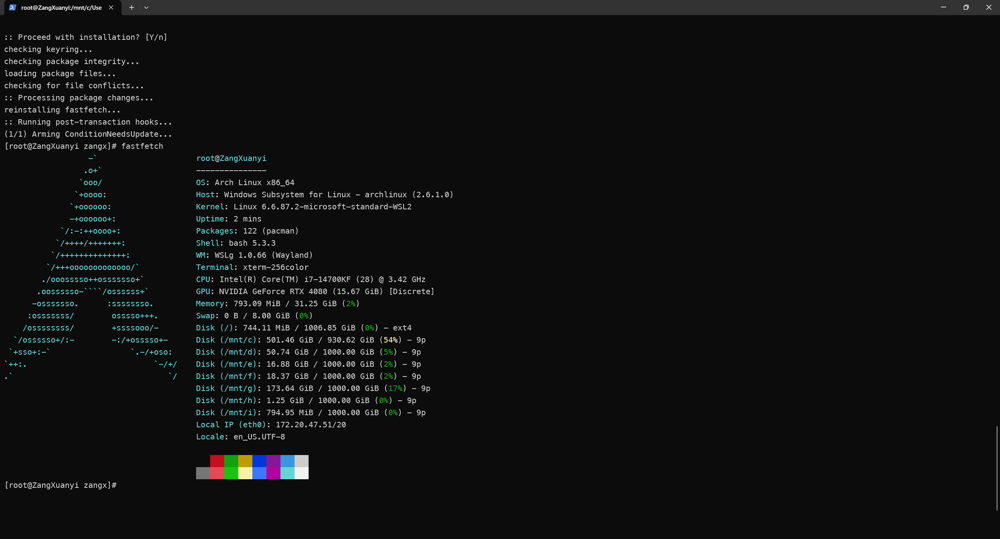

# 开始使用 Linux

刚刚我们学习了怎样使用终端。其实会用了终端，那么我们对Linux的使用就已经会了一大半了。接下来，我们来看看Linux这个操作系统本身。

很多人是因为迫不得已而使用 Linux（最常见的是上ICS）。更深入地想一想，还有没有其他使用Linux的原因呢？

对于 Windows 等带图形化界面操作系统，我们所访问的其实是设计者抽象出的交互逻辑。但对于高效的系统，自底向上的彻底理解和掌握是高效使用系统的必备途径。我们得以更深入洞悉文件和文件之间的联系，获得系统更高的主动权。同时，以最小化的人机接口访问能把足够多的资源投入至计算，获得最高的资源利用率。Linux 正是带着这样的思想而诞生的。而另一方面，Linux在配置编程和开发环境上也有着得天独厚的优势：Linux用户不仅不需要像Windows用户一样和Windows复杂的内核做斗争，也不需要像macOS用户一样被苹果的生态圈所束缚，其自由和开放使得用户可以轻松地配置和定制自己的开发环境。

要学习 Linux，我们需要掌握：

1. 对这一套思想有充分理解、能顺利玩一些玩具
2. 使用现有的工具操作命令行、把他人准备好的软件运行起来
3. 创造新的工具

那么，我们开始吧！

!!! info "阅读材料"

    在20世纪80年代，主要的几个计算机系统有UNIX、DOS和Mac OS。当时，UNIX系统昂贵且无法用于个人计算机，DOS简陋且闭源，Mac OS则只用于苹果电脑，计算机科学教育严重受限。为了解决这个问题，Andrew S. Tanenbaum教授设计了MINIX系统，并将其用于教学。然而该系统功能有限且不实用。

    当时在芬兰赫尔辛基大学读大二的Linus Torvalds在用过MINIX之后，受到了启发。在1991年，他利用UNIX的核心，吸收了MINIX的精华，剔除了不必要的部分，编写了一个新的操作系统内核，并将其命名为Linux 0.01，该内核能够运行在x86架构的个人计算机上。这就是后来各种Linux的雏形。1994年，Linux 1.0版本发布，标志着Linux的正式诞生。

    Linux内核采用了GPL协议，这使得任何人都可以自由地使用、修改和分发它。这种开放的理念吸引了大量的开发者和用户，形成了一个庞大的社区。如今，Linux已经与Windows、macOS成三足鼎立之势，成为全球最流行的操作系统之一，更成为了开源技术的象征。

## Linux发行版及其选择

虽然我们经常说“Linux系统”，但是实际上Linux并不是一个操作系统，它仅仅是一个内核（Kernel）。一个完整的操作系统还需要很多其他的组件，例如文件系统、图形界面、应用程序等。为了方便用户使用，很多组织和公司将Linux内核和其他组件打包在一起，形成了一个完整的操作系统，这就是我们常说的Linux发行版（Distribution）。Linux发行版种类繁多，每个发行版都有其独特的特点和适用场景。常见的Linux发行版有：

| 发行版 | 特点 | 更新频率 | 适用情况 |
| --- | --- | --- | --- |
| Ubuntu | 用户友好，社区活跃 | 两年 | Linux新手，桌面用户 |
| Debian | 稳定，软件包丰富 | 两年 | 服务器等生产环境 |
| Fedora | 最新技术，社区驱动 | 半年 | 开发者，技术爱好者 |
| RHEL | 商业支持，稳定 | 三年 | 企业用户，服务器 |
| CentOS | RHEL的免费版本 | 死了 | 企业用户，服务器 |
| Arch | 滚动更新，极简 | 以天计 | 高级用户，DIY爱好者 |
| NixOS | 声明式配置，原子升级 | 以天计 | 高级用户，系统管理员 |
| Rocky | Cent的复活版本 | 三年 | 企业用户，服务器 |
| Alma | Cent的复活版本 | 三年 | 企业用户，服务器 |
| Mint | 基于Ubuntu，用户友好 | 两年 | Linux新手，桌面用户 |
| Manjaro | 基于Arch，用户友好 | 以月计 | Linux新手，桌面用户 |
| openSUSE | 稳定，企业支持 | 八个月 | 企业用户，服务器 |
| Gentoo | 源码编译，极致定制 | 以月计 | 高级用户，DIY爱好者 |
| Kali | 安全测试，渗透测试 | 半年 | 网络安全专业人员 |
| Alpine | 轻量级，安全 | 以月计 | 容器，嵌入式系统 |
| 统信UOS | 中国本土，兼容Windows | 两年 | 政府，企业用户 |

!!! tip

    现在的CentOS实际上已经被RHEL官方收编并停止维护了，CentOS被收编后的名称叫做CentOS Stream，定位是RHEL的上游测试版。

    另一方面，Alma和Rocky虽然均声称是CentOS的复活版、RHEL的复刻、两者行为基本一致，但也有细微的差别：Alma兼容RHEL的ABI[^1]，声称其软件通用，但不承诺代码完全一致，因此其补丁有些时候甚至比RHEL还快24小时；Rocky则是CentOS的“精神继承者”，承诺与RHEL完全一致，但获取源码的路径比较曲折。

上述发行版是相对常见的Linux发行版。其中，最出圈的发行版莫过于Ubuntu了，有不少人甚至直接将Ubuntu和Linux划等号（这实际上是不对的）。Ubuntu拥有着庞大的用户群体和丰富的软件资源，非常适合初学者入门。

对于什么都不会的小白而言，我们推荐使用Ubuntu、Mint、Manjaro等用户友好的发行版；如果你愿意折腾，可以尝试Arch、Gentoo等极简主义的发行版；如果你要玩服务器，可以选择Debian、RHEL、CentOS（或其复活版本Rocky、Alma）等稳定的发行版；如果你对网络安全感兴趣，可以尝试Kali等专用发行版。

!!! tip

    Linux大致可以分为以下几个“家族”：

    - Debian系：包括Debian、Ubuntu、Mint等，特点是稳定，软件包丰富，适合新手和服务器。
    - Red Hat系：包括Fedora、RHEL、CentOS、Rocky、Alma等，特点是商业支持，稳定，适合企业用户和服务器。其软件生态又以RHEL为核心，因此也叫做“红帽生态”，具体流程是：Fedora激进上游 → CentOS Stream中游测试 → RHEL稳定版商业支持 → Rocky/Alma下游免费替补。
    - Arch系：包括Arch、Manjaro等，特点是滚动更新，极简，适合高级用户和DIY爱好者。
    - 其他系。

    这些系在软件包管理上，采取了不同的策略：

    - Debian系使用APT包管理器，软件包格式为DEB；
    - Red Hat系使用YUM或DNF包管理器，软件包格式为RPM；
    - Arch系使用Pacman包管理器，软件包格式为Tar.xz。

    但是，不同系的发行版实际上最大的区别仅在于包管理器和默认配置上，其他方面并没有太大区别，终端命令行等也完全相似，因此我们并不需要过于纠结。

### CLab

这是最简单的使用Linux的方式，甚至不需要在计算机上安装任何东西。我们只需要去 [CLab](https://clab.pku.edu.cn/) 注册一个账号，根据上面的指南连接到虚拟机。这样，你就可以在不破坏自己的系统的情况下，体验 Linux 的魅力了。当然，这个虚拟机的性能和功能有限，因此一般用户无法在上面运行诸如MineCraft服务端等大型软件。

### 实机安装

如果我们有一台不怎么重要的机器和一个U盘，可以利用U盘在这台机器上面安装Linux。你可以选择任意的发行版进行安装，安装过程参考各发行版的官方文档和本书前面的安装章节即可。

### 使用虚拟机

使用虚拟机也是一个很好的选择。通过虚拟机，我们可以在现有的操作系统上运行Linux或者其它系统，而不需要重新安装或配置硬件。

一般我们使用的虚拟机软件有VirtualBox、VMware等。不同的虚拟机有着不同的特点和使用方法，但是总体而言在虚拟机中安装一个Linux发行版的步骤与在实机上安装类似（只是不需要设置BIOS和U盘启动等了）。

### WSL

这里仅提一嘴，具体的使用见后文“WSL速成指南”一节。

## Linux的基本操作

得了，来了啥也别说，先跑个小火车：

```bash
sudo apt install -y sl && sl
```

执行以上命令，我们就可以看到一个小火车在终端上跑了过去。

`sl` 是一个玩具软件，它的全称是Steam Locomotive，是一个在终端上显示火车动画的程序，展示了 ASCII 艺术的魅力。这个程序最初是作为一个恶搞程序出现的，目的是为了提醒用户注意输入错误的命令（因为很多人会把 `ls` 错误地输入为 `sl`）。不过，随着时间的推移， `sl` 逐渐成为了一个有趣的终端玩具，受到了许多终端爱好者的喜爱。

拆解这一行命令：

- `sudo` 是“以超级用户身份运行命令”的意思。因为安装软件包需要修改系统文件，所以需要管理员权限。执行这个命令时，系统会提示输入当前用户的密码，以验证权限。
- `apt` 是Debian及其衍生发行版（如Ubuntu）中用于管理软件包的工具。它可以用来安装、更新和删除软件包。
- `install` 是 `apt` 的一个子命令，用于安装软件包。
- `-y` 是一个选项，表示自动回答“是”以确认安装过程中的提示。这样可以避免在安装过程中需要手动输入确认。
- `sl` 是要安装的软件包的名称。
- `&&` 是一个逻辑运算符，表示如果前面的命令成功执行了，那么就执行后面的命令。
- 最后的 `sl` 是运行刚刚安装好的小火车程序的命令。

我们发现，这个命令和我们在上一章中接触到的那些命令遵循相同的结构。

如果我们用的不是Debian系的Linux发行版，而用的是其他发行版，则需要使用相应的包管理器，例如Red Hat系使用 `yum` 或 `dnf`，Arch系使用 `pacman`。以Arch为例：

```bash
sudo pacman -S sl && sl
```

让我们看看上面内容是怎么发生的。我们刚刚输入的单条命令依然是这样的形式：

```bash
程序 [子命令] [选项] [对象]
```

我们用 `apt install -y sl` 来举例说说：apt是程序，install是子命令，-y是选项，sl是对象。于是我们就能看到，一个程序就这么跑起来了，看起来很明确。

那么，我们怎么知道有什么程序，我们又怎么使用它们呢？对于第一个问题，我们可以通过搜索来解决，例如在apt中，我们可以使用 `apt search <关键词>` 来搜索软件包；在pacman中，我们可以使用 `pacman -Ss <关键词>` 来搜索软件包；而yum和dnf中，我们可以使用 `yum search <关键词>` 或 `dnf search <关键词>` 来搜索软件包。

对于第二个问题，我们可以通过手册来解决。

- `<program> -h` ：这是最简单的方式，直接查看程序的帮助信息。通常会列出所有可用的子命令和选项。
- `man <program>` ：这是查看程序手册的方式。手册通常会提供更详细的信息，包括子命令的用法、选项的含义等。但是这个手册可能会比较长，需要耐心阅读。
- `tldr <program>` ：这个命令会给出一些常用的命令示例和简要说明。当然， `tldr` 需要自己安装，安装方法和 `sl` 类似。

## Linux的文件系统

好的，我们刚刚已经基本知道怎么使用Linux了。接下来，我们来看看Linux的文件系统。我们不会涉及到任何复杂的概念，只会介绍一些最基本的内容。

思考以下问题：我们刚刚确实输入了 `sl` 命令，但是我们并没有输入 `sl` 的路径。那这个 `sl` 到底在哪里呢？我们怎么知道它在哪里？（其实我们知不知道真无所谓）终端又怎么知道它在哪里？小火车又是怎么跑起来的？

为了解决这一问题，计算机前辈们发挥了聪明才智：只要把所有的东西都归纳为一个概念，那么不就可以方便地管理了吗？于是，文件系统就诞生了。

UNIX和Linux认为，所有的东西都是**文件**。文件系统就是用来管理这些文件的。这时候，我们就可以使用同样的方式来对所有的东西进行操作了。但是我们又出现了其他问题：

1. 文件怎么组织？
2. 文件是谁的？怎么反映不同类型的特性？
3. 文件怎么相互联系？

接下来我们将会逐个回答以上问题。

### 文件的组织

我们在上一章中提到，Windows系统下，物理先于文件存在，所以有盘符一说。但是Linux不这么认为：Linux认为什么都是文件。于是，Linux的根目录 `/` 就成了所有文件的起点。所有的文件都在这个根目录下。

于是，我们就能够通过目录来解决这一问题。目录是一个特殊的文件，它可以包含其他文件和子目录，所以一个文件的文件名如果被创建为 `dir/file` ，那么它就表示在根目录下的 `dir` 目录下有一个名为 `file` 的文件，而不是一个名为 `dir/file` 的文件。我们可以使用 `ls` 命令来查看当前目录下的文件和子目录，也可以使用 `cd` 命令来切换目录。

Linux的目录结构和Windows极其相似，只是没有盘符，并且使用 `/` 作为分隔符，而不是 `\` 。我们可以使用 `/` 来表示根目录，使用 `..` 来表示上一级目录，使用 `./` 来表示当前目录。需要注意的是，Linux的文件系统是区分大小写的，所以 `/home` 和 `/Home` 是两个不同的目录。

Linux还有一个重要的目录：用户的家目录，通常位于 `/home/username` 。在这个目录下，用户可以存放一些配置文件。我们可以使用 `~` 来表示当前用户的家目录。我们不推荐把自己的杂七杂八文件放在根目录或者家目录下，而是放在家目录的子目录下。这样可以更好地组织文件，并且避免与系统文件冲突。

我们在上一章提到，出于安全性考虑，对于可执行文件，如果没有提供路径，系统会在一些特定的目录下查找。因此假如有一个可执行文件 `hello` ，我们应当使用 `./hello` 来运行它，而不是直接使用 `hello` 。

如果我们想要在任何地方都能运行这个程序，我们可以把它加入PATH环境变量中去。PATH是一个环境变量，它包含了一些目录的路径，系统会在未提供路径时去这些目录下查找可执行文件，这是为了安全考虑。我们可以使用 `echo $PATH` 来查看当前的PATH变量。假如我们把 `hello` 放在 `/usr/local/bin` 目录下，那么我们就可以在任何地方运行它了，这是因为上述目录通常会被包含在PATH变量中。

### 文件是谁的，有什么属性

作为多机系统，Linux 中文件如果对每个访问者都相同，那就没有安全性可言了。Linux 的做法是，抽象出了“用户”这个实体（其实就是在  `/etc/passwd`  里面定义的一行 UID 和用户名的对应而已）。为了方便用户的文件共享，同时抽象出了组（Group）的概念，代表一组互相信任的用户。

对文件的基本操作有读、写、执行三种，一般用字母表示为r、w、x。我们使用权限位来表示这三种操作。每个文件都有三个权限位，分别对应所有者、组和其他用户。我们可以使用 `ls -l` 命令来查看文件的权限。

举例：一个用户创建了一个文件，这个文件对他的权限是rwx，对同组用户的权限是r-x，对其他用户的权限是r--。那么这个文件的权限就是 `rwxr-xr--` 。而这个代表方式还是太笨重了，于是Linux又引入了数字表示法。

数字表示法是一个“独热编码”（One-hot Encoding），也就是rwx被看作三个相互独立的二进制位，对应位上1表示有该权限，0表示没有该权限。然后把这三个位的值拼成一个三位的二进制数，就代表了其最终权限。例如：某用户对文件有读、写权限，没有执行权限，即rw-，对应的二进制数是110，转换成十进制就是6。而二进制中的100是4，010是2，001是1，于是就可以把一个用户对文件的权限表示为一个0到7的数字，例如7=4+2+1表示rwx，5=4+0+1表示r-x，等等。

因此我们的文件权限可以用一个三位八进制来表示，从左到右的每一位分别对应所有者、组和其他用户的权限。例如，权限为 `rwxr-xr--` 的文件可以表示为 `754` 。另一个常见的权限编码是 `644` ，你能说明其含义吗？[^2]

但有一个用户比较特殊，那就是root用户。root用户是系统管理员，拥有对所有文件的最高权限。无论文件的权限如何设置，root用户都可以对其进行读、写、执行操作；换句话说，root用户对所有文件的权限都是 `rwx` 或者7。

我们可以使用 `chmod` 命令来修改文件的权限。例如， `chmod 777 file.txt` 将会把指定文件的权限设置为777。

!!! tip

    修改文件权限需要有相应的权限，否则会报错。例如你无法给一个对你来说权限是0的文件加上可执行权限。

!!! warning

    不要执行这类抽象的命令： `chmod 777 /` ，这会导致系统所有成员全部被视同root用户，进而导致系统无法正常工作。

    这样就会导致所有用户都可以写根目录，随便替换 `/bin/sh` 、 `/etc/passwd` 、 `usr/bin/sudo` 等关键文件，乃至随意植入cron、systemd等定时任务，**等同于整个安全阵地完全失守，自毁长城**。

常见的权限标识符包括755、644、750等，这些标识符的含义都很简单，我这里就不详细展开描述了。

而不使用标识符的情况也是可以的，例如某python文件需要被执行，那么我们可以使用 `chmod +x script.py` 来给它加上可执行权限，这里的 `+x` 表示“加上可执行权限”。类似地， `-x` 表示“去掉可执行权限”， `+r` 表示“加上读权限”等。

所以可执行文件并不是因为这个文件本身有什么特别，而是这个文件被你赋予了可执行的性质。一个简单的文本文件也可以被加上可执行的权限，也可以发挥操作其他文件的作用。

例如，如果你会写 Python 的话，写一个从输入读取 2 个数字，输出他们和的程序，输出结果到控制台。在本地跑起来这个程序之后，把 `#!/usr/bin/env python3` 放在脚本的第一行（这个特殊的一行叫 Shebang）。给这个脚本加上可执行的属性，然后直接运行这个文本！

### 文件的联系

文件间的联系，主要是通过文件系统的链接来实现的。Linux 中有两种链接：硬链接和软链接。硬链接是指在文件系统中，一个文件可以有多个文件名，存在于多个位置，但是文件系统中只有一份文件副本，所有链接均指向这一副本。删除其中一个文件名并不会影响文件内容，只有所有位置下的文件链接均被删除时，此文件副本才会被最终移除。软链接是指一个文件名指向另一个文件名，删除原文件名会影响软链接的有效性。

硬链接和软链接的区别在于，硬链接是文件系统的一个特性，而软链接是文件系统的一个单独的文件。硬链接只能在同一个文件系统下，而软链接可以在不同文件系统下。硬链接不能链接目录，而软链接可以链接目录。

!!! tip

    试一试：

    ```bash
    echo "hello" > a # 随便创建一个文件
    ln a b           # 创建硬链接 b 指向 a
    ln -s a c        # 创建软链接 c 指向 a
    ```

    现在这里有了b和c两个新的文件。试着利用 `ls -l` 命令查看它们的属性，看看有什么区别。然后尝试删除a文件，看看b和c会发生什么变化。

## Linux的进一步使用

### root权限的配置

root 用户是超级用户，拥有着 Linux 系统内最高的权限，在终端内使用su命令即可以超级用户开启终端，root 用户的权限最高，而其他账户则可能会有以能以超级用户身份执行命令的授权（可以类比 Windows 中的管理员权限），但即使是拥有授权的账户在终端输入的命令也不会以超级用户身份执行，如果需要以超级用户的身份运行则需要在此命令前加 sudo。

第一种情况，如果你所选择的发行版在安装过程中没有设置 root 密码的环节（如 Ubuntu），则新创建的用户会拥有管理员权限，一般不需要使用 root 账户，直接使用 sudo 命令即可。

第二种情况，如果你所选择的发行版在安装过程中已经设置了 root 密码，但是自己的账户并没有管理员权限（如 Debian），为了用起来方便一般会用 root 账户给自己的账户添加管理员权限，具体操作如下（`$`号后的为输入的命令）：

```bash
yourusername@yourcomputer$ su
root@yourcomputer$ /usr/sbin/usermod -aG sudo yourusername
```

前者表示切换至 root 账户，后者表示为你指定的账户添加管理员权限。有些发行版中 wheel 组表示有 sudo 权限的用户组（例如Arch），也可以用 visudo 编辑 sudo 配置。

### 软件的安装及其源的配置

如果你的系统在安装的时候已经选择过了国内源则忽略，否则默认源来自于国外。从国外的服务器更新软件包会很慢，可以根据自己系统的版本自行搜索匹配的源并更换。具体参考[北大开源镜像站的帮助文档](https://mirrors.pku.edu.cn/Help)。

以采用 apt 包管理器为例，更新源后需要重新更新软件索引，请执行以下操作：

```bash
sudo apt-get update
sudo apt-get upgrade # 如果需要升级软件包
```

如果你需要安装软件包，可以使用以下命令：

```bash
sudo apt-get install <package-name>
```

如果想要卸载软件包，可以使用以下命令：

```bash
sudo apt-get remove <package-name>
```

有时候，我们不得不使用一些其他安装方式，例如从 `*.deb` 包安装。对于这些情况，我们可以使用以下命令：

```bash
sudo dpkg -i <package-name>.deb # 安装 .deb 包
sudo apt-get install -f # 修复依赖问题
```

有时，软件自带安装脚本，我们直接运行这些脚本即可。

特别注意：我们请尽可能地使用包管理器来安装软件，而不是直接下载二进制文件或源码编译安装。包管理器可以自动处理依赖关系，并且可以方便地进行软件的更新和卸载。如果一定要手动安装软件，请确保你了解该软件的安装过程和依赖关系，并尽可能在虚拟环境或容器中进行测试，以避免对系统造成不必要的影响。

### 关于VIM和Nano

虽然我们有很多文本编辑器可以在图形化的Linux上使用，但是在终端中，这两个编辑器依然是最常用的，而且也是不得不用的（尤其是VIM！）。因此，我将会在这里简要介绍一下这两个编辑器。

#### VIM

VIM是一个强大的文本编辑器，它有着丰富的功能和插件，可以满足各种需求。
VIM有两种状态：命令状态和编辑状态。默认情况下，VIM处于命令状态。在命令状态下，我们可以使用各种命令来操作文件；在编辑状态下，我们可以直接输入文本。在这两种方式之间的切换非常简单，只需要按下 `i` 键即可进入编辑状态，按下 `Esc` 键即可返回命令状态。

编辑状态下的VIM乏善可陈，完全可以把这玩意当成一个没有鼠标的Windows记事本来使用，这里根本没有什么好说的。我们的重点在于命令状态下的VIM。
在命令状态下，我们可以使用各种命令来操作文件。以下是一些常用的命令：

- `h` ：向左移动光标。
- `j` ：向下移动光标。
- `k` ：向上移动光标。
- `l` ：向右移动光标。
- `w` ：移动到下一个单词的开头。
- `b` ：移动到上一个单词的开头。
- `0` ：移动到行首。
- `$` ：移动到行尾。
- `gg` ：移动到文件开头。
- `G` ：移动到文件结尾。
- `dd` ：删除当前行。
- `yy` ：复制当前行。
- `p` ：粘贴。
- `u` ：撤销。
- `Ctrl+r` ：重做。
- `:w` ：保存文件。
- `:q` ：退出VIM。
- `:wq` ：保存并退出VIM。
- `:q!` ：强制退出VIM，不保存文件。

想给Vim装插件其实也是一种挺折腾的工作。目前最通行的方式是利用插件管理器，比如Vundle、Pathogen、vim-plug等。安装插件管理器后，我们可以通过编辑 `~/.vimrc` 文件来添加插件，具体也可以参考各插件管理器的文档。而使用NeoVim等衍生版本则会更方便一些。

#### Nano

Nano是一个简单易用的文本编辑器，它有着直观的界面和快捷键，可以快速上手。其使用也比VIM简单得多，因为它没有两种状态的区别，直接打开文件后就可以编辑文本了，而且所有命令快捷键全都在界面下方列出了，直接照着按就行了！

- `Ctrl+O` ：保存文件。
- `Ctrl+X` ：退出Nano。
- `Ctrl+K` ：剪切当前行。
- `Ctrl+U` ：粘贴。
- `Ctrl+W` ：查找文本。
- `Ctrl+\` ：替换文本。
- `Ctrl+C` ：显示光标位置。
- `Ctrl+G` ：显示帮助信息。

## WSL速成指南

WSL，或Windows Subsystem for Linux，是微软为Windows 10及更高版本用户提供的一个功能，允许用户在Windows上运行Linux环境，而无需使用虚拟机或双系统。其中，WSL1和WSL2又是两个不同的东西，WSL1仅使用了一个兼容层，把Linux的系统调用翻译成Windows的系统调用；而WSL2则使用了一个完整的Linux内核，提供了更好的兼容性和性能，兼容性近乎完美。

现在是2025年，我们现在指的WSL指的几乎都是WSL2。其极度轻量，启动速度几块，占用内存极低，估计和一个浏览器标签页差不多；甚至能和Windows共用显卡、网络、文件系统，复制粘贴甚至都随便互通。虽然说WSL不是一个完整的Linux系统，但对于大多数人而言，WSL确实是最好的Linux使用方式。



### 快速安装

管理员权限在PowerShell里运行：

```bash
wsl --install
```

初次运行，微软会自动打开WSL和虚拟机平台功能，并提示重启电脑。重启后，WSL会自动下载并安装Ubuntu发行版（默认最新LTS，也可以手动指定发行版或版本号）。重启后第一次弹出Ubuntu窗口，输入用户名和密码即可。之后就可以愉快地使用Linux了。

怎么验证？只需要输入

```bash
wsl -l -v
```

看到Version列显示2即可。

关于Win10这种老系统[^3]，情况稍有不同，得先干点别的，具体可以参考微软[官方文档](https://learn.microsoft.com/en-us/windows/wsl/install-manual)，或者网上的各种教程。

### 换发行版

如果你不喜欢Ubuntu，可以安装别的发行版。微软商店里有很多发行版可供选择，例如Debian、Kali Linux、openSUSE、Fedora等。只需要打开微软商店，搜索“WSL”，然后选择你喜欢的发行版进行安装即可。或者直接用命令行：

```bash
wsl --list --online # 列出可用发行版
wsl --install -d <name> # 安装指定发行版
wsl --set-default <name> # 设置默认发行版
```

安装完成后，运行

```bash
wsl -d <name>
```

即可进入该发行版的Linux环境。或者在开始菜单找到该发行版的图标，点击即可启动，多个发行版也并不互相影响。

### 文件互相访问

WSL和Windows可以互相随意地访问文件系统，这是WSL往往比虚拟机或双系统好用的一个重要原因。

在WSL的Linux环境中，Windows的文件系统挂载在 `/mnt/c` （C盘）、 `/mnt/d` （D盘）等目录下。你可以通过这些目录访问Windows的文件。例如：

```bash
cd /mnt/c/Users/YourUsername/Documents
```

而从Windows访问WSL的文件系统，则可以通过路径 `\\wsl$\<distro-name>` 来访问，上述目录是WSL的根目录，可以直接拖拽文件出入，或用VS Code等编辑器打开。

### 一口气配好开发环境

下一步就是和Linux一样的开发环境配置：

```bash
# 换国内源（清华）+ 更新
sudo sed -i 's@http://.*.<-URL->@<-URL->' /etc/apt/sources.list
sudo apt update && sudo apt upgrade -y

# C/C++开发必装三件套
sudo apt install build-essential gdb cmake ninja-build
```

关于上述那个 `sed` 命令，具体的URL可以参考清华大学开源软件镜像站的[帮助页面](https://mirrors.tuna.tsinghua.edu.cn/help/ubuntu/)。

对于VS Code，怎么让它调用WSL以及里面的工具呢？只需要在Windows端下安装VS Code的WSL扩展，然后 `Ctrl+Shift+P` ，连接到WSL，下面的内容就和Linux主机或者在docker里开发一模一样。Python、Rust、Golang这堆也同理，包管理器一条就装好，清清爽爽，比先前我们在Windows里折腾环境简单多了！（实际上我们提到过的MSYS2，也是在Windows里模拟Linux环境，但WSL更彻底一些，且更贴近实际Linux使用体验。）

### 图形界面应用

WSL2的另一个优势是图形界面随便用。这个是基于WSLg的，在Windows的较新版本已经内置。比方说经典Linux记事本 `gedit` ，直接在WSL里安装并运行：

```bash
sudo apt install gedit
gedit test.txt
```

窗口直接弹出，和Windows应用无异。甚至连剪贴板都能互通，复制粘贴完全没问题。这个背后用的是微软自家的RDP协议，性能和兼容性都不错，而用户实际上几乎无感。JB全家桶、Firefox乃至qemu-kvm都能跑图形界面应用，体验极佳。

### 性能调优、踩坑急救

一般可能遇到以下问题：

- apt龟速：换源，见上文。当然也可能是没有 `sudo apt update` 导致的。
- 内存[^4]爆炸：WSL默认分配给Linux的内存是无限制的，会根据需要动态增长，但不会自动释放。对此，你需要建立一个文件： `~/.wslconfig` ，内容如下：

```toml
[wsl2]
memory=4GB # 限制最大内存为4GB，当然一般会更大一些
processors=2 # 限制使用2个CPU核心
swap=2GB # 限制交换分区为2GB
```

保存后， `wsl --shutdown` 重启子系统解决问题。

- C盘爆红：如果你能确定你的C盘因WSL而爆红，可以执行：

```bash
wsl --export <distro-name> distro.tar
wsl --unregister <distro-name>
wsl --import <distro-name> <new-location> distro.tar
```

把WSL的虚拟磁盘搬到别的盘去。上述三行命令的意思分别是，导出一个镜像文件、注销当前发行版、从镜像文件导入到新位置。

- 网络异常：WSL的网络是虚拟的NAT网络，有时会出问题。这个问题确实相当常见且棘手。如果希望给自己的3000端口暴露给局域网，需要在Windows端运行：

```bash
netsh interface portproxy add v4tov4 listenport=3000 listenaddress=0.0.0.0 connectport=3000 connectaddress=<WSL_IP_Address>
```

其中 `<WSL_IP_Address>` 可以通过 `ip addr` 命令查看。倘若网络完全异常，可以尝试重置WSL网络：

```bash
netsh winsock reset
netsh int ip reset all
ipconfig /release
ipconfig /renew
ipconfig /flushdns
```

然后重启电脑。

### 进阶玩法

比方说，可以在Windows命令里面直接调用linux命令：

```bash
wsl ls -la /home/user
```

或者在Linux里直接调用Windows命令（但是一般人估计不会这么干）：

```bash
cmd.exe /C dir C:\Users\YourUsername
```

WSL还支持systemd服务，2025年微软终于正式支持了这个功能：

```bash
sudo apt install systemd-genie
genie -s # 进入systemd环境
```

然后就可以愉快地使用systemd服务了，如docker等。

还可以一键备份和还原WSL发行版：

```bash
wsl --shutdown
wsl --export <distro-name> backup.tar
# 这里需要重启计算机以确保WSL完全关闭
wsl --unregister <distro-name>
wsl --import <distro-name> <new-location> backup.tar
```

于是原地复活一个一模一样的WSL发行版。

### WSL的局限性

虽然上述功能已经足够强大，但WSL毕竟不是一个完整的Linux系统，仍然存在一些局限性，主要聚焦于**硬件**。也就是说：

- 要真正去跑一个原生的硬件驱动，例如WiFi渗透、显卡直通等，WSL是做不到的，还是得上真机或虚拟机。
- 对于内核模块玩得很深的用户，甚至自编驱动的高级用户，WSL也不适合，它仅仅是微软定制的一个内核，签名是被锁死的，无法随意更改内核模块。

但除了以上两点，对于绝大多数用户而言，WSL确实是“最好的Linux系统”。

对于WSL的进一步了解，可以参考微软的[官方文档](https://learn.microsoft.com/en-us/windows/wsl/)，以及网上的各种教程。

“太长不看”？那记住以下三行：

```bash
wsl --install
wsl
sudo apt install sl && sl
```

小火车跑起来，你就拥有了一台“开机即用”的Linux系统！

[^1]: ABI：Application Binary Interface，应用二进制接口，是指程序在运行时与操作系统之间的接口规范。
[^2]: 其含义是：所有者有着读写权限，组和其他用户只有读权限。
[^3]: 在2025年10月14日，Win10正式停止支持。
[^4]: 指的是RAM！
