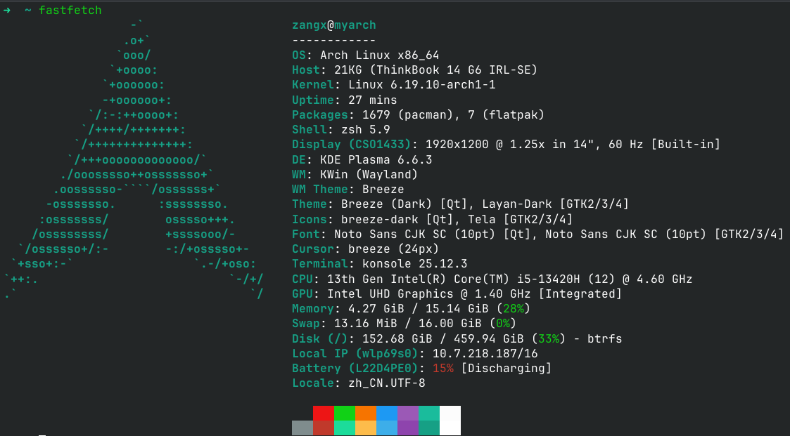
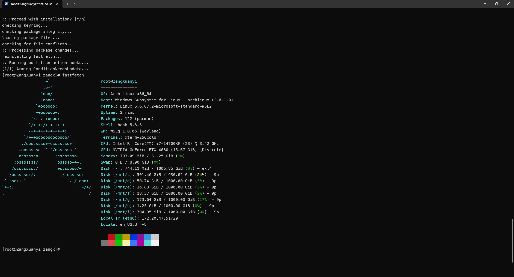
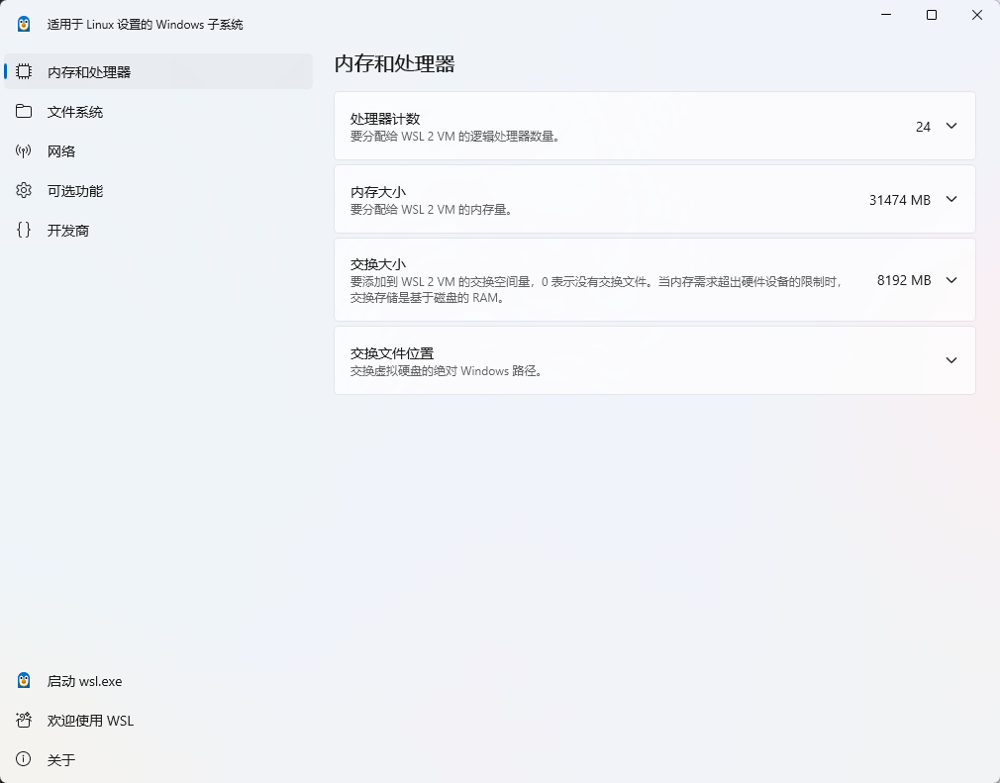

# 开始使用 Linux

刚刚我们学习了怎样使用终端。其实会用了终端，那么我们对Linux的使用就已经会了一大半了。接下来，我们来看看Linux这个操作系统本身。

很多人是因为迫不得已而使用 Linux （最常见的是上ICS）。更深入的想一想，还有没有其他使用Linux的原因呢？

对于 Windows 等带图形化界面操作系统，我们所访问的其实是设计者抽象出的交互逻辑。但对于高效的系统，自底向上的彻底理解和掌握是高效使用系统的必备途径。我们得以更深入洞悉文件和文件之间的联系，获得系统更高的主动权。同时，以最小化的人机接口访问能把足够多的资源投入至计算，获得最高的资源利用率。Linux 正是带着这样的思想而诞生的。而另一方面，Linux在配置编程和开发环境上也有着得天独厚的优势：Linux用户不仅不需要像Windows用户一样和Windows复杂的内核做斗争，也不需要像macOS用户一样被苹果的生态圈所束缚，其自由和开放使得用户可以轻松地配置和定制自己的开发环境。

要学习 Linux，我们需要掌握：

1. 对这一套思想有充分理解、能顺利玩一些玩具
2. 使用现有的工具操作命令行、把他人准备好的软件运行起来
3. 创造新的工具

那么，我们开始吧！

!!! info "阅读材料"

    在20世纪80年代，主要的几个计算机系统有UNIX、DOS和Mac OS。当时，UNIX系统昂贵且无法用于个人计算机，DOS简陋且闭源，Mac OS则只用于苹果电脑，计算机科学教育严重受限。为了解决这个问题，Andrew S. Tanenbaum教授设计了MINIX系统，并将其用于教学。然而该系统功能有限且不实用。

    当时在芬兰赫尔辛基大学读大二的Linus Torvalds在用过MINIX之后，受到了启发。在1991年，他利用UNIX的核心，吸收了MINIX的精华，剔除了不必要的部分，编写了一个新的操作系统内核，并将其命名为Linux 0.01，该内核能够运行在x86架构的个人计算机上。这就是后来各种Linux的雏形。1994年，Linux 1.0版本发布，标志着Linux的正式诞生。

    Linux内核采用了GPL协议，这使得任何人都可以自由地使用、修改和分发它。这种开放的理念吸引了大量的开发者和用户，形成了一个庞大的社区。如今，Linux已经与Windows、macOS成三足鼎立之势，成为全球最流行的操作系统之一，更成为了开源技术的象征。

## Linux发行版及其选择

虽然我们经常说"Linux系统"，但是实际上Linux并不是一个操作系统，它仅仅是一个内核（Kernel）。一个完整的操作系统还需要很多其他的组件，例如文件系统、图形界面、应用程序等。为了方便用户使用，很多组织和公司将Linux内核和其他组件打包在一起，形成了一个完整的操作系统，这就是我们常说的Linux发行版（Distribution）。Linux发行版种类繁多，每个发行版都有其独特的特点和适用场景。常见的Linux发行版有：

| 发行版 | 特点 | 更新频率 | 适用情况 |
|--------|------|----------|----------|
| Ubuntu | 用户友好，社区活跃 | 两年 | Linux新手，桌面用户 |
| Debian | 稳定，软件包丰富 | 两年 | 服务器等生产环境 |
| Fedora | 最新技术，社区驱动 | 半年 | 开发者，技术爱好者 |
| RHEL | 商业支持，稳定 | 三年 | 企业用户，服务器 |
| CentOS | RHEL的免费版本 | 死了 | 企业用户，服务器 |
| Arch | 滚动更新，极简 | 以天计 | 高级用户，DIY爱好者 |
| NixOS | 声明式配置，原子升级 | 以天计 | 高级用户，系统管理员 |
| Rocky | Cent的复活版本 | 三年 | 企业用户，服务器 |
| Alma | Cent的复活版本 | 三年 | 企业用户，服务器 |
| Mint | 基于Ubuntu，用户友好 | 两年 | Linux新手，桌面用户 |
| Manjaro | 基于Arch，用户友好 | 以月计 | Linux新手，桌面用户 |
| CachyOS | 基于Arch，用户友好，专注性能 | 以月计 | 新手，桌面用户 |
| openSUSE | 稳定，企业支持 | 八个月 | 企业用户，服务器 |
| Gentoo | 源码编译，极致定制 | 以月计 | 高级用户，DIY爱好者 |
| Kali | 安全测试，渗透测试 | 半年 | 网络安全专业人员 |
| Alpine | 轻量级，安全 | 以月计 | 容器，嵌入式系统 |
| 统信UOS | 中国本土，兼容Windows | 两年 | 政府，企业用户 |

!!! tip

    现在的CentOS实际上已经被RHEL官方收编并停止维护了，CentOS被收编后的名称叫做CentOS Stream，定位是RHEL的上游测试版。

    另一方面，Alma和Rocky虽然均声称是CentOS的复活版、RHEL的复刻、两者行为基本一致，但也有细微的差别：Alma兼容RHEL的ABI[^abi]，声称其软件通用，但不承诺代码完全一致，因此其补丁有些时候甚至比RHEL还快24小时；Rocky则是CentOS的"精神继承者"，承诺与RHEL完全一致，但获取源码的路径比较曲折。

上述发行版是相对常见的Linux发行版。其中，最出圈的发行版莫过于Ubuntu了，有不少人甚至直接将Ubuntu和Linux划等号（这实际上是不对的）。Ubuntu拥有着庞大的用户群体和丰富的软件资源，非常适合初学者入门。

对于什么都不会的小白而言，我们推荐使用Ubuntu、Mint、CachyOS等用户友好的发行版；如果你愿意折腾，可以尝试Arch、NixOS、Gentoo等极简主义的发行版；如果你要玩服务器，可以选择Debian、RHEL、CentOS（或其复活版本Rocky、Alma）等稳定的发行版；如果你对网络安全感兴趣，可以尝试Kali等专用发行版。

!!! tip

    Linux大致可以分为以下几个"家族"：

    - **Debian系**：包括Debian、Ubuntu、Mint等，特点是稳定，软件包丰富，适合新手和服务器。
    - **Red Hat系**：包括Fedora、RHEL、CentOS、Rocky、Alma等，特点是商业支持，稳定，适合企业用户和服务器。其软件生态又以RHEL为核心，因此也叫做"红帽生态"，具体流程是：Fedora激进上游 → CentOS Stream中游测试 → RHEL稳定版商业支持 → Rocky/Alma下游免费替补。
    - **Arch系**：包括Arch、Manjaro、CachyOS等，特点是滚动更新，极简，适合高级用户和DIY爱好者。
    - **其他系**。

    这些系在软件包管理上，采取了不同的策略：

    - Debian系使用APT包管理器，软件包格式为 `` `.deb` ``；
    - Red Hat系使用YUM或DNF包管理器，软件包格式为 `` `.rpm` ``；
    - Arch系使用Pacman包管理器，软件包格式为 `` `.tar.zst` ``。

    但是，不同系的发行版实际上最大的区别仅在于包管理器和默认配置上，其他方面并没有太大区别，终端命令行等也完全相似，因此我们并不需要过于纠结。



### CLab

这是最简单的使用Linux的方式，甚至不需要在计算机上安装任何东西。我们只需要去 [CLab](https://clab.pku.edu.cn/) 注册一个账号，根据上面的指南连接到虚拟机。这样，你就可以在不破坏自己的系统的情况下，体验 Linux 的魅力了。当然，这个虚拟机的性能和功能有限，因此一般用户无法在上面运行诸如MineCraft服务端等大型软件。

### 实机安装

如果我们有一台不怎么重要的机器和一个U盘，可以利用U盘在这台机器上面安装Linux。你可以选择任意的发行版进行安装，安装过程参考各发行版的官方文档和本书前面的安装章节即可。

### 使用虚拟机

使用虚拟机也是一个很好的选择。通过虚拟机，我们可以在现有的操作系统上运行Linux或者其它系统，而不需要重新安装或配置硬件。

一般我们使用的虚拟机软件有VirtualBox、VMware等。不同的虚拟机有着不同的特点和使用方法，但是总体而言在虚拟机中安装一个Linux发行版的步骤与在实机上安装类似（只是不需要设置BIOS和U盘启动等了）。

### WSL

这里仅提一嘴，具体的使用见 [WSL节](#wsl-guide)。

## Linux的基本操作

得了，来了啥也别说，先跑个小火车：

```bash
sudo apt install -y sl && sl
```

执行以上命令，我们就可以看到一个小火车在终端上跑了过去。

`sl` 是一个玩具软件，它的全称是Steam Locomotive，是一个在终端上显示火车动画的程序，展示了 ASCII 艺术的魅力。这个程序最初是作为一个恶搞程序出现的，目的是为了提醒用户注意输入错误的命令（因为很多人会把 `ls` 错误地输入为 `sl`）。不过，随着时间的推移，`sl` 逐渐成为了一个有趣的终端玩具，受到了许多终端爱好者的喜爱。

拆解这一行命令：

- `sudo` 是"以超级用户身份运行命令"的意思。因为安装软件包需要修改系统文件，所以需要管理员权限。执行这个命令时，系统会提示输入当前用户的密码，以验证权限。
- `apt` 是Debian及其衍生发行版（如Ubuntu）中用于管理软件包的工具。它可以用来安装、更新和删除软件包。
- `install` 是 `apt` 的一个子命令，用于安装软件包。
- `-y` 是一个选项，表示自动回答"是"以确认安装过程中的提示。这样可以避免在安装过程中需要手动输入确认。
- `sl` 是要安装的软件包的名称。
- `&&` 是一个逻辑运算符，表示如果前面的命令成功执行了，那么就执行后面的命令。
- 最后的 `sl` 是运行刚刚安装好的小火车程序的命令。

我们发现，这个命令和我们在上一章中接触到的那些命令遵循相同的结构。

如果我们用的不是Debian系的Linux发行版，而用的是其他发行版，则需要使用相应的包管理器，例如Red Hat系使用 `yum` 或 `dnf`，Arch系使用 `pacman`。以Arch为例：

```bash
sudo pacman -S sl && sl
```

让我们看看上面内容是怎么发生的。我们刚刚输入的单条命令依然是这样的形式：

```bash
程序 [子命令] [选项] [对象]
```

我们用 `apt install -y sl` 来举例说说：apt是程序，install是子命令，-y是选项，sl是对象。于是我们就能看到，一个程序就这么跑起来了，看起来很明确。

那么，我们怎么知道有什么程序，我们又怎么使用它们呢？对于第一个问题，我们可以通过搜索来解决，例如在apt中，我们可以使用 `apt search <关键词>` 来搜索软件包；在pacman中，我们可以使用 `pacman -Ss <关键词>` 来搜索软件包；而yum和dnf中，我们可以使用 `yum search <关键词>` 或 `dnf search <关键词>` 来搜索软件包。

对于第二个问题，我们可以通过手册来解决。

- `` `<program> -h` ``：这是最简单的方式，直接查看程序的帮助信息。通常会列出所有可用的子命令和选项。
- `` `man <program>` ``：这是查看程序手册的方式。手册通常会提供更详细的信息，包括子命令的用法、选项的含义等。但是这个手册可能会比较长，需要耐心阅读。
- `` `tldr <program>` ``：这个命令会给出一些常用的命令示例和简要说明。当然，`tldr` 需要自己安装，安装方法和 `sl` 类似。

## Linux的文件系统

好的，我们刚刚已经基本知道怎么使用Linux了。接下来，我们来看看Linux的文件系统。

思考以下问题：我们刚刚确实输入了 `sl` 命令，但是我们并没有输入 `sl` 的路径。那这个 `sl` 到底在哪里呢？我们怎么知道它在哪里？（其实我们知不知道真无所谓）终端又怎么知道它在哪里？小火车又是怎么跑起来的？

为了解决这一问题，计算机前辈们发挥了聪明才智：只要把所有的东西都归纳为一个概念，那么不就可以方便的管理了吗？于是，文件系统就诞生了。

UNIX和Linux认为，所有的东西都是**文件**。文件系统就是用来管理这些文件的。这时候，我们就可以使用同样的方式来对所有的东西进行操作了。但是我们又出现了其他问题：

1. 文件怎么组织？
2. 文件是谁的？怎么反映不同类型的特性？
3. 文件怎么相互联系？

接下来我们将会逐个回答以上问题。

### 文件的组织

我们在上一章中提到，Windows系统下，物理先于文件存在，所以有盘符一说。但是Linux不这么认为：Linux认为什么都是文件[^unix-file]。于是，Linux的根目录 `/` 就成了所有文件的起点。所有的文件都在这个根目录下。

于是，我们就能够通过目录来解决这一问题。目录是一个特殊的文件，它可以包含其他文件和子目录，所以一个文件的文件名如果被创建为 `dir/file`，那么它就表示在根目录下的 `dir` 目录下有一个名为 `file` 的文件，而不是一个名为 `dir/file` 的文件。我们可以使用 `ls` 命令来查看当前目录下的文件和子目录，也可以使用 `cd` 命令来切换目录。

Linux的目录结构和Windows极其相似，只是没有盘符，并且使用 `/` 作为分隔符，而不是 `\`。我们可以使用 `/` 来表示根目录，使用 `..` 来表示上一级目录，使用 `./` 来表示当前目录。需要注意的是，Linux的文件系统是区分大小写的，所以 `/home` 和 `/Home` 是两个不同的目录。

Linux还有一个重要的目录：用户的家目录，通常位于 `/home/username`。在这个目录下，用户可以存放一些配置文件。我们可以使用 `~` 来表示当前用户的家目录。我们不推荐把自己的杂七杂八文件放在根目录或者家目录下，而是放在家目录的子目录下。这样可以更好地组织文件，并且避免与系统文件冲突。

我们在上一章提到，处于安全性考虑，对于可执行文件，如果没有提供路径，系统会在一些特定的目录下查找。因此假如有一个可执行文件 `hello`，我们应当使用 `./hello` 来运行它，而不是直接使用 `hello`。

如果我们想要在任何地方都能运行这个程序，我们可以把它加入PATH环境变量中去。PATH是一个环境变量，它包含了一些目录的路径，系统会在未提供路径时去这些目录下查找可执行文件，这是为了安全考虑。我们可以使用 `echo $PATH` 来查看当前的PATH变量。假如我们把 `hello` 放在 `/usr/local/bin` 目录下，那么我们就可以在任何地方运行它了，这是因为上述目录通常会被包含在PATH变量中。

### 文件是谁的

#### 用户和组

作为多用户系统，Linux 中文件如果对每个访问者都相同，那就没有安全性可言了。Linux 的做法是，抽象出了"用户"这个实体（其实就是在 `/etc/passwd` 里面定义的一行 UID 和用户名的对应而已）。为了方便用户的文件共享，同时抽象出了组（Group）的概念，代表一组互相信任的用户；为了安全性，Linux又引入了权限的概念，来控制用户对文件的访问。

用户自己有着叫做"家目录"的特殊目录，用户在家目录下创建的文件默认属于这个用户，并且对这个用户有着最高的权限。该目录一般使用 `~` 来简单表示，实际路径是 `/home/username`。

#### 权限

对文件的基本操作有读、写、执行三种，一般用字母表示为r、w、x。我们使用权限位来表示这三种操作。每个文件都有三个权限位，分别对应所有者、组和其他用户。我们可以使用 `ls -l` 命令来查看文件的权限。

举例：一个用户创建了一个文件，这个文件对他的权限是rwx，对同组用户的权限是r-x，对其他用户的权限是r--。那么这个文件的权限就是 `rwxr-xr--`。而这个代表方式还是太笨重了，于是Linux又引入了数字表示法。

数字表示法是一个"独热编码"（One-hot Encoding），也就是rwx被看作三个相互独立的二进制位，对应位上1表示有该权限，0表示没有该权限。然后把这三个位的值拼成一个三位的二进制数，就代表了其最终权限。例如：某用户对文件有读、写权限，没有执行权限，即rw-，对应的二进制数是110，转换成十进制就是6。而二进制中的100是4，010是2，001是1，于是就可以把一个用户对文件的权限表示为一个0到7的数字，例如7=4+2+1表示rwx，5=4+0+1表示r-x，等等。

因此我们的文件权限可以用一个三位八进制来表示，从左到右的每一位分别对应所有者、组和其他用户的权限。例如，权限为 `rwxr-xr--` 的文件可以表示为 `754`。另一个常见的权限编码是 `644`，你能说明其含义吗？[^644-meaning]

但有一个用户比较特殊，那就是root用户。root用户是系统管理员，拥有对所有文件的最高权限。无论文件的权限如何设置，root用户都可以对其进行读、写、执行操作；换句话说，root用户对所有文件的权限都是 `rwx` 或者7。

我们可以使用 `chmod` 命令来修改文件的权限。例如，`chmod 777 file.txt` 将会把指定文件的权限设置为777。

常见的权限标识符包括755、644、750等，这些标识符的含义都很简单，我这里就不详细展开描述了。

而不使用标识符的情况也是可以的，例如某python文件需要被执行，那么我们可以使用 `chmod +x script.py` 来给它加上可执行权限，这里的 `+x` 表示"加上可执行权限"。类似地，`-x` 表示"去掉可执行权限"，`+r` 表示"加上读权限"等。

所以可执行文件并不是因为这个文件本身有什么特别，而是这个文件被你赋予了可执行的性质。一个简单的文本文件也可以被加上可执行的权限，也可以发挥操作其他文件的作用。

例如，如果你会写 Python 的话，写一个从输入读取 2 个数字，输出他们和的程序，输出结果到控制台。在本地跑起来这个程序之后，把 `#!/usr/bin/env python3` 放在脚本的第一行（这个特殊的一行叫 Shebang）。给这个脚本加上可执行的属性，然后直接运行这个文本！

!!! warning

    不要执行这类抽象的命令：`chmod 777 -R /`，这会导致系统所有成员全部被视同root用户，进而导致系统无法正常工作。其实不建议对任何文件设置777权限。

    这样就会导致所有用户都可以写根目录，随便替换 `/usr/bin/sh`、`/etc/passwd`、`/usr/bin/sudo` 等关键文件，乃至随意植入cron、systemd等定时任务，**等同于整个安全阵地完全失守，自毁长城**。

#### 所有者和所属组

除了权限，文件还有"所有者"这个属性。默认情况下，文件的所有者是创建这个文件的用户，但也可以被人为指定；所属组也就是所有者所在的组，默认情况下是创建文件的用户所在的组，但也可以被人为指定。

一般情况下，文件的所有者对该文件的权限是最高的，而同组用户和其他用户的权限则相对较低。但这个最高也未必是7，大概率是6（因为默认情况下创建一个文本文件，不会给你执行权限），也可以人为设置。

这样，我们就可以通过修改文件的所有者和所属组来改变文件的权限，例如 `chown` 命令可以用来修改文件的所有者，`chgrp` 命令可以用来修改文件的所属组。

例如：我在安装系统的时候，在 `/data` 下挂载了一个数据盘。此时，该目录的所有者是root用户，权限是 `rwxr-xr-x`，也就是755。但当我们使用非根用户访问这个目录的时候，就只能读、不能写，非常不方便（因为我们不希望连 `mv` 和 `cp` 这类命令都要用 `sudo` 来执行）。这时候，我们就可以使用 `chown` 命令来把这个目录的所有者改成当前用户，这样就可以正常访问了。

!!! tip

    修改文件权限或所有者等需要有相应的权限，否则会报错。例如你无法给一个对你来说权限是0的文件加上可执行权限。这种情况下一般需要提权，并更改文件的所有者（而不是更改权限：因为更改所有者较为安全，而更改权限可能会导致安全问题）。

### 运行文件

刚才提到，可以通过给一个文本文件加上可执行权限来运行它。于是我们写了如下的Python文件，并添加了Shebang：

```python
#!/usr/bin/env python3
print("Hello, World!")
```

然后执行：

```bash
chmod +x hello.py
./hello.py
```

我们就可以看到输出了Hello, World!。

那在这个过程中，终端是怎么知道这个文件是一个Python脚本的呢？这是因为我们在文件的第一行添加了Shebang，告诉系统这个文件应该使用哪个解释器来运行。Shebang的格式是 `#!<interpreter>`，其中 `<interpreter>` 是解释器的路径，例如 `/usr/bin/env python3` 就表示使用系统环境中的Python 3解释器来运行这个脚本。

如果不写Shebang，那么系统会默认使用当前环境的默认解释器来运行这个脚本，一般就是sh或者bash，这样就会导致运行失败了。

### 文件的联系

文件间的联系，主要是通过文件系统的链接来实现的。Linux 中有两种链接：硬链接和软链接。硬链接是指在文件系统中，一个文件可以有多个文件名，存在于多个位置，但是文件系统中只有一份文件副本，所有链接均指向这一副本。删除其中一个文件名并不会影响文件内容，只有所有位置下的文件链接均被删除时，此文件副本才会被最终移除。软链接是指一个文件名指向另一个文件名，删除原文件名会影响软链接的有效性。

硬链接和软链接的区别在于，硬链接是文件系统的一个特性，而软链接是文件系统的一个单独的文件。硬链接只能在同一个文件系统下，而软链接可以在不同文件系统下。硬链接不能链接目录，而软链接可以链接目录。

!!! tip

    试一试：

    ```bash
    echo "hello" > a  # 随便创建一个文件
    ln a b            # 创建硬链接 b 指向 a
    ln -s a c         # 创建软链接 c 指向 a
    ```

    现在这里有了b和c两个新的文件。试着利用 `ls -l` 命令查看它们的属性，看看有什么区别。然后尝试删除a文件，看看b和c会发生什么变化。

### 文件的类型

实际上，在执行 `ls -l` 命令时，在九个权限位的前面还有一个字符，这个字符表示文件的类型。

一般的文件类型只有三个：普通文件、目录和链接文件。普通文件就是我们平时使用的文本文件、二进制文件等；目录就是用来组织文件的特殊文件；链接文件就是我们前面提到的软链接文件。**硬链接文件是普通文件的一种特殊情况，它们共享同一个inode，因此在文件类型上被视为普通文件。**

但纵然如此，Linux依然禁止同名文件，所以我们不能在一个目录下创建一对同名的文件和目录（因为目录也是文件）。

除了上述三种常见的文件类型之外，Linux还支持其他一些特殊的文件类型，例如设备文件、管道文件、套接字文件等。

### Linux文件系统层次标准

Linux文件系统层次结构标准（FHS）定义了Linux系统中目录结构和文件组织的规范。

大致上，Linux文件系统可以分为以下几个主要目录（你也可以通过 `ls -al /` 来查看一下根目录下都有什么东西）：

- `/bin`：包含系统启动和运行所需的基本命令和工具。在现代的Linux架构下，`/bin` 目录通常是 `/usr/bin` 的符号链接，实际的可执行文件都放在 `/usr/bin` 目录下，这是为了简化文件系统结构和维护而做出的调整。
- `/sbin`：包含系统管理员使用的命令和工具。同样的，现在通常直接链接到 `/usr/bin` 目录。
- `/usr`：包含用户安装的软件和库文件。
- `/var`：包含可变数据，如日志文件、邮件等。
- `/lib`：包含系统运行所需的共享库文件。出于和 `/bin` 和 `/sbin` 目录一样的原因，现在通常直接链接到 `/usr/lib` 目录。
- `/home`：包含用户的个人目录。
- `/etc`：包含系统配置文件。
- `/dev`：包含设备文件，表示系统中的硬件设备。
- `/proc`：包含系统进程和内核信息的虚拟文件系统。
- `/tmp`：包含临时文件，系统重启后会被清空。
- `/opt`：这是特殊的软件包安装目录，通常用于安装第三方软件。这些软件一般不会依赖于系统的其他部分，因此被放在这个目录下，以避免与系统文件发生冲突。
- `/mnt`：挂载点，通常用于挂载外部设备或分区。当我们需要访问一个新的分区或者设备时，可以在 `/mnt` 目录下创建一个新的目录来挂载它。

所有的Linux根目录基本都长这样，只多不少。

如果进入 `/dev`，我们会发现很多有意思的文件（其实都是"设备"）。

- `/dev/null`：该设备永远为空。任何写入该设备的数据都会被丢弃；从该设备中读取数据会得到EOF（文件结束符）。它常被用来丢弃不需要的输出。
- `/dev/zero`：该设备会不断地输出零字节（`0x00`）。它常被用来创建一个指定大小的文件，例如 `dd if=/dev/zero of=file bs=1M count=100` 会创建一个大小为100MB的文件。但是如果试图直接把该设备的内容输出到终端上，你什么都看不到（因为ASCII码中0x00是一个不可见字符）。
- `/dev/random`：该设备会提供随机数据，通常用于生成随机数。它会根据系统的环境噪声来生成随机数据，因此可能会比较慢。
- `/dev/urandom`：该设备也会提供随机数据，但它使用一个伪随机数生成器来生成数据，因此速度更快，但安全性可能不如 `/dev/random`。
- `/dev/tty`：该设备表示当前终端，可以用来与用户进行交互。也有其他的tty设备，例如 `/dev/tty0` 表示第一个虚拟终端，`/dev/tty1` 表示第二个虚拟终端，以此类推。试图把内容重定向到该设备，会导致内容被输出到当前终端上（实际上和 `echo` 的效果一样）。试图从该设备读取内容，会导致系统等待用户输入。
- `/dev/sda`：该设备表示第一个SATA硬盘，`/dev/sdb` 表示第二个SATA硬盘，以此类推。对于NVMe设备，则是 `/dev/nvme0n1`、`/dev/nvme1n1` 等。我们不能直接试图 `cd` 这些设备或者 `cat` 这些设备，这并不是因为他们不能被访问，而是因为它们实际上是二进制的设备文件，直接访问会得到乱码或者无法理解的数据。也正因此，我们必须"挂载"这些设备到一个目录下，才能通过文件系统来访问它们（实际上就是 `mnt` 目录下的某个子目录）。挂载的过程就是把设备文件和一个目录关联起来，这样我们就可以通过访问这个目录来访问设备了。
- `/dev/loop0`：该设备表示第一个环回设备，`/dev/loop1` 表示第二个环回设备，以此类推。环回设备是一种特殊的设备，它可以把一个普通文件当作一个块设备来使用。我们可以使用 `losetup` 命令来创建一个环回设备，并把一个文件关联到这个设备上，这样我们就可以通过访问这个设备来访问这个文件了。

!!! warning

    不得随意修改这些文件的权限，或随意删除这些文件，否则可能会导致系统无法正常工作。

### btrfs和快照

传统的Linux文件系统（如ext4）虽然稳定可靠，但在某些方面存在局限性，例如缺乏内置的快照功能。快照是一种记录文件系统在某一时刻状态的机制，可以让用户在需要时恢复到之前的状态，这对于数据保护和系统恢复非常有用。很多人认为快照是一个非常鸡肋的功能，但在某些场景下，快照确实可以发挥重要作用，例如在系统升级前创建快照，如果升级失败，能够快速回滚到之前的状态。这在生产环境是救命级别的功能。

对此，人们后来又开发出了其他的文件系统。目前较为流行的文件系统是btrfs，它是一个现代化的文件系统，支持快照、压缩、校验等功能。btrfs的快照功能非常强大，可以在几秒钟内创建一个快照，并且占用的空间非常小，因为它只记录了文件系统的变化部分，而不是整个文件系统的副本。

以下的命令可以创建一个快照：

```bash
btrfs subvolume snapshot /mnt/data /mnt/data_snapshot
```

这实际上是创建了一个子卷的快照，子卷是btrfs中的一个概念，它是一个独立的文件系统，可以被挂载和管理。我们可以把子卷看作是一个目录，但它实际上是一个独立的文件系统，可以有自己的权限、配额等。上述命令对子卷 `/mnt/data` 创建了一个快照，并把快照命名为 `/mnt/data_snapshot`。

然后，可以从这个快照中恢复数据，例如：

```bash
btrfs subvolume delete /mnt/data
btrfs subvolume snapshot /mnt/data_snapshot /mnt/data
```

这实际上是先删除了原来的数据子卷，然后从快照中创建了一个新的数据子卷，这样就实现了数据的恢复。

并不用担心快照会占用大量的空间，因为btrfs的快照是基于写时复制（Copy-on-Write）的机制实现的，只有当文件系统发生变化时，才会占用额外的空间。因此，如果在创建快照后没有对文件系统进行大量的修改，那么快照占用的空间就会非常小。在生产环境中，快照的体积往往非常小（因为生产环境中的数据通常是比较稳定的），所以我们不需要担心快照会占用大量的空间。

当然，有了这个功能，我们也不能高枕无忧：快照仅是一个软件层面的功能，如果底层的存储设备出现了问题，那么快照也无法保护数据了。而且就算用了btrfs，也需要时常记得创建快照，否则在需要恢复数据的时候可能会面临无快照可用的情况。

## Linux的进一步使用

### root权限的配置

`root` 用户是超级用户，拥有着 `Linux` 系统内最高的权限，在终端内使用 `su` 命令即可以超级用户开启以该用户为身份的shell。

```bash
yourusername@yourcomputer$ su  # 这会切换到root账户
# 输入 root 用户的密码后你会发现提示符发生变化
root@yourcomputer$ exit  # 退出root账户。也可以通过按下 Ctrl+D 来退出。
```

但是 `su` 面临着一些问题：首先，`su` 需要输入 `root` 用户的密码，无法保证那些被从管理员权限中除名的用户无法再使用 `root` 用户进行操作了。这种情况常见于一些密级较高的服务器上，如商业公司的生产服务器经常需要管理员权限，但如果运维离职，则必须修改 `root` 用户的密码并通知还能够使用 `root` 用户的人员，这相当麻烦，增加了管理的复杂度。其次，`su` 切换到 `root` 用户后，所有的操作都会以 `root` 用户的身份执行，而Linux是一个多用户系统，如果每一个用户都直接使用该账户，则不能对每个用户的操作进行区分和监管，这样就会导致安全隐患。

为此，我们引入了 `sudo` 命令。`sudo` 是"以超级用户身份运行命令"的意思。通过 `sudo`，我们可以授权某些用户以超级用户的身份执行特定的命令，而不需要直接使用 `root` 账户。一般我们把该命令称作"提权"，因为它可以让一个普通用户获得更高的权限来执行某些操作。于是这样就能解决上述两个问题：`sudo` 需要的是当前用户的密码（而非 `root` 用户的密码），这样就可以保证那些被从管理员权限中除名的用户无法再操作了；同时，`sudo` 只会让用户以超级用户身份执行特定的命令，而不会让用户完全切换到 `root` 账户，这样就可以对每个用户的操作进行区分和监管了。

`sudo` 的使用非常简单，我们只需要在需要提权的命令前面加上 `sudo` 就可以了，例如：

```bash
pacman -S cowsay  # 这不能执行，在Arch中需要管理员权限才能安装软件包
sudo pacman -S cowsay  # 这就可以执行了
```

想将 `sudo` 权限授予某个用户，我们需要把该用户添加到一个特殊的用户组中，这个用户组通常叫做 `sudo` 组或者 `wheel` 组等，具体名称取决于不同的Linux发行版。这还分为两种情况：

- 如果你所选择的发行版在安装过程中没有设置 `root` 密码的环节（如 Ubuntu），则新创建的用户会拥有管理员权限，一般不需要使用 `root` 账户，直接使用 sudo 命令即可。
- 如果你所选择的发行版在安装过程中已经设置了 `root` 密码，但是自己的账户并没有管理员权限（如 Debian），为了用起来方便一般会用 `root` 账户给自己的账户添加管理员权限，具体操作如下（`$`号后的为输入的命令）：

```bash
yourusername@yourcomputer$ su  # 这会切换到root账户
root@yourcomputer$ /usr/sbin/usermod -aG sudo yourusername
root@yourcomputer$ exit  # 退出root账户。
```

前者表示切换至 `root` 账户，后者表示为你指定的账户添加管理员权限。在这种情况下，也可以使用 `visudo` 编辑 `sudo` 配置以达到类似的效果。

### 软件的安装及其源的配置 { #software-sources }

在Windows下，我们安装软件包的过程是：下载一个安装包，双击安装包，按照提示完成安装。

这种方式看似简单，但背后隐藏着一个显著的特点：Windows下的安装包通常将软件本身及其所依赖的所有库、运行环境一并打包进来，形成一个"自给自足"的完整实体。这样做的好处是用户无需关心依赖问题，但代价是软件体积臃肿，且多个软件可能重复携带同一份依赖，造成磁盘空间的浪费。只有少数的软件会选择依赖系统中已有的库，这些库通常是操作系统自带的核心组件，例如C运行时库、图形界面库、dotnet运行时等。

我们可以试着在Windows下查找一下chrome内核，看看同一个系统下有多少个chrome内核的副本。可以使用类似Everything这样的工具来搜索一下。

而在Linux生态中，软件安装的哲学则有所不同。Linux下的软件包大多遵循"小而美"的原则，一个软件包通常只包含该软件自身的文件，而它所依赖的公共库（如C运行时、图形界面库等）则由系统中独立的软件包提供，由多个软件共享。这种设计使得每个软件包保持精简，也便于统一维护和升级依赖库——当某个库修复了安全漏洞，系统中所有依赖它的软件都能一次性受益。

正是由于这种"依赖共享"的机制，Linux系统强烈推荐使用包管理器（如apt、yum、dnf等）来安装软件。包管理器能够自动解析并安装所需的依赖项，确保软件正常运行的同时，避免依赖冲突或重复安装。相比之下，若在Linux中直接下载二进制文件或源码手动安装，不仅容易遗漏依赖，还可能绕过包管理器的统一记录，导致后续更新、卸载时出现混乱。

因此，在Linux系统中，除非有特殊需求，我们应优先使用包管理器来安装软件。这既是对系统整洁性的维护，也是Linux使用习惯中一项基本而重要的原则。

如果你的系统在安装的时候已经选择过了国内源则忽略，否则默认源来自于国外。从国外的服务器更新软件包会很慢，可以根据自己系统的版本自行搜索匹配的源并更换。具体参考[北大开源镜像站的帮助文档](https://mirrors.pku.edu.cn/Help)。

以采用 apt 包管理器为例，更新源后需要重新更新软件索引，请执行以下操作：

```bash
sudo apt-get update
sudo apt-get upgrade  # 如果需要升级软件包
```

如果你需要安装软件包，可以使用以下命令：

```bash
sudo apt-get install package-name
```

如果想要卸载软件包，可以使用以下命令：

```bash
sudo apt-get remove package-name
```

有时候，我们不得不使用一些其他安装方式，例如从 `*.deb` 包安装。对于这些情况，我们可以使用以下命令：

```bash
sudo dpkg -i package-name.deb  # 安装 .deb 包
sudo apt-get install -f  # 修复依赖问题，非常重要！
```

有时，软件自带安装脚本，我们直接运行这些脚本即可。

还有的包是松散来源[^loose-source]，我们需要手动下载并安装，这时候就需要仔细阅读安装说明，确保正确安装了所有依赖，并且按照正确的步骤进行安装。也可以使用现成的工具，例如在Arch的AUR中几乎所有的包都是松散来源的，安装这些包可以使用 `yay` 或者 `paru` 等AUR助手来自动处理依赖和安装过程。这些AUR助手也能够正确地将AUR包加入系统级包管理器的数据库中。

特别注意：在绝大多数情况下，请尽可能地使用系统级包管理器来安装软件；如果不得不使用来自松散来源的软件，尽量将其添加到系统级包管理器的数据库中去，以便于后续的维护和管理。这是因为，包管理器可以自动处理依赖关系，并且可以方便地进行软件的更新和卸载。如果一定要手动安装软件，请确保你了解该软件的安装过程和依赖关系，并尽可能在虚拟环境或容器中进行测试，以避免对系统造成不必要的影响。

唯一的特殊情况是这个软件包是一个单一的二进制文件（如著名Minecraft非官方启动器 `hmcl`），没有任何依赖关系，并且不需要进行系统级的维护，那么我们可以直接把它放在一个目录下（例如 `/opt` 目录），并且给它加上可执行权限，这样就可以直接运行了。当然，Arch确实提供了该包的AUR包，我们也可以通过AUR助手来安装它！

### 关于VIM和Nano

虽然我们有很多文本编辑器可以在图形化的Linux上使用，但是在终端中，这两个编辑器依然是最常用的，而且也是不得不用的（尤其是VIM！）。因此，我将会在这里简要介绍一下这两个编辑器。

#### VIM

VIM是一个强大的文本编辑器，它有着丰富的功能和插件，可以满足各种需求。
VIM有两种状态：命令状态和编辑状态。默认情况下，VIM处于命令状态。在命令状态下，我们可以使用各种命令来操作文件；在编辑状态下，我们可以直接输入文本。在这两种方式之间的切换非常简单，只需要按下 `i` 键即可进入编辑状态，按下 `Esc` 键即可返回命令状态。

编辑状态下的VIM乏善可陈，完全可以把这玩意当成一个没有鼠标的Windows记事本来使用，这里根本没有什么好说的。我们的重点在于命令状态下的VIM。
在命令状态下，我们可以使用各种命令来操作文件。以下是一些常用的命令：

- `h`：向左移动光标。
- `j`：向下移动光标。
- `k`：向上移动光标。
- `l`：向右移动光标。
- `w`：移动到下一个单词的开头。
- `b`：移动到上一个单词的开头。
- `0`：移动到行首。
- `$`：移动到行尾。
- `gg`：移动到文件开头。
- `G`：移动到文件结尾。
- `dd`：删除当前行。
- `yy`：复制当前行。
- `p`：粘贴。
- `u`：撤销。
- `Ctrl+r`：重做。
- `:w`：保存文件。
- `:q`：退出VIM。
- `:wq`：保存并退出VIM。
- `:q!`：强制退出VIM，不保存文件。

想给Vim装插件其实也是一种挺折腾的工作。目前最通行的方式是利用插件管理器，比如Vundle、Pathogen、vim-plug等。安装插件管理器后，我们可以通过编辑 `~/.vimrc` 文件来添加插件，具体也可以参考各插件管理器的文档。而使用NeoVim等衍生版本则会更方便一些。

#### Nano

Nano是一个简单易用的文本编辑器，它有着直观的界面和快捷键，可以快速上手。其使用也比VIM简单得多，因为它没有两种状态的区别，直接打开文件后就可以编辑文本了，而且所有命令快捷键全都在界面下方列出了，直接照着按就行了！

- `Ctrl+O`：保存文件。
- `Ctrl+X`：退出Nano。
- `Ctrl+K`：剪切当前行。
- `Ctrl+U`：粘贴。
- `Ctrl+W`：查找文本。
- `Ctrl+\`：替换文本。
- `Ctrl+C`：显示光标位置。
- `Ctrl+G`：显示帮助信息。

### 关于Wine

很多人不使用Linux的主要原因是其与Windows的兼容性比较一般，部分软件（尤其是使用 `C#` 开发的游戏）以二进制形式发布，且这些软件仅针对Windows系统进行过开发和测试，并不能直接在Linux系统上运行。

对于这些软件，我们可以使用Wine来运行。Wine是一个开源的兼容层，可以让Linux系统运行Windows应用程序。它通过实现Windows API来模拟Windows环境，其核心思想是当Windows应用程序试图调用Windows API的时候，Wine会捕获这些调用，并将它们"翻译"成Linux系统调用，从而使得许多Windows应用程序能够在Linux上运行。Wine甚至能够提供一个伪C盘来模拟Windows的文件系统结构，这样Windows应用程序就可以像在Windows上一样访问文件了。

这比虚拟机、双系统等方案的核心优势是，这下Windows代码也是直接跑在你自己的CPU上的，跳过了硬件模拟这一层，性能损失相当小。所以Wine在运行一些轻量级的Windows应用程序时，性能表现与Windows原生环境几乎没有区别。

为了应对现代游戏对图形性能的高要求，Wine生态还发展出了 `DXVK` 和 `VKD3D-Proton` 这样的专用工具，它们能将游戏发出的 `DirectX 9/10/11/12` 图形指令高效地转换为Linux原生支持的 `Vulkan` 指令，从而实现流畅的游戏体验。

但Wine并不是万能的。Windows作为一个闭源的操作系统，其内部实现细节并不公开，Wine虽然能够通过逆向工程和长久的社区努力来尽量实现对Windows API的兼容，但仍然存在一些无法完成的情况。当某些应用程序，特别是依赖特定版本运行时库（如特定版本的 `.NET Framework`）或调用极为冷僻的底层内核函数时，Wine可能会当场崩溃，或者程序不能按预期运行。

另一个极为棘手的挑战是，Wine根本就不是一个内核级的程序——它是用户态的！这尤其体现于很多游戏的反作弊插件：如腾讯的 `AntiCheatExpert` 竟然是个内核态的程序，它会将自己作为一个驱动程序安装到系统中，获取系统的最高权限来监控游戏的运行状态，阻止作弊行为的发生。其他的反作弊插件如 `Easy Anti-Cheat (EAC)`、`BattlEye` 也大同小异。这恰恰与Linux的安全模型存在根本性冲突：Linux的内核是受到严格保护的，Wine作为一个用户态程序，说什么也没法影响 `ACE` 这种内核态程序，遑论捕获和翻译系统调用了。目前腾讯官方已明确表示不会为Wine或Proton提供任何形式的支持；而很多游戏如果不能与反作弊插件通讯，就会直接拒绝启动游戏。这使得这类游戏——如腾讯自己的《三角洲行动》等，以及使用该反作弊插件的《明日方舟》（特指官方PC端）等——在可预见的未来内，都无法在Linux下通过兼容层运行。

所以说，虽然Wine能够解决大多数情况下的兼容问题，但为了更好的体验，还是建议使用Windows来玩游戏。

### 关于systemd服务

`systemd` 是一个让Linux用户又爱又恨的系统和服务管理器。

这个东西的核心概念是"服务"。服务是一个在后台运行的程序，它可以提供某些功能或者响应某些请求。比如说，我们的桌面系统（KDE、GNOME等）就是一个服务；我们的网络服务（NetworkManager、wpa_supplicant等）也是一个服务；我们的打印服务（CUPS）也是一个服务；我们的SSH服务（sshd）也是一个服务；我们的数据库服务（MySQL、PostgreSQL等）也是一个服务；我们的Web服务器（Apache、Nginx等）也是一个服务；我们的定时任务服务（cron）也是一个服务；我们的日志服务（rsyslog、journald等）也是一个服务；我们的容器管理服务（Docker、Podman等）也是一个服务；我们的虚拟机管理服务（libvirt、QEMU等）也是一个服务；甚至我们的WSL2子系统也被微软设计成了一个systemd服务！

于是你就明白为什么"又爱又恨"了：说"爱"，是因为它确实提供了很多强大的功能，例如并行启动服务、按需启动服务、自动重启服务等，这些功能可以大大提高系统的启动速度和稳定性；说"恨"，是因为它的设计违反了Unix哲学的"小而美"原则，将许多功能集成在一起，导致系统变得臃肿和复杂，增加了系统的维护难度。

例如，要启停服务，我们可以使用以下命令：

```bash
sudo systemctl start service-name  # 启动服务
sudo systemctl stop service-name  # 停止服务
sudo systemctl restart service-name  # 重启服务
sudo systemctl status service-name  # 查看服务状态
```

要设置服务开机自启，我们可以使用以下命令：

```bash
sudo systemctl enable service-name  # 设置服务开机自启
sudo systemctl disable service-name  # 取消服务开机自启
```

有些时候，我们可能会自己写一些脚本来实现一些功能（例如自动snapshot）。根据上述知识，我们得到了启发：如果将这个脚本写成一个systemd服务，那么它就可以在后台运行，并且可以通过systemctl来管理，这样就非常方便。

例如我想设计一个服务，当时间为每周一日首（即周一的0点）时自动创建一个快照，并仅保留最近的三个快照，删除旧的快照。那么我可以写一个脚本来实现这个功能。

```bash
#!/bin/bash
SNAPSHOT_DIR="/mnt/data"  # 对这个目录创建快照
SNAPSHOT_STORE="/mnt/snapshots"  # 快照存放目录
SNAP_NAME="data_$(date +%Y-%m-%d-%H-%M-%S)"
btrfs subvolume snapshot -r "${SNAPSHOT_DIR}" "${SNAPSHOT_STORE}/${SNAP_NAME}"

# 删除旧快照时
ls -1 "${SNAPSHOT_STORE}"/data_* | sort | head -n -3 | xargs -r btrfs subvolume delete
# 第一个命令：强制每行一个输出快照的路径，没有权限位等杂项信息；
# 第二个命令：按照字典序排序，日期格式的命名方式保证了字典序和时间顺序是一致的；
# 第三个命令：保留最近的三个快照，删除旧的快照；
# 第四个命令：如果有需要删除的快照，就执行删除命令；如果没有需要删除的快照，就不执行任何命令。
# 第四个命令中的-r是GNU xargs的扩展，表示如果没有输入，就不执行任何命令；如果有输入，就把输入作为参数传递给btrfs subvolume delete命令。
```

脚本写好了，假设这个东西叫做 `snapshot.sh`，我们就可以把它写成一个systemd服务了：

```ini
# 文件名：snapshot.service
[Unit]
Description=Auto snapshot service
[Service]
Type=oneshot  # 这个服务不是一个持续运行的服务，而是一个一次性的服务，每次执行完就退出了。
ExecStart=/path/to/snapshot.sh
[Install]
# 置空，只由定时器来触发这个服务。
```

然后我们还需要写一个定时器来触发这个服务：

```ini
# 文件名：snapshot.timer
[Unit]
Description=Auto snapshot timer
[Timer]
OnCalendar=weekly  # 每周触发一次，默认每周一日首触发
# 也可以使用更具体的时间表达式，例如：OnCalendar=Mon *-*-* 00:00:00
Persistent=true  # 如果错过了触发时间，下一次启动时立即触发一次
[Install]
WantedBy=timers.target  # 这个定时器的目标是timers.target。
```

写好了之后，我们就可以把这两个文件放在 `/etc/systemd/system/` 目录下，然后使用以下命令来启用这个定时器：

```bash
sudo systemctl daemon-reload  # 重新加载配置
sudo systemctl enable snapshot.timer  # 开机自动启动定时器
sudo systemctl start snapshot.timer  # 立即启动定时器
```

这样就完成了一个自动创建快照的systemd服务的配置了。

这仅仅是一个简单的示例，systemd的功能远不止于此，它还支持依赖关系、并行启动、按需启动、自动重启等功能，可以满足各种复杂的需求。对于systemd的深入使用，可以参考官方文档或者网上的各种教程。

### 关于桌面环境和窗口管理器

虽然说使用Linux和命令行就脱离不了干系了，但对于几乎所有的用户而言，有一个图形界面依然是非常重要且自然的需求，要不然Windows 3.1也不是一个"划时代的发明"了。

Linux生态中的图形界面可比Windows和mac这两个官方提供且仅此一家的图形界面要更加百花齐放：喜欢简单实用的可以玩桌面环境，喜欢深度定制的可以玩窗口管理器，更Geek的甚至可以玩tty（虽然TUI已经脱离GUI的范畴了），且每一种流派都有不同的实现和社区，满足了不同用户的需求。

#### 桌面环境

桌面环境指的是一套完整的图形界面系统，提供了一整套解决方案，包括窗口管理器、文件管理器、面板、设置中心（虽然大家一般不爱用）、终端模拟器、文本编辑器等各种工具，主打一个开箱即用的体验。常见的桌面环境有KDE、GNOME、XFCE、Cinnamon、MATE等。


Linux下的桌面环境，基本上就是三巨头的天下：

##### KDE Plasma

目前功能最丰富、可定制性最强的Linux桌面环境之一，基于Qt。其界面设计现代、流畅、华丽，默认布局与Windows相似，近乎零成本迁移。

KDE最大的特点就是"一切皆可定制"，从外观主题、窗口装饰、图标风格，到行为细节如窗口切换动画、任务栏显示方式等，都可以通过设置界面轻松调整，满足不同用户的个性化需求。另一个特点就是，KDE实在是太漂亮了，连带着它的整个解决方案（如Dolphin、Konsole、Kate、Okular等）都非常好看，给人一种赏心悦目的感觉。

KDE的缺点是功能过于丰富，导致新手学习成本比较高；同时，系统资源占用较高，尤其是在较老的硬件上可能会有性能问题；但Plasma5开始，性能已经大幅优化，且目前机器基本不需要担心这个问题了。

##### GNOME

GNOME走的是另一条路线：简约而专注。它基于GTK，默认界面与mac相似，也有类似Dock（程序坞，mac用户就和回家了一样）的设计，强调一个干净、简洁的用户界面，主打开箱即用的体验。

GNOME刻意地隐藏了多数高级选项，仅暴露最常用的功能，对于新手相当友好，但对于喜欢深度定制的用户而言，可能会觉得不够灵活。好在GNOME有一个庞大的插件生态，用户可以通过安装各种插件来扩展功能和定制界面，满足不同的需求。唯一的问题是每次GNOME更新都会连带着挂掉一堆插件，这也是受人诟病的一个地方。

Ubuntu默认使用这个，所以很多人从Windows过来的时候会被mac-like的界面劝退。

##### XFCE

XFCE的设计是没有设计——够用就行的设计。基于更老的GTK框架，以轻量级、稳定、低占用著称。其界面看起来倒是复古得很，有种xp时代的风格。但这也正是其优势：没有GNOME的复杂依赖，没有KDE的华丽动效，就是一个"纯粹干活"的环境。

值得一提的是，不少Linux发行版都提供XFCE风味版（如Xubuntu、Manjaro XFCE等），以满足那些追求稳定、资源占用低的用户需求。

| 工具 | KDE Plasma | GNOME | XFCE |
|------|-----------|-------|------|
| 窗口管理器 | KWin | Mutter | Xfwm |
| 文件管理器 | Dolphin | Nautilus | Thunar |
| 面板 | Plasma Panel | GNOME Shell | XFCE Panel |
| 设置中心 | System Settings | GNOME Control Center | XFCE Settings |
| 终端模拟器 | Konsole | GNOME Terminal | XFCE Terminal |
| 文本编辑器 | Kate | Gedit | Mousepad |
| PDF阅读器 | Okular | Evince | Atril |

需要注意的是，虽然说KDE、GNOME、XFCE都有自己的组件，但它们之间并不是完全独立的，用户可以根据自己的喜好来选择使用哪个组件。不过跨桌面使用组件需要稀稀拉拉地安些不相关的依赖，有些令人头痛。

#### 窗口管理器

窗口管理器指的是一套管理窗口的程序，通常是完整桌面环境的一个组成部分，所以不包含完整的桌面环境。搞半天还得自己拼装一些工具来使用，主打一个高度定制化的体验。常见的窗口管理器有i3、bspwm、dwm、awesome等。

窗口管理器目前基本上就是i3和Openbox的天下了，前者是平铺式窗口管理器，后者是堆叠式的。窗口管理器的好处是极端的轻量化，几百MB内存的机器上都能随便跑；另一个好处是极端的可定制化，用户可以根据自己的需求来配置窗口的行为和外观；缺点是需要一定的学习成本，往往需要手写配置文件，且大多需要自己搭配，不擅长设计的人可能会搞出一个丑到爆的界面来。

##### i3/Sway

所谓"平铺"，指的是窗口会自动分割屏幕空间，互不重叠，像瓷砖一样铺满整个屏幕。其优势在于纯粹键盘驱动，配置文件是纯文本，初学者需要一两个小时来写出自己的第一个配置文件。如果习惯了VIM或Emacs等键盘驱动的编辑器，那么i3的操作方式会非常自然和高效。

Sway是i3的Wayland版本，功能和配置方式基本上和i3一样，且支持更多的特性。但是……Wayland是"未来"的Linux图形栈标准，但现在还不是。

那要不就……战个未来吧。

##### Openbox

所谓"堆叠"，指的是窗口可以自由移动和重叠，类似于传统的桌面环境，可以用鼠标拖拽。虽然这东西本身只有一个桌面，但有强大的右键菜单（"管道菜单"），可以通过脚本动态地生成菜单项。很多轻量级的桌面环境（LXDE等）都是从这东西衍生出来的。

需要注意的是，不管是桌面环境，还是窗口管理器，在Linux中，都仅仅是一个（一组）用户态软件而已，不像Windows和macOS那样是操作系统的一部分。这就意味着，我们可以随时安装、卸载、切换不同的桌面环境和窗口管理器，而不会对系统造成任何影响。这也是Linux生态中一个非常重要的特点，给了用户极大的自由度和灵活性。

所以说，选哪个桌面环境或者窗口管理器，完全取决于个人的喜好和需求。绝大多数Linux发行版都提供了最小安装选项，这样用户就可以在安装完成后，根据自己的喜好来选择安装哪个桌面环境或者窗口管理器了。

而且，桌面环境和窗口管理器也不是鱼和熊掌，完全可以"我全都要"！例如，我可以在同一台机器上安装KDE和i3，然后在登录界面选择使用哪个桌面环境或者窗口管理器来登录，这样就可以同时享受KDE的华丽和i3的高效了。

### 关于中文输入法

作为中国人，中文输入法几乎是每一台计算机上都要有的东西。虽然我们不建议使用汉字作为文件名，但如果真心希望把Linux当成一个日常系统，那么中文输入法就是必不可少的了：但凡聊个天、回个邮件、写个文档，只要涉及到中文输入，就离不开输入法。

Linux生态中，最常用的中文输入法框架是 `IBus` 和 `Fcitx`，它们都是开源的输入法框架，提供了丰富的功能和插件，可以满足各种需求。

#### Fcitx

Fcitx是一个轻量级的、可定制的输入法框架，支持多种输入法引擎，包括拼音、五笔、仓颉等；也支持多种框架下的输入法模块，如XIM、DBus、Wayland、Qt、GTK等。它对**非GNOME**的桌面环境和窗口管理器有着更好的兼容性和稳定性，因此在KDE、XFCE、i3等环境中使用Fcitx会有更好的体验。

fcitx是一个模块化的输入法，我们需要安装引擎本身以及其他模块来实现输入法的功能。例如，中文必然需要安装 `fcitx5-chinese-addons` 模块，以及其他的词库模块（可选，如中文维基百科词库、萌娘百科词库等）；为了能够在Electron应用中阻止候选框的偏移问题，我们还需要安装一些其余模块（如 `fcitx5-qt` 模块）。

安装完毕后，需要设置环境变量，让系统知道我们要使用fcitx作为输入法框架。可以在对应的shell配置文件中（`~/.bashrc`、`~/.zshrc`等）添加以下内容：

```bash
export GTK_IM_MODULE=fcitx
export QT_IM_MODULE=fcitx
export XMODIFIERS="@im=fcitx"
```

对于KDE用户也可以通过系统设置来设置输入法框架为fcitx5，不需要手动编辑环境变量。然后也可以通过系统设置来设置fcitx5的输入法引擎和其他模块，并不需要更多复杂的配置。这也能体现出KDE的大而全特性。至于其他的桌面环境和窗口管理器，可能就需要手动编辑环境变量了。

在KDE中使用该输入法时，可能遇到闪烁问题。为了解决该问题，我们需要启用虚拟键盘功能。

在GNOME桌面中使用该输入法时要先禁用IBus，否则会有冲突，导致输入法无法正常使用。

#### IBus

IBus是许多Linux发行版的默认输入法框架，尤其是在GNOME环境中。我们建议使用GNOME的用户都用IBus，但在其他地方使用IBus的集成体验不好，且其自定义能力也比较有限。其配置与Fcitx的配置大同小异，安装完毕后同样需要设置环境变量：

```bash
export GTK_IM_MODULE=ibus
export QT_IM_MODULE=ibus
export XMODIFIERS="@im=ibus"
```

剩下的配置略，可以通过更多教程和官方文档来完成。

### 关于Office文档

Office文档……我的看法是这个算是很多人不用Linux的另一个重要原因了。打游戏尚且可以通过Wine来解决，但这玩意实在太糟糕了！

首先我们必须了解一下Office文档的格式，然后我们就知道为什么这玩意糟糕得要死了。

- **doc、xls、ppt**：这些是最早期的Office文档格式。两个最让人诟病的点：第一，他们竟然是binary（怎么会有人用binary存储一个需要反复更改的文档的格式？！）；第二，闭源。于是非MS Office软件只能通过逆向工程来解析这些格式，导致兼容性非常差，甚至有些文档根本无法打开。
- **docx、xlsx、pptx**：这些是Office 2007引入的新的文档格式，基于XML和ZIP压缩，理论上应该更开放、更易解析了。但实际上它们依然是闭源的，没有公开的规范；且这里面用的XML甚至不是标准的XML，而是微软自己定义的XML，导致老老实实解析XML的工具也不能正确解析这些文档，很多文档转移到其他计算机上（甚至是同一计算机不同的Office版本）都会出现兼容性问题，文档在不知不觉中就破坏了（因为有的XML解析器在检查到语法错误的时候会自己修复！），所以说这玩意也不是什么好东西。

于是我们就知道为啥非MS Office软件的体验相当糟糕了。

#### LibreOffice

这东西是绝大多数Linux发行版预装的办公套件，是完全开源的社区项目。界面风格类似于Office 2003，功能上也基本上覆盖了Office的核心功能（文字处理、表格处理、演示文稿等）。

它们主要的目标其实是ODF（但这东西知名度远不如Office文档格式），虽然也能读写简单的Office文档，但兼容性只能说是差强人意。对包含大量嵌套表格、文本框、公式的docx、对包含复杂动效、母版布局的pptx而言，Libre是完全水土不服的。此外，calc（Libre对标Excel的组件）在处理大量数据的性能远远不如Excel。

#### WPS

在Windows上我们对这个不闻不问，但在Linux上这个东西的存在感就非常强了，算是国货之光。

比起LibreOffice来，WPS的界面更现代，功能也更丰富了，尤其是对Office文档的兼容性方面，WPS做得相当不错了，虽然说也不是完全兼容，但至少对于大多数文档来说是可以正常打开和编辑的了。问题是这东西在Linux版本上的功能阉割比较严重，缺VBA宏、缺PDF导出的高级选项和云服务集成。而且在笔者自己的电脑上这玩意卡得要命，最终不得不放弃了它，倒向Libre（Libre至少还能正常使用）。

对于以上两个东西，我的评价都是"不好用"，如果MS是100分的话，那么WPS只能打个70分，Libre只能打个及格的分数。他们的不好用并不是源于其设计缺陷，我们完全可以让微软背这口黑锅。MS Office确实是相当优秀的办公套件（当然其存储格式的设计实在是太糟糕了），但它的闭源和不规范导致了Linux上的办公套件无法提供一个良好的兼容性和用户体验，这也是Linux用户在办公方面的一个痛点。

对此，我们有以下两个替代方案。

#### 直接上更专业的工具

既然传统的办公套件烂完，那我们都用Linux了，为什么不上一些更专业的工具呢？当然这直接牺牲了所有的兼容性，不过在科研场合还是这些东西更好用，不管是性能还是专业性都比Office强得多。谁拦着你不让用，谁就是大笨蛋。

##### Excel的对标：Python

众所周知，如果仅仅使用Excel来画个表格，那确实有杀鸡焉用牛刀的嫌疑（虽然大多数情况都是这样，而这种操作用Libre都能胜任）。

Excel的杀手锏其实是函数和宏，它们能够高效地进行数据处理和分析。那么在这种领域，Python的pandas库是专门搞这个的。它的功能远远超过了Excel的函数和宏，且性能比Excel好得没边了：Excel行数上限104万，十几万以上就开始卡，而pandas可以轻松处理数百万乃至数千万行的数据。而且用matplotlib等库来画图，效果不比Excel好得多？

当然，这需要你学习一些 Python 基础知识。但一旦跨过这个门槛，你会发现 Excel 里那些让你头疼的"卡死""公式报错""格式乱掉"的问题就根本不存在了。

##### Word和Powerpoint的对标：LaTeX和Typst

这玩意真是老祖宗来了。你写的是一种带标记的纯文本，但是编译出来的是一份非常漂亮的PDF文档。这听起来似乎更麻烦，但实际上好处多多：

- 格式绝对一致，再也没有"我电脑上三页，别人电脑上两页"的问题。
- 数学公式的支持无敌，代码高亮的支持也极佳，基本上吊打Word公式编辑器。
- 对于学术论文来说，LaTeX是事实上的标准了，Biblatex不比Word的那破参考文献强得多？

当然，这玩意的学习曲线比较陡峭，尤其是对于那些习惯了所见即所得编辑器的用户来说，可能会觉得非常不友好。不过一旦习惯了它的工作方式，你会发现它的效率和质量是无可比拟的，完全可以专注于内容，剩下的交给引擎，唯一的问题是可能在Beamer中一不小心就写多了，一页装不下，且没有PPT那种花里胡哨的动效。

而PPT和Word的格式问题则会像幽灵一样一直缠绕着你。

不用这个，也可以用Typst，效果大差不差，且更现代化一些，语法也更简洁一些。不过笔者是老古董，还是喜欢LaTeX的那种感觉。

##### OneNote的对标：MarkDown

OneNote的功能比较特殊，主要是用来做笔记的，支持文本、图片、手写等多种内容的混合编辑。有些人可能喜欢用Word来达成类似的功能。那么这东西的对标工具其实就是MarkDown了。它是一种轻量级的标记语言，使用简单的语法来格式化文本。

和LaTeX的好处类似，我们完全可以专注于内容，不需要担心格式问题，格式交给渲染器来处理了。对于课程笔记和技术文档、会议记录等场景来说，MarkDown完全可以胜任，且有很多优秀的MarkDown编辑器（如Typora、Obsidian等）可以提供所见即所得的编辑体验。

##### Powerpoint的另一个对标：HTML+CSS+JS

这个可能有点出乎意料，因为这玩意是写网页的工具。但实际上，谁说这玩意不能做静态演示文稿的？如果Beamer或Touying（Typst）对部分情形而言过于学术化、古板、"令人头秃"，没有动效，那这老三样足以满足你对演示文稿的所有需求了。你完全可以用HTML来写内容，用CSS来设计样式，用JS来添加动效，甚至可以用一些现成的库（如Reveal.js、Impress.js等）来帮你快速搭建一个漂亮的演示文稿。

当然，这需要你有一定的前端开发基础。不过你都用Linux了，学点这个应该也无所谓，毕竟语法本身并不算难，真正难的其实在怎样设计一个好看的界面来展示内容。

#### 倒反天罡：VMware和VirtualBox

除了牺牲兼容性改用更专业的工具之外，我们其实还有另一个选择，具体操作是：搞一个虚拟机，安装一个Windows系统，然后在里面安装Office套件来使用。这样就完全解决了兼容性问题了，毕竟是在原生的Windows环境中运行Office了。

当然这看起来确实相当倒反天罡：大家都只听说过在Windows中搞Linux虚拟机，没听说过在Linux中搞Windows虚拟机的，那这还是太荒诞了。

但不得不说，这还真就是兼容性最好的方案，只不过所有的麻烦全都转嫁给用户头上：虚拟机至少得分配足量的资源，启动还慢得要命，感觉Linux不是这样的。

如果你对 MS Office 的兼容性有"强迫症级别的需求"，那这还真就是除了双系统的唯一选择了。

##### Wine：折戟沉沙，壮志未酬

有人会问Wine能不能跑这个。我们之前提过了，Wine虽然能够运行一些Windows应用程序，但对于Office套件来说，老版本（比如07、10）可能还能勉强运行，但新版本（比如365）基本上是完全不兼容的了，甚至连安装都成问题。这是因为，新版本的Office采用的是C2R流式安装器，本质上不是安装到系统，而是挂载一个虚拟的磁盘镜像来运行的，这种安装方式对于Wine来说是一个巨大的挑战。

既然安装都成问题，那运行就更别提了：技术上可行，实际上崩溃。这东西适合拿来当"我今天又折腾成功了"的谈资，但不适合出现在日常使用的工具列表里。

只有一个情况是例外：你用的是deepin-wine，或者说你用的是deepin衍生的发行版（如统信），那倒是可以把版本提升到16。即便如此，更高版本的Office套件（如365）也是远谈不上完美的。试一试总是好的，不行就认栽，然后全面倒向LaTeX或虚拟机。

不过今年年初发布的 Wine 11.0 在架构上有一个重要更新，于是有用户在 Fedora 上成功安装了Office365，虽然 OneNote 无法工作、图形渲染也有些奇怪，但这至少是一个"能装进去"的信号。

## WSL速成指南 { #wsl-guide }

WSL，或Windows Subsystem for Linux，是微软为Windows 10及更高版本用户提供的一个功能，允许用户在Windows上运行Linux环境，而无需使用虚拟机或双系统。其中，WSL1和WSL2又是两个不同的东西，WSL1仅使用了一个兼容层，把Linux的系统调用翻译成Windows的系统调用；而WSL2则使用了一个完整的Linux内核，提供了更好的兼容性和性能，兼容性近乎完美。

现在是2026年，我们现在指的WSL指的几乎都是WSL2。其极度轻量，启动速度极快，占用内存极低，估计和一个浏览器标签页差不多；甚至能和Windows共用显卡、网络、文件系统，复制粘贴甚至都随便互通。虽然说WSL不是一个完整的Linux系统，但对于大多数人而言，WSL确实是最好的Linux使用方式。



### 快速安装

管理员权限在PowerShell里运行：

```bash
wsl --install
```

初次运行，微软会自动打开WSL和虚拟机平台功能，并提示重启电脑。重启后，WSL会自动下载并安装Ubuntu发行版（默认最新LTS，也可以手动指定发行版或版本号）。重启后第一次弹出Ubuntu窗口，输入用户名和密码即可。之后就可以愉快地使用Linux了。

怎么验证？只需要输入

```bash
wsl -l -v
```

看到Version列显示2即可。

关于Win10这种老系统，情况稍有不同，得先干点别的，具体可以参考微软[官方文档](https://learn.microsoft.com/en-us/windows/wsl/install-manual)，或者网上的各种教程。

### 换发行版

如果你不喜欢Ubuntu，可以安装别的发行版。微软商店里有很多发行版可供选择，例如Debian、Kali Linux、openSUSE、Fedora等。只需要打开微软商店，搜索"WSL"，然后选择你喜欢的发行版进行安装即可。或者直接用命令行：

```bash
wsl --list --online  # 列出可用发行版
wsl --install -d name  # 安装指定发行版
wsl --set-default name  # 设置默认发行版
```

安装完成后，运行

```bash
wsl -d name
```

即可进入该发行版的Linux环境。或者在开始菜单找到该发行版的图标，点击即可启动，多个发行版也并不互相影响。

### 文件互相访问

WSL和Windows可以互相随意地访问文件系统，这是WSL往往比虚拟机或双系统好用的一个重要原因。

在WSL的Linux环境中，Windows的文件系统挂载在 `/mnt/c`（C盘）、`/mnt/d`（D盘）等目录下。你可以通过这些目录访问Windows的文件。例如：

```bash
cd /mnt/c/Users/Windows-UserName/Documents
```

而从Windows访问WSL的文件系统，则可以通过路径 `\\wsl$\distro-name` 来访问，上述目录是WSL的根目录，可以直接拖拽文件出入，或用VS Code等编辑器打开。

### 一口气配好开发环境

下一步就是和Linux一样的开发环境配置，如换源（见 [换源节](#software-sources)）、开发工具的安装等：

```bash
# C/C++开发必装三件套
sudo apt install build-essential gdb cmake ninja-build
```

对于VS Code，怎么让它调用WSL以及里面的工具呢？只需要在Windows端的VS Code中安装WSL扩展，然后 `Ctrl+Shift+P`，连接到WSL，下面的内容就和Linux主机或者在docker里开发一模一样。Python、Rust、Golang这堆也同理，包管理器一条就装好，清清爽爽，比先前我们在Windows里折腾环境简单多了！实际上我们提到过的MSYS2，也是在Windows里模拟Linux环境，但WSL更彻底一些，且更贴近实际Linux使用体验。

### 图形界面应用

WSL2的另一个优势是图形界面随便用。这个是基于WSLg的，在Windows的较新版本已经内置。比方说经典Linux记事本 `gedit`，直接在WSL里安装并运行：

```bash
sudo apt install gedit
gedit test.txt
```

窗口直接弹出，和Windows应用无异。甚至连剪贴板都能互通，复制粘贴完全没问题。这个背后用的是微软自家的RDP协议，性能和兼容性都不错，而用户实际上几乎无感。JB全家桶、Firefox乃至qemu-kvm都能跑图形界面应用，体验极佳。

### 性能调优、踩坑急救

一般可能遇到以下问题：

- **apt龟速**：换源，见 [换源节](#software-sources)。当然也可能是没有 `sudo apt update` 导致的。
- **系统资源不足**：Windows系统中的WSL Settings应用程序提供了一个配置WSL的图形界面，可以按需分配内存等系统资源。注意，该设定需要完全关闭WSL（`wsl --shutdown`），等待至少8秒后重启方可生效。细节可以参考微软[官方文档](https://learn.microsoft.com/en-us/windows/wsl/wsl-config)。

  

- **C盘爆红**：如果你能确定你的C盘因WSL而爆红，可以执行：

  ```bash
  wsl --export distro-name distro.tar
  wsl --unregister distro-name
  wsl --import distro-name new-location distro.tar
  ```

  把WSL的虚拟磁盘搬到别的盘去。上述三行命令的意思分别是，导出一个镜像文件、注销当前发行版、从镜像文件导入到新位置。

- **网络异常**：WSL的网络是虚拟的NAT网络，有时会出问题。这个问题确实相当常见且棘手。如果希望把自己的3000端口暴露给局域网，需要在Windows端运行：

  ```bash
  netsh interface portproxy add v4tov4 listenport=3000 listenaddress=0.0.0.0 connectport=3000 connectaddress=<WSL_IP_Address>
  ```

  其中 `<WSL_IP_Address>` 可以通过 `ip addr` 命令查看。倘若网络完全异常，可以尝试重置WSL网络：

  ```bash
  netsh winsock reset
  netsh int ip reset all
  ipconfig /release
  ipconfig /renew
  ipconfig /flushdns
  ```

  然后重启电脑。

### 进阶玩法

比方说，可以在Windows命令里面直接调用linux命令：

```bash
wsl ls -la /home/user
```

或者在Linux里直接调用Windows命令（但是一般人估计不会这么干）：

```bash
cmd.exe /C dir C:\Users\YourUsername
```

WSL还支持systemd服务，2025年微软终于正式支持了这个功能：

```bash
sudo apt install systemd-genie
genie -s  # 进入systemd环境
```

然后就可以愉快地使用systemd服务了，如docker等。

还可以一键备份和还原WSL发行版：

```bash
wsl --shutdown
wsl --export distro-name backup.tar
# 这里需要重启计算机以确保WSL完全关闭
wsl --unregister distro-name
wsl --import distro-name new-location backup.tar
```

于是原地复活一个一模一样的WSL发行版。

### WSL的局限性

虽然上述功能已经足够强大，但WSL毕竟不是一个完整的Linux系统，仍然存在一些局限性，主要聚焦于**硬件**。也就是说：

- 要真正去跑一个原生的硬件驱动，例如WiFi渗透、显卡直通等，WSL是做不到或十分困难的（如NVIDIA显卡的[CUDA驱动](https://docs.nvidia.com/cuda/wsl-user-guide/)仍然存在诸多限制），还是得上真机或虚拟机。
- 对于内核模块玩得很深的用户，甚至自编驱动的高级用户，WSL也不适合，它仅仅是微软定制的一个内核，签名是被锁死的，无法随意更改内核模块。

但除了以上两点，对于绝大多数用户而言，WSL确实是"最好的Linux系统"。

对于WSL的进一步了解，可以参考微软的[官方文档](https://learn.microsoft.com/en-us/windows/wsl/)，以及网上的各种教程。

"太长不看"？那记住以下三行：

```bash
wsl --install
wsl
sudo apt install sl && sl
```

小火车跑起来，你就拥有了一台"开机即用"的Linux系统！

---

[^abi]: ABI：Application Binary Interface，应用二进制接口，是指程序在运行时与操作系统之间的接口规范。

[^unix-file]: 严格地说，实际上是UNIX这么认为的。

[^644-meaning]: 其含义是：所有者有着读写权限，组和其他用户只有读权限。

[^loose-source]: 松散来源指的是没有被打包成标准的软件包格式，而是以源码、二进制文件或者其他形式发布的。

<!-- handout-sync-source
source_type: latex
source_url: https://github.com/ZangXuanyi/getting-started-handout
source_branch: main
source_commit: e1f6c5d23fb730d144f0261027c515ca0971ffc6
source_commit_short: e1f6c5d
-->
