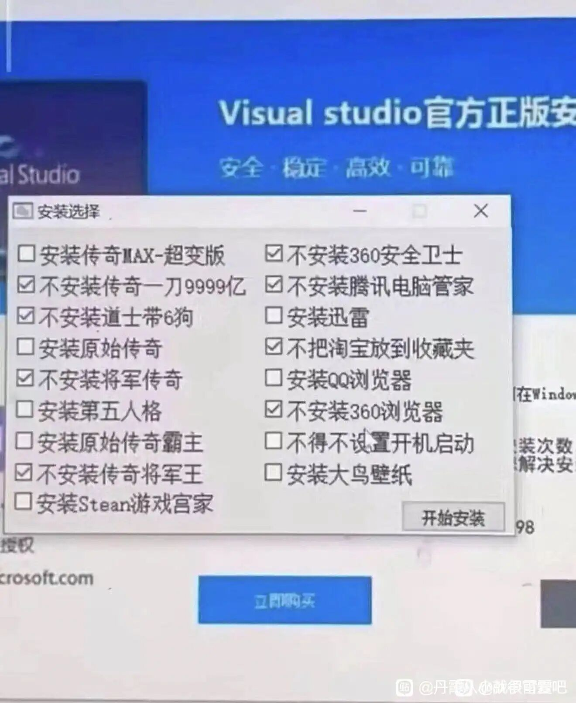
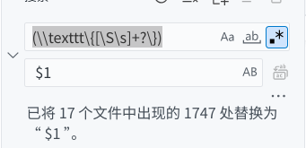
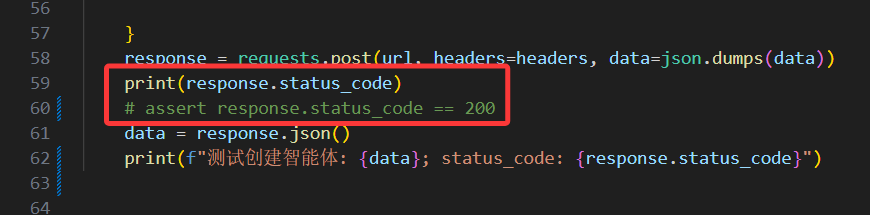
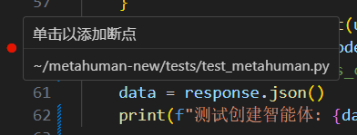
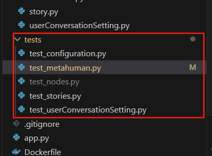

# 正式踏入编程世界

对于计算机小白而言，编程的世界可能会显得有些陌生和复杂。要想在这个世界中游刃有余，我们需要掌握的两个重要要素是**工具**和**环境**。

工具，指的是我们用来编写和运行程序的东西。包括语言、编辑器等。它们帮助我们更高效地达成我们的目标，例如调试程序、管理项目等。

环境，指的是我们编写和运行代码所依赖的操作系统、编程语言版本以及相关的库和框架。一个良好的编程环境可以大大提高我们的工作效率；同时，我们写出的代码，最终是也要运行在某个环境中的。编程语言本身就是为了让我们能够更方便地与计算机进行交流。

## 编程语言初探

!!! info "阅读材料"
    **编程语言发展简史**
    
    编程语言的发展经历了几个重要阶段：
    
    - **机器语言**：最早的编程语言，直接与计算机硬件对应，使用二进制代码。最早的机器语言是通过拔插电缆实现的，是一个体力活，非常不便。后来改为采用打孔纸带的形式，但仍然非常繁琐和不直观。同时，对于不同的硬件架构，机器语言也不兼容，导致了可移植性差的问题。
    - **汇编语言**：在机器语言基础上发展而来，引入了助记符，使得编程更加人性化。同时，汇编语言与特定的指令集相关联，这大大增强了其可移植性，但仍然需要对硬件有一定的了解。汇编语言虽然比机器语言更易读，但仍然需要手动管理内存和硬件资源。
    - **高级语言**：高级语言的出现使得编程过程更像说话，而不是在机器上进行什么精确控制硬件的操作，显著增强了其可维护性和可读性；同时同一个高级语言在不同的硬件平台上只需要在对应系统上有一个编译器或解释器就可以运行，这也大大增强了其可移植性。高级语言可以分为两类：
      - **编译型语言**：如C系语言，代码在运行前需要经过编译器转换为机器码，这样可以提高运行效率，但编译过程可能较慢。
      - **解释型语言**：如Python，代码在运行时由解释器逐行解释执行，虽然运行速度可能较慢，但开发效率更高，调试更方便。
    
    
    
    现代的编程语言通常结合了编译型和解释型的优点，提供了更高的抽象层次和更丰富的功能库，使得编程变得更加高效和便捷。微软的.NET系就是一个典型的例子，它提供了一个统一的编程环境，支持多种语言，并且可以在不同的平台上运行。
    

同学们可能会疑惑：一段代码充其量只是一堆文本，为什么它能变成一个程序，运行在计算机上呢？

这是编译器或解释器在起作用。编译器将高级语言代码转换为机器码，生成可执行文件；而解释器则逐行解释执行代码。无论是编译型语言还是解释型语言，最终都是通过某种方式将代码转换为计算机能够理解和执行的形式。所以说，可以执行的程序其实是代码经过编译或解释后的产物，没有编译器或解释器这个中间环节，代码是无法直接运行的。所以学习编程的第一步，就是要安装好并学会使用编译器或解释器，并配置好相关开发环境。本文将会以C++和Python为主要例子，介绍如何搭建编程环境和使用相关工具。

这一章和第二章的要求一致：本章中如果有任何你不理解的指令，**请先照做**，不要自作主张更改步骤，以免导致之后不必要的麻烦。随着你对计算机的了解加深，你会逐渐理解为什么让你这么做。另，mac用户请自行查找对应的配置方法，笔者并不拥有mac设备，无法提供相关支持。

!!! warning
    如果你是信科的同学，或将来有志于从事相关研究工作（如计算机视觉、自然语言处理、数据分析等），请务必看完本章内容，因为这些工作对编程环境有更高的要求，而信科的课程则天天和代码打交道，所以学会配置环境更是非常必要的。
    
    如果你仅是为了应付课程，则不必完整地阅读本章，直接使用我下文提供的环境：
    - C/C++：用DevC++。这是一个轻量级的、仅支持C/C++的IDE，开箱即用，省去了一切配置烦恼，非常适合初学者使用。DevC++扩展性较差，无法满足复杂的开发需求，且原版已经多年未更新，建议使用社区维护的新版。
    - Python：用Python自带的IDLE。IDLE是Python自带的轻量级IDE，开箱即用，适合初学者使用。IDLE功能有限，无法满足复杂的开发需求，但对于入门学习已经足够。
    - Python：或者也可以用PyCharm，和学校机房的环境保持一致。问题是臃肿，且需要注册账号使用社区版。
    - 通用：下载VS Code但不配置任何环境，直接搜索插件：Code Runner，然后安装该插件即可。Code Runner插件可以让VS Code支持多种编程语言的运行，包括C/C++和Python等，且无需额外配置环境，非常适合初学者使用，但同样面临功能有限的问题。下载VS Code的方式请参考下文。
    

## IDE及其选择

### 为什么选择VS Code？

IDE（集成开发环境，Integrated Development Environment）是一种软件应用程序，提供了编写、调试和测试代码所需的各种工具和功能。IDE通常包括代码编辑器、编译器或解释器、调试器、版本控制系统等组件，旨在提高开发效率和代码质量。IDE可以简单地被归类为通用的和专有的两种。

在PKU大一的课程《计算概论》上，一般会推荐使用Visual Studio、DevC++和PyCharm这三种。它们各有各的优势，并且有一个最大的共同点：开箱即用，用户并不需要复杂的配置来进行编程。

但是它们的缺点非常明显：Visual Studio（一般简称VS）和PyCharm都非常臃肿，尤其是前者如果安装全家桶需要大量的磁盘空间和内存资源。同时，它们更注重于超大型项目的开发，这一“超大”往往动辄涉及数十万甚至上百万行代码，我们日常学习使用的代码量远远达不到这个级别，只能说是“杀鸡焉用牛刀”。VS的另一个缺点是它实际上专精于Windows平台和微软的.NET生态系统，虽然它也支持C++和Python等语言，但很笨重。至于DevC++，它的功能少，且只支持C/C++。虽然比较适合初学者，但扩展性极差，完全无法满足更复杂的开发需求。因此，我并不推荐初学阶段就使用这些IDE。从长远来看，使用更加通用的编辑器会更有利于你在编程世界中游刃有余。

!!! note
    Visual Studio 把一个工作目录视为一个“项目”，当用户使用编译功能时会把整个项目编译一遍。而在同一个项目中，不能同时存在多个同名的变量和函数，因此即使我们在VS中新建了不同的C++文件且他们在逻辑上并无任何关联，但是VS依然会把它们视为同一个项目的一部分，从而导致命名冲突的问题。对于初学者来说，这无疑是一个巨大的坑，往往表现为“我这个 `main` 函数怎么出现了重定义的错误？”。
    
    另外，VS出于安全性考量，禁用了C系的一部分函数，例如 `printf`。当我们试图对这些函数进行调用时，VS会报错并提示我们使用更安全的版本，例如 `printf_s`。这无疑给初学者带来了不必要的困扰。当然这个困扰并非不能解决，只需要在文件开头定义宏 `#define _CRT_SECURE_NO_WARNINGS` 即可，但这无疑增加了学习的难度。另外， `printf_s` 等并不是标准函数，这会导致代码的可移植性变差。
    
    综上所述，我非常建议新手远离VS，即使是简陋的DevC++也比VS强。每一年都会有大量的同学因为使用VS而陷入困境，浪费了大量的时间和精力。

为了解决臃肿的问题，我们一般使用轻量的文本编辑器来编写代码，并用自己额外安装的编译器或解释器来编译运行代码。这样做的好处是可以根据自己的需求选择合适的工具，避免了臃肿和不必要的功能，同时也提高了灵活性和可定制性。常见的文本编辑器包括Vim、Visual Studio Code、notepad++等。

最Geek的一批程序员最喜欢使用命令行编辑器，例如VIM、Emacs、NeoVim等。这些编辑器通常具有强大的功能和高度的可定制性，适合喜欢命令行操作和自定义配置的用户。但是这些编辑器的使用难度极高，学习曲线陡峭，对于初学者来说极不友好。技术人中有一个非常著名的笑话：“怎么生成一段随机的字符串？答：只需要让不会用VIM的人试着退出VIM就可以了！”

!!! tip
    退出VIM的命令是 `:q`，如果你在编辑器中输入了内容并且想要保存，可以使用 `:wq` 命令；如果你不想保存，可以使用 `:q!` 命令强制退出。纵然如此，我个人还是建议同学们学着使用一下vim这个经典TUI编辑器，这是因为在将来的开发中，我们或多或少都会面对一些情况：不得不从远端登录某机器，且这个机器甚至还不能安装一些诸如nano的更现代的编辑器！

笔者个人非常推荐Visual Studio Code（简称VS Code或者Code），它是一款轻量级的编辑器，具有良好的扩展性和社区支持，可以满足不同用户的需求。VS Code支持多种编程语言，并且有丰富的插件生态系统，可以根据需要安装各种插件来增强功能。它同时也为调试和版本控制功能添加了GUI，非常适合初学者和中小型项目开发者使用。

!!! warning
    VS Code 和 Visual Studio Community 两个产品都是微软公司开发的**免费**软件，不要点进某些广告网站下载收费版本！请务必从[VS Code官网](https://code.visualstudio.com/)和[VS 官网](https://visualstudio.microsoft.com/zh-hans/vs/)下载对应的最新版本，以避免下载到捆绑恶意软件的盗版软件！
    
    VS 也有付费版本，叫做Visual Studio Professional和Visual Studio Enterprise，分别面向专业开发者和企业用户，提供了更多高级功能和支持服务，但对于大多数个人开发者和学生来说，社区版完全足够使用。



除此之外，还有一些语言仅在特定的编辑器中有很好的支持，例如C#之于Visual Studio，SQL之于DBeaver和DataGrip，Java之于Eclipse等。这些语言通常需要特定的IDE来提供更好的支持和功能，此时再去使用VS Code反而可能会有些不便，但到时候再去选择合适的IDE也不迟。

### 安装VS Code

我们应该上官网下载安装包进行安装。我们需要安装的是System Installer版本，而不是User Installer版本。因为User Installer版本会将VS Code安装在用户目录下，而System Installer版本会将VS Code安装在系统目录下，这样可以方便地在所有用户之间共享VS Code，并且能够把它直接放在环境变量中。

在安装之前，我们应当确定自己计算机的CPU架构是x86-64还是arm64。在Windows系统下，我们可以使用 `systeminfo` 指令来查看系统信息，或者右键点击“此电脑”选择“属性”来查看系统类型。在官网上下载的Code架构应当和操作系统的架构一致。

安装完成后，我们需要设置环境变量，以便在命令行中直接使用code命令。不过如果你在安装时选择了“Add to PATH”选项，则不需要手动设置环境变量。

### 配置VS Code

VS Code是一个非常灵活的编辑器，可以通过安装插件来增强其功能。我们可以在不同的工作区（可以简单地理解为工作用文件夹）启用和禁用不同的插件，以实现其高度可定制特性。常用的插件包括：

- **Python**：提供对Python的支持，包括语法高亮、代码补全、调试等功能。
- **C/C++**：提供对C/C++的支持，包括语法高亮、代码补全、调试等功能。
- **GitLens**：增强版的Git支持，可以更好地查看版本历史和代码变更。
- **Chinese (Simplified) Language Pack for Visual Studio Code**：提供中文界面支持。

此外，VS Code还支持多种主题和图标包，可以根据个人喜好进行定制。你可以在VS Code的插件市场中搜索并安装这些插件和主题等。

### VS Code 的一些设置项

VS Code的不少有用的设置项都隐藏在设置菜单中且默认关闭，很多人用了许久都不知道这些功能的存在：甚至VS Code的设置菜单都不是很容易发现（需要点击左下角齿轮图标，然后选择“设置”）。因此，下面介绍几个比较实用的设置项。

设置页面的搜索栏可以用来快速定位设置项。

#### 内联提示

对于Python等语言，其变量类型是动态的，因此我们在编写代码时（尤其是有许多包的时候），往往很难确定某个变量的类型是什么。VS Code提供了内联提示功能，可以在代码中直接显示变量的类型信息，帮助我们更好地理解代码。

启用方式：在设置界面搜索 `inlay Hints`，然后往下翻，找到你喜欢的语言对应的内联提示选项并启用它们即可。

#### 随系统主题切换颜色

有时候，我们的系统主题会根据时间自动切换深色和浅色模式。如果VS Code的主题不能随系统主题切换，则会显得格格不入，手动调整也很麻烦。VS Code提供了一个选项，可以让主题随系统主题自动切换。

启用方式：在设置界面搜索 color theme，找到这一项： window.autoDetectColorScheme，然后启用它即可。同时，你还需要在上面指定workbench.preferredDarkColorTheme 等四个选项，来指定深色和浅色主题以及对应的高对比度主题。

我个人推荐GitHub系和Ayu系的主题。当然也可以使用“现代深色”，这是VS Code的默认主题，美观大方，但有点太黑，对应的“现代浅色”配色又不如GitHub Light好看。喜欢纯黑色的可以使用Absolute Black主题。

#### 搜索、替换和正则替换

VS Code的搜索和替换功能支持正则表达式，可以帮助我们更高效地进行文本处理。

首先，搜索和替换功能可以在左边的搜索按钮找到，这个搜索是针对整个工作区的搜索。或者也可以使用快捷键 `Ctrl + F` 或 `Ctrl + H` 来打开搜索和替换面板，该面板仅会搜索当前打开的文件。

在搜索和替换面板中，有一个小的正则表达式图标（类似于 `.*` ），点击它可以启用正则表达式模式。启用后，我们就可以使用正则表达式来进行搜索和替换了。在该正则表达式中，我们可以用括号来捕获分组，然后在替换文本中使用 `$1` 、 `$2` 等来引用这些分组。



## 在纯Windows上搭建C/C++编程环境

!!! note
    下文经常提到的一个东西“环境变量”是操作系统的重要变量 `PATH`。该变量存储了一系列路径，当用户在命令行中输入一个命令时，操作系统会在这些路径中查找对应的可执行文件。如果找到了，就会运行该文件，否则会提示“命令未找到”之类的错误。因此，在安装编译器、解释器等工具时，通常需要将它们的安装路径添加到 `PATH` 变量中，以便在任何位置都能使用这些工具。否则，每次输入命令时都要指定完整路径，极其不便。

### C系编译器及其环境配置

C/C++有三个最常见的编译器：GCC、Clang和MSVC。它们各有特点，但都能满足大部分初学者的C语言开发的需求。这些编译器通常会与特定的C标准库实现（如GNU的libstdc++、LLVM的libc++或Microsoft的MSVC CRT）配合使用，不同的标准库之间存在细微差异。我们一般建议在Linux上使用GCC，而在Mac上推荐使用Clang。MSVC工具链在Windows上非常流行，但是不跨平台且为闭源软件，有部分程序员可能因此不愿意使用。

对于Windows用户，有两种方式获得这一编译器：如使用MSVC，则直接下载Visual Studio并安装C++开发模块即可，Visual Studio内置了MSVC工具链；如果使用GCC，则需要通过其他渠道。比起手动下载和配置GCC，我更推荐使用MSYS2或者Cygwin来安装GCC。它们提供了一个完整的UNIX环境，免去了在Windows上配置编译器的麻烦。

你需要在[MSYS2官网](https://www.msys2.org/)下载最新的安装包，并按照官网的说明进行安装。安装完成后，你可以在MSYS2终端中运行以下命令来安装GCC和GDB（建议使用UCRT64终端，不建议使用逐渐失去支持的32位以及MINGW64环境，也不建议新手使用CLANG64环境，该环境完全使用Clang代替GCC）：

```bash
pacman -S mingw-w64-ucrt-x86_64-gcc
pacman -S mingw-w64-ucrt-x86_64-gdb
```

在MSYS2中安装完成后，用户如果想要在Windows终端中使用GCC，则需要设置环境变量，以便在命令行中直接使用编译器命令。

一般情况下，用户需要将MSYS2的bin目录添加到系统的PATH环境变量中。具体步骤如下：

- 找到MSYS2的安装目录，通常是 `C:\msys64`。
- 将 `C:\msys64\ucrt64\bin` 添加到系统的PATH环境变量中。（请按照你的实际安装路径进行调整，下同）
- 在PowerShell或者CMD中运行以下命令来验证是否配置成功： `gcc --version`。如果输出了GCC的版本信息，则说明配置成功。
- 需要在Windows的PowerShell或者CMD中运行POSIX风格工具时，也可以将下列路径也添加到用户的PATH环境变量中： `C:\msys64\usr\bin`。但这样具有环境冲突风险，需要注意保证该变量的查找顺序在比ucrt64的bin目录更靠后，以避免冲突。

在安装完GCC和GDB后，我们可以在终端中运行以下命令来验证是否安装成功：
```bash
gcc --version
gdb --version
```

输出大概类似于：
```text
gcc (GCC) 15.2.1 20250813
Copyright © 2025 Free Software Foundation, Inc.
本程序是自由软件；请参看源代码的版权声明。本软件没有任何担保；
包括没有适销性和某一专用目的下的适用性担保。
```

或其英文版本。GDB的输出类似。如果你能看到上述输出，则说明GCC和GDB安装成功且配置正确。否则，请检查你的安装步骤和环境变量设置是否正确。

!!! warning
    有的同学可能不是按照上述推荐的方式安装GCC的，而是通过其他方式（例如直接下载预编译版本）安装的GCC。如果是这种情况，务必记住GCC和非ASCII字符是死敌，因此请不要将GCC安装在包含非ASCII字符（如汉字、空格）的路径下！（最大的坑可能是你的用户名中包含非ASCII字符，例如汉字！）
    
    另外，直接下载预编译版本往往会遇到版本过老的问题，比如笔者就见过一个人在2025年还在用GDB 7.6.1（2013年发布的版本）调试代码，结果最新版本的VS Code无法对该GDB进行注入，从而导致无法输入、无法调试的问题。而使用MSYS2等手段下载的GDB往往是最新或相当新的版本，能够避免这些问题。

!!! warning
    有些同学的Windows系统可能不是使用UTF-8编码的（例如使用GBK编码），这会导致GCC无法正确处理包含非ASCII字符的文件名，从而引发各种奇怪的问题。因此，建议将系统的区域设置更改为使用UTF-8编码。具体步骤见第一章相关小节。如不愿修改该设置项，则务必注意不要使用非ASCII文件名！

!!! tip
    Linux用户安装GCC是最简单的。例如在Arch Linux上，只需要运行以下命令：
    ```bash
    sudo pacman -S gcc gdb
    ```
    
    即可安装GCC和GDB。其他的发行版则使用对应的包管理器安装即可，例如Debian/Ubuntu使用 `apt`，Fedora使用 `dnf` 等。
    
    macOS也是类UNIX系统，因此使用HomeBrew安装GCC也是非常简单的：
    ```bash
    brew install gcc gdb
    ```
    

### 在VS Code中配置C/C++

!!! tip
    VS Code 的工作基于工作区（workspace）的概念，实际上我们启用的不少插件也都是基于工作区启用的。对于C/C++扩展来说，它们的工作有不少基于当前工作区目录，并帮助你输入编译和调试命令。如果你直接打开一个C/C++文件，而不是一个工作区目录，那么这些基于工作区的插件也将会全部失效。此时，VS Code就回归其作为一个文本编辑器的本质，无法为你提供编译和调试的功能。
    
    最简单的工作区就是一个目录。所以我们必须打开一个文件夹而不是仅打开一个文件，这样才能使用VS Code的C/C++扩展来编译和调试代码，其他扩展也大同小异。Code的其他语言扩展也大同小异。在之后，我都会用“打开一个工作区”这种说法。

你需要在VS Code中配置GCC，以便能够编译和运行C/C++代码。

##### json配置

可以通过以下步骤进行配置：

1. 安装C/C++插件：在VS Code的插件市场中搜索并安装C/C++插件: `C/C++`、`C/C++ Extension Pack` 和 `C/C++ Themes`。这些插件都是微软提供的。
2. 配置tasks.json文件：在VS Code中打开一个新的工作区，创建一个C++文件 `*.cpp` 或者 `*.cc`，然后随便输入一些什么代码，然后编译之。首次编译C++代码时，VS Code会提示你创建一个 `tasks.json` 文件。选择“C/C++: g++.exe 生成活动文件”，这将会在项目根目录下创建一个 `.vscode/tasks.json` 文件。如果你创建的是C文件 `*.c`，那么你可以选择“C/C++: gcc.exe 生成活动文件”。
3. 配置launch.json文件：在VS Code中按下 `F5`，选择“C++ (GDB/LLDB)”，然后选择“g++.exe build and debug active file”。这将会在项目根目录下创建一个 `launch.json` 文件。（如果没有后一步，可以忽略之。）

如果你并不信任自动生成的配置文件或者需要更多的功能（例如开 `-O2` 优化），可以手动创建并修改 `tasks.json` 和 `launch.json` 文件。这两个文件都应该放在项目根目录下的 `.vscode` 文件夹中。

以下是一个简单的 `tasks.json` 文件示例[^1]。我会使用#来表示注释内容，但JSON文件是不支持注释的，因此请不要把这些注释内容放进你的JSON文件中。不懂JSON文件的可以把整个手册翻到《数据交换格式》一节。

```text
{
  "version": "2.0.0", 
  "tasks": [
    {
      "label": "C/C++: g++.exe 生成活动文件", # 任务标签，你可以通过这个标签来引用这个任务，可以自定义。
      "type": "shell",  # 任务类型，这里是在shell中运行命令，不建议改动
      "command": "g++", # 编译器命令。如仅编译C代码，则改为gcc。你也可以把这个改为编译器的完整路径。
      "args": [
        "-g",           # 开启调试信息
        "${file}",      # 当前打开的文件
        "-O3",          # 开启O3优化
        "--std=c++23",  # 指定C++标准为C++23。这里是因为笔者习惯现代C++。不指定则使用编译器默认的标准，现代GCC默认C++17。
        "-o",           # 指定输出文件
        "${fileDirname}\\${fileBasenameNoExtension}.exe" # 输出文件路径到当前文件同目录，文件名和当前文件名相同但扩展名为.exe
      ],
     "group": {
        "kind": "build",  # 任务组类型，这里是构建任务
        "isDefault": true # 该任务为默认构建任务
      },
      "problemMatcher": ["$gcc"], # 问题匹配器，用于解析编译器输出的错误和警告信息。gcc和g++通用，都应该使用"$gcc"。
      "detail": "生成活动文件"  # 细节描述，这个可以自定义，也可以删除该字段。
    }
  ]
}
```

以下是一个简单的 `launch.json` 文件示例：

```text
{
  "version": "0.2.0",
  "configurations": [
      {
          "name": "C++ Launch", # 配置名称，可以自定义
          "type": "cppdbg",     # 调试器类型，这里使用C++调试器
          "request": "launch",  # 请求类型，这里是启动调试
          "program": "${fileDirname}\\${fileBasenameNoExtension}.exe", # 要调试的程序路径，直接照着上述tasks.json的输出路径抄下来
          "args": [],          # 程序参数，这里留空，同学们可以根据需要添加，但一般不需要
          "stopAtEntry": false,# 是否在程序入口处停止，这里设置为false
          "cwd": "${workspaceFolder}",  # 当前工作目录，这里设置为工作区根目录
          "environment": [],  # 环境变量，这里留空
          "externalConsole": false, # 是否使用外部控制台，这里设置为false，使用内置终端。如果true，则会弹出一个新的控制台窗口
          "MIMode": "gdb",  # 调试模式，这里使用gdb
          "setupCommands": [ # 调试器设置命令，这里仅启用pretty-printing功能，也可以添加其他命令，例如设置断点等
              {
                  "description": "Enable pretty-printing for gdb", # 描述信息
                  "text": "-enable-pretty-printing", # 命令文本，实际上和gdb命令行中输入的命令是一样的
                  "ignoreFailures": true # 忽略失败，这里设置为true
              }
          ],
          "preLaunchTask": "C/C++: g++.exe 生成活动文件", # 预启动任务，这里设置为上述tasks.json中的任务标签，因为必须先编译才能调试
          "miDebuggerPath": "C:\\msys64\\ucrt64\\bin\\gdb.exe" # gdb调试器路径，请根据你的实际安装路径进行调整
      }
  ]
}
```

##### UI配置[^2]

如不想用JSON文件进行配置，我们还可以使用UI配置相关功能。

在Code中按下 `Ctrl + Shift + P`，找到“C/C++: Edit Configurations (UI)”选项。这样就可以通过图形界面来配置C/C++的编译和调试选项。

一般地，我们需要更改以下内容：
- 配置名称：默认即可。
- 编译器路径：选择你要选用的编译器的路径。该选项一般会自动检测电脑上的编译器。
- 编译器参数：留空即可。如需要，可以添加一个 `-O2` 或者 `-O3` 来开启编译优化，或者添加一个 `-g` 来开启调试信息。但是， `-g` 会严重拖慢编译速度，因此建议只在调试时开启。另，如果想使用较新的C++特性，也可以加上 `--std=c++23` 之类的选项。
- IntelliSense模式：根据你的系统、编译器、CPU架构选择对应的模式。该选项会为你打开对应的代码补全、语法高亮、错误警示功能。
- 包含路径：不用动。
- 定义：不用动。
- C/C++标准：建议C17和C++17，和PKU线上代码检查的标准一致。如果不是为了考试服务，可以选择最新版本，如C++26；如果不希望使用过新的特性（如初学者），也可以选择C++11。
- 高级：一个都不用动。

调试配置没有UI配置选项，我们还得老老实实地手动编辑 `launch.json` 文件。当然默认调试已经够了，如果你不需要更复杂的调试功能，完全可以不修改。

如果你确实做了这些事情，但是你的VS Code仍然无法编译和调试C/C++代码，那么你可能需要检查以下几点：
- 使用 `where g++` 命令来确定你的编译器是不是在PATH环境变量中，另外你还需要确定上述识别出的编译器是不是你想用的那个。
- 检查你的C++目录和编译器目录是否包含非ASCII字符（如汉字、空格等）。
- 检查你是不是错误地使用了 `gcc` 来编译C++代码。C++代码需要使用 `g++` 来编译，而不是 `gcc`，这是最常见的错误之一。
- 检查你的包含路径是否正确。VS Code会自动检测你的编译器和标准库，但如果你使用了自定义的路径或者安装了多个版本的编译器，可能需要手动配置包含路径。
- 检查你改的几个配置文件是不是正确的配置文件、有没有保存。
- 检查你的VS Code和C/C++插件是否是最新版本。有时候，旧版本的插件可能会有bug或者不兼容最新的VS Code版本。

一般情况下，修正的方法很简单：如果是环境变量、路径等问题，重新设置就可以；如果是误用GCC调试C++代码的问题，只需要改回G++即可；如果是配置文件问题，杀掉当前所有终端，删除 `.vscode` 文件夹，然后重新编译调试就可以了。

另外，如果希望使用Code的插件来帮助你编译并运行C/C++代码，则需要打开一个工作文件夹。否则，插件无法为你提供编译和运行的功能。当然，`g++ main.cpp -o main.exe && ./main.exe`也并非不可。

### 不依赖VS Code的编译方式

如果你不想使用VS Code来编译和运行C/C++代码，你也可以直接在命令行中使用GCC来编译和运行代码。以下是一个简单的示例：
```bash
g++ main.cpp -O2 -g -o main.exe
./main.exe
```

上述命令的含义是：使用 `g++` 编译器编译 `main.cpp` 文件，开启 `-O2` 优化，开启调试信息 `-g`，并将生成的可执行文件命名为 `main.exe`。然后，使用 `./main.exe` 命令来运行生成的可执行文件。

命令行能提供更高的灵活性，可以随意增删改编译选项，例如添加 `-Wall` 来开启警告等。我个人非常推荐同学们学会使用命令行来编译和运行代码，这样可以更好地理解编译过程，并且能够更好地控制编译选项。

## 用WSL配置C/C++环境

使用WSL，可以大大简化配置环境的过程。

首先，假设你没有安装过任何WSL发行版。打开PowerShell，输入以下命令：
```bash
  wsl --install # 默认安装 Ubuntu 发行版，完全足够
```

等待安装完成后，重启电脑。重启后，在开始界面找到Ubuntu图标，点击打开。第一次打开时，会提示你创建一个Linux用户名和密码，按照提示操作即可。

接下来，换源并更新系统：
```bash
  sudo apt update && sudo apt upgrade -y
```

换源操作请参考[清华大学开源软件镜像站的帮助页面](https://mirrors.tuna.tsinghua.edu.cn/help/ubuntu/)。

然后，安装C/C++开发环境：
```bash
  sudo apt install gcc gdb # CMake先不装，新手用不上
```

下一步，打开你的VS Code，在欢迎页上选择“连接到”，在弹出的菜单里选择WSL，此时如果没有安装过WSL插件则会自动安装。连接成功后，VS Code会自动打开一个新的窗口，左下角会显示你当前连接的WSL发行版名称。

然后你就需要在该窗口里安装一个C++插件，以便于代码高亮、补全等。按下 `Ctrl+Shift+X` 打开扩展商店，搜索“C++”，找到由微软官方发布的那个，点击安装即可。

现在，你就可以愉快地在WSL里编写C/C++代码了！（当然你依然需要创建一个工作目录，并在里面创建源代码文件，否则扩展不起作用。）

## Python、虚拟环境及其配置

### 简单安装Python

如果仅仅是安装Python，那可比安装C系编译器简单得多了，直接去[Python官网](https://www.python.org/downloads/)上下载符合你操作系统的最新版本就行了，只要记得安装时勾选“添加到Path”就行了。

检验安装的方式是：打开终端，输入以下命令：
```bash
python --version
```

如果输出了Python的版本信息，例如 `Python 3.12.0`，则说明Python安装成功且配置正确。否则，请检查你的安装步骤和环境变量设置是否正确。

### 虚拟环境及其配置

然而，这样安装会有一个问题：会将Python安装到全局环境中。

Python作为一门流行的编程语言，拥有丰富的第三方库和框架，可以帮助我们快速实现各种功能，并不需要从零开始开发，第三方库的安装和管理是必然是开发中非常重要的一部分。而不同的开发往往需要不同的包，或者同一个包的不同版本。这些包有可能会产生冲突，如果用全局环境则会导致依赖混乱。这时，我们引入了虚拟环境，它是解决包冲突的有效手段。

虚拟环境可以理解为一个单独的沙盒，包含了特定版本的编译器、解释器和所有依赖的包。用户可以在虚拟环境中自由安装和管理包，而不会影响全局的Python环境，更不会影响其他沙盒。目前较常见的虚拟环境创建工具有conda、mamba、venv、uv、pixi等。在这里我们讲述传统手段，也就是conda和mamba。

##### conda

conda是数据科学领域开山鼻祖级别的包管理和虚拟环境管理工具。它不仅可以管理Python包，还可以管理其他语言的包，例如R、Ruby等，因此也是迄今为止用的最广泛的跨语言包管理工具。但conda有两个缺点：一个是笨重，一个是慢。

conda有两个主要的发行版：Anaconda和Miniconda。Anaconda是一个完整的数据科学平台，包含了大量的预装包，适合初学者和数据科学家使用；Miniconda则是一个轻量级的版本，解决了笨重的问题（虽然依然慢）。我们推荐使用Miniconda。

Windows用户可以把以下命令直接贴到终端里运行：
```bash
curl https://repo.anaconda.com/miniconda/Miniconda3-latest-Windows-x86_64.exe -o .\miniconda.exe
start /wait "" .\miniconda.exe /S
del .\miniconda.exe
```

Linux用户见[官方网站](https://www.anaconda.com/docs/getting-started/miniconda/install)即可，其实大差不差。

安装完成后，你可以通过以下命令来创建并激活一个新的虚拟环境：
```bash
conda create -n myenv python=3.12
conda activate myenv
```

上述命令的含义是：创建一个名为 `myenv` 的虚拟环境，并安装Python 3.12版本。你可以根据需要更改环境名称和Python版本。在快速开发的背景下，可以把东西一股脑的安装到base环境中，但不推荐把这种手段用到正式开发中。

##### mamba

mamba是conda的一个替代品，旨在解决conda的慢的问题。mamba使用C++编写，具有更快的包解析和安装速度。mamba完全兼容conda的命令和配置文件，因此用户可以无缝切换到mamba，而无需修改现有的环境和脚本。

如果计算机上已经安装了conda，则可以通过以下命令来安装mamba：
```bash
conda install mamba -n base -c conda-forge
```

安装完成后，你可以使用 `mamba` 命令来代替 `conda` 命令，例如：
```bash
mamba create -n myenv python=3.12
mamba activate myenv  
```

上述命令的含义与使用conda时相同。

对于没有安装过conda的用户，我们遵从“最简单”原则，安装micromamba。micromamba是mamba的一个轻量级“纯净”版本，不依赖于conda或Anaconda。它仅包含mamba的核心功能，适合那些只需要基本包管理和虚拟环境管理功能的用户。

只需要运行下列命令：
```bash
"${SHELL}" <(curl -L micro.mamba.pm/install.sh)
```

然后按照提示操作即可。安装完成后，你可以使用 `micromamba` 命令来创建和管理虚拟环境，使用方法与conda类似。

### 在VS Code中配置Python

在VS Code中配置Python非常简单。只需要安装微软提供的四个Python插件： `Python` 、 `Pylance` 、 `Python Debugger` 和 `Python Environments`。

然后，在VS Code中打开一个工作区，并创建一个Python文件 `*.py`。你会在右下角看到一个黄色按钮“选择Python解释器”，点击它可以选择你想要使用的Python解释器。一般情况下，你可以选择“Python 3.x (conda)”或者“Python 3.x (venv)”等选项，这样VS Code就会自动识别你当前的虚拟环境。有时候，右下角会直接帮你选好，那也可以点击它来确认或更改。

当然，我们非常建议同学们趁早熟悉纯命令行运行Python的方式，例如 `python main.py`，这样可以更好地理解Python的运行机制，同时也更便于调试（？）。

### 不依赖VS Code的运行方式

如果你不想使用VS Code来运行Python代码，你也可以直接在命令行中使用Python解释器来运行代码。以下是一个简单的示例：
```bash
python main.py
```

上述命令的含义是：使用当前虚拟环境中的Python解释器来运行 `main.py` 文件。

我们也可以指定特定的Python解释器来运行代码，例如：
```bash
/path/to/python main.py
```

这样就可以使用指定路径下的Python解释器来运行代码。一般有CPython、PyPy等不同的Python解释器可供选择。

另外，如果你想要运行一个交互式的Python环境，可以使用以下命令：
```bash
python
```

这将会启动一个交互式的Python解释器，你可以在其中输入Python代码并立即执行。想要退出该环境，可以使用 `exit()` 命令或者按下 `Ctrl + D` （Linux/macOS）或 `Ctrl + Z` （Windows），以输入一个EOF信号。如果你在Linux上不小心按下了 `Ctrl + Z`，则会将Python进程挂起，此时可以使用 `fg` 命令将其恢复。

### 在VS Code中配置终端

VS Code内置了终端功能，可以方便地在编辑器中运行命令。终端默认使用系统的命令行工具，例如在Windows上是PowerShell，在Linux上是bash。

你可以通过快捷键 Ctrl + `（反引号）打开终端，也可以通过菜单 `视图 > 终端` 来打开。终端打开后，你可以在其中输入命令，和在普通命令行中一样。

如果你希望在VS Code中使用Oh My Posh，只需要把Code的终端字体设置为Nerd Font即可。你可以在VS Code的设置中搜索 `terminal.integrated.fontFamily`，然后将其值设置为你安装的Nerd Font的名称，例如 `MesloLGS Nerd Font`。

## 编写程序的基本素养

做了这么多操作，我们终于可以编写第一个能跑的程序了。我们将使用C++和Python两个语言来演示怎么书写第一个程序，同时告诉大家编程新手应有的素养。

### 编写你的第一个程序

由于众所周知的原因，我们的第一个程序通常是“Hello, World!”程序。它的作用是让我们熟悉编程语言的基本语法和编译运行流程，同时也是一个传统。而第二个程序一般往往是写一个加法，让我们熟悉输入输出的基本操作。

#### C++

对于C++，我们可以使用以下代码来编写第一个程序。你可以在VS Code中创建一个新的C++文件，例如 `hello.cpp` （**该文件的路径不能包含空格和中文！**），然后输入以下代码：

```cpp
#include <iostream>
int main() {
    std::cout << "Hello, World!" << std::endl;
    return 0;
}
```

然后如果配置得当，我们就可以通过按下F5键来编译并运行这个程序了。VS Code会自动调用编译器进行编译，并在终端中显示输出结果。如果一切顺利，你应该会看到“Hello, World!”的输出。

在一些极端情况下（例如无GUI环境），你可能需要手动编译和运行程序。可以使用以下命令来编译和运行程序：

```bash
g++ -o hello hello.cpp
./hello
```

请使用类似的方式**手敲**、编译、运行以下代码：

```cpp
#include <iostream>
int main() {
    int a, b;
    std::cout << "Enter the first integer: ";
    std::cin >> a;
    std::cout << "Enter the second integer: ";
    std::cin >> b;
    std::cout << "Their sum is: " << a + b << std::endl;
    return 0;
}
```

#### Python

对于Python，我们同样可以使用以下代码来编写第一个程序：

```python
print("Hello, World!")
```

同样，如果配置得当，我们就可以通过按下F5键来运行这个程序了。VS Code会自动调用Python解释器运行，并在终端中显示输出结果。同样的，如果希望使用命令行来运行程序，可以使用以下命令：

```bash
python hello.py
```

请使用类似的方式**手敲**、编译、运行以下代码：

```python
a = int(input("Enter the first integer: "))
b = int(input("Enter the second integer: "))
print("Their sum is:", a + b)
```

#### 这两个语言有什么区别？

可以看到，使用命令行来执行程序的方式有所不同：C++需要两步，但是Python只需要一步。这是因为C++是编译型语言，需要先将源代码编译成可执行文件，然后再运行；而Python是解释型语言，直接运行源代码即可。前者的好处是，一份需要被反复运行的代码只需要编译一次，之后可以反复高效率运行。而后者的好处是，代码修改后可以立即运行，但是需要反复解释执行，运行速度（相对的）非常缓慢。

另一个区别是，C++中，我们可以看到定义a和b之前需要先声明它们的类型，而Python中则不需要。这说明，C++是强类型语言，变量的类型在编译时就确定了；而Python是动态类型语言，变量的类型在运行时才确定。

而这也导致了一个问题：编译器可以识别全部的语法错误和部分的语义错误，因此一份能够编译通过的C++代码，通常代码本身是正确的，但是算法可能因为极端数据出现错误，例如除零等；而Python则无法检查语法错误和语义错误，解释器只会在按顺序运行代码，直到在出现问题的的地方停止。Python 自身的动态类型系统与缺少编译器带来的静态查错系统，使得实际写出来的 Python 代码中经常包含大量的错误。

!!! note
    在Python的较新版本中引入了“类型注释”，例如 `func(para: int) -> int`。VS Code的Pylance插件能够识别类型注释，并在编辑器中提供有限的类型检查。一些新生代程序员在编写程序时，会使用类型注释来帮助自己检查代码的正确性，防止出现错误。在C++的较新版本中，也引入了“类型推断”，我们可以把部分变量声明为 `auto` 类型，例如 `for(auto item : items)`，其中 `items` 是一个列表。编译器能够自动推断变量的类型，从而减少了代码的冗余。由此可见，编程语言的发展是不断演进的，程序员们不断引入新的特性和语法，以提高代码的可读性和可维护性；同时，我们还可以看到，强类型语言和动态类型语言之间的界限正在逐渐模糊。

### 学会阅读错误信息

从上文中我们知道，代码中出现错误是不可避免的一件事情。有时候，我们会犯较为低级的语法错误，此时编辑器会自动指出问题；有时候，我们在只有在代码跑起来的时候才能发现程序错误、不能执行，此时编译器或解释器会给出错误信息，帮助我们定位问题所在；还有一些时候，程序自己运行时并没有因为致命错误而停止运行，但是输出的结果并不是我们期望的，此时我们只能通过调试来解决问题。

例如，以下是C++初学者常见的错误：

```cpp
  #include<iostream>
  using namespace std;
  int mian()
  {
      cout<<"Hello World!"<<endl;
      return 0;
  }
```

而它的错误信息是在编译时报出：

```text
g++ example.cpp -o example.exe
ld.exe: *.a(lib64_libmingw32_a-crtexewin.o): in function `main':
C:/.../crtexewin.c:70: undefined reference to `WinMain'
collect2.exe: error: ld returned 1 exit status
```

虽然信息略显抽象，但我们还是可以看到很多有用的信息。 ld 是 C++ 中的链接器，再往上看可以发现对 WinMain 的引用是未定义的。这提示我们去看 main 函数，从而发现这里将 `main` 函数写成了 `mian`，因此链接器无法找到 main 函数，从而引发错误。

而Python给出的错误信息则更为直观，例如以下代码：

```python
def calc(numbers):
  total = sum(numbers)
  count = len(numbers)
  return total / count

numbers = [10, 20, 30, 40, 50]
print("Average:", calc(numbers))

numbers.append("60")
print("Updated Average:", calc(numbers))
```

其报错是：
```bash
Average: 30.0
Traceback (most recent call last):
  File "example.py", line 10, in <module>
    print("Updated Average:", calc(numbers))
  File "example.py", line 2, in calc
    total = sum(numbers)
TypeError: unsupported operand type(s) for +: 'int' and 'str'
```

可以看到，解释器对第10行和第2行进行了报错。第10行的报错是因为在调用 `calc` 函数时，传入的 `numbers` 列表中包含了一个字符串“60”，而 `calc` 函数期望的是一个数字列表，因此在计算平均值时出现了类型错误（TypeError）。而第2行的报错则是因为在计算总和时，无法将整数和字符串相加。于是我们发现了问题所在：在第9行，我们向 `numbers` 列表中添加了一个字符串“60”，而不是一个数字。我们可以通过将其改为 `numbers.append(60)` 来解决这个问题。

顺便一提，这段代码在C++这种强类型语言中是无法通过编译的（ `List<int>` 类型不能进行append(string)），但 Python 的解释器还是运行代码直到遇到了具体的问题，在输出信息中可以看到第一个  `print()`  语句仍然被正常地执行。

### 学会调试

调试（技术人一般直接说debug）是我们发现和修复代码中隐藏起来的错误的最有力工具。调试可以帮助我们理解代码的执行流程，从而**定位**问题所在。

调试有两种手段：静态调试和动态调试。前者一般是通过静态分析工具（例如反汇编器）来分析代码的结构和逻辑，寻找潜在的问题；后者则是通过运行代码并观察其行为来发现问题。静态调试通常用于编译型语言且难度极高，我们不会涉及；而动态调试则适用于所有语言，接下来的内容我们将主要介绍动态调试。

C系有着自己的调试器：GDB（GNU Debugger），它是一个强大的调试工具，可以在命令行中使用。GDB可以让我们逐行执行代码，查看变量的值，设置断点等。VS Code也集成了GDB，可以通过图形界面进行调试。Python也有类似的调试器：PDB（Python Debugger），它同样可以在命令行中使用，也可以通过VS Code进行调试。

纯命令行调试的方式极为困难（尤其是GDB，需要背诵大量的命令），我们在这里不做介绍。然而，VS Code提供了一个非常友好的调试界面，可以通过图形化的方式进行调试。我们可以在代码中设置断点，逐行执行代码，查看变量的值等。这样可以大大提高调试效率。（当然这需要你安装GDB，安装并配置的过程见“在VS Code中配置C/C++”小节。）

我们调试主要有以下几个手段：打日志、打断点、写测试代码。

#### 打日志

打日志是指在代码中添加打印语句，以便在运行时输出某些特定变量的值，进而确定程序的执行流程。这样可以帮助我们理解代码的执行过程，定位问题所在。

新人常常不喜欢这种手段，因为它需要在代码中添加额外的打印语句，很丑陋、不优雅，且会影响代码的可读性和维护性。但是打日志是一个非常有效的调试手段，尤其是在工程量巨大、无法或者很难打断点的情况下。

例如我在调试某数万行的大型项目时，出现断言错误。于是本人在代码中添加了以下打印语句：



这样我就知道了程序在执行到这里的时候，返回的不是预期的200，而是404。于是这让我顺藤摸瓜，排查可能会导致404的原因，最终发现是因为某个API的返回值发生了变化，导致程序无法正常运行。

这是打日志的一个典型例子。通过在代码中添加打印语句，我们可以快速定位问题所在，并进行修复。

#### 打断点

在VS Code中，我们可以通过点击行号左侧的空白区域来设置断点。断点是调试过程中非常重要的工具，它可以让代码执行到特定的某行时暂停，从而查看当前的变量值和程序状态。

我们可以逐行执行代码，查看变量的变化，从而定位问题所在。



这样就可以打出一个断点。在调试过程中，当程序执行到断点所在的行时，程序会暂停，我们可以查看当前的变量值和程序状态。我们可以通过单步执行（Step Over）来逐行执行代码，或者通过单步进入（Step Into）来进入函数内部进行调试。对于小型项目或者单文件项目，打断点是一个非常有效的调试手段。

#### 写测试代码

写测试代码是指编写一些专门用于测试的代码，以便在运行时验证程序的正确性。测试代码可以帮助我们发现潜在的问题，并确保程序的功能正常。这也是用于较大型项目的调试手段，但是小型项目也可以使用。我们可以在这些测试代码中模拟各种可能出现的情况（包括常规值、边界值、异常值等），从而验证程序的正确性和健壮性。



#### 小结

debug 最重要的一件事是缩小错误出现的范围，为达成这一目的我们通常会跟踪代码的行为，直到发现代码的行为与预期不符。实际上最棘手的情况是，代码只在特定的数据上出现错误，尤其是当我们无法获取程序执行日志的时候。这种情况尤见于我们在POJ上做题的时候：POJ的测试数据是不可见的，只会告诉你结果是WA、RTE还是TLE、MLE。

这时最应该做的是重新审视自己的预期（以及 OJ 题的题面），寻找是否遗漏了什么约束条件或关键信息。一份貌似运行正常的代码很有可能会在边界条件或复杂数据的情况下出问题，可以尝试手写一些处于边界条件之下的数据，或编写一个数据生成器来生成更复杂的数据。实在手足无措时，休息一下放空大脑也是很好的选择。实在走投无路之时，摇人求助也不是什么大不了的事情。debug 很可能会占用比编写代码更多的时间和精力，保持良好的心态才是 debug 的关键。

[^1]: 其实就是上面自动生成的那个，按照笔者的计算机环境稍微改了改
[^2]: 本节作者张天齐。
