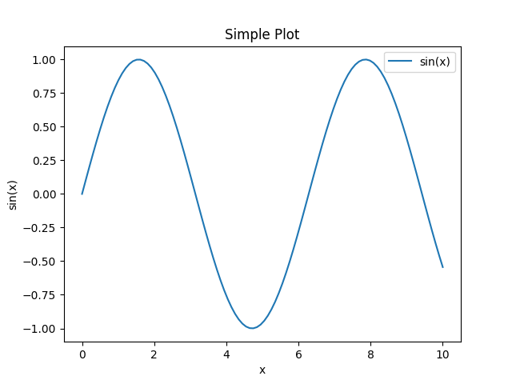
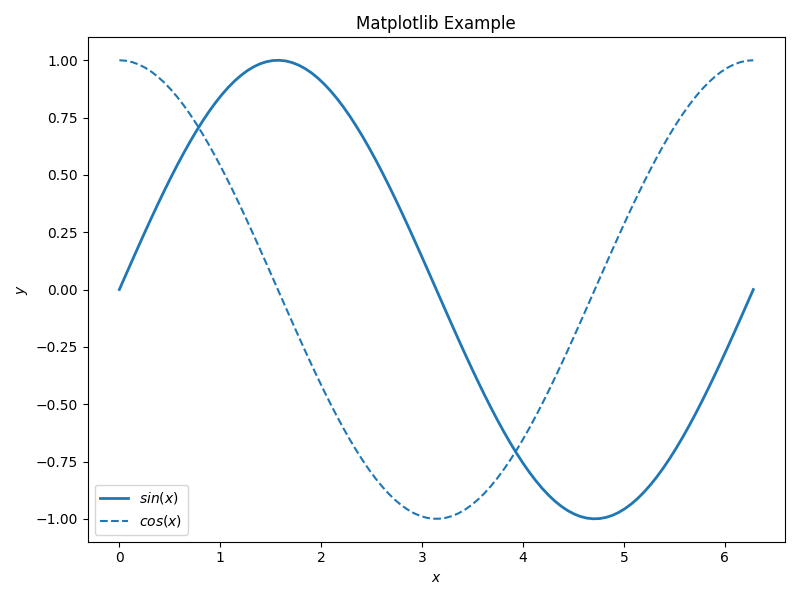
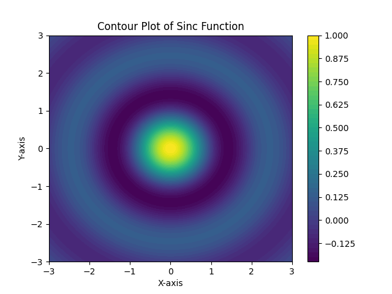
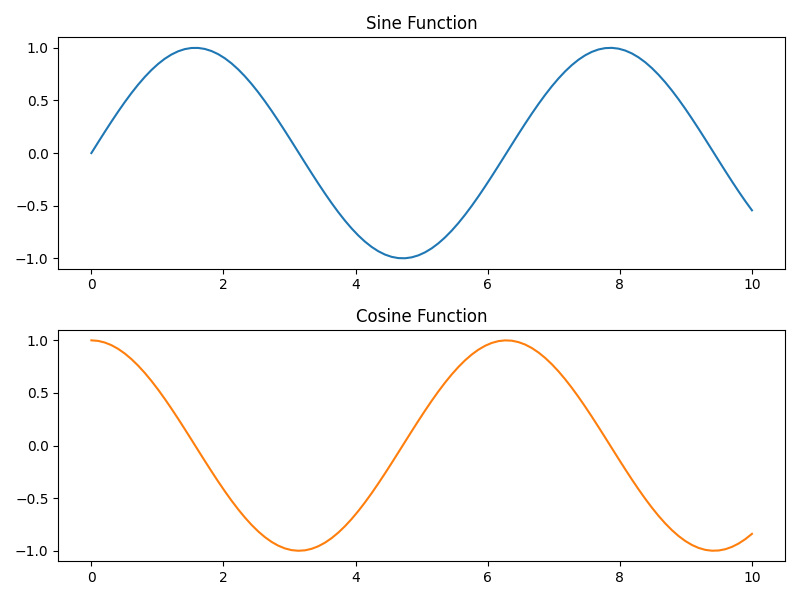
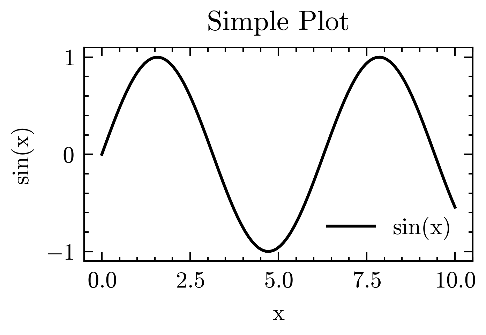

# Python常用包

Python作为时下最流行的高级脚本语言之一，在多个领域有着广泛的应用；不仅是文科学生可以利用它来进行数据分析、自然语言处理等工作，理科生也可以利用它来进行科学计算、机器学习等任务。本章将介绍一些非常常用的包，涵盖了机器学习、数学建模、数值计算、信号处理、算法可视化等大量内容，供大家按需使用。

## 超级Excel：Pandas

Pandas是一个强大的数据分析库，可以帮助我们处理表格数据。

Pandas比较喜欢的文件是CSV（逗号分隔的值）文件，我们可以使用 `read_csv()` 函数来读取CSV文件，并将其转换为DataFrame对象。当然，Pandas也支持其他格式的文件，如Excel、JSON等。

```python
import pandas as pd
df = pd.read_csv("data.csv")  # 读取CSV文件
print(df.head())  # 输出前5行数据
df.to_csv("output.csv", index=False)  # 将DataFrame保存为CSV文件
```

然后，对于这个DataFrame对象，我们可以使用各种方法来处理数据，例如筛选、排序、分组等：
```python
filtered_df = df[df["age"] > 18]  # 筛选年龄大于18的数据
sorted_df = df.sort_values(by="name")  # 按照姓名排序
df[df['朝代'] == '唐']['作者'].value_counts()  # 输出唐代谁被提及最多
pd.merge(df1, df2, on='书名')  # 合并两个表，随意拼接
```

## 自动分词的结巴：jieba

jieba是一个中文分词库，可以帮助我们对中文文本进行分词处理。它可以将一段连续的中文文本切分成一个个单独的词语。

比方说，我想要把一整段《红楼梦》切成“贾宝玉”“林黛玉”“葬花”等词语，并统计频次：
```python
import jieba
with open("book.txt", "r", encoding="utf-8") as file:
    text = file.read()
words = jieba.cut("林黛玉葬花")  # 分词，精确模式
jieba.add_word("林黛玉葬花")  # 添加新词，这个词会被识别为一个整体
```

当然，三件套最好一起用：Pandas读数据 $\rightarrow$ jieba分词 $\rightarrow$ Pandas统计 $\rightarrow$ Matplotlib可视化。这样可以轻松地完成论文中最让文科生们头痛的“数据分析”部分了！不过以上三件套的使用方法只是冰山一角，文科生们可以通过查阅相关文档和教程来深入学习。

## PyTorch：让你的电脑会学习

!!! tip

    建议本节阅读者有一定的线性代数基础。

PyTorch是一个开源的机器学习框架，广泛应用于科研领域，和大名鼎鼎的TensorFlow齐名。由于PyTorch更加灵活、动态，因此在学生和科研人员中更受欢迎；而TensorFlow则因为性能更强大而多用于生产环境。当然，我们在这里不讨论后者（因为我也不大会用）。

即使不用它来做机器学习，PyTorch也可以作为一个非常强大的数值计算库来使用，例如从一大堆点中拟合出一条直线等。或者说，NumPy++。

### 安装

如果希望使用PyTorch，一般建议先有一个Python虚拟环境和一个显卡（最好是英伟达）。如果没有显卡，PyTorch也可以在CPU上运行，但速度会慢很多。

首先在终端中运行这个命令，来判断你的显卡是什么CUDA版本：
```bash
nvidia-smi
```

然后去[PyTorch官网](https://pytorch.org/get-started/locally/)，根据你的CUDA版本和系统环境选择合适的安装命令。（无GPU版本则选CPU。）

安装完毕后，使用以下命令来测试PyTorch是否安装成功：
```python
python -c "import torch, torch.cuda; print(torch.__version__, torch.cuda.is_available())"
```

要是输出True，说明你的GPU准备好了。即使是没有GPU的电脑，PyTorch也可以正常运行，只是速度会慢很多。

### 张量、梯度下降和自动求导

刚刚说到，PyTorch是一个机器学习库，因此我们至少应当了解这些基本概念。

张量（Tensor）是PyTorch的核心数据结构，类似于NumPy中的数组。张量可以是标量（0维）、向量（1维）、矩阵（2维）或更高维度的数组。使用PyTorch的情况下，张量可以在CPU或GPU上运行，显著提高并行速度。

梯度（Gradient）可以通俗理解为“导数”，在机器学习上特指损失函数相对于模型参数的导数，表示损失函数在某一点的变化率。而梯度下降则指，通过计算损失函数相对于模型参数的梯度来更新模型参数，使得损失函数最小化。PyTorch提供了自动求导功能，可以自动计算梯度。自动求导则是指，PyTorch可以自动计算张量的梯度，这样我们就不需要手动计算导数了。

```python
import torch

# 像 NumPy 一样造张量
x = torch.arange(12, dtype=torch.float32).reshape(3, 4)
y = torch.randn_like(x)
z = torch.tensor([1., 2., 3.], dtype=torch.float32, requires_grad=True)  # requires_grad=True表示需要计算梯度

# 一句话把张量搬到GPU上
if torch.cuda.is_available(): # 如果确定GPU可用，这个可以不写
    x = x.cuda()
    y = y.cuda()

# 广播、切片、点乘，全部 NumPy 语法
xy = (x @ y.T).relu()          # relu 也能直接点出来

z2 = x.pow(2).sum()  # 求平方和
z2.backward()  # 自动求导，计算 z2 相对于 x 的梯度
print(x.grad)  # 输出 x 的梯度，输出应当是[2., 4., 6.]

```

上文中的 `x@ y.T` 的意思是矩阵乘法（点乘）， `y.T` 表示 `y` 的转置。PyTorch的张量支持广播（Broadcasting）机制，这意味着当两个张量的形状不同时，PyTorch会自动调整它们的形状以进行运算。relu是一个函数，用于将负值变为0，非负值不变。

### 数据集、数据加载器、预处理

在机器学习中，我们通常需要处理大量的数据。PyTorch提供了数据集（Dataset）和数据加载器（DataLoader）来帮助我们处理数据，而不是使用for循环来缓慢地加载数据。

```python
from torch.utils.data import Dataset, DataLoader
from torchvision import datasets, transforms

transform = transforms.Compose([    # 数据预处理
    transforms.ToTensor(),                    # HWC to CHW, [0,255] → [0,1]
    transforms.Normalize((0.1307,), (0.3081,)) # 数据集统计均值方差
])

train_ds = datasets.MNIST(root='.', train=True,  download=True, transform=transform)
train_dl = DataLoader(train_ds, batch_size=256, shuffle=True, num_workers=4)

for x, y in train_dl:        # x.shape == [256, 1, 28, 28]
    ... # 这里应当存在一些代码用于表示训练逻辑，但是这里懒得写了
```

### `nn.Module` 搭积木式写网络

PyTorch的 `nn.Module` 是一个非常强大的模块化网络构建工具。我们可以通过继承该类来定义自己的网络结构。例如：

```python
import torch.nn as nn

class MLP(nn.Module):
    def __init__(self):
        super().__init__()
        self.net = nn.Sequential(
            nn.Flatten(),
            nn.Linear(28*28, 256),
            nn.ReLU(),
            nn.Linear(256, 10)
        )

    def forward(self, x):
        return self.net(x)

model = MLP().cuda() if torch.cuda.is_available() else MLP()
```

上述代码定义了一个叫做MLP的多层感知机（MLP）模型[^1]。它包含了一个输入层、一个隐藏层和一个输出层。我们使用 `nn.Flatten` 将输入的28x28的图像展平为一维向量，然后通过两个全连接层（ `nn.Linear` ）进行处理，中间使用ReLU激活函数（ `nn.ReLU` ）来增加非线性。

在上述实践中，我们使用 `nn.Sequential` 来将多个层按顺序组合起来，并使用 `nn.Module` 的 `forward` 方法定义了前向传播的逻辑。

### 真正训练

这里的内容实际上应该是科研组干的或者上课讲的。我们在这里举个例子就好了！

```python
opt = torch.optim.Adam(model.parameters(), lr=1e-3)
loss_fn = nn.CrossEntropyLoss()

for epoch in range(3):
    for x, y in train_dl:
        x, y = x.cuda(), y.cuda()
        pred = model(x)
        loss = loss_fn(pred, y)

        opt.zero_grad()
        loss.backward()
        opt.step()

    print(f"epoch {epoch}: loss={loss.item():.4f}")
```

上述代码展示了一个简单的训练循环。我们使用Adam优化器（ `torch.optim.Adam` ）来更新模型参数，使用交叉熵损失函数（ `nn.CrossEntropyLoss` ）来计算损失。每个epoch中，我们遍历数据加载器（ `train_dl` ），获取输入数据和标签，然后进行前向传播、计算损失、反向传播和参数更新。

### 做个实验

多说无益。我们来做个实验，看看PyTorch能不能学会识别手写数字。

MNIST数据集是一个经典的手写数字识别数据集，包含了60000个训练样本和10000个测试样本。我们可以使用PyTorch来加载这个数据集，并训练一个简单的神经网络来进行手写数字识别。当然，想让啥也不会的同学们写个代码帮助计算机识别0到9的数字还是太难了，我们就写个鉴别0和1的二分类器吧。

```python
#!/usr/bin/env python3 # 这是一个shebang行，不写也行
"""
mnist_01_linear.py
用 PyTorch 线性分类器区分 MNIST 的 0 和 1
运行环境: Python最低3.8, PyTorch最低1.13, torchvision
"""

import torch
import torch.nn as nn
from torch.utils.data import DataLoader, Subset
from torchvision import datasets, transforms
from sklearn.metrics import accuracy_score   # 仅用来算准确率，可省

# 1. 超参数，用于提纲挈领地控制训练流程
DEVICE = 'cuda' if torch.cuda.is_available() else 'cpu'
BATCH_SIZE = 256    # 批大小，即每次训练使用多少张图片
EPOCHS = 5          # 训练轮数
LR = 0.1            # 学习率，控制参数更新的步长

# 2. 只保留 0 和 1 的子数据集，别的全都不要
transform = transforms.ToTensor()   # 0-255 -> 0-1, [1,28,28]

def get_binary_mnist(root='.', train=True):
    full = datasets.MNIST(root=root, train=train, download=True, transform=transform)
    idx = (full.targets == 0) | (full.targets == 1)
    return Subset(full, torch.where(idx)[0])

train_ds = get_binary_mnist(train=True)
test_ds  = get_binary_mnist(train=False)

train_dl = DataLoader(train_ds, batch_size=BATCH_SIZE, shuffle=True)
test_dl  = DataLoader(test_ds,  batch_size=BATCH_SIZE)

# 3. 线性二分类器
class LogisticRegression(nn.Module):
    def __init__(self):
        super().__init__()
        self.flatten = nn.Flatten()           # 1*28*28 -> 784
        self.linear  = nn.Linear(28*28, 1)    # 输出 1 个 logit

    def forward(self, x):
        x = self.flatten(x)
        return self.linear(x).squeeze()       # [B,1] -> [B]

model = LogisticRegression().to(DEVICE)

# 4. 损失 & 优化
criterion = nn.BCEWithLogitsLoss()            # 自带 sigmoid
optimizer = torch.optim.SGD(model.parameters(), lr=LR) # 使用最简单的 SGD 优化器

# 5. 训练
for epoch in range(1, EPOCHS+1):
    model.train()
    for x, y in train_dl:
        x, y = x.to(DEVICE), y.float().to(DEVICE)
        optimizer.zero_grad()
        logits = model(x)
        loss = criterion(logits, y)
        loss.backward()
        optimizer.step()
    print(f"Epoch {epoch}: loss={loss.item():.4f}")

# 6. 测试
model.eval()
all_pred, all_true = [], []
with torch.no_grad():
    for x, y in test_dl:
        x = x.to(DEVICE)
        probs = torch.sigmoid(model(x))
        preds = (probs > 0.5).long()
        all_pred.append(preds.cpu())
        all_true.append(y)

# 7. 计算准确率
all_pred = torch.cat(all_pred).numpy()
all_true = torch.cat(all_true).numpy()
print("Test accuracy:", accuracy_score(all_true, all_pred))
```

以上代码使用的是784 to 1的线性分类器（Logistic Regression），通过sigmoid函数将输出转换为概率。我们使用二元交叉熵损失函数（ `nn.BCEWithLogitsLoss` ）来计算损失，并使用随机梯度下降（SGD）优化器来更新模型参数。

同学们很可能看不懂这些代码的细节，顶多能知道每一块代码是做什么的。不过，没关系！只要理解了整体用法，剩下的就是逐步掌握细节；而这则需要同学们在之后的课程和学习中不断探索和实践，不断优化自己的模型、调整模型的参数，从而真正成为机器学习的高手。

### 我看完了，然后呢

看完本节内容估计只需要五分钟。既然同学们这么快就看完了我写的基础内容，那么接下来就可以去官网自己查自己需要的内容了。PyTorch官方的[60分钟速通PyTorch](https://docs.pytorch.org/tutorials/beginner/deep_learning_60min_blitz.html)课程链接我已经放在这里了，感兴趣的同学们可以自己去看看。

## NumPy+SciPy：科学计算的利器

!!! tip

    建议本节阅读者有一定的线性代数和高等数学基础。

NumPy和SciPy是Python中用于科学计算的两个重要库。NumPy提供了高效的多维数组对象和各种数学函数，而SciPy则在此基础上提供了更多的科学计算功能，如优化、积分、插值等。掌握了这两个库，Python就具有了MATLAB的核心战斗力，却又保留了Python的灵活性和易用性。

### NumPy：多维数组和矩阵运算

NumPy的核心数据类型是ndarray（N维数组），它可以存储多维数据。这玩意可不是低级的“列表+语法糖”，而是一个真正的C风格连续内存块和元数据。它要求我们应当具有**向量思维**。

对于该数据类型，我们熟悉这两个术语就可以：形状（shape）和步长（stride）。形状表示数组的维度；步长表示每个维度的跨度。
举例：
```python
import numpy as np
a = np.arange(12).reshape(3, 4)
a.strides        # 每一行 32 字节，因为 int64=8B * 4 列

# 应当是(32, 8)
```

#### 向量化三件套

NumPy的向量化三件套是指：广播（Broadcasting）、通用函数（ufuncs）和切片视图（Slicing Views）。这三者结合起来，可以让我们在处理大规模数据时，避免使用for循环，从而提高计算效率。

一个个讲吧：
- 广播：从尾部维度开始比较，长度相等或其中一维为 1 即可兼容。
```python
pts = np.random.randn(1000, 3)
t   = np.array([1.0, 2.0, 3.0])
shifted = pts + t       # (1000,3) + (3,)，自动广播
```

- 通用函数：NumPy提供了许多通用函数（ufuncs），可以对数组进行元素级的操作，如加减乘除、三角函数等。
```python
pts = np.random.randn(1000, 3)
norms = np.linalg.norm(pts, axis=1)  # 计算每个点的范数
```

- 切片视图：NumPy的切片操作返回的是原数组的视图，而不是复制数据。这意味着对切片的修改会影响原数组。
```python
pts = np.random.randn(1000, 3)
pts[:, 0] = 0.0  # 将所有点的 x 坐标设为 0
print(pts[0])  # 输出第一个点的坐标，x 坐标应为 0.0
```

不如做个性能对比实验：给你一千万（1e7）个点，计算它们的欧氏范数。欧式范数的计算方法是：$\sqrt{x^2 + y^2 + z^2}$。vanilla写法自己去写，我这里只给出NumPy的写法：
```python
import numpy as np
pts = np.random.randn(int(1e7), 3)  # 生成一千万个三维点
norms = np.sqrt(np.einsum('ij,ij->i', pts, pts))  # 使用爱因斯坦求和约定计算欧氏范数
```

运行你的代码和NumPy的代码，比较一下性能。使用爱因斯坦求和约定计算范数应当是最快的算法，预计比基准线快50倍以上。

### SciPy：科学计算的扩展

SciPy是站在NumPy上的科学计算库，提供了更多的科学计算功能，如优化、插值、积分、信号处理等。SciPy的模块化设计使得它可以非常方便地进行各种科学计算，可以将高阶算法压成一行随便用，显著加快了运算效率。

#### 优化

SciPy提供了许多优化算法，可以用于许多问题，例如梯度下降、牛顿法、共轭梯度等。我们可以使用 `scipy.optimize` 模块来进行优化，以下函数是一个最小化函数的例子：
```python
from scipy.optimize import minimize

rosenbrock = lambda x: (1-x[0])**2 + 100*(x[1]-x[0]**2)**2
result = minimize(rosenbrock, x0=[2,2], method='BFGS', jac='2-point')
print(result.x, result.nit)   # [1. 1.] 24
```

以上代码使用BFGS算法最小化Rosenbrock函数，初始点为(2, 2)，最终结果应当接近(1, 1)。不知道Rosenbrock函数是什么的同学可以看[维基百科](https://en.wikipedia.org/wiki/Rosenbrock_function)。

比较常见的minimize优化参数包括jac（梯度计算方式）、tol（容忍度）、options（其他选项）等。SciPy还提供了许多其他的优化函数，如 `scipy.optimize.linprog` 用于线性规划， `scipy.optimize.curve_fit` 用于曲线拟合等。这些函数同学们都可以查阅[SciPy官方文档](https://docs.scipy.org/doc/scipy/reference/optimize.html)。

#### 稀疏矩阵

稀疏矩阵在科学计算中非常常见。SciPy提供了 `scipy.sparse` 模块来处理稀疏矩阵。

```python
from scipy.sparse import diags
n = 1000
k = [-1, 0, 1]
data = [np.full(n-1, -1), np.full(n, 2), np.full(n-1, -1)]
L = diags(data, k, shape=(n, n), format='csr')  # 三对角稀疏

from scipy.sparse.linalg import spsolve
x = spsolve(L, np.ones(n))  # 求解 Lx = 1
```

以上代码创建了一个三对角稀疏矩阵L，主对角线为2，次对角线为-1。SciPy的稀疏矩阵支持许多操作，如矩阵乘法、求逆等。例如上述元素代码中使用 `spsolve` 函数来求解线性方程组$Lx = 1$，其中$1$是一个全1向量。

#### 数值积分

有些时候，对于一些积分我们不是很容易求出解析解，这时候就需要数值积分了。SciPy提供了 `scipy.integrate` 模块来进行数值积分。
```python
from scipy.integrate import quad
val, abserr = quad(lambda x: np.exp(-x**2), 0, np.inf)
print(np.sqrt(np.pi)/2 - val)  # 输出误差， ~1e-13
```

上述代码使用 `quad` 函数计算了从0到无穷大的高斯函数的积分，结果应当接近$\sqrt{\pi}/2$。 `quad` 函数返回两个值：积分值和绝对误差。

### 两个一起，双倍开心

一般情况下，我们需要将NumPy和SciPy协同使用以实现更强大的功能，前者向量化批处理，后者提供算法和工具，十分快乐。以下是一个示例，利用二次Bezier曲线拟合100个带噪声的二维点，并最小化点到曲线距离的平方和：
```python
import numpy as np
from scipy.optimize import minimize

# 数据
pts = np.c_[np.linspace(0,1,100)**2,
            np.linspace(0,1,100)] + np.random.randn(100,2)*0.02

# Bezier 曲线函数
bezier = lambda t, p0, p1, p2: (1-t)**2*p0 + 2*(1-t)*t*p1 + t**2*p2

def error(params):
    p0, p1, p2 = params.reshape(3,2)
    t = np.linspace(0,1,100)
    curve = bezier(t[:,None], p0, p1, p2)
    return np.sum((curve - pts)**2)

result = minimize(error, x0=np.random.rand(6))
print(result.x.reshape(3,2))
```

上述代码首先生成了100个带噪声的二维点，然后定义了一个二次Bezier曲线函数，并使用最小化算法拟合这些点。最终输出的结果是拟合曲线的控制点坐标。

## Matplotlib：数据可视化的神器

在上一章中我们讲过，可以使用Matplotlib来绘制各种统计图表和数据可视化图形。这是Python里面最常用的可视化库之一，也是生态中最早、最稳定、最通用的可视化库。另一方面，它能够和NumPy、Pandas等库无缝集成，提供了强大的绘图功能。

### 基本用法

Matplotlib的基本用法是通过pyplot模块来实现的。我们可以使用以下代码来绘制一个简单的折线图：
```python
import matplotlib.pyplot as plt
import numpy as np

x = np.linspace(0, 10, 100)
y = np.sin(x)

plt.plot(x, y, label='sin(x)')  # 绘制曲线
plt.xlabel('x')  # 添加坐标轴标签
plt.ylabel('sin(x)')  # 添加坐标轴标签
plt.title('Simple Plot')  # 添加标题
plt.legend()  # 添加图例
plt.show()  # 显示图形
```

上述代码使用 `plt.plot` 函数绘制了一个简单的折线图，并添加了坐标轴标签、标题和图例。最后使用 `plt.show()` 函数显示图形。



除了使用简洁的 `pyplot` 以外，还可以使用面向对象风格的API来绘图，便于封装和复用：

```python
import matplotlib.pyplot as plt
import numpy as np

x = np.linspace(0, 2*np.pi, 100)  # Create x values from 0 to 2pi

fig, ax = plt.subplots(figsize=(8, 6))  # 创建一个图形和坐标轴对象
ax.plot(x, np.sin(x), label=r'$sin(x)$', color='tab:blue', lw=2)  # 绘制曲线
ax.plot(x, np.cos(x), label=r'$cos(x)$', ls='--')  # 绘制曲线
ax.set_xlabel(r'$x$')  # 添加坐标轴标签
ax.set_ylabel(r'$y$')  # 添加坐标轴标签
ax.legend()  # 添加图例
ax.set_title('Matplotlib Example')  # 添加标题
fig.tight_layout()  # 自动调整布局
plt.show()  # 显示图形
```

上述代码使用 `plt.subplots` 函数创建了一个图形和坐标轴对象，然后使用坐标轴对象的 `plot` 方法绘制曲线。这样可以更灵活地控制图形的各个部分。



### 和其他包协同工作

Matplotlib可以和NumPy、Pandas等库无缝集成，提供了强大的绘图功能。例如，我们可以使用NumPy生成数据，然后使用Matplotlib绘制图形：
```python
import matplotlib.pyplot as plt
import numpy as np

X, Y = np.meshgrid(np.linspace(-3, 3, 300),
                   np.linspace(-3, 3, 300))
Z = np.sinc(np.sqrt(X**2 + Y**2))

fig, ax = plt.subplots()
c = ax.contourf(X, Y, Z, levels=50, cmap='viridis')
fig.colorbar(c, ax=ax)

plt.title('Contour Plot of Sinc Function')
plt.xlabel('X-axis')
plt.ylabel('Y-axis')
plt.show()
```



或者使用Pandas绘制数据框的图形：
```python
import pandas as pd

df = pd.read_csv('experiment.csv')
ax = df.plot(x='voltage', y='current', kind='scatter', color='k')
ax.set_xlabel('Voltage (V)')
ax.set_ylabel('Current (mA)')
# 这只是一个示例，没有数据是真不行，后面绘图的逻辑自己写就好了
```

### 子图布局

在实际应用中，我们经常需要将多个图形绘制在同一个窗口中，这就需要用到子图的概念。Matplotlib提供了 `subplot` 和 `subplots` 函数来创建子图。

```python
import matplotlib.pyplot as plt
import numpy as np

x = np.linspace(0, 10, 100)
y1 = np.sin(x)
y2 = np.cos(x)

fig, axs = plt.subplots(2, 1, figsize=(8, 6))  # 创建2行1列的子图
axs[0].plot(x, y1, label='sin(x)', color='tab:blue')
axs[0].set_title('Sine Function')
axs[1].plot(x, y2, label='cos(x)', color='tab:orange')
axs[1].set_title('Cosine Function')
plt.tight_layout()
plt.show()
```

上述代码创建了一个包含两个子图的图形窗口，分别绘制了正弦函数和余弦函数。使用 `plt.tight_layout()` 函数可以自动调整子图之间的间距。



### 风格和导出

Matplotlib支持多种风格，可以通过 `plt.style.use` 函数来设置风格。例如，我们可以使用 `science` 和 `ieee` 风格来绘制图形，使得图形符合IEEE论文的格式要求：
```python
plt.style.use(['science', 'ieee'])  # 需安装 SciencePlots
```

当然，如使用该风格，则默认需要 LaTeX 来渲染文本，而这是非常缓慢的。因此可以在该列表中添加 `no-latex` 选项，以禁用 LaTeX 渲染：
```python
plt.style.use(['science', 'ieee', 'no-latex'])  # 需安装 SciencePlots
```



*使用SciencePlots风格绘制的图形*

此外，我们还可以将图形导出为各种格式，如PNG等：
```python
plt.savefig('figure.svg')   # 矢量图
plt.savefig('figure.png', dpi=600, transparent=True) # PNG图
```

### 常见坑与提示

- 中文字体乱码：提前设置rcParams，或者使用 `matplotlib.font_manager` 来设置中文字体。
```python
import matplotlib.pyplot as plt
plt.rcParams['font.sans-serif'] = ['SimHei']  # 设置中文字体
plt.rcParams['axes.unicode_minus'] = False  # 解决负号显示为方块的问题
```

- 在Jupiter中不显示：使用 `%matplotlib inline` 命令来确保图形在Jupyter Notebook中显示。
- 颜色过多：使用 `tab:` 前缀来使用Matplotlib内置的颜色表，避免颜色过多导致的混乱。
- 图例遮挡：使用 `plt.legend(loc='best')` 自动解决图例位置问题。

除此之外，Matplotlib还有许多其他的功能，如动画、3D绘图等，这些内容同学们可以在[Matplotlib官方示例](https://matplotlib.org/stable/gallery/index.html)中找到。

## SymPy：符号计算高级计算器

!!! tip

    建议本节阅读者有一定的高等数学基础。

SymPy是一个用于符号计算的Python库。符号计算是指对数学表达式进行符号操作，而不是数值计算；或者说，**求解析解而不是数值解**。SymPy可以用于求解方程、积分、微分、矩阵运算等多种数学操作。它的语法类似于Mathematica和Maple，但使用Python语言编写，因此更易于学习和使用。

在使用该库之前，我们尽量在文件的靠前位置添加下面这一行，这样可以让SymPy的输出更加美观。
```python
  init_printing(use_unicode=True)
```

### 基本数据类型

SymPy的基本数据类型有三个：符号、表达式、等号。符号是SymPy的核心数据类型，用于表示数学符号，如变量、常数等。表达式是由符号和运算符组成的数学表达式，可以进行各种数学操作。等号用于表示等式关系。
```python
    x, y = symbols('x y', real=True)  # 定义符号变量 x 和 y
    expr = x**2 + y**2  # 定义表达式
    line = Eq(y, 3*x + 2) # 定义等式
    print(expr)  # 输出表达式
```

上述代码定义了两个符号变量x和y，并定义了一个表达式$x^2 + y^2$和一个等式$y = 3x + 2$。SymPy的符号计算可以对这些符号进行各种操作，如求导、积分、化简等。

比方说：
```python
    expr = (x+1)*(x-2)-(x**2-2)
    simplify(expr)  # 化简表达式, 得到-x
    expand((x+1)**5)  # 展开多项式
    factor(x**3+1)  # 因式分解
    limit(expr, x, 0)  # 求expr在 x=0 处的极限
    diff(expr, x)  # 对 expr 求一次导数
    integrate(expr, x)  # 对 expr 求不定积分
    integrate(expr, (x, 0, 1))  # 对 expr 求定积分
    series(expr, x, 0, 5)  # 求泰勒级数展开，最高项次数为不超过4
    series(expr, x, 0, 5).removeO()  # 去掉高阶项
    solve(x**4-1, x)  # 求解等式x**4-1=0的解
    solve(a*x**2+b*x+c, x)  # 求解二次方程ax^2+bx+c=0的解，带着参数也能算
    nonlinsolve([x**2+y**2-1, x-y], (x, y))  # 求解非线性方程组
```

多元函数也可以使用上述方法来求导和积分，这里就不写了。需要注意的是，这里的求导数都是**偏导数**。一个非常有趣的事情是：在该库中，使用 `-oo` 和 `oo` 来表示负无穷和正无穷，而不是使用 `float('inf')` 。（疑似有些过于符号化了）

### 矩阵和线性代数

SymPy还提供了矩阵和线性代数的功能，可以进行矩阵运算、求逆、求特征值等操作。SymPy的矩阵是一个二维数组，可以进行各种矩阵运算，如加法、乘法、转置等。
```python
    A = Matrix([[1, 2], [3, 4]])  # 定义一个矩阵
    b = Matrix([x, y])  # 定义一个列向量

    A.det()  # 求矩阵的行列式
    A.inv()  # 求矩阵的逆
    A.eigenvals()  # 求矩阵的特征值

    linsolve((A, b), [x, y])  # 求解线性方程组 Ax = b

    P, D = A.diagonalize()  # 对矩阵对角化，P为特征向量矩阵，D为对角矩阵
```

### 输出、可视化

在Jupiter里一行搞定输出，贴出来的字符串直接粘到论文里就能编译：
```python
    latex(Integral(exp(-x**2), (x, 0, oo)))
```

如果需要将表达式可视化，可以使用SymPy的 `plot` 函数来绘制函数图像：
```python
    plot(sin(x)/x, (x, -10, 10))
```

### 常见坑

- 符号爆炸：符号计算缓慢是正常现象，表达式也会越来越大。必要的时候，simplify、expand、factor等函数可以帮助我们化简表达式。
- 算错：这是常规现象，符号计算可能出现算错是不可避免的。我们可以快速使用数值验证结果的正确性。
- 并行：Sympy不能并行，但是可以拆任务并行计算（如multiprocessing）。

祝愿玩得开心，下次计算不用抄公式抄到手软！

## 爬虫

爬虫很难说是一个包。它实际上是一种技术，或者说是一种思维方式。爬虫的核心思想是：模拟浏览器行为，自动化地获取网页内容。Python中有许多用于爬虫的库，如Requests、BeautifulSoup、Scrapy等。

一般而言，爬虫的基本流程包括以下几个步骤：
1. 发送HTTP请求：使用Requests库发送HTTP请求，获取网页内容。
2. 解析网页内容：使用BeautifulSoup库解析HTML内容，提取所需的数据。
3. 存储数据：将提取的数据存储到本地文件或数据库中。

以下是一个简单的爬虫示例，使用Requests和BeautifulSoup库来爬取一个网页的标题：
```python
import requests
from bs4 import BeautifulSoup
url = 'https://example.com'
response = requests.get(url)
soup = BeautifulSoup(response.text, 'html.parser')
title = soup.find('title').text
print(title)
```

上述代码发送了一个HTTP GET请求，获取了网页内容，并使用BeautifulSoup解析HTML，提取了网页的标题并打印出来。

当然，上述代码只是一个非常简单的爬虫示例，实际应用中可能需要处理更多的细节，如处理分页、模拟登录、处理JavaScript渲染等。另一方面，很多网站实际上已经做了反爬虫处理，想要成功爬取数据可能需要更多的技巧和方法。出于个人原因，笔者也很少使用爬虫技术，因此我在这里就不做过多介绍了，感兴趣的同学可以自行查找相关资料进行了解。

!!! warning

    爬虫涉及到法律和道德问题，爬取数据时应当遵守网站的robots.txt文件和相关法律法规，避免侵犯他人的权益。

## OpenAI：自己做自己的Agent

Cherry Studio等软件给了我们一个强大的图形界面，让我们可以通过各种方式来使用LLM。但是涉及到一些自动化的任务时，还是需要自己编写代码来实现。OpenAI官方提供了一个Python SDK，可以让我们方便地使用OpenAI的各种模型和功能。

实际上，OpenAI的Python SDK非常简单易用，甚至可以说是简陋到傻瓜级别的。我们如果希望使用该包，只需要记住代码分为两步：定义client，使用client。以下是一个简单的示例，使用OpenAI的GPT-4模型来生成文本：
```python
from openai import OpenAI

API_KEY = 'your_api_key' # 这个是必须的
BASE_URL = 'https://example.com/v1'  # 请改成服务供应商提供的地址

# 定义 client
client = OpenAI(api_key=API_KEY, base_url=BASE_URL)

# 使用 client
with client.chat.completions.create(
    model='gpt-4o', # 取决于实际情况
    messages=[
        {'role': 'system', 'content': 'You are a helpful assistant.'},
        {'role': 'user', 'content': 'Hello, how are you?'}
    ] # Prompts需要自己写
    # 这里也可以添加 temperature, max_tokens 等参数
) as response:
    print(response.choices[0].message.content)
```

在上述代码中，我们首先定义了一个OpenAI客户端，然后使用该客户端发送了一个聊天请求，获取了模型的回复并打印出来。使用 `with` 语句可以确保资源的正确释放，是良好的习惯。

于是上述库的使用就这么简单，疑似确实是傻瓜级别的。更多的功能和用法可以参考相关文档。当然，如果希望进行记忆持久化等功能，那需要其他的库来实现，例如 `langchain` 和 `langgraph` 等。

!!! question "实践选题"

    以下内容是一些简单的实践选题，供同学们参考。可以使用 LaTeX 来形成实验报告！
    1. 用《红楼梦》文本做词-人共现网络：试着读入一段红楼梦文本，统计人物和词语的共现关系，并使用SnowNLP等库为人物的情绪打分，最终观察人物的情绪走势。
    2. 用PyTorch试着复现线性回归的解析解：试着生成一百万个三维点，使用PyTorch实现线性回归，并与解析解进行对比。提示：解析解可以使用Numpy求得，公式是$w^* = (X^TX)^{-1}X^Ty$。
    3. 使用多个库做信号处理，做出一个简单的调音器：可以使用pyaudio库来辅助录音，使用SciPy来做FFT变换，使用Matplotlib来做频谱图，使用SymPy来做滤波器设计。
    4. 使用PyTorch训练一个简单的神经网络来做手写数字特征提取；然后使用UMAP来降维可视化。提示：ResNet。
    5. 混沌摆模拟：使用SciPy的ODE求解器来模拟一个混沌摆的运动轨迹，然后使用Matplotlib来绘制相空间图和时间序列图。你能做出一个动画吗？如果你有GPU，可以使用PyTorch来并行，看看混沌敏感性。

[^1]: MLP是最基础的神经网络结构之一，适用于处理结构化数据，如图像、文本等。
