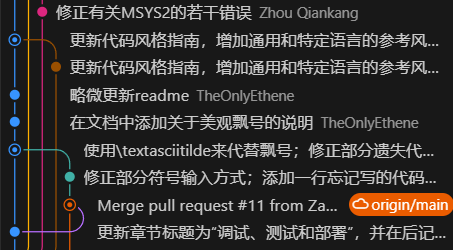
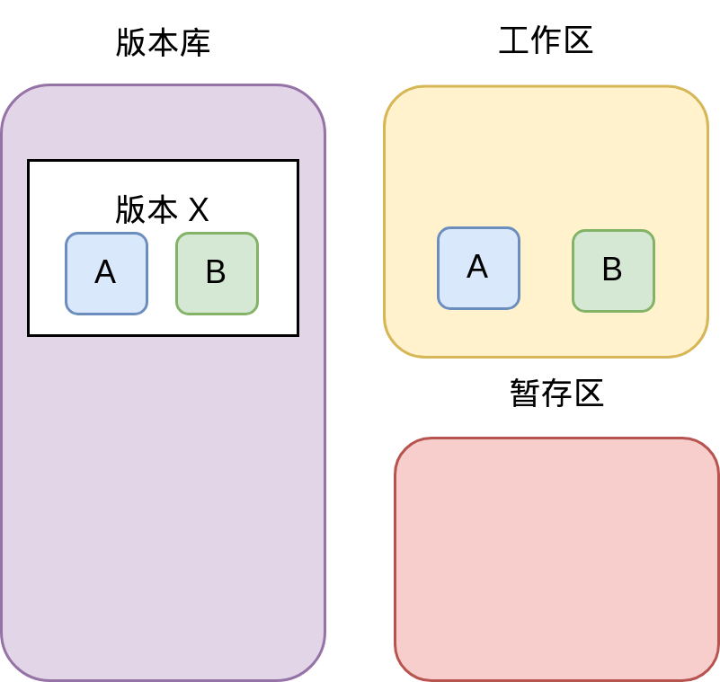
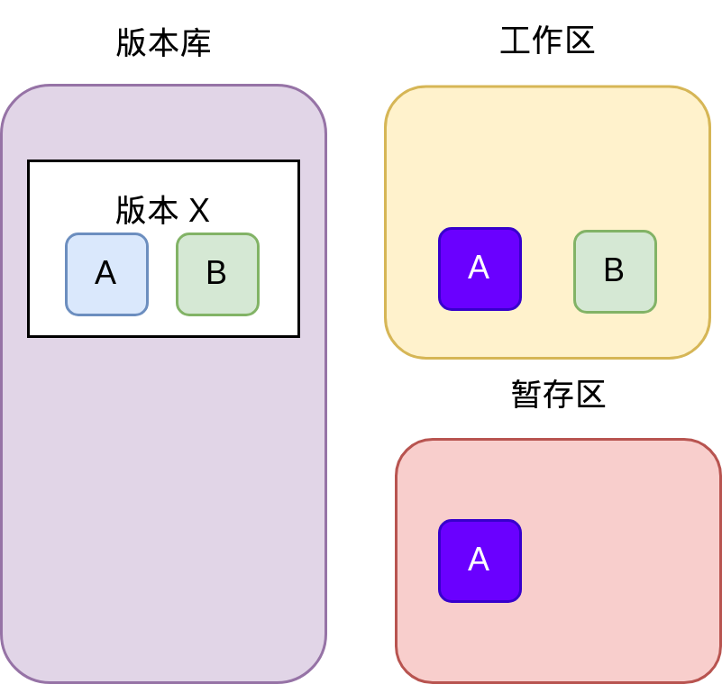
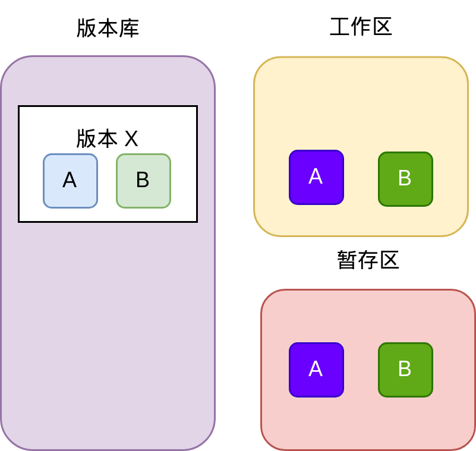
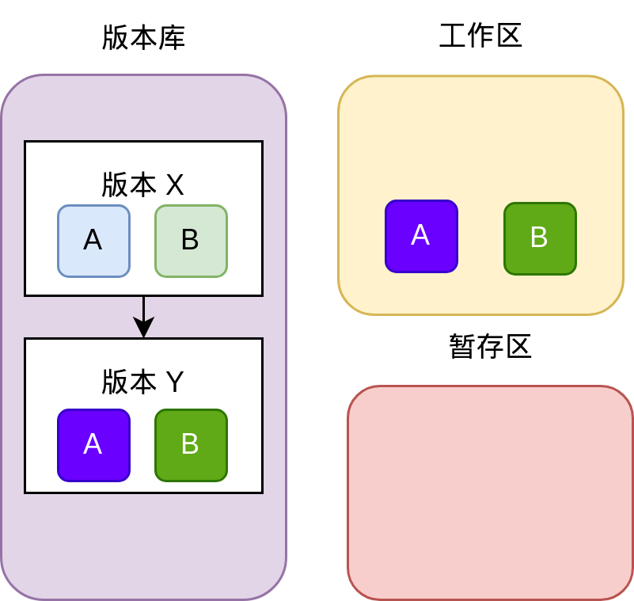
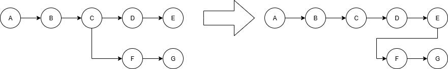
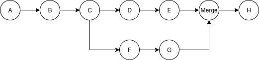
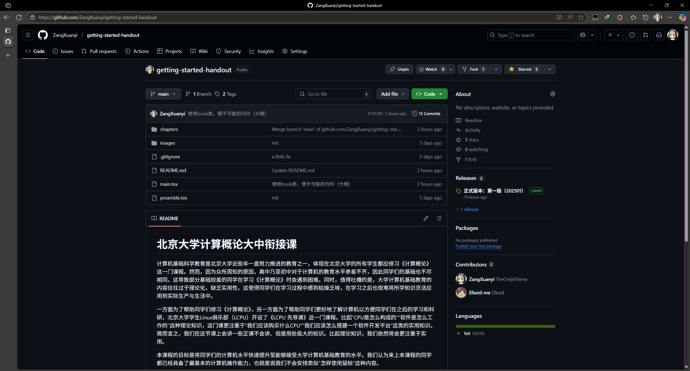
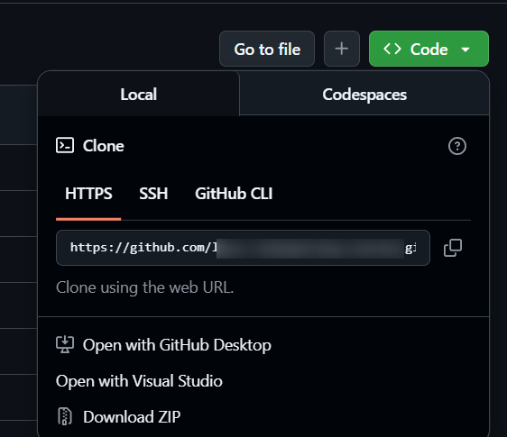

# Git与版本控制

试想以下环境：我们正在写一项作业，开发工作已经基本完成，试运行也能够得到90分。此时我们希望进一步精进代码，使得分数达到95分以上；但是经过一通修改以后，发现程序再也运行不起来了。这时候距离ddl只有1小时，我们决定摆烂，提交能够得到90分的代码。然后我们根据记忆改回原来的代码的时候，发现我们再也想不起来旧代码是怎么写的了！这无疑是令人极为懊恼的。

再试想另一个环境：假设我们正在开发一个大型项目，项目中有很多人参与开发。如果使用传统的方式来分发代码，那么每个人都要手动下载代码，修改代码，然后再上传代码。这时候就会出现很多问题，例如代码冲突、版本不一致等。那这就需要专门的一个人或者几个人来管理代码的版本和分发，但是这样就会显著增加工作量和复杂度。

为了避免以上问题，我们引入了版本控制（VCS）系统。一般来说，VCS系统可以分为两类：集中式版本控制系统（CVCS，也叫中心化的）和分布式版本控制系统（DVCS，也叫去中心化的）。集中式版本控制系统的特点是所有的代码都存储在一个中心服务器上，所有的开发者都需要从中心服务器上下载代码，然后再上传代码；而分布式版本控制系统的特点是每个开发者都有一份完整的代码库，所有的操作都是在本地进行的，然后再将修改推送到中心服务器上。这样就可以避免代码冲突、版本不一致等问题。

2002 年以前，Linux 内核开发完全依赖于 Linus 一个人手工检查并合并全世界发来的补丁，这样工作量非常大。于是，Linus 的一个朋友介绍了 BitMover 公司开发的商业 VCS 软件 BitKeeper 免费授权给 Linux 开发团队使用。此举招致了 FSF 的 RMS 等人的批评，认为在自由软件开发中使用非自由软件是"道德上有污点"的行为。但是作为实用主义者的 Linus 并不在意这些事情，BitKeeper 作为去中心化的 VCS，满足了 Linus 的需求。然而好景不长，有 Linux 内核开发者逆向了 BitKeeper 的协议，致使 BitMover 公司在 2005 年决定收回其授权。Git 就是在这种条件下诞生的，据说第一版 Git 是 Linus 利用 1 周休假时间完成的。随着Linux的广泛应用，Git也逐渐成为了最流行的去中心化版本控制系统，也是目前最流行的版本控制系统。



/// caption
一个典型的Git工作流程
///

## Git的工作原理

Git有三个目录共同完成版本控制：工作区、暂存区、版本库。工作区是项目目录，暂存区是一个隐藏的文件夹 `.git`，版本库是一个隐藏的文件夹 `.git/objects`。工作区是我们平时使用的目录，暂存区是Git用来存储修改的地方，版本库是Git用来存储所有版本信息的地方。版本库有一个指针，指向当前版本的某一节点（一般指向最新的节点）。每个节点都有一个唯一的哈希值[^1]，用来标识该节点。每个节点包含了该版本的所有文件和目录的信息，以及指向上一个版本的指针。Git使用哈希值来标识每个版本，这样可以保证每个版本都是唯一的。

这样讲解很难以理解，我们不妨举例说明：现在，Git中有一个版本为X的节点，包括文件A和文件B两个文件。这些文件存储在版本库中。此时，工作区为空，暂存区为空，指针指向X。我现在希望对它们进行修改，这个修改遵循以下过程：

1. 我拿出了这些文件，并且对文件A进行修改。此时，工作区有AB两个文件，但是暂存区依然是空的。我们的任何修改都不会被暂存区记录，Git也不会知道我对这些文件进行了修改。

2. 我觉得修改差不多了，现在把A放进暂存区。现在Git知道我对A进行了一些修改了。

   {width="48%"}  {width="48%"}

3. 我又对B进行了类似的修改，此时B也进暂存区了。

4. 我觉得修改差不多了。我认为我应该永久保存目前的状态，于是就把暂存区提交到版本库。此时版本库多了一个Y节点，指针也指向Y节点，有修改过的AB两个文件。此时，暂存区又清空了，而工作区和版本库的Y版本一致。

   {width="48%"}  {width="48%"}

## 下载Git

一个最简单的方式是使用Winget包管理器：

```bash
winget install Microsoft.git
```

或者你也可以从官方网站上下载并安装之。同样，安装的时候一定要勾选"添加到PATH"这一选项，否则你在命令行中无法使用Git。

如果你已经按照前文建议安装了MSYS2，那么可以直接在MSYS2中安装Git，无需单独下载。详见前文的编程环境章节。

## Git信息设置

安装并使用Git的第一步是先编辑本地的一些信息。Git的提交需要一个用户名和一个邮箱，来对应每次提交的作者。我们可以使用以下命令来设置这些信息：

```bash
git config --global user.name "Your Name"
git config --global user.email "email@example.com"
```

这样即可设置全局用户名和邮箱。如希望给某个特定仓库设置特定的用户名和邮箱，你需要在该仓库下重新执行上述命令，但是不写 `--global` 命令。

现代Git一般提倡使用main作为根分支的名称。而Git依然使用旧的master分支作为根分支，你可以使用以下命令修改为main：

```bash
git config --global init.defaultBranch main
# 这条命令会修改全局的默认分支名称
```

## Git的最基本使用

### 提交

要具体地在某一目录下进行版本控制，我们需要在命令行中进入到我们希望使用Git的目录下。然后我们可以使用以下命令来初始化一个Git仓库：

```bash
git init
```

如果你在视窗中开启了"显示隐藏文件"这类功能，你就会发现一个隐藏的文件夹 `.git` 出现在了你当前的目录下。这个文件夹就是Git用来存储版本信息的地方。

然后你可以使用以下命令来添加文件到Git仓库中（这个命令的实际意义是把文件添加到暂存区）；

```bash
git add filename
```

如果我们忘记了当前状态下有哪些文件被修改了，我们可以使用以下命令来查看当前状态：

```bash
git status
```

如果你觉得修改差不多了，保存文件以后，你可以使用以下命令来提交文件到Git仓库中（这个命令的实际意义是把暂存区的文件提交到版本库中）：

```bash
git commit -m "commit message"
```

上述内容中，`-m` 后面是提交信息。提交信息是对本次提交的简要描述。我们建议每次提交都写上简要的提交信息，这样可以帮助我们更好地理解代码的修改历史。

### 回退

如果出现了先前我们说的不小心写坏了的情况，这时候就可以进行版本回退了。我们可以使用以下命令来查看当前的版本信息：

```bash
git log # 例如版本库是a-b-c-d-e-f-g
```

找到你希望回退到的版本的哈希值（前几位即可），然后使用以下命令来回退到该版本（这个命令会把指针回退到指定的版本，丢弃之后的所有内容，然后丢弃暂存区和工作区的所有东西）：

```bash
git reset --hard commit_hash
# 请谨慎使用这一命令！该命令不会保留当前的修改！
```

如果你希望回退到某个版本，但是不想丢失当前的修改，你可以使用以下命令来回退到该版本（这个命令会把版本库后面的东西全部丢弃，清空暂存区，但是保留当前工作区）：

```bash
git reset --mixed commit_hash
# 我们更加推荐这个回退方式，--mixed可以省略，或者用--soft替代。
# 用--soft替代时，不会清空暂存区。
```

使用图解来表示一下：


/// caption
Git的回退操作
///

可以看到，回退操作虽然会把指针回退到指定的版本并丢弃之后的版本，但是之后的版本提交依然存在于版本库中，只是被从树上摘下来了。这些提交被称为"孤立提交"。实际上，对于Git分支上的所有删除或回退操作，都是摘下了某些提交，使其成为孤立提交。如果希望恢复或者删除这些孤立提交，可以执行以下命令：

```bash
git fsck --lost-found # 查看孤立提交、孤立分支等
git checkout commit_hash # 进入分离头模式
git branch branch_name # 创建一个分支来恢复孤立提交

git gc --prune=now # 清理孤立提交
```

即使我们不使用 `git gc` 手动清理孤立提交，随着时间的推移（一般是90天提交记录过期），孤立提交也会被Git逐渐自动清理掉。

所谓"分离头模式"，是指当前的HEAD指针不指向任何分支，而是直接指向某个提交。这时候，我们可以查看该提交的内容，但是无法进行提交操作。如果我们想要在这个状态下进行提交操作，我们需要先创建一个新的分支，并切换到该分支上（具体操作见后文）。

### 排除相关文件

有时候我们版本跟踪的时候不需要跟踪一些文件，例如具有敏感信息的文件（如密码），或者构建文件等。此时，我们可以创建一个文件 `.gitignore` 来阻止跟踪。例如，在Linux下，构建文件往往是 `*.o`。那么我们可以在上述文件中加入 `*.o` ，之后git就会忽略这些文件。

`.gitignore` 文件应当放在Git仓库的根目录下，并且必须被跟踪。其中的文件名应一行一个。

如果试图对Git已经跟踪的文件进行排除，Git是不会理会的。此时，我们需要先把这些文件从Git中删除掉（这个命令的实际意义是把文件从暂存区和版本库中删除掉，但是保留工作区中的文件），然后再把这些文件添加到 `.gitignore` 中：

```bash
git rm --cached filename
# 这个命令会把文件从Git中删除掉，但是保留工作区中的文件。
# 之后再把这些文件添加到.gitignore中。
```

### 查看历史记录

在非视窗的情况下，我们可以使用以下命令来查看提交历史记录：

```bash
git log
```

这会显示所有的提交记录，包括提交的哈希值、作者、日期和提交信息。如果我们希望查看更简洁的历史记录，可以使用以下命令：

```bash
git log --oneline
```

### 打包备份

有些时候，我们需要把当前的Git仓库打包成一个压缩文件，以便于备份或者传输。容易想到的一个手段是直接把工作区目录打包成一个压缩文件，但是这样会包含 `.git` 目录；另一方面，有些文件是被 `.gitignore` 忽略掉的，不希望被打包进去。此时，我们可以使用以下命令来打包Git仓库：

```bash
git archive -o ../backup.zip HEAD
```

其中，`-o` 选项指定了输出文件的路径，`HEAD` 表示当前分支的最新提交。这样会把当前分支的所有文件打包成一个zip文件，忽略掉 `.gitignore` 中指定的文件，这也不会把 `.git` 目录打包进去。如果要指明其他特定分支的某个提交，可以把 `HEAD` 替换为对应的分支名称或者提交哈希值。

### 比较差异

我们可以使用以下命令来比较当前工作区和最新提交之间的差异：

```bash
git diff
```

这会显示所有修改过的文件和具体的修改内容。如果我们希望比较某个文件的差异，可以使用以下命令：

```bash
git diff filename
```

## 分支管理

实际上，刚才提到的许多简单功能使用VS Code等软件自带的GUI，大多可以很方便的完成。但下面的这些高级功能，使用GUI不是很方便，建议使用命令行。

有时候我们想同时开发新功能，并且调优以前的代码，这样可能就需要两条线进行开发。这时，分支相关的功能就会很有帮助。Git 的分支功能允许我们在同一个仓库中创建多个独立的开发线，每个分支可以独立地进行提交和修改。

我们可以做如下假设：已经有一个名为main的分支，并已经有了一列提交记录A、B、C。现在，我希望开发一个新的功能，但是不想影响到main分支上的代码。这时，我们可以创建一个新的分支，例如feature，并在该分支上进行开发。

### 创建和切换分支

可以使用以下命令创建一个新的分支并切换到该分支：

```bash
git checkout -b feature
```

以上等价于执行

```bash
git branch feature commit-hash-of-C
git checkout feature
```

如果我现在想要回到main分支，可以使用以下命令：

```bash
git checkout main
```

### 分支变基

如果我们已经在feature分支上进行了多次提交F、G，同时在main分支上也有了新的提交D、E。现在想要将feature这些提交变基到main分支上，可以使用以下命令：

```bash
git rebase main
git checkout main
```

这样会把上述feature上的三个提交从C变基到E，变成F'和G'。我们可以用图解来理解这个过程：



/// caption
分支变基示意图
///

变基操作会改变提交的哈希值。

### 合并分支和冲突解决

如果我们想要将feature分支上的代码合并（不是变基）到main分支上，可以使用以下命令：

```bash
git checkout main
git merge feature
```

这时候我们在main分支上，并试图将E和G合并在一起。这时，会自动创建一个特殊的提交Merge，它有两个父提交。之后的提交就会以Merge为父提交，而不是E或G中的任何一个。



/// caption
分支合并示意图
///

如果这两个提交没有冲突，那么合并会自动完成。但是如果有冲突（例如两个分支涉及到同一行的修改），Git 会提示我们解决冲突。此时，我们不得不手动解决冲突。我们会看到以下内容（或者其英文版本）：

```bash
自动合并 example1.txt
冲突（内容）：合并冲突于 example1.txt
自动合并失败，修正冲突然后提交修正的结果。
```

此时，我们需要打开冲突的文件，手动解决冲突。Git 会在冲突的地方插入标记，例如：

```bash
  <<<<<<< HEAD
  这是 main 分支上的内容。
  =======
  这是 feature 分支上的内容。
  >>>>>>> feature
```

我们需要手动编辑这个文件，删除这些标记，并保留我们想要的内容。

如果使用Code等编辑器，通常会有冲突解决的工具，可以帮助我们更方便地解决冲突。

解决完冲突后，我们需要使用以下命令来标记冲突已解决：

```bash
git add .
git merge --continue
```

### 删除分支

如果我们已经完成了feature分支上的开发，并且已经将其合并到main分支上，可以使用以下命令删除该分支：

```bash
git branch -d feature
```

一般不建议直接删除分支，而是使用 `-d` 选项来删除已经合并的分支。如果分支没有被合并，可以使用 `-D` 选项强制删除。

### 压缩提交

有时候，我们在开发过程中，可能会有很多小的提交，这些提交可能是一些临时的修改或者调试信息。为了保持代码和版本库的整洁，我们可以使用 Git 的压缩提交功能，将多个提交合并为一个提交。这个压缩功能被称作是**Squash**，但是特别注意：没有 `git squash` 命令。

我们一般只在分支合并的时候使用压缩提交。可以使用以下命令中的一个来压缩提交：

```bash
git merge --squash feature
```

## 标签管理

标签（Tag）是 Git 中用于标记特定提交的功能。标签通常用于标记版本发布或重要的里程碑。与分支不同，标签是静态的，不会随着提交而移动。

### 创建标签

可以使用以下命令创建一个标签：

```bash
git tag v1.0
```

这将创建一个名为 v1.0 的标签，指向当前的提交。如果需要为特定的提交创建标签，可以在命令中指定提交的哈希值：

```bash
git tag v1.0 <commit-hash>
```

### 查看标签

可以使用以下命令查看所有标签：

```bash
git tag
```

### 删除标签

如果需要删除一个标签，可以使用以下命令：

```bash
git tag -d v1.0
```

## "摘樱桃"

Cherry-Pick（摘樱桃）操作（也叫挑拣）是指从一些提交中选择一些特定的提交（修改），并将这些提交（修改）应用到当前分支上。这适用于当我们只想要一些特定的提交而不是整个分支的所有提交的时候。

一般，CherryPick操作很难使用命令行来操作，其复杂程度过高。我们可以使用VS Code的自带Git视窗或者GitLens等工具来进行这个操作。

使用视窗进行挑拣非常方便，我们只需要在提交列表中选择需要的提交，然后右键点击"Cherry-Pick"（汉化应该是挑拣）即可。这样会将选中的提交应用到当前分支上。

## 在VS Code中配置Git

在VS Code中配置Git同样非常简单。只需要安装Git，并确保Git的可执行文件在系统的PATH环境变量中。然后在VS Code中打开一个Git仓库，VS Code会自动识别并启用Git功能。

VS Code为Git提供了一个视窗化界面，可以方便地进行版本控制操作，例如提交、推送、拉取等。你可以在左侧的活动栏中找到Git图标，点击它即可打开Git视图。另外，还有GitLens这个扩展也相当不错，该扩展提供了更多的Git功能和视图，例如查看提交历史、比较分支等，只可惜没有中文版。

纵然如此，我个人依然推荐使用命令行进行Git操作，因为命令行提供了更高的灵活性和控制力。

## GitHub

很多项目无法只在一台机器上进行开发，往往都需要在远程部署一个仓库（例如GitHub、GitLab等，或者公司自建库），然后将本地的代码推送到远程仓库中。这样，我们就可以在不同的机器上从远程仓库中拉取代码，从而保证代码的一致性。

在本节，我们将使用 GitHub 作为远程仓库的示例，介绍如何将本地仓库与远程仓库进行关联、推送和拉取代码。

### GitHub界面指南

!!! tip "提示"
    GitHub是美国的网站，它也并没有提供任何其他语言界面，因此只有英文界面。

    如果阅读英文有困难，可以使用浏览器的翻译插件来帮助我们理解界面内容，也可以使用这个插件：[GitHub Chinese](https://github.com/maboloshi/github-chinese)。当然，后者需要油猴（Tampermonkey）等脚本管理器的支持。

我们打开GitHub的一个仓库的时候，映入眼帘的类似这张图片内容。可以看到，这些图片中有很多不同的概念和功能。我们来逐一介绍一下。



/// caption
GitHub 仓库页面
///

在上面的一栏中，我们可以看到以code、issues、pull requests等为标题的选项卡。每个选项卡对应着一个功能模块。

- **Code**：代码模块，显示仓库中的代码文件和目录结构。我们可以在这里浏览代码、下载代码、查看提交历史等。
- **Issues**：问题模块，用于跟踪和管理项目中的问题和任务。我们可以在这里创建新的问题、查看已有的问题、评论和解决问题等。在Gitea上，问题模块被称为"工单"（Tasks），这与它常用于公司自建库的特点有关。
- **Pull Requests**：合并请求模块，用于管理代码的合并和审查。我们可以在这里创建新的合并请求、查看已有的合并请求、评论和审查代码等。Pull Request（简称 PR）是 GitHub 和 GitLab 等平台提供的一种代码审查和合并的机制，具体内容可以参考本节的[Pull Request](#pull-request)小节。
- **Actions**：自动化模块，用于管理项目的自动化工作流。我们可以在这里创建新的工作流、查看已有的工作流、运行和调试工作流等。
- **Projects**：项目模块，用于管理项目的进度和任务。我们可以在这里创建新的项目、查看已有的项目、添加任务和卡片等。
- **Wiki**：维基模块，用于管理项目的文档和知识库。我们可以在这里创建新的页面、编辑已有的页面、添加图片和链接等。GitHub Wiki 是 GitHub 提供的一种文档管理工具，可以帮助我们编写和维护项目的说明文档。
- **Security**：安全模块，用于管理项目的安全性和漏洞。我们可以在这里查看项目的安全报告、修复漏洞、配置安全策略等。
- **Settings**：设置模块，用于管理项目的设置和配置。我们可以在这里修改项目的名称、描述、权限等属性。

除了这些意外，有的仓库还有Discussions和Sponsors等选项卡。Discussions是讨论区功能，可以帮助我们在项目中进行讨论和交流。Sponsors是GitHub提供的一个赞助功能，可以帮助我们为开源项目提供资金支持。

靠下一行就是仓库的名称，右面是仓库的描述和一些操作按钮。Star 用来标记喜欢的仓库，Fork 用来复制仓库到自己的账户下，Watch 用来关注仓库的更新。

再靠下一行，我们可以看到仓库的分支（Branch）和提交（Commit）信息。分支是代码的不同版本，提交是代码的历史记录。我们可以在这里切换分支、查看提交历史、比较不同分支的差异等。同一行的那个绿色的Code按钮是用来下载代码的，可以选择下载为 ZIP 文件或者使用 Git 克隆仓库。我们非常推荐使用 Git 克隆仓库，因为这样可以更方便地管理代码和提交。

页面的左下方部分，在文件目录之下，是仓库的readme文件内容。README 文件是仓库的说明文档，通常包含项目的介绍、安装和使用说明、贡献指南等信息。我们可以在这里查看项目的详细信息。

页面右侧的一列是仓库的统计信息，包括提交历史、分支、标签、贡献者等。我们可以在这里查看项目的活跃度、贡献者的统计信息、代码的质量和覆盖率等。同时，我们也可以在这里找到仓库的发行版等信息。

### 创建仓库

首先，我们需要在 GitHub 上创建一个新的仓库。创建完成后，GitHub 会提供一个远程仓库的 URL，例如：

```text
  https://github.com/YourName/example.git
```

我们可以在GitHub上的仓库页面中找到这个 URL，如图所示。



/// caption
GitHub 上的仓库页面
///

接下来，我们需要将本地仓库与远程仓库关联。可以使用以下命令：

```bash
git remote add origin <your-repo-url>
```

这将把远程仓库的 URL 添加为名为 origin 的远程仓库。origin 是习惯上的远程仓库名称。

现在我们要将这个本地仓库的代码推送到远程仓库中。可以使用以下命令：

```bash
git push -u origin main
```

这里的 `-u` 选项表示将本地的 main 分支与远程的 main 分支关联起来，以后可以直接使用 `git push` 和 `git pull` 命令进行推送和拉取。

如果本地分支名称和远程有区别，（例如本地仓库主要分支是master，而远程仓库的主要分支是main），我们可以使用以下命令来推送代码：

```bash
git push -u origin master:main
```

这将把本地的 master 分支推送到远程的 main 分支。

### 使用仓库

如果你是仓库的使用者，想要从远程仓库中拉取代码（但是本地没有这个仓库），可以使用以下命令：

```bash
git clone <your-repo-url>
```

这样会在本地创建一个**新的**目录，并将远程仓库的代码克隆到该目录中。在克隆代码的时候，Git 会自动创建与远程同名的分支，并把它们与远程的 main 分支关联起来。

如果你已经有了本地仓库，并且想要将远程仓库的代码拉取到本地，经典的操作是以下命令：

```bash
git pull origin main
```

直接使用 `git pull` 命令也是可以的，因为我们之前已经使用 `-u` 选项将本地分支与远程分支关联起来了。然而，需要注意的是现代的拉取操作往往不推荐使用 `git pull` 命令，因为它会自动合并远程分支的代码到本地分支，这可能会导致冲突。更推荐的做法是先使用 `git fetch` 命令拉取远程仓库的代码，然后再手动合并：

```bash
git fetch origin
git merge origin/main
```

这样可以更好地控制合并过程，避免自动合并带来的问题。

!!! tip "提示"
    `origin/main` 可以初步理解为远程仓库 origin 上的 main 分支。但是，它和真正的"分支"并不完全一样。它是一个特殊的引用，指向远程仓库 main 分支的最新提交。当我们使用 `git fetch` 命令拉取远程仓库的代码时，Git 会更新这个引用，使其指向远程仓库 main 分支的最新提交。

    这个引用是在本地且只读的，永远忠实地反映远程仓库的上一次状态，故而checkout到这个分支上会进入分离头模式。

    如果别人在你之后推送了代码，而你没fetch，你的 origin/main 就是过时的，它并不能代表远程仓库此时此刻的真实状态。此时，执行 `git status` 会提示你本地分支落后于远程分支，建议你先拉取远程仓库的代码。

    如果没有fetch就直接在本地做出了一些修改，并且执行 `git push` ，则会失败（因为你并没有基于最新的origin/main进行修改）。此时必须先把远程仓库的代码拉取到本地，解决可能的冲突，然后再推送本地的修改。

如果你在本地做出了一些修改，想要将这些修改推送到远程仓库，可以使用以下命令：

```bash
git push origin main
```

直接使用 `git push` 命令也可以。

如果存在某些提交在远程仓库中，而本地仓库没有这些提交，Git 会提示你先拉取远程仓库的代码，然后再推送本地的修改。这是因为 Git 不允许直接推送到远程仓库，除非本地仓库是最新的。如果你确定你不需要远程仓库的提交，可以使用以下命令强制推送本地的修改：

```bash
git push -f origin main
```

!!! warning "警告"
    强制推送会覆盖远程仓库的代码，可能会导致其他工作丢失，在实际工作中可能触发真人线下快打或提桶跑路CG。所以，务必谨慎使用强制推送，确保你知道你在做什么，并且已经备份了重要的代码。

### 更改关联

有些时候，我们从远程仓库克隆了一个仓库，但是后来希望将其关联到另一个远程仓库。例如从别人的仓库克隆了代码，但是希望将其推送到自己的仓库中。此时，我们可以使用以下命令来更改远程仓库的 URL：

```bash
git remote set-url origin <new-repo-url>
```

这样会将远程仓库的 URL 更改为新的 URL。

## 多人协作

成熟的项目往往是由多人协作完成的，因此需要一些规范来管理代码的提交和合并等。GitHub、GitLab等提供了多种方式来支持多人协作，包括分支管理、代码审查、合并请求等。

### Fork

Fork 是 GitHub 和 GitLab 等平台提供的一种代码复制和协作的机制。它允许用户将其他人的仓库复制到自己的账户下，从而可以在自己的仓库中进行修改和提交。这样可以使得修改更加方便（主要是防止权限不够），并且可以避免直接修改原仓库的代码。当然，权限足够的情况下，我们往往会直接在原仓库中创建新分支进行修改。

### Pull Request

Pull Request（简称 PR）是 GitHub 和 GitLab 等平台提供的一种代码审查和合并的机制。它允许开发者在完成某个功能或修复某个问题后，将自己的代码提交到主分支（通常是 main 或 master）之前，先进行代码审查和讨论。

PR 的工作流程通常如下：

1. 开发者fork（分叉）一个仓库，或者在原仓库中创建一个新的分支。
2. 开发者在自己的分支上进行开发，完成某个功能或修复某个问题。
3. 创建一个PR，请求将自己的分支合并到主分支。PR 中可以包含对代码的描述、相关问题的链接等信息。
4. 其他开发者可以对 PR 进行代码审查，提出修改意见或建议。
5. 开发者根据审查意见修改代码，并更新 PR。
6. 当 PR 获得足够的审查和批准后，可以将其合并到主分支。通常会有一个维护者或项目负责人来执行这个操作。
7. 合并后，PR 会被关闭，相关的分支可以被删除；也可以保留，以便后续的开发和维护。

而对于自己（仓库的所有者）而言，也应遵循上述流程：

1. 在自己的仓库中创建一个新的分支。
2. 在新的分支上进行开发，完成某个功能或修复某个问题。
3. 把该分支推到远程仓库中。
4. 创建一个PR，请求将自己的分支合并到主分支。
5. 自己审自己（或者其他开发者一起审，提出建议）。
6. 合并，删除远端临时分支。
7. 本地回到主分支，拉取远程仓库的代码。
8. 删除本地临时分支。

上述自己审自己的流程可以用以下命令来实现：

```bash
git checkout -b temp-branch
# coding...
git add .
git commit -m "commit message"
git push -u origin temp-branch
# 在GitHub上创建PR，审查，合并，删除远端临时分支
git checkout main
git pull origin main
git branch -d temp-branch
```

只要涉及到多人协作，有一个分支就应当永远禁止直接提交代码，所有的修改都必须通过PR的方式来进行，这样可以保证代码的质量和规范，也可以保证主要分支的整洁和稳定。

如果只有一个人，那么可以轻松一些，直接在主分支上进行开发和提交，不需要创建新的分支和PR。但是，如果项目规模较大或者需要长期维护，建议还是采用分支管理和本地PR（即本地squash merge后删除临时分支）等方式来规范开发流程，保持代码的整洁和稳定。

### Lint

在多人协作中，代码风格和规范的一致性非常重要。Lint 工具可以帮助我们检查代码中的潜在问题和不符合规范的地方。常见的 Lint 工具有 ESLint（用于 JavaScript）、Pylint（用于 Python）等。

如果我们在仓库中包含了 Lint 工具的配置文件（例如 `.eslintrc.json` 或 `.pylintrc`），那么在提交代码时，Git 会自动运行 Lint 工具，对代码进行检查。如果代码不符合规范，Lint 工具会给出相应的错误或警告信息。

Lint 工具通常会在 PR 中自动运行，并将检查结果反馈给开发者。开发者可以根据检查结果修改代码，确保代码符合项目的规范。

### 成熟项目的分支管理策略

在成熟的项目中，一般会采用一些分支管理策略来规范分支的使用和合并等。一般说来，同一个仓库中会有以下几种分支：（以下是Git Flow的工作管理策略）

- main/master：主分支，通常是代码的稳定版本。一般禁止直接提交代码，只能通过合并其他分支来进行更改。
- develop/dev：开发分支，一般是集成了所有的新功能的基准分支，是开发的主要分支。该分支从main分出，最终也要进入main分支。对于一些较为轻量级的项目，有时候会直接使用feature分支来代替develop分支。
- feature/*feature-name*：功能分支，每个新功能或改进都在独立的分支上进行开发。不同的开发者可以在不同的功能分支上工作，完成后再合并到develop分支。在功能完成开发后，通常会删除该分支。
- hotfix/*hotfix-name*：热修复分支，一般是绕过开发流程，直接从main分支分出，修复完成后再合并回main分支和develop分支。热修复分支通常用于修复生产环境中的紧急问题，在问题彻底解决之后，该分支往往会被删除。
- release/*release-name*：发布分支，一般用于准备发布新版本的代码。该分支从develop分出，经过测试和修复后再合并回main分支和develop分支。发布分支通常用于准备发布新版本的代码。在发布完成后，通常会删除该分支。不过现在往往会直接使用打标签的方式来替代发布分支。

开发的一般流程是：在main分支上发布了第一个稳定的版本后，会分出一个dev分支。之后，通常会禁止大多数人对main进行直接提交或者合并，所有新功能都在dev分支上开发，具体的形式是从dev分支上分出多个feature分支来进行多线、多功能的同时开发，且对于大型项目，dev分支往往也只允许合并，禁止小的提交。

有时候合并进dev分支的代码可能存在一些问题，而测试和检查又疏忽，导致合并进main分支之后出现了错误。此时，我们需要直接从main分支分出一个hotfix分支来修复问题，可能会采用一些临时的策略来修复问题。修复完成后，hotfix分支会被合并回main分支。在这之后，main分支会被合并进dev分支以同步代码，然后对hotfix分支上出现的问题加以更稳定的修复。在修复完成后，再将dev分支合并进main分支，此时可以删除hotfix分支。

除了Git Flow，还有其他一些分支管理策略，例如GitHub Flow、GitLab Flow等。GitHub Flow 是 GitHub 提出的分支管理策略，主要用于快速迭代和持续集成，其开发非常轻量级，一般只有 main/master 和 feature 分支。GitLab Flow 则是 GitLab 提出的分支管理策略，多出了产品分支和预发布分支等，分别用于生产环境和预发布环境。

### github-cli

`github-cli` 是 GitHub 提供的一个命令行工具，可以帮助我们在命令行中进行 GitHub 相关的操作，例如创建 PR、查看 Issues 等。使用 github-cli 可以让我们在命令行中更方便地管理 GitHub 仓库和项目。不同的Linux发行版大多提供了该工具的包，也可以使用winget和Homebrew等包管理器来安装。

在安装后，第一步是进行身份验证，可以使用以下命令：

```bash
gh auth login
```

随后便是一些交互式的步骤，指导我们完成身份验证的流程。在身份验证之前，建议先搞一个SSH密钥，并把公钥添加到GitHub账户中，这样在使用github-cli进行操作时，就不需要每次都输入用户名和密码了。

在此之后，我们便可以通过 `github-cli` 来进行一些 GitHub 相关的操作了，例如创建 PR：

```bash
gh pr create --title "feat: something" --body "" --base main
```

该命令会在当前分支上创建一个 PR，标题为 "feat: something"，描述为空，目标分支为 main。实际上描述为空是常规做法。

随后，如果自己已经测过了，觉得这个 PR 没有问题了，可以直接合并：

```bash
gh pr merge --squash --delete-branch
```

当然这需要有权限。该命令会将 PR 合并到目标分支，并且使用 squash 的方式合并（即把多个提交压缩成一个提交），最后删除临时分支。不过在仓库的设置界面如果设置了"自动删除分支"，那么在合并 PR 后，GitHub 会自动删除临时分支。

于是，上述"自己审自己"的流程就可以通过 github-cli 来实现了：

```bash
git checkout -b temp-branch
# coding...
git commit -am "commit message"
git push -u origin temp-branch
gh pr create --title "feat: something" --body "" --base main
gh pr merge --squash --delete-branch
git checkout main
git pull origin main
git branch -d temp-branch
```

这样全流程都在本地实现，不需要打开浏览器来操作了。

更进一步的，我们还可以使用别名一步到位：

```bash
git config --global alias.pr '!gh pr create --title "$1" --body "" --base main'
git config --global alias.merge '!gh pr merge --squash --delete-branch'
git config --global alias.sync '!git checkout "$1" && git pull origin "$1"'
```

上述 `!` 表示这是一个 shell 命令，而不是 Git 的内置命令；`$1` 表示第一个参数，即 PR 的标题。这样，我们就可以使用以下命令来创建 PR 和合并 PR 了：

```bash
# 前面照搬照抄
git pr "feat: something"
git merge
git sync main
# 删除临时分支
```

于是这样便能更加方便的规范化自己的开发流程了。

该工具还提供了很多其他的功能，例如查看 PR 列表、查看 Issues 列表、查看仓库信息等。我们可以使用 `gh help` 命令来查看所有可用的命令和选项，或者直接访问 GitHub CLI 的官方文档来了解更多信息。

## 实际工作流操作指南

我们刚才讲了很多独立的命令和概念。在实际工作中，背诵这些命令和概念是没有意义的，我们必须把理论投入实践中才能创造价值。

我们可能会遇到下述一些常见的情况，这些情况有些可能是常规的，有些可能是预期之外的。读者可以先只看小结标题，想一下自己会怎么做；然后再看解释，对比自己的做法和建议的做法，比较其优劣。同时，最好也先将命令遮住，想一想怎样实现这个建议的做法，并加以实操。

**线性的提交** 这是最常见的情况。我们在本地完成一些开发，提交到本地仓库，然后推送到远程仓库中。这个过程非常简单，使用以下命令：

```bash
git add .
git commit -m "commit message"
git push origin main
```

**提出PR** 现在我们是协助别人开发。我们Fork了一个仓库，在本地做出了一些修改，现在希望把这些修改合并到原仓库中。此时，我们有两个方法。

=== "GitHub 网页"

    先把修改推送到自己的远程仓库中，然后在 GitHub 上创建一个 PR，选择目标分支和源分支，填写 PR 的标题和描述，最后提交 PR。

=== "`gh` CLI"

    先把修改推送到自己的远程仓库中，然后使用以下命令来创建 PR：

    ```bash
    gh pr create --title "feat: something" --body "" --base main
    ```

    这样会在当前分支上创建一个 PR，标题为 "feat: something"，描述为空，目标分支为 main。如果希望合并到别人的仓库中，可以使用以下命令：

    ```bash
    gh pr create --title "feat: something" --body "" --base main --repo owner/repo
    ```

**合并PR** 当我们是PR的维护者时，我们需要审查PR，并决定是否合并。如果PR没有问题，我们可以直接在GitHub上点击"Merge"按钮来合并PR。我们非常建议使用变基策略或压缩提交的方式来合并PR，这样可以保持提交历史的整洁。如果我们使用github-cli来合并PR，可以使用以下命令：

=== "GitHub 网页"

    审查 PR 后，直接在 GitHub 上点击 "Merge" 按钮即可合并。建议使用变基或压缩提交的方式，保持提交历史整洁。

=== "`gh` CLI"

    使用以下命令以 squash 方式合并 PR：

    ```bash
    gh pr merge --squash --delete-branch
    ```

    这样会将 PR 合并到目标分支，并且使用 squash 的方式合并（即把多个提交压缩成一个提交），最后删除临时分支。有时候可能无需删除该临时分支（例如这个分支是别人的）。

    如果想要采用变基的方式来合并 PR，则将上述命令中的 `--squash` 替换为 `--rebase`。变基会比合并更好地保持历史的线性，但不直观。

在实际的仓库中，务必保证主要分支提交历史的线性。具体采用变基还是压缩，还是不压缩，取决于维护者的偏好和团队的习惯。无论如何，保持提交历史的整洁和可读性是非常重要的。

**维护仓库** 当我们本人是仓库的维护者，且该仓库有很多人使用时，我们依然建议使用PR的方式开发，以与其余人保持一致。

我们建议对主要分支采取保护措施，例如禁止提交代码、PR需要审查才能合并、禁止强制推送等。这样可以保证主要分支的稳定性和整洁性。但作为仓库的维护者，我们有必要持有强制推送的权限，以便在必要的时候进行紧急修复等操作。在自己是开发的绝对主力，且对自己的代码极度信任时，可以允许自己的代码无需审查也能合并。

为了简化操作（所有操作都在本地完成），我们可以使用github-cli来创建PR和合并PR。这样可以避免频繁地打开浏览器来操作，提高效率。

```bash
git checkout -b temp-branch
# coding...
git commit -am "commit message"
git push -u origin temp-branch
gh pr create --title "feat: something" --body "" --base main
gh pr merge --squash --delete-branch
git checkout main
git pull origin main
git branch -d temp-branch
```

**修错**

当我们发现先前提交的代码出现未检查出的小错误时，只要这个错误不大（例如只改一个小笔误），我们就可以直接在本地修改这个错误，然后使用以下命令来修改提交：

```bash
git add .
git commit --amend
```

这会将当前的修改添加到上一次提交中，并且允许我们修改提交信息。如果提交信息没有问题，我们可以添加一个 `--no-edit` 。

如果这个错误已经被推送到远程仓库中，并且我们需要修改这个错误，那么我们在持有强制推送权限的情况下，可以使用以下命令来推送提交：

```bash
git push --force-with-lease origin main
```

这里的 `--force-with-lease` 是一个安全的强制推送选项，它会在推送前检查远程仓库是否有新的提交，如果有，则拒绝推送，以避免覆盖他人的工作。不建议单用 `--force`，因为它会直接覆盖远程仓库的代码，可能会导致其他工作丢失。

如果不持有强制推送权限，我们则只能创建一个新的提交来修复这个错误了。虽然这样会增加一个无用提交，但这是最安全的方式，不会影响其他人的工作。

如果发现这个错误已经长久存在了，并且已经被很多人使用了，那么我们就不建议利用其他手段修改这个错误了（这个错误确实是可以通过修改很久远的提交修改的）。因为修改这个错误可能会导致其他人的工作受到影响，甚至引入新的错误。我们建议新开一个提交来修复这个错误。

**处理合并冲突（本地）** 当我们试图提交PR的时候，可能会遇到合并冲突的情况。这时，除了使用GitHub等给的编辑器之外，我们还可以在本地来解决合并冲突，随后重新提交PR。具体的大致流程是，我们要先把待合并入的分支拉到本地，然后在本地利用更趁手的编辑器来解决冲突，最后再把修改后的代码推送到远程仓库中。以下是具体的命令：

```bash
git checkout main
git pull origin main
git checkout feature
git merge main   # 或使用 rebase: git rebase main
# conflict happens
# coding...
# after resolving conflict
git add .
git merge --continue   # 如果用 rebase: git rebase --continue
git push origin feature
```

如果团队偏好线性历史，建议使用rebase。

**紧急修改bug** 当我们发现生产环境中的代码出现了紧急问题时，我们需要立即修复这个问题。如果在使用Git Flow的公司中，我们不能容忍常规流程的效率，此时可以特事特办，先签出一个 `hotfix` 分支修复这个问题，然后将其直接合并进 `main` 分支，最后再将 `main` 分支合并进 `develop` 分支以同步代码。此时的修改可以包括临时的、不稳定的处理方式，等到问题彻底解决之后，再在 `develop` 分支上进行更稳定的修复，并将其合并进 `main` 分支。

但特事特办不代表不能代码审查。甚至说，代码审查永远是必要的。

在这里仅列出临时修复的流程。稳定修复依然要走Git Flow的流程。

```bash
git checkout -b hotfix
# debugging...
git commit -am "fix: something"
git push -u origin hotfix
# PR, review, merged
git pull origin main
git checkout develop
git merge main
git push origin develop
```

**分支交错** 有时候粗心把一些提交交到了错误的分支上。此时，我们并不需要摘樱桃。我们可以直接在本地使用 `git rebase` 来修改提交的基底，从而把这些提交移到正确的分支上。以下是具体的命令：

```bash
git checkout feature
git rebase --onto main feature~3 feature # 这里假设我们要把 feature 分支上最近的 3 个提交移到 main 分支上
```

如果我们这个"正确的分支"本来就不存在，需要手动创建，则我们可以这样：

```bash
git branch correct-branch main
git reset --hard HEAD~3 # 这里假设我们要把最近的 3 个提交移到 correct-branch 分支上
```

这里是利用了创建分支时分支会指向当前提交的特性来实现的。如果把 `HEAD~3` 改成 `origin/main`，则可以把这个分支重置到远程仓库的 main 分支上，尤其多见于忘记了分支保护规则，将一些提交直接提交到该分支上时的补救措施。

**暂存** 有时候某个功能写到一半，需要紧急去做一些其他的工作。但我们不希望提交这个写到一半的功能。此时，我们可以这么做：

```bash
git stash
# do something else...
git stash pop
```

`git stash` 会把当前的修改保存到一个临时的栈里面，并且恢复到上一次提交的状态。这样我们就可以去做其他的工作了。当我们完成其他的工作之后，可以使用 `git stash pop` 来把之前保存的修改恢复回来。

**撤销一个已经被Merge的PR** 当我们发现一个已经被合并的PR出现了问题时，我们需要撤销这个PR。此时，我们可以使用以下命令来撤销这个PR：

```bash
git checkout main
git pull origin main
git revert -m 1 hash   # -m 1 表示保留被合并分支的改动，撤消合并
git push origin main
```

这里的 `hash` 是指那个合并提交的哈希值。该命令是较为友好的撤销方式，它会创建一个新的提交来撤销之前的合并提交，而不会直接修改提交历史。这样可以保证代码的安全性和稳定性。不建议直接 `reset` 然后强制推送，除非团队很小，全员知情。

**意外提交敏感信息** 假设我们在本地有一个 `.env` 文件存储了密钥或密码等敏感信息，却忘记将这个文件添加到 `.gitignore` 文件中，结果不小心把该文件提交到仓库中去了。此时，我们需要立即撤销（或修改）该提交，并将此文件从git缓存中清除，并阻止git跟踪该文件。

```bash
git rm --cached .env
echo ".env" >> .gitignore # 一般情况下文本文件末尾都会有空行。这样会把该文本写到最后一行，并依然保留末尾的空行。如果没有空行，则会把该文本写到最后一行的末尾，导致该行无法被正确解析。此时建议"\n.env\n"，或用vim手动编辑.gitignore文件来添加该文本。
git commit --amend --no-edit
```

如果更早的提交中也有，此时必须用交互式 `rebase` 来修理提交历史，或使用其他手段，如 `filter-branch` 或 `BFG Repo-Cleaner` 来彻底删除该文件的历史记录。无论如何，即使这样做，也可能会清理不干净的情况，建议修改密码或轮转密钥，来确保安全。

[^1]: 哈希（Hash，也叫散列）指的是固定长度、像指纹一样的唯一小串字符，可用于快速校验、查找或加密等功能。


<!-- handout-sync-source
source_type: latex
source_url: https://github.com/ZangXuanyi/getting-started-handout
source_branch: main
source_commit: e1f6c5d23fb730d144f0261027c515ca0971ffc6
source_commit_short: e1f6c5d
-->
