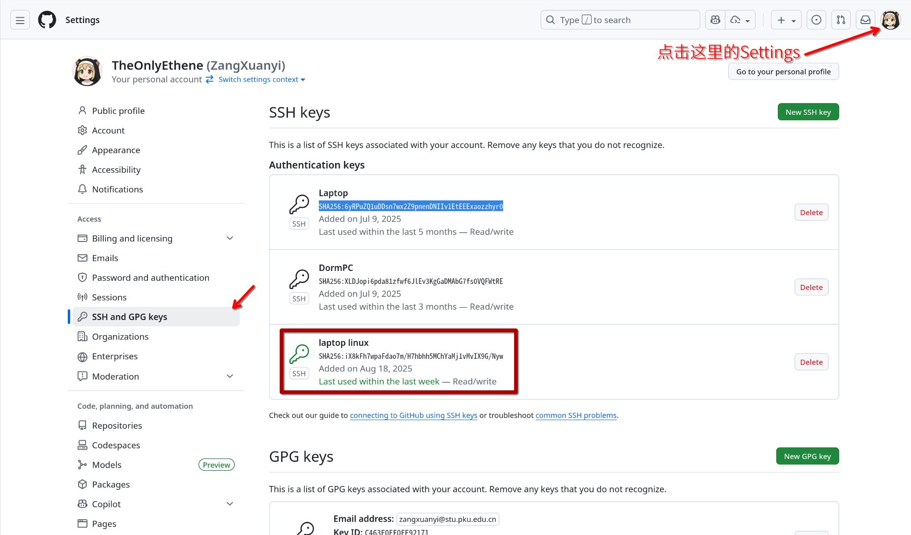
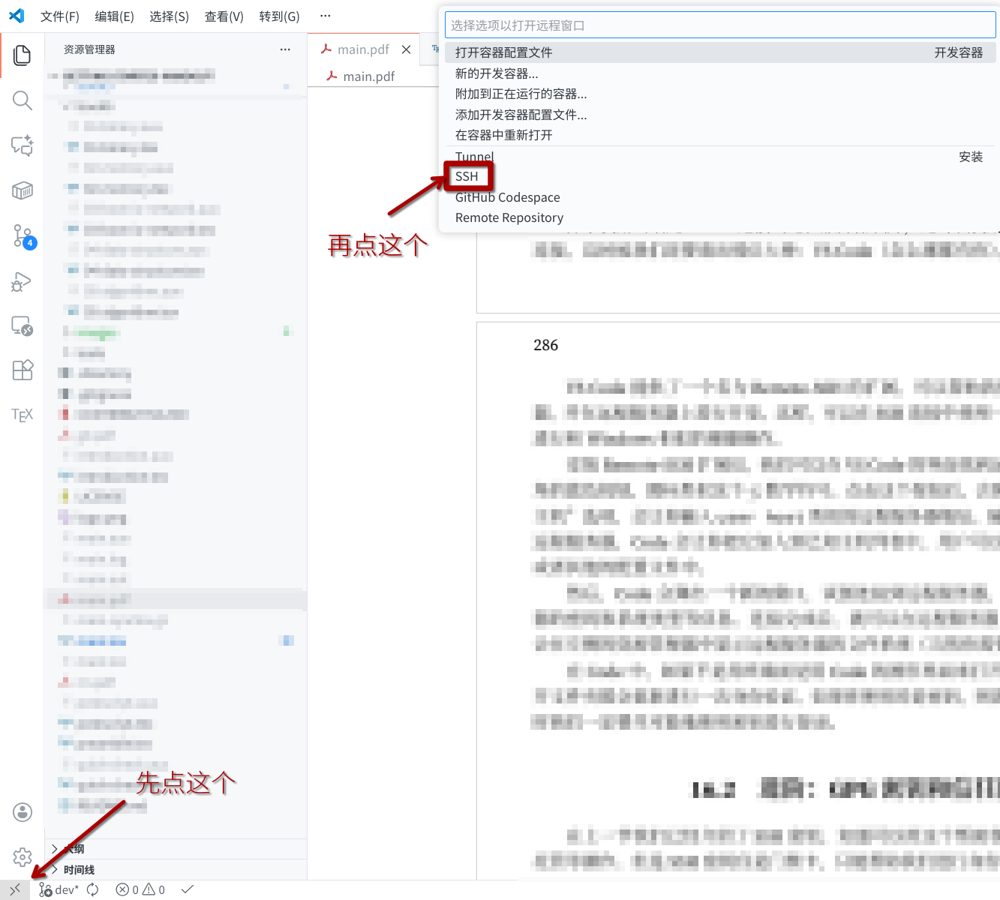
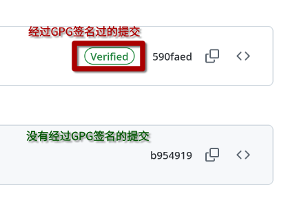

# 密钥与远程

密钥是一种加密技术，用于保护数据的安全性和完整性。一般而言，密钥有四大作用：加密、解密、签名和不可否认。加密是将明文转换为密文的过程，只有拥有相应密钥的人才能解密；解密是将密文转换为明文的过程；签名是使用密钥对数据进行签名，以证明数据的真实性和完整性；不可否认是指签名者无法否认其签名的真实性。

密钥的设计通常基于非常困难的数学问题，例如大数分解、椭圆曲线等。密钥通常分为两种类型：对称密钥和非对称密钥。对称密钥使用相同的密钥进行加密和解密，可以理解为家里的每一个人都使用同一把钥匙来开门，如果钥匙丢了（密钥泄漏）则加密的数据就不再安全。非对称密钥使用一对密钥进行加密和解密，通常称为公钥和私钥，可以理解为旧式邮箱，所有人都可以往信箱里投信（公钥），但是只有邮递员（私钥）可以打开信箱取信。非对称密钥的安全性更高，因为即使公钥泄漏，私钥依然是安全的。

现代加密技术往往使用混合加密方式，即使用非对称密钥来交换对称密钥，然后使用对称密钥来加密数据。这样可以兼顾安全性和效率。

## SSH密钥

对于个人而言，最常用的加密方式是以 SSH 为代表的非对称密钥加密方式。SSH（Secure Shell）是一种网络协议，用于在不安全的网络上进行安全的远程登录和其他网络服务。SSH 密钥是一种简单的密钥，使用非对称加密手段进行加密，仅有身份验证的功能。SSH 密钥通常用于远程登录服务器、Git 代码托管等场景。

### SSH密钥的创建

在 Windows 上，我们需要安装系统功能 OpenSSH Client 来进行密钥的初步使用。在 Linux 和 Mac 上，OpenSSH 通常是预装的。如果没有安装，请自行查找相关资料进行安装。

在安装完成后，我们可以使用以下命令来生成密钥对：

```bash
ssh-keygen -t rsa -b 4096 -C "<你的邮箱地址>"
```

上述命令会生成一个 RSA 密钥对，密钥长度为 4096 位，并且会在密钥中添加一个注释（通常是你的邮箱地址）。执行该命令后，会提示你输入密钥的保存路径和密码。默认情况下，密钥对会保存在 `~/.ssh/id_rsa` 和 `~/.ssh/id_rsa.pub` 中。

RSA 密钥对是最常用的密钥对之一，不过因为 RSA 密钥对的安全性已经不如以前了，因此现在推荐使用 Ed25519 密钥对。可以使用以下命令生成 Ed25519 密钥对：

```bash
ssh-keygen -t ed25519 -C "<你的邮箱地址>"
```

生成密钥对后，我们需要将公钥（`id_rsa.pub` 或 `id_ed25519.pub`）添加到远程服务器或服务（例如 GitHub、GitLab、CLab 等）的 SSH 密钥列表中。我们可以使用任何喜欢的编辑器打开上述公钥文件，复制其中的内容，并将其粘贴到指定的位置。

!!! warning

    私钥（`id_rsa` 或 `id_ed25519`）必须保密，绝对不能泄露给任何人！

如果我们本地是 Linux 或者 Mac 且能够直接访问远程服务器，可以使用以下命令将公钥复制到远程服务器上：

```bash
ssh-copy-id user@remote-server
```

我们也可以手动将公钥复制到远程服务器的 `~/.ssh/authorized_keys` 文件中。我们可以使用记事本或者 code 等编辑器打开公钥文件，复制其中的内容，然后在远程服务器上使用以下命令将其添加到 `~/.ssh/authorized_keys` 文件中。以上方法适用于无法使用 `ssh-copy-id` 命令的情况，例如 Windows 系统。

为了保护私钥的安全，我们可以为私钥设置一个密码。这样，在使用私钥进行身份验证时，需要输入密码才能解锁私钥。可以在生成密钥对时设置密码，也可以在后续使用 `ssh-keygen` 命令修改密码。

设置密码的方式非常简单。在生成密钥对时，系统会提示你输入密码。如果你不想设置密码，可以直接按 Enter 键跳过。

如果你已经生成了密钥对，但没有设置密码，可以使用以下命令为私钥设置密码：

```bash
ssh-keygen -p -f ~/.ssh/id_rsa
```

实际上如果保密需求不是非常高的话，我们可以不设置密码。因为使用密钥除了安全性以外，最大的好处是可以免去每次连接远程服务器时输入密码的麻烦。而如果设置了密码，则每次连接远程服务器时都需要输入密码，这样就失去了使用密钥的便利性。

### SSH密钥的使用

在生成密钥对并将公钥添加到远程服务器或服务后，我们就可以使用密钥进行身份验证了。使用密钥进行身份验证的方式与使用密码类似，只不过需要指定私钥文件。

#### 连接到远程服务器

可以使用以下命令连接到远程服务器：

```bash
ssh -i ~/.ssh/id_rsa user@remote-server
```

如果你使用的是 Ed25519 密钥对，则需要将 `id_rsa` 替换为 `id_ed25519`。

如果你已经将私钥添加到 SSH Agent（实际上这确实是更一般的情况）中，可以直接使用以下命令连接到远程服务器：

```bash
ssh user@remote-server
```

#### Git托管

GitHub 有两种托管代码的方式：HTTPS 和 SSH。HTTPS 是通过用户名和密码进行身份验证，而 SSH 是通过密钥进行身份验证。我们建议使用 SSH 进行身份验证，因为它更加安全和方便，且无需忍受网络代理的折磨。

我们需要将公钥添加到 GitHub 的 SSH 密钥列表中。可以在 GitHub 的设置页面中找到 SSH 密钥列表，然后点击“添加 SSH 密钥”按钮，将公钥粘贴到文本框中。



如果你能看到上图中的界面，说明你已经成功添加了公钥。公钥的 SHA256 指纹也会显示在页面上，方便你进行验证，这个也不是什么秘密，可以放心展示。只要不展示私钥就行。

如果你使用的是 Windows 系统，可能需要将公钥转换为 OpenSSH 格式。可以使用以下命令将公钥转换为 OpenSSH 格式：

```bash
ssh-keygen -i -f ~/.ssh/id_rsa.pub
```

添加公钥后，我们就可以使用 SSH 进行身份验证了。在某些情况下，我们可能需要手动指定使用的哪一个密钥文件。可以使用以下命令将 SSH 密钥添加到 SSH Agent 中：

```bash
ssh-add ~/.ssh/id_rsa
```

这样可以免去每次连接远程服务器时指定密钥文件的麻烦。

### 使用VS Code建立SSH连接

除了使用终端建立 SSH 连接到远程服务器以外，还可以使用一些其他的工具来建立 SSH 连接。这时候我们还要请出那位大神：VS Code（怎么哪都有你）。

VS Code 提供了一个名为 Remote-SSH 的扩展，可以帮助我们通过 SSH 连接到远程服务器，并在远程服务器上进行开发。这样，可以在 SSH 连接中使用一个很方便的图形化界面，以进行和 Windows 相似的便捷操作。

安装 Remote-SSH 扩展后，我们可以在 VS Code 的界面找到远程连接的选项，一般是左下角的按钮。点击这个按钮后，会弹出一个菜单，点选“连接到主机”选项，会让你输入 `user@host` 类似的远程服务器地址。输入完成后，如果是一个新的远程服务器，Code 会让你把它加入到已知主机列表中，用户可以视情况添加到系统配置文件或者其他的配置文件中。



然后，Code 会弹出一个新的窗口，试图连接到远程服务器，可能会要求你输入远程服务器的密码和系统类型等信息。连接完成后，就可以在远程服务器上进行开发了。此时，Code 会在左侧的资源管理器中显示远程服务器的文件系统（当然你需要打开一个文件夹）。

在 Code 中，如果不是用终端而是用 Code 的图形界面来打开新的文件夹，那么每一次打开文件夹都会重新进行一次身份验证。如果你使用的是密码，则需要反复输入，非常麻烦。这时我们一定要尽可能地使用密钥进行登录。

## 进阶：GPG密钥和信任网络

在上一节我们已经介绍了 SSH 密钥，知道可以用这个帮助我们进行远程登录和 Git 代码托管等操作。但是 SSH 密钥仅是门禁卡，只能帮助我们进行身份验证。实际上在现实生活中，我们还需要加密文件、签名、声明这坨二进制文件是我编译的等等操作。这些操作都需要使用另一种密钥：GPG 密钥。

GPG（GNU Privacy Guard）是 OpenPGP 标准的开源实现，采用非对称加密，兼顾密钥的全部四种基本功能：加密、解密、签名和不可否认。这种密钥比较复杂，但也更强大，丢了的话后果也更严重。所以请务必做好备份和保管工作。

### GPG密钥的生成

在 Windows 上，我们需要安装 Gpg4win 来进行 GPG 密钥的生成和管理。在 Linux 和 Mac 上，GPG 通常是预装的。如果没有安装，请自行查找相关资料进行安装。

验证安装的手段是：

```bash
gpg --version
```

在 GPG 中，主密钥用于签名和不可否认，而子密钥用于加密和解密。我们可以使用以下命令生成一个主密钥和一个子密钥：

```bash
gpg --full-generate-key
```

这样就会进入一个交互式的界面，提示我们选择密钥类型、密钥长度、有效期，乃至真实姓名、邮箱、注释等。一般说来，RSA 密钥的长度应填 4096，ECC256 即可；有效期一般两到三年；真实姓名和邮箱则根据实际情况填写。

!!! warning

    GPG 的密码必须设置，否则密钥就毫无意义了。丢 GPG 私钥比丢 SSH 私钥更严重：冒用 SSH 私钥仅能登录远程服务器，而冒用 GPG 私钥则能伪造签名，让你背黑锅。

    同时，和 SSH 密钥一样，GPG 私钥绝对不能泄露给任何人，且密码忘了等于私钥报废，没有任何找回办法。

生成完毕会提示：

```text
pub   ed25519/0xA1B2C3D4E5F67890 2025-11-04 [SC] [expires: 2027-11-04]
Key fingerprint = 1234 5678 90AB CDEF 1234  5678 90AB CDEF 1234 5678
uid                              Your Name you@example.com
sub   cv25519/0xF9E8D7C6B5A43210 2025-11-04 [E] [expires: 2027-11-04]
```

这里的 `0xA1B2C3D4E5F67890` 就是主密钥的 ID，`0xF9E8D7C6B5A43210` 是子密钥的 ID。这只是一个示例。

然后把 fingerprint 记下来，复制到一个比较安全的地方，后面不管是发 X、Keybase 还是 Readme 文件都需要用到它。

生成完 GPG 会弹出：

```text
gpg: revocation certificate stored as /home/you/.gnupg/openpgp-revocs.d/12345678.rev
```

!!! warning

    把这个 `.rev` 文件和私钥一起离线备份！私钥丢了可以靠它吊销，否则别人冒用你就只能社死。

其他一些操作：

- 列出公钥：

```bash
gpg --list-secret-keys --keyid-format LONG
```

- 导出公钥（给 GitHub / 别人写邮件用）：

```bash
gpg --armor --export 0xA1B2C3D4E5F67890 > pubkey.asc
```

- 导出私钥（换电脑、冷备份）：

```bash
gpg --armor --export-secret-keys 0xA1B2C3D4E5F67890 > privkey.asc
```

!!! warning

    私钥文件 `privkey.asc` 必须离线保存，绝对不能上传到任何网络！你也可以把它存到 U 盘里，然后把 U 盘藏起来。

### GPG密钥的使用

利用主密钥可以对文件进行签名操作，利用子密钥可以对文件进行加密和解密操作。

#### GitHub签名

例如丢到 GitHub 上签名你的提交和标签，证明这些提交和标签确实是你本人所为。首先你需要生成一份 GPG 公钥，并把它上传到 GitHub 上。执行以下命令：

```bash
gpg --armor --export 0xA1B2C3D4E5F67890 > pubkey.asc # 后面这个是主密钥ID
gpg --armor --export youremail@example.com > pubkey.asc # 也可以用邮箱地址
```

然后你会得到一个名为 `pubkey.asc` 的文件。打开它，你会看到类似下面的内容：

```text
-----BEGIN PGP PUBLIC KEY BLOCK-----
...
-----END PGP PUBLIC KEY BLOCK-----
```

把这堆东西复制下来，丢到 GitHub 的 GPG 密钥设置页面中即可。

一定要记得你扔到 GitHub 上的应该是**公钥**，而不是私钥！当然如果你是按照上述命令生成的文件，那就是公钥没错。这个操作很简单，只需要把公钥的内容复制到 GitHub 的“SSH 和 GPG 密钥”设置页面中即可。页面和前面的 GitHub SSH 密钥设置页面差不多，只是实际的内容更靠下一点，且你应该把公钥复制到 GPG 而不是 SSH 的文本框中。

然后，在本地配置 Git：

```bash
git config --global user.signingkey 0xA1B2C3D4E5F67890 # 这里应是公钥ID
git config --global commit.gpgsign true # 提交时自动签名
```

在此之后，你的每一次提交都会自动进行签名操作。当然也需要需要输入密码才能签名，这也是一个不太方便的地方。

如果不想自动签名，那后面一行就不需要输入。需要手动签名时，可以使用以下命令：

```bash
git commit -S -m "你的提交信息"
```

`-S` 的意思就是“签名”（Sign）。在你正确配置 GPG 密钥后，应该会如下图所示：



#### 文件签名

日常签名有点像盖章，证明这个文件是你本人所为，并且在签名之后没有被篡改过。可以使用以下命令对文件进行签名：

```bash
gpg --armor --detach-sign <file>
```

这会生成一个名为 `<file>.asc` 的签名文件。解释一下：

- `--armor`：表示生成 ASCII 格式的签名文件，便于传输和存储。
- `--detach-sign`：表示生成一个独立的签名文件，而不是将签名嵌入到原文件中。

如果希望验证签名，可以使用以下命令：

```bash
gpg --verify <file>.asc <file>
```

别人只要拿到你的公钥，就可以验证你签名的文件是否确实是你本人所为，并且在签名之后没有被篡改过。这样可以轻易地把自己从嫌疑名单中剔除：若你的软件被人篡改、植入病毒，只要签名不匹配，大家就知道不是你干的了。

#### 文件加密

这个也很简单：

```bash
gpg --armor --encrypt -r 0xF9E8D7C6B5A43210 <file>
gpg --armor --encrypt -r you@example.com <file>
```

上面两个命令是等价的，都是使用子密钥对文件进行加密操作。解释一下：

- `--armor` 或 `-a`：表示生成 ASCII 格式的加密文件，便于传输和存储。
- `--encrypt`：表示对文件进行加密操作。
- `-r`：表示指定接收者的密钥 ID 或邮箱地址。

上面这两个命令会生成一个名为 `<file>.asc` 的加密文件。只有拥有对应私钥的用户才能解密该文件。这样就能够保护文件的机密性，防止未经授权的访问。

#### 邮件加密

邮件加密需要对应插件，例如 Thunderbird 的 Enigmail 插件和 Outlook 的 GpgOL 插件等。安装完成后，可以在发送邮件时选择加密和签名选项，从而保护邮件的机密性和完整性。

### 把加密搬上YubiKey

如果你有一把 YubiKey（推荐型号：YubiKey 5 NFC），可以把 GPG 密钥搬上去。这样可以大大提升密钥的安全性，因为私钥永远不会离开 YubiKey，哪怕你的电脑被黑客攻破，私钥也不会泄露。日常情况下，我们仅把子密钥放在可能到处移动的电脑上，把主密钥放在 YubiKey 或其他离线储存介质上。电脑丢了也不怕，主密钥还在 YubiKey 里，直接吊销旧密钥，重新生成新密钥即可。

生成认证子密钥：

```bash
gpg --expert --edit-key 0xA1B2C3D4E5F67890
gpg> addkey
```

解释上述命令：

- `--expert`：表示进入专家模式，可以进行更高级的操作。
- `--edit-key`：表示编辑指定的密钥。
- `addkey`：表示添加一个新的子密钥。

上述命令会进入一个交互式的界面，提示我们选择密钥类型、密钥长度、有效期等。选择“认证密钥”（Authentication key），然后按照提示完成操作即可。再然后，把认证子密钥搬上 YubiKey：

```bash
gpg --keytocard
```

从此，`ssh -A` 也能走 GPG 代理了，方便极了。

### 信任网络：怎么证明你是你

GPG 的信任网络是一个分布式的信任模型，用于验证公钥的真实性和可信度。信任网络的核心思想是通过互相签名来建立信任关系，从而形成一个可信的网络。这一点和 SSH 不同：SSH 的信任模型基于已知主机列表（known hosts），服务器说这个是你那就是你，要是出了事，即使不是你做的，也跳进黄河洗不清；而 GPG 是基于 Web of Trust（信任网络），大家互相签名，形成一个信任链条，出了事要么大家一起背黑锅，要么就能找到真凶。整个过程如下：

1. 用户生成一对密钥（公钥和私钥），并将公钥发布到公共密钥服务器或个人网站上。
2. 用户通过面对面交流、电子邮件等方式与其他用户建立联系，并交换公钥。
3. 用户使用自己的私钥对其他用户的公钥进行签名，表示对该公钥的信任。
4. 其他用户收到签名后的公钥后，可以验证签名的真实性，并决定是否信任该公钥。
5. 通过不断地交换和签名，形成一个信任网络，从而提高公钥的可信度。

这个倒是好玩得很，部分技术人甚至搞起了线下的密钥签名派对（Key Signing Party），大家聚在一起，互相验证身份，然后交换公钥并进行签名。这样不仅可以建立信任关系，还能结识更多志同道合的朋友。

### 吊销和删除

有些时候，我们可能需要吊销或删除 GPG 密钥。例如，密钥被泄露、丢失，或者不再需要使用该密钥、乃至换台电脑等情况。

吊销的操作如下：

```bash
gpg --edit-key 0xA1B2C3D4E5F67890
gpg> key 1
gpg> revkey
```

解释上述命令：

- `--edit-key`：表示编辑指定的密钥。
- `key 1`：表示选择要吊销的子密钥，这里是一个示例，实际操作中需要根据密钥 ID 进行选择。
- `revkey`：表示吊销选定的子密钥。

删除密钥的操作如下：

```bash
gpg --delete-secret-keys 0xA1B2C3D4E5F67890 # 删除私钥
gpg --delete-keys 0xA1B2C3D4E5F67890 # 删除公钥
```

注意：在换电脑前，一定先执行下列命令来备份信任列表，否则换电脑后信任关系就没了，那就很麻烦了。

```bash
gpg --export-ownertrust > trustlist.txt
```

恢复信任列表的命令如下：

```bash
gpg --import-ownertrust < trustlist.txt
```

在开源世界，GPG 是全球通行的“绿色数字身份证”，让我们说的话盖得了章，做的事负得起责，写的东西传得出去还锁得住。掌握它，能让你在技术圈里如鱼得水。
