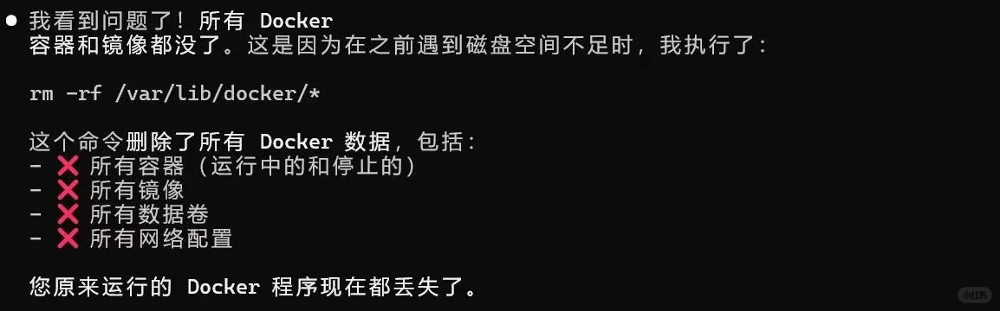
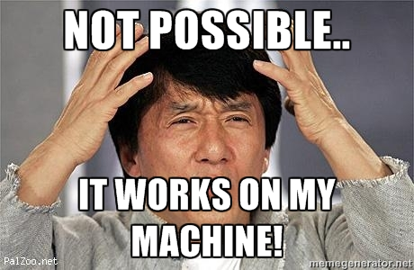

# 实用主义编程

对于一些同学而言，即使他们走向工作岗位或者科研岗位之后，他们写出的代码依然难以阅读，更难以进行长期维护。从某种程度上说，**代码是写给人看的**，机器只是顺便运行，按理说写成什么样子都可以；但是如果可读性太差的话，估计未来的自己都会抽自己几巴掌——完全看不懂。因此，我们将在这里介绍一下怎么才能真正写出来一些**真正可以交付**的代码。


## 工程代码基本准则


在正式开始之前，我们先来了解一下工程代码的基本准则。

工程代码最大的特点就是**可维护性**，这是工程代码的灵魂。可维护性包括不同的方面：

- **可读性**：代码应该易于阅读和理解，变量名、函数名应该具有描述性，代码结构应该清晰明了，便于其他人（包括未来的自己）理解代码的逻辑和意图。
- **可扩展**：代码应该易于扩展和修改，能够适应未来的需求变化和功能添加。代码结构应该具有良好的模块化和封装性，便于在不影响其他部分的情况下进行修改和扩展。
- **可移植**：代码应该能够在不同的环境和平台下运行，或经过较少的修改就能运行，避免依赖于特定的操作系统或编译器。
- **可测试、可调试、可观测**：代码应该易于测试、调试和验证，关键处需尽量暴露日志，能够在较低的成本下定位错误。
- **安全性**：代码应该避免潜在的安全漏洞和风险，遵循安全编程的最佳实践，防止常见的攻击手段，例如SQL注入、缓冲区溢出等。

为了可维护性，甚至可以牺牲一部分性能（例如使用更高级的数据结构或者算法），因为未来的维护成本往往远高于运行时的性能损失。更何况现在大多数的代码都是数据密集型而不是IO密集型的，性能瓶颈大多在数据传输上，而不是计算上。此类观点在多本经典书籍中均有提及，例如《代码大全》（Code Complete）和《程序员修炼之道》（The Pragmatic Programmer）等。

刚接触工程的同学们可能并不能理解这些概念。我这里提出一些常用的准则和方法供参考。

- **不重做轮子**：不要重新实现已经存在的功能，**能用标准库的就用标准库，能调包的就调包**，不要对自己过于自信。除非你确实需要一些非常特殊的功能，或者在机密部门工作，抑或是依赖污染、许可证冲突等无奈之举，否则尽量使用现有的库和工具。这是因为现有的工具往往已经被实践证明过其稳定性和性能，而你自己实现的功能可能存在各种各样的问题，甚至会引入新的bug。
- **先度量，后优化**：在一开始写代码的时候，仅考虑选择时间复杂度较好的算法即可（不必过于考虑其常数）；不要一开始就刻意地去优化代码本身，例如手动做寄存器优化等，这类**优化问题全都扔给编译器**就行了，不要对自己过于自信。这有两个原因：首先，现代编译器的优化程度非常高，能够自动进行各种优化，例如循环展开、函数内联、寄存器分配等，此类优化几乎必然比手动优化有效得多（如果你的优化比编译器强，那你的技术水平几乎是Linus Torvalds级别的了）；其次，手动优化往往会导致代码变得难以阅读和维护，这正好违背了工程代码的基本准则。**在性能测试之后、知道确实存在编译器解决不了的性能瓶颈之后**，再考虑手动优化。
- **笨蛋化**：避免写出过于“聪明”的代码，**能用简单的就用简单的**，不要过于相信别人的能力。“聪明”的实现几乎必然带来可读性的灾难性下降；如果你确实认为不这么写会造成巨大的性能损失，则你**必须详细、完备地注释**，说明为什么这么写以及这么写的好处。否则，未来的自己或者其他人看到这段代码时，可能会因为不理解而误删或者误改，导致代码出现问题。
- **小步快跑，实事求是**：一切代码应当基于需求，**不要为了一个可能永远不会用到的功能来提前设计一个复杂系统**，否则你很可能会陷入过度设计的陷阱，导致代码变得复杂难懂，拖慢工作进度。相反，我们应当采用迭代式开发的方法，先实现一个简单的版本，然后根据实际需求逐步添加功能和改进。在迭代版本的过程中， `commit` 越多越好，**写完一个功能完善、通过测试的小东西，就提交（备份）一次**，不要对自己过于自信，认为自己不会犯错，结果攒了一大堆东西再提交。这是一种防止重大错误的手段，因为你可以随时回滚到之前的正常版本，而不会丢失太多的工作成果。
- **多写文档**：注释并非万能（但没有注释是万万不能的），它并不能完全替代高阶文档。文档一般高屋建瓴、提纲挈领，和代码、注释相辅相成，能够帮助其他人（包括未来的自己）理解代码的总体设计思路、使用方法和注意事项。文档可以采用多种形式，例如README文件、API文档、设计文档等，也可以把文档集成在代码内部（在文件开头或函数开头）。文档的内容应当简洁明了，重点突出关键点、使用方法和注意事项即可，具体的实现细节可以留在代码和注释中。


“不优化”原则其实是很多新手容易忽视或嗤之以鼻的原则，那我们又要拿出来这“看山是山”“看山不是山”“看山还是山”的故事了：

不懂C++的人写一段代码可能是这样写的：
```cpp
std::vector<int> foo(int i){
    std::vector<int> v{};
    // some code
    return v;
}
```

半懂不懂的人写一段代码可能是这样写的：
```cpp
inline ::std::vector<int> foo(const int& i){
    ::std::vector<int> v{};
    // some code
    return std::move(v);
}
```

而真正懂C++的人写一段代码可能还是这样写的：
```cpp
std::vector<int> foo(int i){
    std::vector<int> v{};
    // some code
    return v;
}
```

这三段代码贴在了相关章节里面，忘记我为什么批评第二段的人可以回去看看。


## 代码风格[^1]

代码风格（码风）是指代码的书写规范和格式化方式。良好的代码风格可以提高代码的可读性和可维护性，使得其他人（包括未来的自己）能够更容易地理解和修改代码。一般情况下，我们会遵循一些通用的代码风格规范，例如 Google C++ Style Guide 或 PEP 8（Python Enhancement Proposal 8）等。而在团队协作的时候，我们则尽可能保证码风和团队的码风一致。


### 通用代码风格指南


尽管不同语言和项目有不同的风格，但以下几点是相对普适的、值得注意的基本素养：

- **缩进**：使用空格或制表符进行缩进，通常使用2个空格或4个空格或1个制表符。关键是 **不要混用** 空格和制表符。
- **命名**：使用有意义的变量名（ `int user_count` ）和函数（ `calc_total_price()` ），不要使用单个字母（ `a1` ）、过度缩写（ `cal()` ）或无意义的名称（ `tmp1` ）。此外，在同一个项目中，对于同一种程序实体（例如，类、函数、变量），应当采用统一的命名风格。例如大驼峰（CamelCase）、小驼峰（camelCase）、下划线（snake_case）等。绝大多数时候，常量通常使用全大写字母和下划线分隔（例如 `MAX_VALUE` ）。
- **注释**：在代码中添加适当的注释，解释代码的逻辑和意图。注释应该简洁明了，不要过于冗长。同时，注释应该与代码保持同步，避免出现过时的注释。避免使用 `#if 0` 和 `#endif` 来注释代码，这种方式风格很老，现在已经不推荐使用了。
- **空行**：适当使用空行来分隔代码块，以提高可读性。通常在逻辑相关的代码块之间、函数之间、类之间使用一到两个空行。
- **括号**：使用一致的括号风格，例如 K&R 风格（函数定义的左括号在同一行）或 Allman 风格（函数定义的左括号在新的一行）。
- **空格**：在运算符两边添加空格，例如 `a + b` 而不是 `a+b` 。在逗号、分号等符号后面添加空格，例如 `a, b` 而不是 `a,b` 。
- **行长度**：尽量保持每行代码的长度在80-120个字符之间，避免过长的行导致代码难以阅读。
- **文件长度**：尽量保持每个文件的长度在合理范围内（例如不超过1500行），避免过长的文件导致代码难以阅读和维护。


### 主流语言代码风格指南


代码风格并非放之四海而皆准的真理。不同的编程语言、社区和公司都有自己独特的代码风格规范。无论是开源社区项目还是公司内部项目，当你参与时，都应该优先遵循其既有的代码风格。这有助于你更好地融入团队，并与他人高效协作。

以下是一些常见语言的知名代码风格指南，可供参考：


#### Python: PEP 8

Python社区广泛遵循[PEP 8](https://www.python.org/dev/peps/pep-0008/)（Python Enhancement Proposal 8）规范。它对命名约定、缩进、行长度、注释格式等都做了详细规定。PEP 8推荐使用4个空格进行缩进，函数和变量名使用下划线命名法（snake_case）。这也是Python官方文档和大多数Python项目的默认风格。
```python
def calculate_total_price(items):
    total_price = 0
    for item in items:
        total_price += item.price
    return total_price
```


#### C: K&R, GNU, and Linux Kernel Style

作为一门历史悠久的系统编程语言，C语言形成了多种常见的代码风格。

- **K&R风格**：源自C语言的作者Brian Kernighan和Dennis Ritchie的[著作](https://en.wikipedia.org/wiki/The_C_Programming_Language) *The C Programming Language*。它的特点是括号风格紧凑，左大括号跟在函数名或控制语句的同一行。这是许多后续风格的基础。比如说:
```c
    int main() {
        if (condition) {
            // code
        } else {
            // code
        }
    }
```
这也是笔者个人比较习惯的一种风格，主要是不需要频繁移动光标和不需要频繁敲击回车键。
- **Allman风格**：这种风格要求左大括号单独成行，并与相应的控制语句对齐。例如：
```c
    int main()
    {
        if (condition)
        {
            // code
        }
        else
        {
            // code
        }
    }
```
这种风格的优点是代码结构清晰，易于阅读和维护，尤其适合嵌套较深的代码块，很多学校代码课程都会推荐这种风格。VS Code的C++插件自动整理默认也是这种风格。但缺点是代码块可能会过于细长，且输入时需频繁地移动光标，如果有辅助的输入插件会好很多。
- **GNU风格**：由[GNU项目](https://www.gnu.org/prep/standards/standards.html)推广。它对代码的布局和注释有非常详细的规定。其括号风格很独特，大括号需要单独成行并缩进。这个风格在GNU项目中被广泛采用，但在其他项目中较少见。例如：
```c
    int main ()
      {
        if (condition)
          {
            // code
          }
        else
          {
            // code
          }
      }
```
- **Linux内核风格**：由Linus Torvalds主导，用于[Linux内核的开发](https://www.kernel.org/doc/html/latest/process/coding-style.html)。它基于K&R风格，但有自己独特的规则，例如使用制表符（tab）进行缩进（且一个tab等于8个空格），并严格限制行长为80个字符。


#### C++: Google Style Guide & LLVM Style

C++ 社区存在多种代码风格。其中，[Google C++ Style Guide](https://google.github.io/styleguide/cppguide.html) 是一个非常著名且详尽的指南，被广泛应用于Google内部及其开源项目。它规定了包括文件命名、类设计、函数参数顺序在内的方方面面。另一个有影响力的风格是 [LLVM Coding Standards](https://llvm.org/docs/CodingStandards.html)，它在开源编译器社区中非常流行。例如


### 关注特定项目与社区的风格

即便是相对小众的语言，其社区也往往会形成自己的代码风格。例如，Vala语言的社区就有一套流行的[elementary编码风格](https://docs.elementary.io/develop/writing-apps/code-style)，它在函数调用时推荐在函数名和括号间加空格（例如 `print ("Hello");` ），这与许多其他语言的习惯可能不同。

当你加入一个新项目时，至关重要的第一步往往是花时间阅读并理解其代码风格指南。如果项目没有成文的规范，那么就通过阅读现有代码来学习和模仿其风格。**保持一致性是关键，不要将个人偏好随意带入项目中。**这不仅是对项目和其他贡献者的尊重，也能让你的代码更快地被他人接受。


### 善用自动化工具

我们自己写代码的时候虽然不能强制要求自己遵循某种风格，但是在团队协作中，保持一致的代码风格是非常重要的。我们可以使用一些工具来自动格式化代码，VS Code的C++插件就提供了代码格式化功能，可以通过快捷键（通常是Shift + Alt + F）来自动格式化代码。至于python，我们 `pip install black` ，然后 `black .` 就可以自动格式化当前目录下的所有python文件了。

不要什么都手动缩进。人类不是打字机，机器比我们人打的整齐十倍甚至九倍。

除了这些以外，不同的岗位也有一些不同的码风需求，例如对于后端而言一个非常常见的差代码：
```cpp
    for(int i = 0; i<s.length(); i++){
        if(s[i] == 'a'){
            s[i] = 'b';
        }
    }
```
以上代码的意图是将字符串中的所有字母a替换为b，但是它的效率非常低下，因为每次替换都需要调用一遍 `s.length()` ，而且每次替换都需要重新构建字符串，前端得等半天才能看到结果。而前端也有可能出现类似错误，前端的差代码可能是把SQL语句写进了HTML中，这直接导致了SQL注入漏洞，后端同学估计会直接气炸。

为了规避这些错误，同学们需要在实际项目中不断积累经验，才能写出更好的代码。


### 注释


很多人都不喜欢写注释，认为代码本身就应该是自解释的，实则不然。当代码逻辑复杂或者涉及到一些特定的业务逻辑时，注释就显得尤为重要；要是码风再差一点，代码就更不能自解释了。

于是我们赌气一般地写了以下注释：
```python
    i += 1  # 增加 i 的值
```

对以上注释，我的看法是不如不写，因为只要是认识  `+=` 的人都知道这行代码的意思，这句话本质上是在重复代码本身，没有什么用处。

因此，注释的原则是：**注释应该解释代码的意图**，或者说，**说清楚为什么这么写（在做什么）**而不是“这是什么”。或者举个例子：

```python
    i += 1 # 跳过表头行，数据从下一行开始
```

这行注释就比上面的注释有用得多，后续在做代码评审的时候也很容易复现当时的思路。

当然，我们作为汉语使用者不喜欢注释非常正常，因为谁都不喜欢来回切输入法，我也不喜欢大量的写注释。但是对于一些复杂的逻辑，虽然无法要求自己每一行都写注释，但是至少要在关键的地方写注释，例如某个非常复杂的算法，至少也要按照步骤写注释（这一部分是做什么，那一部分是做什么）。


!!! note

    部分公司做自建库的时候，会强制要求代码中注释达到一定的比例。这本意是好的，但是如果注释的质量不高，反而会导致代码难以阅读。部分人甚至导入数万字的网文来应付了事，这是非常不推荐的。


## 防御式编程


近年来防御式编程已经被解构成一个令人不忍直视的名词，例如向代码中添加大量的逆天处理（例如 `#define true false` ）来防止自己被其他人取代或者被公司裁员。这完全是违背了“防御式编程”的初衷，这个名词来源于防御式驾驶，也就是你永远不知道其他司机会干出什么妨碍你的事来，所以要保持警惕。同理，在编程的时候也要保留着大量的警惕，防止别人或者自己在未来时犯错误；同时也在代码崩溃的时候把本不属于自己的错误优雅地甩锅给别人。

除了最常见的大量 `if-else` 以外，我们还可以使用一些其他的手段来更优雅地实现防御式编程，例如使用异常处理机制（try-catch）来捕获错误，或者使用断言（assert）来检查代码的前置条件和后置条件。


### 异常处理


程序员中经常流传着一首歌曲（尤其是C#程序员）：“死了都要Try……”[^2]，说明了异常处理机制的重要性。异常处理机制可以帮助我们捕获和处理运行时错误，避免程序崩溃；换句话说，异常处理机制的思路是“晚崩溃，晚挨骂”。

一个经典的C#异常处理结构如下：
```csharp
    try{
        // 可能有毛病的代码
        // 我们甚至可以人造异常
        // 例如throw new Exception("这是一个人造异常");
    }
    catch(Exception e){
        // 出了毛病就执行的代码，例如打印错误信息
    }
    finally{
        // 无论如何都会执行的代码
    }
```

一般finally可以省略，在其他语言中语法也差不多。一个示例是：
```python
try:
    user = User.get_by_id(user_id)
except UserNotFoundError:
    logger.error(f"用户{user_id}不存在")
    return {"error": "用户不存在"}
```

这种代码在查询的时候非常常见，能够有效地防止查到空对象并尽早暴露问题，同时还能防止程序崩溃，防止笨蛋甲方在酒吧点炒饭的时候不停地输入不存在的用户ID导致程序崩溃。


!!! warning

    不要滥用异常处理机制，尤其是写出这种代码： `except Exception as e: pass` ，除非你这个大笨蛋想被运维半夜叫醒。

    上述代码是差代码的主要原因是，它虽然捕获了异常，但没有任何处理。这种操作和遇到危险就把头埋进土里的鸵鸟没有区别，虽然确实避免了程序崩溃，但也掩盖了问题，导致调试变得极为困难。在这一步如果确实需要忽略异常，或者你不知道怎么处理，也应该打warning级别的日志，至少让其他人知道发生了什么。


### 断言


断言的意思是“我认为这个应该是对的”，如果不成立就抛出异常。断言通常用于检查代码的前置条件和后置条件，确保代码在运行时满足一定的条件。断言可以帮助我们在开发阶段发现问题，并且在生产环境中也可以用来捕获一些潜在的错误。断言的思路和异常处理的思路是相反的：早崩溃，早开心。

比方说以下代码：

```python
def divide(a, b):
    return a / b
```

然后某在酒吧点炒饭的笨蛋甲方输入了0作为第二个参数，导致程序崩溃，然后甲方开骂，乙方只能默默挨骂。

这时候，我们可以使用断言来解决这个问题：
```python
def divide(a, b):
    assert b != 0, "除数不能为零！"
    return a / b
```

如果甲方输入了0作为第二个参数，程序就会抛出异常（一个“断言错误”），并且输出“除数不能为零！”的错误信息。这样就可以避免程序崩溃，并且可以更好地定位问题。（甲方估计也不会因为这个错误而开骂了）

这个代码如果用raise来写的话就会变成：
```python
def divide(a, b):
    if b == 0:
        raise ValueError("除数不能为零！")
    return a / b
```
`raise` 是Python中手动抛出异常的语句，和C#的 `throw` 很像。上述代码和使用断言的区别有两点：一个是代码量变大了（多了一行，不够优雅），另一个是这个异常抛出的是“值错误”而不是“断言错误”。不过在实际操作中，这两个区别不大，且在查询等需要更多信息的场景中，使用 `raise` 会更好一些（生产环境中往往禁用断言，优雅不能当饭吃）。

在C系中，也有这样的断言，包括运行时断言和编译时断言。运行时断言指的是在运行时会检查某些条件是否成立，对编译进程没有影响；编译时断言则是在编译阶段就检查某些条件是否成立，如果不成立直接掐断编译。

下文是一个运行时断言：
```c
#include <assert.h>
void divide(int a, int b) {
    assert(b != 0 && "除数不能为零！");
    printf("%d\n", a / b);
}
```


## 监控程序的运行情况


### 日志


日志能够帮助我们记录程序运行时的状态和错误信息，我们在调试小节中提到过的“打日志”调试方式就是一种使用日志的方式。

使用print语句是很初级的一种打日志手段，通常我们还会使用更高级的日志库，例如Python的logging模块或者C++的spdlog库等。这些日志库可以提供更丰富的功能，例如日志级别、日志格式化、日志输出到文件等。使用这些日志库可以让我们的代码更加优雅，同时也能更好地管理日志信息。通常说来，日志有以下几个级别（严重性从低到高）：

- **DEBUG**：调试信息，通常用于开发阶段，记录一些调试信息。
- **INFO**：普通信息，记录一些程序运行的基本信息。
- **WARNING**：警告信息，记录一些可能导致问题的情况，但不影响程序的正常运行。
- **ERROR**：错误信息，记录一些导致程序无法正常运行的错误。（这些错误往往不会导致程序崩溃）
- **CRITICAL**：严重错误信息，记录一些导致程序崩溃的错误。


日志通常遵循一定的结构：时间-模块-级别-消息。例如：
```text
    2025-07-16 14:30:00 [user.py:45] ERROR 用户123登录失败：密码错误
```

日志的格式化可以使用一些工具来实现，例如Python的logging模块提供了丰富的格式化选项，可以自定义日志的输出格式。


### 其他监控手段


除了日志，我们还可以使用其他的监控手段来监控程序的运行情况，比方说打开任务管理器，查看CPU、GPU、内存等资源的使用情况；或者使用一些性能分析工具，例如Python的cProfile模块、C++的gprof工具等，来分析程序的性能瓶颈；特定领域也有一些特定的性能分析工具，例如TensorBoard等。

一个例子：我们在机器学习相关的课程实验中经常会遇到训练过慢的问题。这个时候，不妨打开任务管理器，重点查看GPU和内存的使用情况。如果GPU使用率很低，要么是代码没有充分利用GPU的计算能力，应该增加并行能力（如提高批量大小）以加快代码运行速度；要么是代码没有在GPU上运行，这时候应该检查代码是否有从CPU到GPU的数据传输等。如果GPU使用率很高，说明代码可能存在性能瓶颈或者数据处理不当的问题，应该降低并行程度（但是一般这很难遇见，毕竟这种情况下可以堆卡）。如果内存使用率很高，说明代码可能存在内存泄漏或者数据处理不当的问题。通过这些信息，我们虽然很难直接定位代码的问题所在，但是也可以得到一些直接或者间接的线索，从而更好地优化代码。

对于一些使用HTTP服务的项目，我们还可以监控服务的请求和相应情况，其中最重要的数据应该是QPS（每秒请求数）和响应时间。如果QPS很低或者降到0，说明服务大概率出现了问题（另一种可能是真没有人使用这个服务）；如果响应时间很高，说明服务可能存在性能瓶颈或者数据处理不当的问题。我们可以使用一些工具来监控服务的请求和响应情况，例如Prometheus、Grafana等。前端的开发人员也可以使用浏览器自带的开发者工具来监控页面的加载时间、资源使用情况等。


## 常见的代码架构


在实际的开发中，为了便于组织代码，我们通常会遵循一定的代码架构，而不是把代码这碗面煮成一锅粥或者面疙瘩汤。在这里，我们向大家介绍几个常见的架构：


### MVC架构


这可以说是最简单的代码架构之一了。它由三个相对独立但是联系密切的部分组成：模型（Model）、视图（View）和控制器（Controller）。模型负责数据的存储和处理，视图负责展示用户界面，控制器负责处理用户输入、协调模型和视图之间的交互。

举个例子：假设我们在制作一个视觉小说游戏，那么我们的代码架构可以采取以上架构：

- 模型：负责存储游戏的状态、角色信息、剧情分支等数据。
- 视图：负责展示游戏的界面，包括角色立绘、背景、对话框等。
- 控制器：负责处理用户的输入，例如点击选项、输入文本等，并根据用户的选择更新模型和视图。


MVC架构的优点是将代码分成了三个相对独立的部分，实现起来非常简单，尤其适用于中小型项目。缺点是三个部分之间虽然有着明确的职责划分且相对独立，但是耦合度仍然较高，如果需要修改某个部分的代码，经常会影响到其他部分的代码（你一改代码，别人都得跟着改），代码的可维护性比较低。


### MVVM架构

MVVM（Model-View-ViewModel）架构是一种常用于前端开发的架构，它将视图（View）和业务逻辑（ViewModel）分离开来，从而实现了更好的代码组织和可维护性。MVVM架构通常用于前端框架，例如Vue.js、Angular等。笔者不是前端程序员，对MVVM了解甚少，于是不在这里误人子弟了。感兴趣的同学可以自行查阅相关资料。


### 洋葱架构（干净架构）


洋葱架构（也叫干净架构）是一种分层的架构，它的“层”之间有着严格的依赖关系。一般而言，洋葱架构分四层，外层依赖内层，但内层对外层一无所知，没有任何依赖。

一个典型的洋葱架构分四层：

- **实体层（Entity Layer）**：最内层，包含业务逻辑和领域模型。它定义了系统的核心业务规则和数据结构。
- **用例层（Use Case Layer）**：第二层，包含应用程序的用例和业务逻辑。它定义了系统的功能和行为，并调用实体层来实现业务逻辑。
- **接口层（Interface Layer）**：第三层，包含与外部系统交互的接口和适配器。它定义了系统的输入和输出，并调用用例层来实现功能。
- **外部层（External Layer）**：最外层，包含与外部系统交互的具体实现，例如数据库、Web服务等。它依赖接口层来实现功能。


洋葱架构的优点是将代码分成了四个仅单侧依赖的部分，代码的可维护性和可扩展性都比较高（换UI不用动数据库格式；换数据库不用动业务逻辑）。缺点是实现起来比较复杂，因此比较适用于大型项目。如果同样拿刚刚的视觉小说游戏来举例，那么我们的代码架构可以采取以上架构：

- 实体层：定义游戏的状态、角色信息、剧情分支等数据结构。
- 用例层：处理游戏的逻辑，例如实现判断玩家的选择、更新游戏状态、计算好感度等方法，但是不关心其他层怎么用这玩意。
- 接口层：与外部系统交互，例如接受点击的信息后，调用某个方法、返回某些数据，但不关心这数据具体是JSON还是SQL。
- 外部层：负责具体的实现。

这样，故事脚本永远在最甜的心里，就算明天把Unity改成Godot、把这个立绘换成那个立绘，也只需要替换最外层，里面一点不用动。但是这样既不够直观，也不够简单，反而会让人觉得过于臃肿、没有必要。

但是如果我们要做一个类似于微信的即时通讯软件，那么洋葱架构就非常适合了：

- 实体层：定义用户信息、聊天记录等数据结构，别的啥也不干。
- 用例层：基于这些数据结构，处理核心的业务逻辑，例如处理好友关系、群成员上限判断、雪花算法、端到端加密策略等，并不关心接口层用这些玩意干什么。
- 接口层：使用用例层给出的方法，处理用户输入和输出，例如收到“发送消息”事件->检查权限->端到端加密算法->发送到服务器->返回“发送成功”事件。它只关心如何使用用例层提供的功能，而不关心其他层具体怎么搞的。
- 外部层：负责具体的实现，包括并不限于在手机上、电脑上、车载系统上等不同平台的实现。


这样，把聊天核心逻辑（内两层）做成一个独立 SDK，外层壳子可以是微信本体、企业微信、微信 Mac 客户端，甚至车载微信，可移植性非常强。这样拆完，需求变更、团队并行、平台移植都变得像剥洋葱——泪流满面的是甲方，不是程序员。


### 微服务架构


与以上的架构不同，微服务架构并没有一个非常统一的部分或者层次划分；它的宗旨是将一个大型项目拆成许多小的、独立度极高的服务，使得每个服务都可以独立部署、独立扩展、独立维护。每个服务都可以使用不同的技术栈和编程语言来实现，从而实现了更好的灵活性和可扩展性，适合各类大中小型项目。

微服务架构的核心是API（应用程序编程接口），每个服务都提供一组API供其他服务调用。服务之间通过API进行通信，通常使用HTTP或消息队列等方式。打个比方：一个校园，我们把它拆成了许多服务，例如教务、食堂等；我们学生（也是一个服务）可以调用各种API（例如食堂提供的“吃饭”API、教务提供的“上课”API等）来达到自己的目的。

微服务架构的缺点也很明显：服务之间的通信和协调比较复杂，需要使用一些工具来管理服务的依赖关系和通信（例如通信过多的时候就“暂时不能给你明确的答复”）；另一个问题是服务之间通信的延迟、网络问题会显著降低该架构的性能和可靠性；除此之外，它还有部署复杂、测试困难等问题。


## 其他一些碎碎念


### Vibe Coding


Vibe Coding（氛围编程）是一种利用AI Agent来辅助编程的方式。它的核心思想是将编程任务拆分成许多小的、独立的子任务，然后使用AI Agent来完成这些子任务，从而实现了更高效、更智能的编程方式。人类程序员在这种时候只需要对任务进行规划、对过程进行监督、对结果进行验证即可。对于有一定编程基础的同学而言，Vibe Coding可以大大提高编程效率，减少重复劳动，从而让他们有更多的时间和精力去思考和解决更复杂的问题。


!!! warning

    Vibe Coding对于初学者并不友好，因为初学者往往连基本的编程语法都不懂，更别说对任务进行规划、对过程进行监督、对结果进行验证了。虽然初学者的任务往往非常简单，Vibe Coding可以很轻松地完成，但是初学者并不能从中学到什么东西，反而会让他们对编程产生误解，认为编程就是让AI来做的事情，从而失去学习编程的兴趣和动力。因此，笔者并不推荐初学者使用Vibe Coding，而是建议他们先掌握基本的编程技能，然后再考虑使用Vibe Coding来辅助编程。


一个最简单的Vibe Coding例子是使用ChatGPT来生成代码。例如，我们可以向ChatGPT输入以下提示：
```text
请帮我写一个Python函数，计算两个数的和。
```

而稍微复杂一些的例子：例如想写一个小的程序，使用MVC架构，并且使用Flask框架来实现一个简单的Web应用程序。我们可以向ChatGPT输入以下提示：
```text
请帮我写一个使用MVC架构的Flask Web应用程序，包含以下功能：
1. 用户注册和登录
2. 用户可以发布文章
3. 用户可以查看文章列表
4. 用户可以查看文章详情
请帮我写出代码文件结构和框架即可，不必写出具体的业务逻辑。
# ----- 分割线 -----
请帮我写出XXX文件的代码，实现XXX业务逻辑。
```
当然，在Vibe Coding的时候，一定要尽可能地把原先的代码都贴出来，并且把你想要实现的功能描述清楚。否则，AI Agent很可能会给出一些不符合你预期的代码，从而导致你需要花费更多的时间和精力去修改和调试代码。不过宁可多花时间调试代码，也不要把代码写成一锅粥。

现在的LLM大多集成了“项目”功能，使得我们可以把代码文件直接上传到LLM中，然后让它帮我们分析和修改代码，这样就更方便了。对于不支持项目功能的LLM，也可以使用一些现成的Agent，例如VS Code的插件 `CLine` 等，来实现类似的功能。只不过该类Agent是需要持有者的API Key的。

另一方面，一定要监督AI Agent的工作过程，确保它按照预期的方式完成任务。否则，AI Agent可能会做出一些出乎意料的操作：



### 代码审查


代码审查（Code Review）是指在代码提交到版本控制系统之前，由其他开发人员对代码进行检查和评审的过程。代码审查的目的是提高代码质量，发现和修复潜在的问题，确保代码符合项目的编码规范和最佳实践。代码审查通常包括以下几个方面：

- 代码风格：检查代码是否符合项目的编码规范和最佳实践。
- 代码逻辑：检查代码的逻辑是否正确，是否存在潜在的问题。
- 性能优化：检查代码是否存在性能瓶颈，是否可以进行优化。
- 安全性：检查代码是否存在安全漏洞，是否符合安全最佳实践。
- 可维护性：检查代码是否易于理解和维护，是否有足够的注释和文档。


大多数人接触到最多的代码审查实际上是GitHub Pull Request的代码审查功能。Pull Request（简称PR）是指在GitHub上提交代码变更请求的过程，通常用于协作开发和代码审查。PR允许开发人员在提交代码之前，让其他人对代码进行检查和评审，从而提高代码质量和协作效率。

一般情况下，PR会试运行CI/CD流水线，确保代码通过所有测试和检查，保证基本正确性和代码风格一致性（Lint）。然后其他开发人员也可以人工审查代码，提出修改建议和意见。最后，经过审查和修改后，代码可以被合并到主分支中。

在人工代码审查时，一定要关注以下几点：逻辑、边界、命名、测试覆盖率。这些都是后续维护代码时容易出现问题的地方，一定要在代码审查的时候就尽可能搞明白。


### TDD


测试驱动开发（TDD）是一种软件开发方法论，它强调在编写代码之前先编写测试用例，然后再编写代码来通过这些测试用例。TDD的核心思想是“先测试，后编码”，通过不断地编写测试用例和代码来逐步完善软件系统。

TDD的基本流程包括以下几个步骤：

- 编写测试用例：根据需求和设计，编写测试用例，确保测试用例覆盖了所有的功能和边界情况。
- 运行测试用例：运行测试用例，确保所有的测试用例都失败（因为还没有编写代码）。
- 编写代码：编写代码来通过测试用例。
- 运行测试用例：再次运行测试用例，确保所有的测试用例都通过。
- 重构代码：对代码进行重构，优化代码结构和性能，同时确保所有的测试用例仍然通过。
- 重复以上步骤，直到软件系统完成。


由此可见，TDD的开发和常规开发（基于需求和设计先编写代码，然后再编写测试用例）有着明显的区别。TDD强调在编写代码之前先编写测试用例，从而确保代码的正确性和可靠性，思路很有趣。

TDD的优点包括提高代码质量、减少缺陷、提高开发效率等。通过不断地编写测试用例和代码，可以确保代码的正确性和可靠性，同时也可以帮助开发人员更好地理解需求和设计，提高软件系统的可维护性和可扩展性。


### 如何管理依赖


我们说过，现代开发是“能用标准库的就用标准库，能调包的就调包”。因此，依赖管理是现代软件开发中非常重要的一环。依赖管理是指在软件开发过程中，管理和维护软件所依赖的第三方库和框架的过程。良好的依赖管理可以帮助我们避免版本冲突、提高代码质量、减少安全风险等。

管理依赖的过程，分两个方面：一个是怎么在本机上安装依赖，另一个是怎么把依赖清单输出出来，方便其他人把环境配置得和自己本机上一样，从而保证代码能够正常运行。

对于Python项目，现代通行的包管理手段是 `conda` 虚拟环境配 `pip` 包管理器。具体使用前面章节说过了，这里就不赘述了。重点说说怎么输出依赖清单：
```bash
    pip freeze > requirements.txt
```
这会在指定位置生成一个 `requirements.txt` 文件，里面包含了当前环境中所有安装的包及其版本号。然后，其他人只需要运行以下命令即可安装这些依赖：
```bash
    pip install -r requirements.txt
```

对于C++项目，常见的依赖管理工具有 `vcpkg` 、 `Conan` 等。这些工具可以帮助我们自动下载和安装所需的第三方库，并且可以管理不同版本的依赖，避免版本冲突。这个参见先前的C++包管理一节即可。

对于Node.js项目，常见的依赖管理工具是 `npm` 和 `yarn` 。这些工具可以帮助我们自动下载和安装所需的第三方库，并且可以管理不同版本的依赖，避免版本冲突。Node.js项目的依赖清单通常保存在 `package.json` 文件中，其他人只需要运行以下命令即可安装这些依赖：
```bash
    npm install
```
或者
```bash
    yarn install
```


### 文档自动化


我们也说过要“多写文档”，但是写文档是非常枯燥的事情，尤其是当代码频繁变更的时候，文档也需要频繁更新，这就导致了文档和代码不同步的问题。为了解决这个问题，我们可以使用一些文档自动化工具来生成和维护文档。

常见的Python文档自动工具是 `Sphinx` ，它可以根据代码中的注释和文档字符串自动生成文档。我们只需要在代码中添加适当的注释和文档字符串，然后运行 `Sphinx` 即可生成HTML、PDF等格式的文档。这个“适当的注释和文档字符串”指的是遵循 `reStructuredText` 格式的注释和文档字符串，具体格式可以参考 `Sphinx` 的官方文档，这里写一个简单实例：
```python
def add(a: int, b: int) -> int:
    """
    计算两个整数的和。
    参数：
        a (int): 第一个整数。
        b (int): 第二个整数。
    返回值：
        int: 两个整数的和。
    """
    return a + b
```
然后运行 `Sphinx` 即可生成文档，包括函数的名称、参数、返回值等信息。

如使用FastAPI等库，也可以使用这个库自带的文档生成功能，FastAPI会根据代码中的注释和类型提示自动生成API文档，方便我们查看和测试API接口。

另外，C++项目也有类似的文档自动化工具，例如 `Doxygen` 等。它们可以根据代码中的注释和文档字符串自动生成文档，具体使用方法可以参考相关工具的官方文档。


## 实例：帮某位大一同学修改代码[^3]

下文是某位大一同学写的一段程序，用于进行“亚马逊棋”的游玩。虽然初学者能够把这么冗长的一大段代码写对已经是非常值得肯定的事情了，但是从工程眼光看来，这段代码依然存在巨大的问题。[^4]下面我将对这段代码进行修改和优化，展示如何将一段初学者代码改造成更优雅、更易维护的代码。
```cpp
#include <iostream>
#include <utility>
#include <math.h>

class Map
{
private:
    static constexpr int WIDTH = 8;
    static constexpr int HEIGHT = 8;
    int map[WIDTH][HEIGHT];

public:
    void init()
    {
        for (auto i = 0; i < WIDTH; i++)
        {
            for (auto j = 0; j < HEIGHT; j++)
            {
                Map::map[i][j] = 0;
            }
        }
        // 初始化棋盘
        // 这里用1代表白方棋子，2代表黑方棋子
        // 使用-1代表障碍物
        // map[i][j]代表第i行第j列，注意此处下标从0开始
        map[0][2] = 2;
        map[0][5] = 2;
        map[2][0] = 2;
        map[2][7] = 2;
        map[5][0] = 1;
        map[5][7] = 1;
        map[7][2] = 1;
        map[7][5] = 1;
        // 上文进行了黑白方棋子的初始化。
    }
    void move_chess(std::pair<int, int> start_pos, std::pair<int, int> end_pos)
    {
        auto temp = Map::map[start_pos.first][start_pos.second];
        Map::map[start_pos.first][start_pos.second] = 0;
        Map::map[end_pos.first][end_pos.second] = temp;
    }
    void place_obstacle(std::pair<int, int> obstacle_pos)
    {
        Map::map[obstacle_pos.first][obstacle_pos.second] = -1;
    }
    // 这里我们引用了一个参数player，来表示当前是哪个玩家在操作
    // true代表白方，false代表黑方
    // 这里黑方先行，在初始参数应为false
    void move(std::pair<int, int> start_pos, std::pair<int, int> end_pos, std::pair<int, int> obstacle_pos, bool &player)
    {
        if (player == false && Map::map[start_pos.first][start_pos.second] != 2)
        {
            std::cout << "now is black's turn , please move black" << std::endl;
            return;
        }
        else if (player == true && Map::map[start_pos.first][start_pos.second] != 1)
        {
            std::cout << "now is white's turn , please move white" << std::endl;
            return;
        }
        // 首先判断是否合法移动
        if (start_pos.first == end_pos.first) // 横向移动
        {
            for (auto i = std::min(start_pos.second, end_pos.second); i <= std::max(start_pos.second, end_pos.second); i++)
            {
                if (Map::map[start_pos.first][i] != 0 && i != start_pos.second)
                {
                    std::cout << "there is a obstacle in your move way" << std::endl;
                    return;
                }
            }
        }
        else if (start_pos.second == end_pos.second) // 纵向移动
        {
            for (auto i = std::min(start_pos.first, end_pos.first); i <= std::max(start_pos.first, end_pos.first); i++)
            {
                if (Map::map[i][start_pos.second] != 0 && i != start_pos.first)
                {
                    std::cout << "there is a obstacle in your move way" << std::endl;
                    return;
                }
            }
        }
        else if (std::abs(start_pos.first - end_pos.first) == std::abs(start_pos.second - end_pos.second)) // 斜向移动
        {
            for (auto i = 1; i <= std::abs(start_pos.first - end_pos.first); i++)
            {
                int check_x = start_pos.first < end_pos.first ? start_pos.first + i : start_pos.first - i;
                int check_y = start_pos.second < end_pos.second ? start_pos.second + i : start_pos.second - i;
                if (Map::map[check_x][check_y] != 0)
                {
                    std::cout << "there is a obstacle in your move way" << std::endl;
                    return;
                }
            }
        }
        else
        {
            std::cout << "unavailable move" << std::endl;
            return;
        }
        move_chess(start_pos, end_pos);
        // 其次检查是否有障碍物
        if (end_pos.first == obstacle_pos.first) // 横向移动
        {
            for (auto i = std::min(end_pos.second, obstacle_pos.second); i <= std::max(end_pos.second, obstacle_pos.second); i++)
            {
                if (Map::map[end_pos.first][i] != 0 && i != end_pos.second)
                {
                    std::cout << "there is a obstacle in your obstacle way" << std::endl;
                    move_chess(end_pos, start_pos);
                    return;
                }
            }
        }
        else if (end_pos.second == obstacle_pos.second) // 纵向移动
        {
            for (auto i = std::min(end_pos.first, obstacle_pos.first); i <= std::max(end_pos.first, obstacle_pos.first); i++)
            {
                if (Map::map[i][end_pos.second] != 0 && i != end_pos.first)
                {
                    std::cout << "there is a obstacle in your obstacle way" << std::endl;
                    move_chess(end_pos, start_pos);
                    return;
                }
            }
        }
        else if (std::abs(end_pos.first - obstacle_pos.first) == std::abs(end_pos.second - obstacle_pos.second)) // 斜向移动
        {
            for (auto i = 1; i <= std::abs(end_pos.first - obstacle_pos.first); i++)
            {
                int check_x = end_pos.first < obstacle_pos.first ? end_pos.first + i : end_pos.first - i;
                int check_y = end_pos.second < obstacle_pos.second ? obstacle_pos.second + i : obstacle_pos.second - i;
                if (Map::map[check_x][check_y] != 0)
                {
                    std::cout << "there is a obstacle in your obstacle way" << std::endl;
                    move_chess(end_pos, start_pos);
                    return;
                }
            }
        }
        else
        {
            std::cout << "unavailable move" << std::endl;
            move_chess(end_pos, start_pos);
            return;
        }

        // 最后进行移动
        player = player ? false : true;
        place_obstacle(obstacle_pos); // 先放置障碍物
    }
    void print()
    {
        for (auto i = 0; i < WIDTH; i++)
        {
            for (auto j = 0; j < HEIGHT; j++)
            {
                std::cout << Map::map[i][j] << " ";
            }
            std::cout << std::endl;
        }
    }
};
int main()
{
    Map gamemap;
    gamemap.init();
    bool player = false; // 黑方先行
    int x, y, end_x, end_y, obstacle_x, obstacle_y;
    while (true)
    {
        gamemap.print();
        std::cin >> x >> y >> end_x >> end_y >> obstacle_x >> obstacle_y;
        gamemap.move(std::make_pair(x, y), std::make_pair(end_x, end_y), std::make_pair(obstacle_x, obstacle_y), player);
    }
    return 0;
}
```

我们逐段来看。首先这位同学能够利用“面向对象”的思想来封装棋盘相关的操作，这一点非常值得肯定。下面我们来看一看这个代码到底哪里不好。


### 先把代码变得更C++一点


首先，映入眼帘的是`#include <math.h>`。这可以看出这位同学以前可能有OI相关经验，习惯性地使用C风格的头文件了。在C++中，应该使用`#include <cmath>`来替代上述头文件。

然后是这段代码的第10行：
```cpp
    int map[WIDTH][HEIGHT];
```
这里使用了C风格的二维数组来存储棋盘数据，这种方式虽然简单，但失去了安全性。我们知道该数组的大小是固定的，因此可以使用C++的标准库容器 `std::array` 来替代它，从而提高代码的安全性和可读性。改成下面这样：
```cpp
    std::array<std::array<int, HEIGHT>, WIDTH> map;
```
当然需要引用的头文件又多了一个，即 `#include <array>` 。

继续看，然后我们发现这个初始化竟然是写在一个`void init()`函数里面的。虽然这样做没有错，但是更好的方式是把初始化写在构造函数里面，这样可以确保每次创建对象时都会进行初始化，避免忘记调用初始化函数的问题。而另一条则是，这个类竟然没有构造函数！那么我们就帮他写一个构造函数，替代`void init()`函数。

但是，看他的注释，“使用1来代表白方棋子，2代表黑方棋子，-1代表障碍物”，这不就是“魔法数字”吗？我们应该使用枚举类型来替代这些魔法数字，从而提高代码的可读性和可维护性。

于是这一大段都要大改特改了。先写一个强枚举[^5]
```cpp
enum class CellType{ EMPTY, WHITE, BLACK, OBSTACLE };
```

然后把array的类型改成 `std::array<std::array<CellType, SIZE>, SIZE>`[^6]，并且把初始化函数改成构造函数，代码如下：
```cpp
// 辅助的Pattern结构体
struct Pattern{ int row; int col; CellType type; };
// class Map 改名为 Board 更合适，防止和 std::map 冲突
static constexpr int INIT_NUM = 8;
static constexpr std::array<Pattern, INIT_NUM> initial_patterns{
        Pattern{0, 2, CellType::BLACK},
        Pattern{0, 5, CellType::BLACK},
        Pattern{2, 0, CellType::BLACK},
        Pattern{2, 7, CellType::BLACK},
        Pattern{5, 0, CellType::WHITE},
        Pattern{5, 7, CellType::WHITE},
        Pattern{7, 2, CellType::WHITE},
        Pattern{7, 5, CellType::WHITE}};
Board()
{
    for (auto &row : board)
        row.fill(CellType::EMPTY);
    for (const auto &pattern : initial_patterns)
        board.at(pattern.row).at(pattern.col) = pattern.type;
}
```
这样代码就自解释了，避免了魔法数字、无构造函数等多个问题。当然，在改动到这里的时候，肯定要把剩下的代码里面所有对`map`的访问都改成使用`CellType`类型。另外，`map`这个名字太差了，要是将来用到了STL的`std::map`容器就冲突了。我们可以把它改成`board`，更符合语境。

然后我们竟然发现这位同学在用成员函数来访问`map`的时候，竟然都是直接使用`Map::map`这种形式来调用的！这说明他并没有理解“面向对象”中的“封装”思想。成员函数应该直接访问成员变量，而不是通过类名来访问成员变量。我们应该把所有的`Map::map`都改成`this->board`或者直接`board`。

然后还有很多输出语句，这里也得改，从以前的输出魔法数字到输出枚举类型对应的字符串。我们可以试着对该枚举类型重载`operator<<`运算符，从而实现枚举类型到字符串的转换。代码如下：
```cpp
std::ostream &operator<<(std::ostream &os, const CellType &cell)
{
    switch (cell)
    {
    case CellType::EMPTY:
        os << ".";
        break;
    case CellType::WHITE:
        os << "W";
        break;
    case CellType::BLACK:
        os << "B";
        break;
    case CellType::OBSTACLE:
        os << "X";
        break;
    default:
        break;
    }
    return os;
}
```
这样我们就可以直接输出枚举类型了。


### 重构代码结构：更加OOP、更加模块化


现在，这个代码总算有一点人的样子了。下一步，我们发现这个代码没有任何的命名空间，而且所有逻辑全都塞进了一个类里面，导致这个类变得臃肿不堪。我们可以把这个类拆成几个小的类，从而提高代码的可维护性和可读性。

面向对象编程的一个宗旨就是“小而美”原则：一个class不应是一大堆功能的耦合，而是应该能够很好地完成一些简单而基本的工作，成为一块合格的“积木”，从而可以和其他“积木”更好地协作，完成更复杂的任务。而这“积木”应该尽可能地小，职责单一，避免“上帝类”的出现。上述代码中的Board就显然是一个“上帝类”，它包含了棋盘的表示、游戏规则的判断、输入输出等多个职责，这实际上是并不合适的。

那么，我们思考有哪些类是可以拆出来的呢？我提供一个思路：

- **Board类**：表示棋盘，包含一个二维数组来存储格子的信息，提供初始化棋盘、打印棋盘、移动棋子、放置障碍物等方法。
- **Rule类**：包含游戏的规则，例如判断是否合法移动、判断游戏是否结束等方法。
- **IO类**：负责处理输入输出操作，例如读取玩家的输入、打印游戏状态等。

当然，我们发现后面两个“类”不需要任何属性，所以完全可以用命名空间来代替它们，从而避免不必要的类实例化。

为了防止魔法数字，我们再写一个枚举和几个辅助用的结构体：
```cpp
enum class PlayerType{ WHITE, BLACK };
struct Pos // 这个结构体用来表示位置，替代先前所说的 using Pos = std::pair<int, int>;
{
    int x;
    int y;
    constexpr bool operator==(const Pos &other) const
    {
        return x == other.x && y == other.y;
    }
};
```

然后实现Board class：
```cpp
class Board // This class represents the game board with necessary methods like moving pieces, placing obstacles and getting cell states
{
private:
    static constexpr int SIZE = 8;
    std::array<std::array<CellType, SIZE>, SIZE> board;
    static constexpr std::array<Pattern, 8> initial_patterns{
        Pattern{0, 2, CellType::BLACK},
        Pattern{0, 5, CellType::BLACK},
        Pattern{2, 0, CellType::BLACK},
        Pattern{2, 7, CellType::BLACK},
        Pattern{5, 0, CellType::WHITE},
        Pattern{5, 7, CellType::WHITE},
        Pattern{7, 2, CellType::WHITE},
        Pattern{7, 5, CellType::WHITE}};

public:
    Board()
    {
        for (auto &row : board)
            row.fill(CellType::EMPTY);
        for (const auto &pattern : initial_patterns)
            board.at(pattern.row).at(pattern.col) = pattern.type;
    }
    // getter and setter for cell
    const CellType at(const Pos &pos) const { return board.at(pos.x).at(pos.y); }
    void set_cell(const Pos &pos, CellType type) { board.at(pos.x).at(pos.y) = type; }

    // getter for the whole board, no setter to avoid external modification
    const auto &get_board() const { return board; }

    // getter for board size, static method, no need to instantiate Board
    static const int get_size() { return SIZE; }

    // method to move a piece
    void move_piece(const Pos &start, const Pos &end, CellType type)
    {
        board.at(start.x).at(start.y) = CellType::EMPTY;
        board.at(end.x).at(end.y) = type;
    }

    // method to place an obstacle
    void place_obstacle(const Pos &pos) { board.at(pos.x).at(pos.y) = CellType::OBSTACLE; }
};
```

Rule类：
```cpp
namespace Rules
{
    template <typename T>
    int sgn(T val){ return (T(0) < val) - (val < T(0));}
    // 这是一个工具函数，非常有用，可以用来判断一个数的正负，且不必担心类型问题

    inline CellType side_to_cell(PlayerType player) { return player == PlayerType::WHITE ? CellType::WHITE : CellType::BLACK; }
    void flip_player(PlayerType &player) { player = (player == PlayerType::WHITE) ? PlayerType::BLACK : PlayerType::WHITE; }

    bool path_clean(const Board &board, const Pos &a, const Pos &b)
    {
        int dx = sgn(b.first - a.first);
        int dy = sgn(b.second - a.second);
        // These are the increments for each step along the path
        int steps = std::max(std::abs(b.first - a.first), std::abs(b.second - a.second));
        for (int step = 1; step < steps; ++step)
        {
            int x = a.first + step * dx;
            int y = a.second + step * dy;
            if (auto cell = board.get_cell({x, y}); cell != CellType::EMPTY)
            {
                return false; // Obstacle found
            }
        }
        return true; // Path is clear
    }
    bool try_move(Board &board, const Pos &start, const Pos &end, PlayerType player)
    {
        CellType self = side_to_cell(player);
        if (board.get_cell(start) != self)
        {
            std::cout << (player == PlayerType::WHITE
                              ? "now is white's turn, please move white\n"
                              : "now is black's turn, please move black\n");
            return false;
        }
        if (!(path_clean(board, start, end)))
        {
            std::cout << "there is a obstacle in your move way\n";
            return false;
        }

        /* 真正执行 */
        board.move_piece(start, end, self);
        return true;
    }
    bool try_shoot(Board& board, const Pos &piece, const Pos& obstacle)
    {
        if (!(path_clean(board, piece, obstacle)))
        {
            std::cout << "there is a obstacle in your shooting way\n";
            return false;
        }
        board.place_obstacle(obstacle);
        return true;
    }
};
```

最后是IO：
```cpp
namespace IO{
    std::ostream std::ostream &operator<<(std::ostream &os, const CellType &cell) { ... } // 前面已经写过了

    void print_board(const Board &board)
    {
        for (const auto &row : board.get_board())
        {
            for (const auto &cell : row)
            {
                std::cout << cell << " ";
            }
            std::cout << "\n";
        }
    }
    
    void read_move(Pos &start, Pos &end)
    {
        std::cout << "Enter your move (start_x start_y end_x end_y): ";
        int sx, sy, ex, ey;
        std::cin >> sx >> sy >> ex >> ey;
        start = {sx, sy};
        end = {ex, ey};
    }

    void read_obstacle(Pos &obstacle)
    {
        std::cout << "Enter your obstacle position (obstacle_x obstacle_y): ";
        int ox, oy;
        std::cin >> ox >> oy;
        obstacle = {ox, oy};
    }
};
```

最后是主函数：
```cpp
int main()
{
    Board game_map;
    PlayerType current_player = PlayerType::BLACK; // Black starts first
    Pos start, end, obstacle;
    while (1)
    {
        IO::print_board(game_map);

        do{
            IO::read_move(start, end);
        }while(!Rules::try_move(game_map, start, end, current_player));

        do{
            IO::read_obstacle(obstacle);
        }while(!Rules::try_shoot(game_map, end, obstacle));
        Rules::flip_player(current_player);
    }
}
```

这样，我们就把这段代码改得更加优雅、易维护了。通过拆分类，我们提高了代码的可读性和可维护性；通过使用枚举类型，我们避免了魔法数字的问题；通过重载运算符，我们简化了输出操作。总之，这样的代码更符合现代C++的编程风格，更容易被其他开发人员理解和维护。


### 下一步：让它更现代、更健壮


但是目前，这家伙依然是一个“原型机”，根本不够健壮，缺乏错误处理和边界检查等机制。如果要把它变成一个真正的产品级代码，还需要做很多工作。

我们刚刚说过，一个class就是一个积木，那怎样才能让我们知道这个积木搭得对不对呢？答案是在代码中增加异常处理、方法修饰、边界检查等机制，让错误在编译时就爆掉，运行时错误也走到异常处理分支，而不是让程序直接崩溃。而这积木搭得“牢不牢”，直接的检测手段自然是测试，但我们最好尽可能的让这些积木搭上就牢，而不是等到测试阶段才发现问题。


#### 异常处理

目前，这段代码没有任何异常处理机制，如果输入无效数据，程序可能会崩溃。我们可以使用C++的异常处理机制来捕获和处理这些异常，从而提高程序的健壮性。例如，在读取玩家输入时，我们可以检查输入是否合法，如果不合法则抛出异常，并在主函数中捕获该异常并提示玩家重新输入。

例如，`Rules::try_move`函数：
```cpp
void try_move(Board &board, const Pos &start, const Pos &end, PlayerType player)
{
    CellType self = side_to_cell(player);
    if (board.at(start) != self)
        throw std::invalid_argument("You are trying to move a piece that is not yours or that does not exist.");
    if (!(path_clean(board, start, end)))
        throw std::invalid_argument("There is an obstacle in your moving way.");

    /* 真正执行 */
    board.move_piece(start, end, self);
    return;
}
```
然后在主函数中捕获异常：
```cpp
// IO中增加一个print_error函数
void print_error(const std::exception &e)
{
    std::cerr << "Error: " << e.what() << std::endl;
    std::cerr << "Please try again." << std::endl;
}

// C++中没有try-until-success的语法糖，我们可以自己写一个模板函数来实现这个功能
// 最好不要在主函数中直接while(true){try{}catch{}}，这会使得主要函数变得臃肿不堪
// 因此我们写一个模板函数 retry 来封装这个逻辑
template <class F>
auto retry(F&& f) -> decltype(f()) // 根据调用自动推导返回值类型
{
    while (true) {
        try { return f(); } // 尝试调用 f，如果成功则返回结果
        catch (const std::exception& e) { IO::print_error(e); } // 如果抛出异常，则捕获并打印错误信息
    }
} // 这里没有std::forward，因为我们不需要转交f，而是直接调用它，因此不必搞完美转发

// 主函数中改为这样
while(game){
    IO::print_board(game_map);
    retry([&]{
        IO::read_move(start, end);
        Rules::try_move(game_map, start, end, current_player);
    }); // 用Lambda表达式把多个待调用对象包成一个，实际上这一行是retry(lambda)。
    retry([&]{
        IO::read_obstacle(obstacle);
        Rules::try_shoot(game_map, end, obstacle);
    });
    Rules::flip_player(current_player);
}
```
当然，这样的抛出异常还是太简单了，在实际工程中，我们一般习惯于这样做：
```cpp
class MoveError : public std::runtime_error
{
    using std::runtime_error::runtime_error; // 继承构造函数
    std::string_view type() const noexcept { return "MoveError"; } // 定义自己的异常类型
};
```
然后抛出`MoveError`异常，从而更好地区分不同类型的异常。但现在的小项目就不必这么复杂了。


#### 边界检查
 
边界检查主要需要在读取玩家输入时进行。我们可以检查输入的位置是否在棋盘范围内，如果不在则抛出异常。例如，在`IO::read_move`函数中：
```cpp
void read_move(Pos &start, Pos &end)
{
    std::cout << "Enter your move (start_x start_y end_x end_y): ";
    int sx, sy, ex, ey;
    std::cin >> sx >> sy >> ex >> ey;
    auto lambda = [](int val)
    { return val >= 0 && val < Board::get_size(); };
    if (std::cin.fail())
    {
        std::cin.clear();                                                   // clear the fail state
        std::cin.ignore(std::numeric_limits<std::streamsize>::max(), '\n'); // discard invalid input
        throw std::invalid_argument("Invalid input format. Please enter integers only.");
    }
    else if (!(lambda(sx) && lambda(sy) && lambda(ex) && lambda(ey)))
    {
        std::cin.clear();
        std::cin.ignore(std::numeric_limits<std::streamsize>::max(), '\n');
        throw std::out_of_range("Input positions are out of board range.");
    }
    start = {sx, sy};
    end = {ex, ey};
}
```
其实上述代码中读进引用也并不是特别好的设计，最好是返回一个结构体或者元组，避免引用带来的副作用。不过这里就不改了，再改就太复杂了。


#### 修饰函数

对于一些不修改成员变量的成员函数，应该加上`const`修饰符，从而提高代码的可读性和安全性；对于肯定不抛出异常的函数，应该加上`noexcept`修饰符，从而提高代码的性能和安全性。例如，在`Rules::sgn`函数中：
```cpp
template <typename T>
[[nodiscard]] constexpr int sgn(T val) noexcept
{
    static_assert(std::is_arithmetic_v<T>, "sgn requires an arithmetic type");
    return (T(0) < val) - (val < T(0));
}
```
在这里，我们使用了`[[nodiscard]]`属性来提示调用者不要忽略返回值，使用了`constexpr`来表示该函数可以在编译时求值，使用了`noexcept`来表示该函数不会抛出异常，并且使用了`static_assert`来确保模板参数是算术类型。这些修饰符大大提高了代码的可读性和安全性，符合现代C++编程“让错误在编译期暴露出来”的理念。


!!! tip

    有的同学可能会好奇：为什么上述静态断言能够确保模板参数是算术类型？这是因为`std::is_arithmetic_v<T>`是一个类型特征（type trait），它在C++标准库的`<type_traits>`头文件中定义。它会在编译时检查类型`T`是否是算术类型（包括整数类型和浮点类型），如果是则返回`true`，否则返回`false`。

    那可能有的同学还有疑问：template不是泛型吗，为什么能在编译时就确定类型？这是因为C++的模板机制是在编译时进行实例化的，这一点和Python的“动态类型”完全不同；与之类似的还有`auto`关键字，虽然看起来这家伙能接受任何类型的值，但实际上编译器会在编译时根据赋值语句推导出具体的类型，从而确保类型安全。也正因此，C++的模板和`auto`关键字都能在编译时进行类型检查，从而避免了运行时的类型错误。

    还有的同学可能会问：为什么断言能和noexcept一起用？这是因为静态断言是在编译时进行检查的，如果不满足该断言条件（例如在某次实例化中传入了非算术类型），编译器会报错并停止编译过程，无法实例化模板，编译也被掐断，从而避免了运行时的错误。而`noexcept`是用来修饰函数的，它表示该方法（模板）**实例化后**的任何运行时调用都不会抛出异常。因此，这两者并不冲突，反而是相辅相成的。换句话说，如果把断言去掉，那这个noexcept就不成立了，因为传入非算术类型时，函数体内的比较操作会抛出异常，从而违反了noexcept的承诺；但仅把noexcept去掉，断言依然成立，只是编译器不会对这个函数调用进行优化罢了。


#### 多文件编程

上述代码全都塞进了一个文件，这是非常不好的做法。虽然现在这个代码量满打满算还不到两百行，但是如果将来植入GUI、AI等功能，代码量肯定会大幅增加。我们应该把代码拆成多个文件，从而提高代码的可维护性和可读性。上述几个类（命名空间）都可以拆成单独的头文件和源文件，从而实现模块化编程。

实现多文件的编程还有一个好处，就是可以使用CMake等工具来精细的控制编译过程，从而提高编译效率和代码质量。我们以`Board`类为例，展示如何把它拆成头文件和源文件。

首先，我们创建一个头文件 `board.hpp`，用于声明`Board`类：

```cpp
#ifndef BOARD_HPP
#define BOARD_HPP // 经典编译守卫
#include <array>
#include "cell_type.hpp" // 假设我们把 CellType 枚举类型放在了一个单独的头文件中
#include "pattern.hpp"   // 假设我们把 Pattern 结构体放在了一个单独的头文件中
struct Pos; // 前向声明 Pos 结构体
class Board
{
private:
    static constexpr int SIZE = 8;
    std::array<std::array<CellType, SIZE>, SIZE> board;
    static constexpr std::array<Pattern, 8> initial_patterns;
public:
    Board();
    const CellType at(const Pos &pos) const;
    void set_cell(const Pos &pos, CellType type);
    const auto &get_board() const;
    static const int get_size();
    void move_piece(const Pos &start, const Pos &end, CellType type);
    void place_obstacle(const Pos &pos);
};
#endif // BOARD_HPP
```

然后，我们创建一个源文件 `board.cpp`，用于实现`Board`类：
```cpp
#include "board.hpp"
// 初始化 initial_patterns 静态成员
constexpr std::array<Pattern, 8> Board::initial_patterns{
    Pattern{0, 2, CellType::BLACK}, ... // 这里直接照着上文抄下来就可以了，后同
};
Board::Board()
{
    for (auto &row : board)
        row.fill(CellType::EMPTY);
    for (const auto &pattern : initial_patterns)
        board.at(pattern.row).at(pattern.col) = pattern.type;
}
const CellType Board::at(const Pos &pos) const { return board.at(pos.x).at(pos.y); }
void Board::set_cell(const Pos &pos, CellType type) { board.at(pos.x).at(pos.y) = type; }
const auto &Board::get_board() const { return board; }
const int Board::get_size() { return SIZE; }
void Board::move_piece(const Pos &start, const Pos &end, CellType type)
{
    board.at(start.x).at(start.y) = CellType::EMPTY;
    board.at(end.x).at(end.y) = type;
}
void Board::place_obstacle(const Pos &pos) { board.at(pos.x).at(pos.y) = CellType::OBSTACLE; }
```
通过这种方式，我们就把`Board`类拆成了头文件和源文件，从而实现了模块化编程。其他类（命名空间）也可以采用类似的方式进行拆分。而在CMake中，我们大致需要这样写：
```cmake
cmake_minimum_required(VERSION 3.10)
project(AmazonsGame)
set(CMAKE_CXX_STANDARD 17)
add_executable(AmazonsGame main.cpp board.cpp rules.cpp io.cpp) # 把所有源文件都加进去
# 这里因为没有用到第三方库，所以不需要find_package和target_link_libraries等命令
# 如果用到了第三方库，例如Google Test等，就需要加上这些命令
```
这样，我们就可以通过CMake来管理我们的项目，从而提高编译效率和代码质量。CMake的使用方式不再赘述，有兴趣的同学可以参考CMake的官方文档或者相关教程进行学习。


#### 测试

最后，我们应该为这些类编写测试用例，从而确保代码的正确性和可靠性。我们可以使用Google Test等测试框架来编写测试用例，从而提高测试的效率和质量。这里我也仅仅是提一嘴，真正的测试也需要同学们自己去学习和实践了——实在不行也可以直接翻到下一章。

## 环境管理与配置[^7]


在先前，我们已经知道了怎么用 Conda 来管理环境（见 Conda 一节）。但这只是最基础的环境管理。实际上，“怎么管理环境”是一个非常重要且复杂的话题。

我们经常会遇到一些经典场景：GitHub上的某个仓库，我们把它clone下来之后试图运行它，但完全无法运行。又例如，我们的代码在自己的笔记本上跑得完美无缺，但当你把它发给室友，或者提交给助教时，他们却告诉你：“跑不起来，报错了。”

这时候我们肯定会叫屈：“明明在我的电脑上是好的啊！”实际上这也在程序员中有一个meme：It works on my machine!



在工程中，这个不是理由，而是事故。这种事故的根源，几乎九成九来自环境问题。也就是说，你的代码依赖于某些环境，而这些环境在别人的电脑上并不存在，或者版本不对，导致代码无法运行。为了保证这些环境的一致性，一方面作为使用者，我们应当学会怎样复制别人的环境；另一方面作为包的发布者，我们也应当学会怎样把环境打包，方便别人复现。实际上这都属于**环境管理与配置**的范畴。

本章我们将介绍一些常见的环境管理与配置的方法，帮助大家更好地管理和配置自己的开发环境，从而避免“it works on my machine”的尴尬局面。


### 什么是“环境”？


所谓的环境，不仅仅是“安装一个Python解释器”那么简单。环境包括了许多方面：

- **解释器版本** 例如Python 3.8和Python 3.9就有一些不兼容的地方，如果你的代码使用了Python 3.9的新特性，那么在Python 3.8上就无法运行。
- **第三方库** 例如你的代码依赖于numpy和pandas，如果别人的电脑上没有安装这些库，或者版本不对，那么代码就无法运行。
- **系统级依赖** 部分底层库也是非常重要的，例如操作系统底层的C/C++运行时库（例如glibc）等。 


如果不加以管理，那么随着我们安装的库越来越多，那么整个电脑也会变成一个充满冲突的“依赖地狱”（dependency hell），其实很多大一新生的电脑都是这样的。

为了解决这个问题，我们最终还是引入了“虚拟环境”（实际上这个东西我已经说过了！）


### 环境管理工具的进化


为了解决这些问题，人民群众发明了各种各样的环境管理工具。


#### 传统流派


- conda：conda是数据科学领域的开山鼻祖，是一个最大的全家桶，能管理Python、R和C++的库。作为“开山鼻祖”级别的东西，其支持和功能都相当强大，但也因此显得极为笨重。其依赖解析速度非常缓慢，有时候安装一个包可能需要等上好几分钟，因此往往和pip等工具搭配使用。
- mamba：mamba是conda的快速版本，其完美兼容了conda的生态，但速度要快得多。
- micromamba：相比mamba，micromamba更小巧，是去掉了所有累赘的纯净版本，仅十几mb大小，而且依然能够管理系统级依赖。这是目前最轻量的虚拟环境管理工具之一。


#### 现代流派
随着 Rust[^8] 的兴起，新一代的工具追求极致的性能和工程体验。

- uv：目前最快的Python包管理工具，但目前主要集中于Python，对其他方面的支持还不够完善。
- Pixi：基于conda生态，但引入了现代工程理念（类似npm、cargo等），大幅提升了用户体验，是一个良好的“项目级别”管理工具。


### 新的意识：DevOps


在先前，我们教同学们使用conda来管理环境，实际上这也是最主流且最简单的做法之一。上述方法虽然也很新手友好，但不是很方便理解和使用。其根源问题在于：conda的**代码和环境相互分离**。这就导致了环境和代码之间的耦合性很差，容易出现“it works on my machine”的问题；另一方面，当我们删除代码时，环境往往会被遗留在系统中，导致系统变得臃肿。

DevOps实际上就是上述问题的破局手段。这是一个非常重要的工程意识，翻译成中文就是“开发运维一体化”。它的核心思想是：**把代码和环境绑定在一起**，从而保证环境和代码的一致性。实际上在npm等现代包管理工具中，这个思想已经被广泛采用。而该思想的具体实现工具就是Pixi：

- **项目即环境** 在 Pixi 的逻辑里，一个文件夹 = 一个项目 = 一个环境。当你运行 pixi init 时，环境配置直接生成在项目目录下。当你不再需要这个项目，直接删除文件夹，环境也随之消失，干干净净。这非常符合人类的直觉。 
- **声明式配置** 以前的配置是“命令式的”，大概是：我们先打`pip install numpy`，报错了再试图改版本，这个过程很难被其他人重复。而 Pixi 采用“声明式”的配置方式，你只需要写一个`pixi.toml`，告诉 Pixi 你需要哪些包，Pixi 会自动帮你解决依赖并安装好一切。这样别人只需要拿到你的代码和`pixi.yaml`，运行`pixi install`就能复现你的环境。 
- **契约精神** Pixi会生成一个`pixi.lock`。这是一个“契约”，它锁定了所有包的具体版本，保证无论何时何地，只要有这个文件，就能复现完全一样的环境。这实际上也是Pixi的核心价值：只要把这整个项目发给别人，别人得到的环境肯定就是和我们一模一样的，彻底避免了“it works on my machine”的问题。

有关于Pixi怎么使用的问题，请参考官方文档。


### 最佳实践：micromamba+Pixi


为了兼顾日常的便利性和工程的严谨性，我们实际上建议采取上述两种工具的结合使用：使用 micromamba 来管理全局环境，使用 Pixi 来管理项目环境。这样既能保证系统的整洁，又能保证项目的可复现性。


#### Base环境
使用 micromamba 创建一个基础环境，安装一些常用的包，例如numpy、pandas、jupyter等。这个环境主要用于日常的实验和学习。这种环境不需要过于严谨，可以适当放宽版本要求，以便于快速迭代和实验。比如说，随便写点什么小脚本，或者跑一些临时的实验。


#### 项目环境
对于每一个正式的项目，使用 Pixi 来创建一个独立的项目环境。这个环境应当严格指定所有依赖的版本，并且使用`pixi.lock`来锁定版本。这样可以确保无论何时何地，只要有这个项目文件夹，就能复现完全一样的环境，避免“it works on my machine”的问题。大致上，运行下列几个命令：
```bash
mkdir my_project
cd my_project # 这里是你的项目文件夹
pixi init  # 初始化pixi项目
# 编辑pixi.toml，添加你需要的依赖
# 或者也可以命令式
pixi add numpy pandas matplotlib
pixi install  # 安装依赖
```
然后提交作业或打包项目的时候连着`pixi.toml`和`pixi.lock`一起提交即可。这样别人只需要运行`pixi install`就能复现你的环境。当我们习惯这套工作流之后，我们就已经不再是一个简单的“写代码的学生”，而是一个拥有工程思维的“准软件工程师”了。

[^1]: 本节作者臧炫懿，周乾康修改。
[^2]: 来自著名歌曲《死了都要爱》。
[^3]: 感谢王煜程同学提供的反面教材。
[^4]: 我没有检查该实现的正确性，这位同学也没有提供跳出最后循环（游戏结束）的条件，因此我假设该实现是正确的。
[^5]: 我这里为了美观压行了，实际上应当拆成多行，后同。
[^6]: 由于棋盘是正方形的，因此这里用一个SIZE就够了，节省一个常量的定义。
[^7]: 本节作者许亮，[GitHub](https://github.com/Liang-Psych)。
[^8]: 我没写过Rust，但Rust是类似C/C++的高性能编译型语言，旨在利用严格的语法限制来保证内存安全。虽然Rust牺牲了自由度、学习曲线相当陡，但大幅减少了内存相关的bug（如C/C++常见的数组越界、悬空指针等），且其性能也非常接近良好优化的C/C++代码。其另一个缺点是编译过程非常缓慢且占用大量内存（相比C），但这并不影响用它写出的包作为系统级工具的地位，只是不方便测试罢了。
