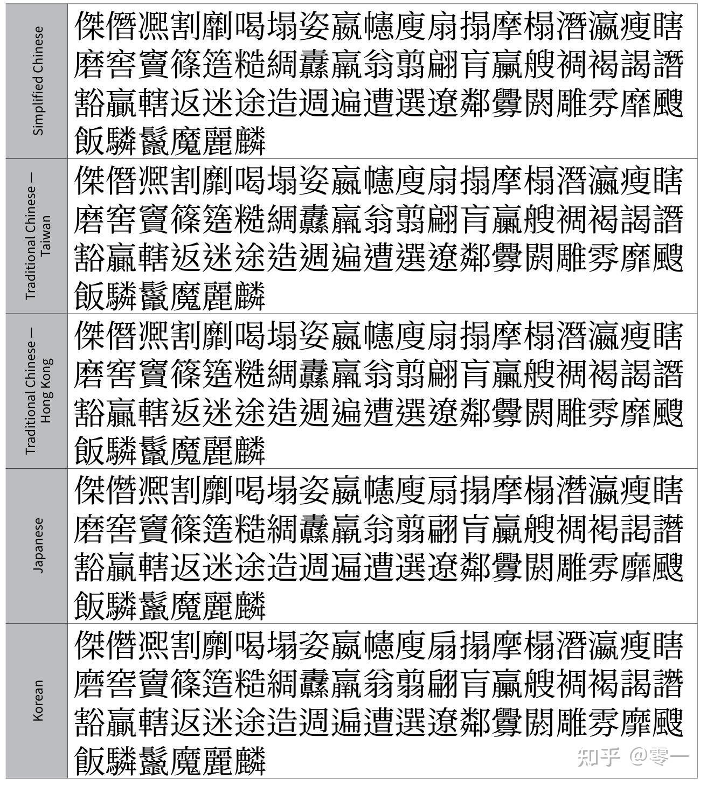

# 信息表示和机器级代码

在使用计算机的过程中，我们很容易冒出这样的问题：我们在计算机上看到各种各样的信息，比如文字、图片、音频、视频等等，这些信息是如何在计算机中表示和存储的？计算机是如何理解和处理这些信息的？我们写的代码充其量只是一堆有逻辑的文本，计算机是如何将这些文本转换为可以执行的机器级代码的？本章就来带领大家了解这些问题的答案。

**我非常建议有时间的同学们阅读CSAPP这本经典教材，而且能读英文原版就读原版。**这是一本非常好的教材，内容非常全面，值得一读。

## 信息怎么被表示？

我们写的程序中，有各种各样的数据类型，例如整数、浮点数、字符、字符串等。计算机也只认识0和1，那么，这些繁多的数据类型在计算机中是怎么被表示的呢？

在计算机上，信息是以二进制的形式被表示的，也就是0和1。每一个数字都是一个二进制位（bit），8个二进制位组成一个字节（byte）。于是我们就了解了：计算机上的数字只是约定好的0-1串，且要遵从一定的格式；计算机本身并不知道内存中这里存的是什么，这一切实际上都是程序告诉计算机的。于是你就理解了为什么在C系语言中的 `union` 可以把同一块内存当成不同类型来读写：内存中的0-1串并没有类型，类型只是程序员的约定。

为了表示方便，计算机上一般利用十六进制的两位来表示一个字节，例如十进制下的11，写成二进制是0b1011，写成十六进制是0xB；其中 `0b` 表示后面这个是二进制数[^1]， `0x` 表示后面这个是16进制。有时候也可以看见这个数在八进制下的表示013，这个开头0就表示后面这个是8进制数。

### 整数

整数在计算机中通常使用补码的形式来表示。对于一个n位（这个n指的是二进制位）的有符号整数，最高位是符号位，其他n-1位用于表示数值；对于无符号整数，所有n位都用于表示数值。

例如一个四位的有符号整数，实际数值是各位数值相加，最高位表示$-2^3$，剩下的三位表示$2^2 + 2^1 + 2^0$，因此它的数值范围是$-8$（0b1000）到$7$（0b0111）。而一个四位的无符号整数，所有四位都表示数值，因此它的数值范围是$0$到$15$。

32位计算机中，常见的整数类型 `int` 指的通常是32位的整数（也就是4个字节）。于是我们就知道了，int类型的最大值是$2^{31}-1$，最小值是$-2^{31}$。而无符号整数类型 `unsigned int` （以下简写为 `uint` ）的最大值可以表示为$2^{32}-1$，最小值为0。在C/C++中，int的最大值有宏定义 `INT_MAX` ，最小值有宏定义 `INT_MIN` ，无符号整数的最大值有宏定义 `UINT_MAX` 。

我们知道，十进制中的加法可能会产生进位。二进制加法也不例外，例如$1+1=10$。但是在刚刚的讲解中，我们发现对于 `uint` 类的变量，最长只有32位，那么如果两个变量相加，可能会超过32位，比如两个“1后面跟31个0”这样的整数相加，结果是1后面跟32个0，超过了32位，这个时候就会发生溢出（overflow）。我们一般不能依赖于溢出后的结果。

一般情况下，计算机对溢出行为的处理是取最低32位的结果。例如两个 `uint` 类型的变量相加，如果结果超过了32位，那么计算机往往会将结果的低32位作为最终结果返回。对于有符号整数（ `int` ），溢出结果按模$2^n$回绕；通常情况下也可以理解为将结果的低32位作为最终结果返回。（当然如果一开始就是两个更长的整数相加，例如两个64位的整数相加发生溢出时，就会返回低64位的结果。）

### 浮点数

浮点数是另一个表示实数的方式。浮点数在计算机中通常使用IEEE 754标准来表示。一个32位的浮点数（单精度）由三部分组成：符号位、指数位和尾数位。浮点数的本质是科学计数法的变种。

- 符号位（1位）：表示数值的正负。
- 指数位（8位）：表示数值的指数部分。
- 尾数位（23位）：表示数值的有效数字部分，存储的是隐含前导1的一个二进制小数，实际值是1.xxx。

具体说来，一个32位浮点数的数值可以表示为：

$$
(-1)^{\text{符号位}} \times (1 + \text{尾数}) \times 2^{\text{指数} - 127}
$$

其中，指数的偏移量是127，这个127的来源是$2^{(8-1)} - 1$。同理，一个64位的浮点数（双精度）由1位符号位、11位指数位和52位尾数位组成，指数的偏移量是1023。满足上述标准的单精度和双精度浮点数一般被称为规格化浮点数。因此，我们可以知道，最大的规格化单精度浮点数大概是$3.4 \times 10^{38}$，最小的规格化单精度浮点数大概是$1.2 \times 10^{-38}$；而最大的规格化双精度浮点数大概是$1.8 \times 10^{308}$，最小的规格化双精度浮点数大概是$2.2 \times 10^{-308}$。更精确的长数值（例如128位浮点数）也有类似的表示方法，这里就不赘述了。

现在的问题就变成，尾数位如果全是0，指数位如果全是0或者全是1，这种情况怎么办？IEEE 754标准对这些特殊情况做了规定：

- 如果指数位全是0，尾数位全是0，那么表示的数值是0。
- 如果指数位全是0，尾数位不全是0，那么表示的数值是**非规格化数**，用于表示非常接近0的数值。
- 如果指数位全是1，尾数位全是0，那么表示的数值是无穷大（Infinity）。
- 如果指数位全是1，尾数位不全是0，那么表示的数值是NaN（Not a Number），用于表示未定义或不可表示的数值，例如0除以0。

对于32位非规格化浮点数，数值可以表示为：

$$
(-1)^{\text{符号位}} \times (0 + \text{尾数}) \times 2^{-126}
$$

32位非规格化数的指数部分被固定为-126。同理，64位非规格化浮点数的指数部分被固定为-1022。因此最大的非规格化单精度浮点数大概是$1.7 \times 10^{-38}$，最小的非规格化单精度浮点数大概是$1.4 \times 10^{-45}$；而最大的非规格化双精度浮点数大概是$1.0 \times 10^{-307}$，最小的非规格化双精度浮点数大概是$5.0 \times 10^{-324}$。

然而，有些数值无法精确表示为二进制浮点数，例如十进制下的0.1在二进制下是一个无限循环小数，无法用有限的位数表示。因此，浮点数在计算机中往往只能**近似**表示某些实数，且在数非常大的时候精度会进一步降低。例如计算机实际上计算$0.1+0.2=0.3000\cdots 004$。另一方面，浮点数**并不连续**，从上述表示方法可以看出浮点数也有间隔。一般的，把1到下一个浮点数之间的间隔叫做**机器精度**，例如单精度浮点数的机器精度大概是$1.2 \times 10^{-7}$，双精度浮点数的机器精度大概是$2.2 \times 10^{-16}$。

另一方面，我们知道浮点数是科学记数法，其精度有限，在进行加法或乘法运算时不可避免地会导致舍入误差，而先丢失的精度可能会影响最终的结果，因此**浮点数的运算并不满足交换律和结合律**。例如$1.0 + 1.0 \times 10^{-7} - 1.0 \times 10^{-7} \neq 1.0 + (1.0 \times 10^{-7} - 1.0 \times 10^{-7})$。而在连续运算当中，这个舍入误差会累积，导致结果偏差越来越大。我们在实际操作中应当避免这种情况，例如可以将数值从小到大排序后再进行运算，并尽可能地减少数量级相差过大的数值运算，来减少累积误差。

作为Mini ICS，我们只需要知道浮点数有误差就可以了（这是因为十进制小数可能无法精确表示为二进制浮点数）。因此，工程上**不可以利用浮点数来进行货币运算**，除非使用高精度浮点数（例如 `decimal` 类）。一般的处理是把货币放大100倍（也就是把元变成分），然后用整数来表示和计算。

有不少算法依赖于浮点数有精度这一客观事实，例如最大流算法中Ford-Fulkerson算法在计算机上的有限终止性证明就利用了这一特性。

### 地址

在内存中，每一个字节都有一个唯一的地址。地址通常是一个无符号整数，表示该字节在内存中的位置。地址的大小取决于计算机的架构，例如32位计算机的地址是32位的，而64位计算机的地址理论上是64位的（实际上大部分64位计算机只使用了48位或57位地址空间）。因此前者最多能表示4GB的内存，而后者理论上最多能表示16EB的内存。

有了地址，我们就可以对内存进行读写操作，也可以使用一些更高级的数据结构，例如数组、链表、树等。

### 字符

我们知道，现在的计算机是使用二进制来存储数据的。但是，对于人类使用的语言而言，即使是相对简单的英语，也有52个大小写字母、10个数字、各种标点符号和特殊符号等，远远超过了二进制的0和1两种状态；而计算机却能够正确地显示并处理这些字符。这究竟是怎么做到的呢？

#### 从编码到字符

一个非常容易想到的办法就是，给每一个字符分配唯一的一个编号，然后再使用二进制来表示该编号。通过建立字符和编号之间的唯一映射关系，我们就可以使用二进制来表示字符了。如果把许多个字符和编号之间的映射关系放在一起，就叫做**字符集**；至于如何建立字符和编号之间的映射关系，就叫做**编码方案**。

然而，一开始，不同厂家、不同地区等生产的计算机系统使用不同的编码方案，导致同一个编码在不同的系统上表现为不同的字符，对数据交换造成了严重的障碍。我们童年时候玩的新新魔塔就是一个非常典型的例子，其标题在中国的计算机上显示为“穝穝臸娥”，其中角色“暗黑大法师”被显示为“穞堵臸猭畍”，现在这个甚至成为了一个梗。

为了解决这个问题，也容易想到两种手段：要么利用一些方法来区分不同的编码方案，并在使用时指定编码方案；要么制定一个统一的编码方案，所有的计算机系统都使用这个编码方案。然而，前者的问题非常明显：如果这么做，那么所有的计算机都要存储所有的编码方案，这非常浪费空间；而且，如果用户不知道文件使用了哪种编码方案，那么就无法正确地显示文件内容。那么制定一个统一的编码方案反而成了一个不错的选择。这或许也是新时代的“书同文”吧。

最早的统一编码方案是美国人制定的ASCII编码。该编码使用7位二进制来表示128个字符，包含了英文字母、数字、标点符号和一些控制字符。例如，字母A的ASCII编码是65，字母a的ASCII编码是97，数字0的ASCII编码是48。可是世界上并非只有英语一种语言。为了兼容法语、德语等有变音符号的语言，后来又出现了ISO-8859（以Latin-1为代表）、扩展ASCII编码等，这些编码支持更多字符。

然而，当我们把目光投向亚洲时，我们发现了新的困难：以汉语为代表的亚洲语言有着数万个甚至数十万个字符，显然超过了上述编码的范围。为了促进国际交流，世界人民最终制定了一个统一的字符集：Unicode，或“统一码”。Unicode使用16位二进制来表示65536个字符，包含了世界上所有主要语言的字符以及一些符号和表情符号，同时该编码方案也完全兼容ASCII编码和扩展ASCII编码，例如0的Unicode编码仍然是48。后来也出现了扩展Unicode编码等，可以表示更多的字符。Unicode编码的出现极大地促进了国际交流和信息共享。为了和不同的计算机相适应，Unicode编码也有多种不同的表示方式，例如UTF-8、UTF-16、UTF-32等。其中，UTF-8是最常用的表示方式，它使用1到4个字节来表示一个字符，比较节省空间。Linux和mac OS系统默认使用UTF-8编码。

如果利用错误的编码方案来读取文件，就会出现乱码的问题。以下是常见的一些乱码及其原因，我们在看到这类乱码时，可以根据其原因来判断文件使用了哪种编码方案，从而选择正确的编码方案来读取文件。

!!! note
    列表中“烫烫烫”等行和“锟斤拷”一同在网络上十分流行，但是和锟斤拷等不同。烫烫烫等和编码本身无关。

    `0xCC` 等内容实际上是MSVC编译器在分配内存空间时填充的内容， `0xCC` 是未分配且未赋初值的内存空间，而 `0xCD` 是已动态分配但未赋初值的内存空间， `0xDD` 是已动态分配且已释放但未清理的内存空间。如果试图访问这些内存区域并以字符串形式打到终端上，就会出现烫烫烫等内容。

    举个有趣的例子：

    - 小明煮了20个饺子。当他试图吃到第21个时，喊出“烫烫烫”。
    - 小明说“我要煮20个饺子”但是还没煮。当他试图吃饺子的时候，喊出“屯屯屯”。
    - 小明煮了20个饺子，吃光了并洗了碗。当他试图吃洗完的碗里的饺子时，喊出“葺葺葺”。

常见乱码以及其可能的原因：

| 乱码 | 原因 |
| --- | --- |
| 锟斤拷 | GBK读UTF-8 |
| 大量非法字符和西欧字符 | UTF-8读GBK |
| 仅大量西欧字符，原文变长 | Latin1读UTF-8或GBK |
| 出现大量长得像yp的东西 | UTF-8读UTF-16 |
| 大量不认识的汉字 | GBK读Big-5 |
| 烫烫烫 | UTF-8的 `0xCC` |
| 屯屯屯 | UTF-8的 `0xCD` |
| 葺葺葺 | UTF-8的 `0xDD` |

Linux和mac OS系统默认使用UTF-8编码，因此一般不会出现乱码的问题；而由于一些历史遗留问题，在Windows系统中，如果使用中文系统，则其编码方案通常是UTF16或GBK，但该编码方案并不兼容UTF8编码，因此在处理UTF8编码的文件时，可能会出现乱码的问题。为了解决这个问题，Windows系统后来也提供了Unicode编码的支持（但现在仍不完善）。

在Windows 10以及以后的系统中，我们可以通过 `设置>时间和语言>语言>管理语言设置>更改系统区域设置` ，来将系统的默认编码方案更改为UTF-8编码，从而避免乱码的问题。此类编码应在系统新安装时就启用，以保证不会出现乱码问题。

然而，电脑屏幕上的同一个汉字，往往也有着不同的表现形式。这又是怎么做到的？难不成，Unicode为同一个汉字的不同样子都分配了不同的编码？显然不是这样。实际上，Unicode只为每一个汉字分配了一个编码，而同一个汉字的不同表现形式，是通过不同的**字形**来实现的。简而言之，“字符”是它的身体，而“字形”则是它的外套。

#### 从字符到字形

Unicode为每一个抽象字符都分配了一个唯一的编码，例如汉字“汉”的Unicode编码是U+6C49。但是这仅仅规定了这是什么字符，却并没有规定这个字符长什么样。真正的字符长相，是由**字形**来决定的。字形实际上是在计算机出现之前就已经存在的概念，指的是是字符的具体表现形式：横平竖直还是行云流水，撇是飘带还是刀刃，点是瓜子还是露珠，这些都由字形来决定。

同一个字符可以有着多种字形，这些字形可以有着不同的风格和特点。例如，宋体、黑体、楷体等都是汉字的不同字形；英语等字母语言也有不同的字形，例如Times New Roman、Arial、Courier New等。把目光放远到全世界，我们会发现同一个字符在不同的国家和地区也有着不同的字形，例如中国汉字和日本、韩国所用汉字的字形就有着明显的差异。但是它们都是同一个字符，只是字形不同而已，这便是大一统下的多样性。



不同的字形可以给人不同的感觉和印象，例如宋体给人正式、庄重的感觉，而楷体则给人优雅、柔和的感觉。因此，正确使用字形可以提高文本的可读性和美观性。

#### 从字形到字体

如果把一套风格相同的字形放在一起，装进一个索引文件，再配上一个索引表，就形成了**字体文件**，使用这个字体文件的字形集合就是我们常说的**字体**。例如，宋体字体文件中包含了宋体字形的集合，黑体字体文件中包含了黑体字形的集合。

当计算机试图显示一个字符的时候，它就会去字体文件中查找该字符对应的字形，然后将该字形显示出来。这个过程很容易让人想到活字印刷术：把一套字形雕刻在木块上，然后把这些木块放在一个盒子里，当需要显示某个字符的时候，就从盒子里取出对应的木块，然后将其印在纸上。而实际上一开始的确是这么做的，只是把纸张换成了屏幕罢了！

一开始，人们把字体中的每一个字形作为图片来存储，也就是所谓的“位图字体”。然而这样就会出现一个弊病：每一个字体的大小是固定的，如果我们想要一个大字体，简单地放大其图片是不行的：大家可以参考在手机上放大一张图片的效果，放大后的图片会变得模糊不清，甚至出现锯齿状的边缘。难道要为每一个字号做一个字体吗？显然不现实。

1978年，王选院士主持研制的汉字激光照排系统问世，标志着我国在汉字信息处理领域实现了从无到有的历史性突破。该系统采用了点阵字模技术，不仅可以生成不同字号的汉字，还数千倍地压缩了存储空间，极大地提高了汉字排版的效率和质量。简单地说，它突破了位图字体的局限性，正式的使得字形能够被“算出来”而不是“画出来”，这使得人们彻底打开了字体编写的思路。

1982年，Adobe推出划时代的字体格式PostScript，采用三次贝塞尔曲线来描述字形轮廓。这类字体被称为矢量字体，比王选院士的点阵字模技术更进一步。矢量字体可以通过数学公式来描述字形轮廓，因此可以任意缩放而不会失真，且文件体积较小，加载和渲染速度也较快。后来，苹果公司也推出了自己的矢量字体格式TrueType，采用二次贝塞尔曲线来描述字形轮廓，算起来更快。

之后，微软联手Adobe又搞出了OpenType字体，结合了PostScript和TrueType的优点，又能往里塞其他东西（字符变体、连字、小型大写文字、旧式数字等），成为了现在最常用的字体格式。举例说，我们现在看到的ff、fi等连字，实际上就是OpenType字体中的一个特性。汉字方面，王选院士为中文字体打下的坚实地基，也显著地促进了中文字体的不断发展。直至今日，计算机对汉字的处理方式依然是小字号点阵字模、大字号矢量字形的结合；现在，TrueType、OpenType成千上万种中文字体中数以亿计的汉字字形能够被我们随意使用，也离不开王选院士的开创性工作，王选院士也被誉为当代毕昇。

需要说明的是，PostScript等都是具体的**字体格式**，而非字体文件本身。目前的字体基本上都是TTF（TrueType Font）或OTF（OpenType Font）格式的字体文件，而PostScript字体文件（.ps）则很少见了（在Windows上，这个扩展名甚至让位于脚本文件！）。而宋体、黑体、Times New Roman、Arial等则是具体的**字体**，它们可以有不同的字体格式，例如宋体可以有TTF格式的宋体文件和OTF格式的宋体文件。实际上，常规使用者并不需要关系字体究竟是什么格式，只需要选择喜欢的字体（字形）即可。

#### 从字体到屏幕

计算机屏幕是由无数个像素点组成的，每一个像素点可以显示一种颜色。当我们试图在屏幕上显示一个字符的时候，计算机会先去字体文件中查找该字符对应的字形，然后将该字形转换为一组像素点，并将这些像素点显示在屏幕上。这个过程叫做**字体渲染**。字体渲染的过程非常复杂，涉及到许多技术和算法，例如抗锯齿、次像素渲染、字距调整等。不同的操作系统和应用程序可能会使用不同的字体渲染引擎，导致同一个字体的同一个字符在不同的系统和应用程序中显示效果不同。

#### 字重、斜体和复合字体

在计算机出现之前，字重和斜体等就随着着印刷术的发展而出现了。字重指的是字体的粗细程度，一般可以分为Regular（常规）、Bold（粗体）、Light（细体）等。斜体指的是字体是倾斜的，一般可以分为意大利体（也叫斜体，Italic）和倾斜体（Oblique）[^2]。字重和斜体可以用来强调文本中的某些部分，例如标题、关键词等，从而提高文本的可读性和美观性。

在设计字体的时候，我们自然会考虑设计不同的字重和斜体版本。然而，如果为每一个字体都设计一个不同字重的版本，而不同字重的版本有的还需要斜体，这样就会导致字体文件数量爆炸，且每一个字体文件的体积也会变得很大。为了解决这个问题，我们可以使用**复合字体**。复合字体是指将多个字重和样式的字体文件组合在一起，形成一个统一的字体文件，这样不仅便于分发，也便于管理和使用。复合字体通常会包含Regular、Bold、Italic、Bold Italic等常用的字重和样式。

然而，大多数汉字字体并没有斜体字体：这是因为汉字是方块字，斜着不好看，没有这方面的需求，因此大多数汉字字体并没有斜体版本。对于英文字体而言，斜体是非常常见的，例如Times New Roman、Arial等都有斜体版本。

那有的读者会问了：为什么在MS Office中，我们能对汉字进行倾斜操作呢？这是因为，微软对斜体的定义比较宽泛：只要是倾斜的都叫斜体，而不一定非得是斜体版本的字体。对于没有斜体版本的汉字字体，微软会通过软件算法来实现倾斜效果，形成所谓的“伪斜体”。类似的，微软的Word等软件也会对没有粗体版本的汉字字体进行加粗处理，形成所谓的“伪粗体”，例如微软宋体（宋体，SimSun）就没有粗体版本，微软会通过软件算法来实现加粗效果，形成伪粗体。而对于Times New Roman等有粗体和斜体版本的字体，微软则会直接使用对应版本的字体。所以我们会发现，Times New Roman等字体的斜体和整体比起来字形有明显的差异，而宋体汉字的斜体和整体比起来字形没有明显的差异。

#### 衬线、无衬线和等宽字体

字体可以分为衬线字体、无衬线字体和等宽字体三种类型。

衬线字体（Serif）是指在字形的笔画末端有小装饰线条的字体，例如宋体、Times New Roman等。衬线字体通常被认为更适合用于印刷品和长篇文本，因为衬线可以引导读者的视线，提高文本的可读性。无衬线字体（Sans Serif）是指没有衬线的字体，例如黑体、Arial等。无衬线字体通常被认为更适合用于屏幕显示和短篇文本，因为无衬线字体更简洁、现代，且在低分辨率下也能保持清晰。等宽字体（Monospace）是指每一个字符占用相同宽度的字体，例如Courier New、Consolas等，也叫打字机字体。等宽字体通常被认为更适合用于编程和代码编辑，因为等宽字体可以使代码更整齐、易读，且便于对齐和排版。

我们知道，汉字是方块字，每一个字它天然就是等宽的，所以为汉字设计等宽字体没有什么意义，也就没有汉字的等宽字体。一般排版中，往往使用汉字的无衬线字体（例如黑体、微软雅黑等）来搭配英文字体的等宽字体（例如Consolas、Courier New等），以达到较好的视觉效果。有些时候用仿宋搭配西文等宽字体也不错。

#### LF和CRLF

刚刚讲完字符和编码，我们就可以来讲讲这个东西了。

LF和CRLF是两种不同的换行符表示方式。LF是Line Feed的缩写，表示换行符；CRLF是Carriage Return和Line Feed的组合，表示回车换行符。有的人可能会疑惑：现代计算机上，回车和换行不是一回事吗？为什么还要区分这两者呢？实际上，这个问题要追溯到打字机时代。

在打字机时代，回车和换行不是一个键。回车是指将打印头移动到行首（但行数不变），而换行是指将打印头移动到下一行（但列数不变）。这里能提“行列”的主要原因是，西文打字机的本质实际上是在表格中输入，其字符也是等宽的。所以我们在打字机上，如果想要达到现在计算机上的换行效果，就需要先按回车键将打印头移动到行首，然后再按换行键将打印头移动到下一行。

那为什么现代计算机上这两个键就没有了呢？其实归根到底完全可以用“麻烦”来解释，合二为一能够简化键盘。但是，在ASCII码表中，却保留了这两个控制字符：CR（Carriage Return，回车，ASCII码为13）和LF（Line Feed，换行，ASCII码为10），分别用 `\r` 和 `\n` 来表示。

而现代不同操作系统对这两个控制字符的使用方式却不一样：Unix和类Unix系统（如Linux、mac OS等）使用LF作为换行符，而Windows系统则使用CRLF作为换行符。实际上这是历史遗留问题：在上世纪，当时系统三巨头是Unix、Dos和Mac OS，它们分别使用LF、CRLF和CR（你没看错，Mac OS早期版本使用CR，没有LF）作为换行符。后来，Mac OS内核受到BSD Unix的启发，从古老的Classic Mac OS（使用CR作为换行符）演变成了mac OS X（基于Unix的系统），因此也顺便改用了Unix的LF。而Dos则演变成了Windows 3.1（当时Windows 3.1仅是一个运行在DOS系统上的软件！），并沿用了Dos的CRLF作为换行符；再后来，Windows NT内核（Windows 95/98混血，2000开始全面使用NT内核）诞生，但是为了兼容性，Windows依然沿用了CRLF作为换行符！

这就导致了一个问题：如果我们在Windows系统上创建了一个文本文件，然后将其复制到Linux系统上打开，可能会出现换行符显示异常的问题（行尾出现不可见字符）。同样地，如果我们在Linux系统上创建了一个文本文件，然后将其复制到Windows系统上打开，可能会出现换行符显示异常的问题（所有内容都在一行显示）。

那这就很麻烦了，有没有什么解决办法呢？当然有！大多数现代文本编辑器（如VS Code、Notepad++等）都支持自动识别和转换不同的换行符格式，我们只需要在保存文件时选择合适的换行符格式即可。此外，我们也可以使用一些命令行工具（如 `dos2unix` 和 `unix2dos` ）来转换文本文件的换行符格式。但令人不爽的是，Git会导致换行符格式混乱的问题，这需要我们在使用Git时特别注意，建议在Git配置中设置合适的换行符处理方式（例如 `core.autocrlf` 选项），即明确规定在检出和提交时如何处理换行符格式。

这也说明了，当今社会是一个统一的社会，标准的不统一依然是一个极其让人头疼的问题，至于之后究竟是全面统一成CRLF还是LF，有待于后人的努力了。

## 程序怎么跑起来？

不知道同学们在写程序的时候，会不会疑惑“为什么我写的代码只是文本文件，但为什么这些特定的文本文件能够变成一个可以执行的程序、而我随便写的文章等却不能”。而另一个可能疑惑的问题是“只认识二进制的计算机，为什么能看懂我写的语言”。这就涉及到程序的编译和链接过程了。

我们知道，计算机的编程语言有很多种，这些高级语言都是方便人类来编写的。因此，就需要一些工具来把这些高级语言翻译成计算机能看懂的机器码（machine code）。对于C系语言写出的程序，一般情况下是由源代码（.c或.cpp文件）编译成目标代码（.o或.obj文件），然后链接成可执行文件（.exe或.out文件）。这个过程通常分为三个步骤：预处理、编译和链接。

### 预处理

预处理是对源代码进行一些简单的文本替换和宏展开。预处理器会处理一些指令，例如 `#include` 、 `#define` 等。同时，预处理会除去源代码中的所有注释。从某种程度上来说，预处理后的代码和源代码完全等价。

### 编译和汇编

计算机通过编译器将预处理后的代码转换为汇编码（能读懂一部分），然后再利用汇编器把汇编码转变成机器码（二进制码，人几乎读不懂）。编译器会将源代码转换为目标代码（.o或.obj文件），这个目标代码是特定于处理器架构的。这两步原理和过程相近，因此我们把它们合并在一起，但实际上是两步，这一点需要注意。

编译器会将源代码中的每个函数、变量等转换为机器码指令，并生成符号表（symbol table）来记录这些符号的地址。

编译器还会进行一些优化，例如常量折叠、循环展开等，以提高程序的执行效率。默认情况下，gcc编译器会进行一些基本的优化，但如果需要更高的优化级别，可以使用 `-O2` 或 `-O3` 选项。**优化可能暴露代码中的未定义行为**，但是不会导致本符合标准的代码出现错误。因此，我们一定要尽可能地编写符合标准的代码。

### 常见汇编码

x86-64架构是Intel的64位架构，在现代计算机非常常见。我们会利用该架构来简单解释汇编码的语法。

在深入介绍汇编码之前，我们要先了解一下CPU的寄存器。寄存器是CPU内部的高速存储器，用于存储临时数据和指令。x86-64架构有16个通用寄存器（RAX、RBX、RCX、RDX、RSI、RDI、RBP、RSP、R8-R15），每个寄存器都是64位的。CPU将指令和数据加载到寄存器中，利用控制单元CU来执行指令，利用算术逻辑单元ALU来进行计算。

x86-64架构的汇编码通常由操作码（opcode）和操作数（operand）组成。操作码是指令的名称，操作数是指令的参数。以下是一些常见的汇编码指令：

- `mov` ：将数据从一个寄存器或内存位置移动到另一个寄存器或内存位置。
- `add` ：将两个寄存器或内存位置的值相加，并将结果存储在第一个寄存器或内存位置中。
- `sub` ：将一个寄存器或内存位置的值减去另一个寄存器或内存位置的值，并将结果存储在第一个寄存器或内存位置中。
- `jmp` ：无条件跳转到指定的标签。
- `call` ：调用函数，将返回地址压入栈中。
- `ret` ：从函数返回，弹出栈顶的返回地址。
- `cmp` ：比较两个寄存器或内存位置的值，并设置标志位。
- `je` 、 `jne` 、 `jg` 、 `jl` 等：条件跳转指令，根据比较结果跳转到指定的标签。

在x86-64架构中，假如我们想要把某个整数从寄存器RAX移动到寄存器RBX，可以使用以下指令：

```gas
mov rbx, rax
```

或者说我们想要call一个函数，假设函数名为 `foo` ，可以使用以下指令：

```gas
call foo
```

这是最基本的一些汇编码指令。对于其他的机器（例如Arm架构），汇编码的语法和指令可能会有所不同，但基本原理是相似的。编译器会在不同的架构上生成不同的汇编码，来保证程序的正确性和效率。

对于同一个机器，不同程序的同一句汇编码被编译出的机器码是一样的。比如说在x86-64架构上且使用AT&T语法时， `mov rbx, rax` 这句汇编码被编译成的机器码永远 `48 89 D8` ，不会改变。

### 其他情况

对于解释性语言，情况略有不同。

以Python为例，它是一种解释性语言。这种语言并不需要先编译成机器码，而是通过解释器（例如CPython）先把 `*.py` 文件编译成**字节码**（bytecode）（.pyc文件），然后再由虚拟机（VM）来逐条解释执行这些字节码。字节码是一种中间表示形式，介于源代码和机器码之间。Python的字节码是与平台无关的，可以在任何支持Python解释器的系统上运行。而另一些工具（例如PyPy、Jython）会有JIT编译功能，能够把字节码编译成更高效的机器码来执行，而不是逐条解释执行。

而对于以C#为首的“中间语言”，情况又略有区别。C#是一种编译型语言，但它并不直接编译成机器码，而是编译成一种中间语言（Intermediate Language，IL），也叫做托管代码（Managed Code）。这种中间语言是一种与平台无关的字节码，可以在任何支持.NET框架的系统上运行。然后，.NET框架会利用即时编译器（JIT compiler）将中间语言编译成特定平台的机器码来执行。因此，C#的逆向工程非常容易，直接反编译IL就能得到接近源代码的结果。

### 从文件到程序

刚才，我们知道了程序是怎么从源码转变成可执行文件的。那么，程序是怎么从可执行文件跑起来的呢？

在Linux中，可执行文件叫做ELF（Executable and Linkable Format）文件。ELF文件包含了程序的代码段（text segment）、数据段（data segment）、堆（heap）、栈（stack）等信息。操作系统通过加载器（loader）将ELF文件加载到内存中，并创建一个新的进程来执行该程序。在Windows中，可执行文件叫做PE（Portable Executable）文件，原理类似。

当我们运行一个可执行文件时，操作系统会将文件加载到内存中，并创建一个新的**进程**来执行该程序。每一个进程中都会有一个或多个**线程**，线程是进程中的一个执行单元。每个线程都有自己的寄存器状态和栈空间，但多个线程可以共享进程的内存空间。

操作系统会为该进程分配内存空间，并将程序的代码和数据加载到内存中。然后，操作系统会将CPU的控制权转移到程序的入口点（通常是 `main` 函数），开始执行程序。

程序在执行过程中，CPU会不断地从内存中取指令，并执行这些指令。程序可能会调用其他函数、分配和释放内存、进行输入输出等操作。当程序执行完毕后，操作系统会回收该进程的资源，并将控制权返回给操作系统。一般情况下，程序只能够访问分配给自己的内存空间，不能访问其他进程的内存空间。程序一般无法直接操作外存中的内容，必须通过操作系统提供的系统调用来进行文件读写等操作，显著地降低了恶意程序破坏文件的风险。

当然，也有一些病毒等恶意程序会利用系统漏洞来直接操作其他进程的内存空间，或者直接操作外存中的内容，破坏文件系统的完整性和安全性。

怎样才能证明上述ELF文件“确实”包括这些内容呢？我们可以这样，先用 C[^3] 写一点东西，然后运行下列命令：

```bash
gcc -o hello hello.c # 编译 C 源代码
objdump -d hello      # 反汇编可执行文件
```

然后我们就会看到类似下面的输出：

```text
hello:     file format elf64-x86-64
Disassembly of section .text:
0000000000401136 <_start>:
  401136:    31 ed                   xor    %ebp,%ebp
  ...
```

在上述反汇编输出中，我们可以看到ELF文件的格式信息，以及程序的代码段（.text section）中的汇编码指令。这些指令就是程序在运行时会被CPU执行的机器码指令。通过这种方式，我们可以验证ELF文件确实包含了程序的代码段。而数据段、堆、栈等内容则可以通过调试器（如gdb）来查看。

一般情况下，在C中，程序的入口点是 `main` 函数。然而，在ELF文件中，程序的实际入口点是 `_start` 标签。这个标签是由编译器自动生成的，它负责初始化程序的运行环境，并调用 `main` 函数。因此，当我们运行一个C++程序时，操作系统实际上是从 `_start` 标签开始执行程序的。

### 链接

有时候，代码不是由单一源文件组成的，而是由多个源文件组成的。在这种情况下，编译器会将每一个源文件编译成一个目标文件（.o或.obj文件），然后再利用链接器（linker）将这些目标文件链接成一个可执行文件。

例如，有一个目录：

```text
project/
- utils.c
- utils.h
- main.c
```

这个目录中的文件（不依赖任何构建工具的话）是这样编译和链接的：

```bash
gcc -c utils.c -o utils.o  # 编译 utils.c 成为目标文件
gcc -c main.c -o main.o    # 编译 main.c 成为目标文件
gcc utils.o main.o -o app   # 链接目标文件成为可执行文件
```

在链接过程中，链接器会将各个目标文件中的符号表进行合并，并解决符号引用。例如，如果 `main.c` 中调用了 `utils.c` 中的函数，链接器会将这些函数的地址进行替换，从而使得程序能够正确地调用这些函数。

我们知道，在C语言中，变量有局部和全局之分。这些变量还有一些重要的属性，如static、extern等。这些属性会影响变量的链接方式。例如，static变量是局部变量，只能在定义它的源文件中访问，因此它不会出现在符号表中。而extern变量是全局变量，可以在多个源文件中访问，因此它会出现在符号表中，链接器会将这些变量的地址进行替换。通过符号表，链接器能够正确地将各个目标文件中的符号进行链接，从而生成一个完整的可执行文件。

[^1]: 仅限于GNU语法。
[^2]: 意大利体指的是字形本身是倾斜的，而倾斜体指的是将常规矩形字体压扁成普通平行四边形而成的字体。
[^3]: 这里不用C++，是因为C++会引入一些额外的内容，例如异常处理、虚函数表等，可能会干扰我们的观察。
