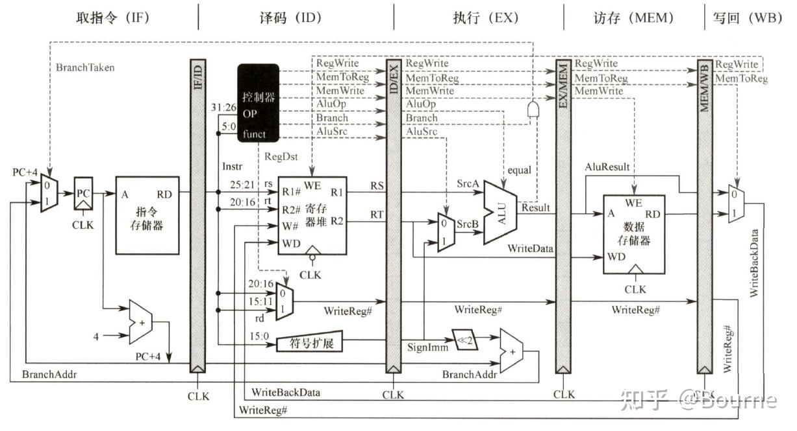

# 内存缓存管理和系统调用

在上一章，我们已经知道，计算机不是直接执行文本文件，而是执行文本文件编译出的机器码。而新的问题接踵而至：计算机是如何存储和管理这些机器码的？计算机是如何从内存中取出指令和数据的？买电脑的时候发现内存的频率仅有几千MHz，而CPU的频率却高达几GHz，计算机是如何解决这个速度差异的？同时运行的计算机程序众多，如果都在内存中乱写，那么内存岂不是乱成一锅粥了？本章就来带领大家了解这些问题的答案。

## 内存怎么被管理？

刚刚我们提到，计算机的CPU从内存取指令和数据，执行指令，然后把结果再存回内存。但是现在的问题是：对于一些用户，我们可能会在后台挂着114514个进程，这些进程都需要使用内存。但是这些进程所占用的内存可能远远大于实际物理内存的大小。那么，计算机到底怎么管理内存，使得每个进程都能正常运行？

### 虚拟内存、页面、页表

计算机使用虚拟地址空间来管理内存。每个进程都有自己的虚拟地址空间，都认为自己是从0号地址开始用内存的。操作系统通过虚拟内存技术，将虚拟地址映射到物理地址。这样，每个进程都可以独立地使用内存，而不需要关心其他进程的内存使用情况。

打个比方：某高度智能运行的图书馆给每一本书贴一个标签，标签上写着书的编号；但是读者不需要管实际上书放在哪里，只需要知道自己的书编号就行了。

实际上，如果我们在编译一个多源文件的C程序的时候，允许中间文件的生成，就会发现每个源文件都会生成一个中间的汇编文件，这些汇编文件中的地址全都是**虚拟地址**，这个虚拟地址[^1]是基于特定汇编文件的；也就是说，在链接这一步之前，每个汇编文件的地址都是从0开始的。链接器会把这些汇编文件链接成一个可执行文件，链接过程中会把这些虚拟地址重新映射成一个连续的地址空间，但该地址空间实际上依然是虚拟地址空间。最后，当我们运行这个可执行文件的时候，操作系统会把这个虚拟地址空间映射到物理内存中。

对普通应用程序开发者（相对于底层开发者或嵌入式开发者）而言，现代计算机编程中，我们把所有地址全都当成虚拟地址来使用。也就是说，C的裸指针指向的地址都是虚拟地址，操作系统会负责把它们映射到物理内存中。我们在编写程序的时候，不需要关心物理内存的地址，只需要使用虚拟地址就行了。

而这时，我们会发现虚拟内存还能达成一个意外之喜：虚拟内存的存在，实际上阻止了程序访问不属于它的内存区域。因为每个进程都有自己的虚拟地址空间，操作系统只需确保每个进程只能访问自己的虚拟地址空间，不能访问其他进程的虚拟地址空间。这样就能有效地保护每个进程的内存安全，防止恶意程序破坏系统的稳定性和安全性。这是现代操作系统比DOS等老式操作系统更安全的重要原因之一。

操作系统使用页表来管理虚拟地址和物理地址之间的映射关系。虚拟内存被划分成固定大小的页面（page），物理内存也被划分成同样大小的页面。每个虚拟页面可以映射到一个物理页面，或者不映射（表示该虚拟页面没有对应的物理页面）。操作系统通过页表来记录这些映射关系。当程序访问一个虚拟地址时，操作系统会查找该虚拟地址所在的页表项，找到对应的物理地址，然后进行访问。

页面是虚拟内存的基本单位，通常是4KB或8KB。页表是一个数据结构，用于记录虚拟地址和物理地址之间的映射关系。每个页表项包含了虚拟页面的状态信息，例如是否有效、是否被修改、是否被访问过等，以及对应的物理页面的地址。当程序访问一个虚拟地址时，操作系统会查找该虚拟地址所在的页表项，找到对应的物理地址，然后进行访问。

### 磁盘交换区和缺页异常

磁盘交换区用来解决物理内存不足的问题。当物理内存不足时，操作系统会将一些不常用的页面（page）从物理内存（快）中换出到磁盘上的交换区（swap space）（慢）；而在需要访问这些页面时，操作系统会从磁盘交换区中加载相应的页面到物理内存中。这样就能让计算机在物理内存不足的情况下继续运行，而不会因为内存不足而崩溃。

在上述利用页表管理虚拟内存的过程中，如果程序访问了一个虚拟地址，但是该虚拟地址没有对应的物理地址，那么就会发生缺页异常（page fault）。操作系统会捕获这个异常，然后从磁盘上的交换区中加载相应的页面到物理内存中。如果磁盘交换区也没有该页面，那么操作系统就会终止该程序，并报告段错误（segmentation fault），这大概率是因为程序访问了一个非法的虚拟地址。所以说页表实际上就是操作系统“确保每个进程只能访问自己的虚拟地址空间”的重要工具。

如果在加载相应页面到物理内存中时，物理内存已经满了，那么操作系统就需要选择一个页面进行换出，以腾出空间来加载新的页面。操作系统通常会使用一些算法来选择要换出的页面，例如最近最少使用（LRU）算法、先进先出（FIFO）算法等。

### 内存分配器

内存分配器（memory allocator）是操作系统或运行时库提供的，用于管理进程的内存分配和释放。常见的内存分配器有 `malloc`、`free` 等函数。内存分配器会维护一张空闲内存块的列表，当进程请求分配内存时，分配器会从空闲列表中找到合适的内存块，并将其分配给进程。

假如我们在C系语言用了malloc函数分配了许多字节的内存，这时候操作系统**不会**直接分配物理内存，而是分配虚拟内存。操作系统会在页表中记录这个虚拟地址和物理地址的映射关系。而真正给物理页，是“用到才给”，多数情况下，当我们第一次访问这个虚拟地址时，操作系统会触发缺页异常，然后将对应的物理页加载到内存中；少数情况下（例如堆内存），操作系统会预先分配一些物理页而不是延迟到首次访问才分配。

这也可以解释为什么我malloc了10GB内存但是电脑依然流畅运行：还没真正分配呢。

### 一个例子

假如，我们打开了微信。这时候，操作系统给微信预留了1GB的虚拟地址空间；但是实际上只先分配很少数的物理内存来加载常用数据，剩下的全在磁盘交换区。然后，假设我们又切换到其他应用程序（例如去B站看视频），这时候B站会获得许多新的物理页，而微信的物理页会被换出去一部分。

现在老板给我发消息了，我打开微信，点击几下，这时操作系统触发一个缺页异常，然后微信数据又被拉回内存。如此反复，整个过程只在数十毫秒内完成，使得我们几乎感觉不到延迟。

因此以后谁再拿“某某手机/某某电脑真好，同时开十个APP也不卡”来宣传产品的时候，你可以跟他讲讲虚拟内存！

## 怎么压榨CPU的性能？

我们知道，CPU是计算机的核心部件，负责执行指令和处理数据，其做法是从内存中取指令和数据，执行指令，然后把结果再存回内存。但是，现在的计算机内存的速度已经远远跟不上CPU的速度了。我们怎么才能更进一步地压榨CPU的性能呢？

有时候在做超大矩阵乘法的时候，我们发现仅将循环从按列换成按行，或者从按行换成按列，就能将程序的运行速度提升许多。这又是为什么呢？这就涉及到了CPU的缓存机制。

### 缓存的分级

CPU的缓存（cache），又叫高速缓存，是一种小容量、高速度的存储器，用于存储经常使用的数据和指令。缓存通常分为三级：L1、L2和L3缓存。

- L1缓存：位于CPU内部，速度最快（1纳秒级），但容量最小，通常为32KB或64KB。
- L2缓存：位于CPU内部或外部，速度较快（3到5纳秒级），容量较大，通常为256KB或512KB。
- L3缓存：位于CPU外部[^2]，速度较慢（10纳秒级），但容量最大，通常为2MB或更大。

再往后就轮到内存了，内存的速度大约是100纳秒级别。我们可以利用小卖部来理解，L1缓存有点像学校每层楼都有的贩卖机，L2有点像每栋楼都有的小超市，L3有点像学校的大超市，而内存有点像学校外面的供货仓库。

### 缓存行和局部性原理

缓存是以缓存行为单位进行存储的。缓存行（cache line）是缓存中最小的传输单位，通常为64字节，但CPU依然能够按字节寻址。当CPU访问内存时，如果访问的地址在某个缓存行内，那么这个缓存行就会被加载到缓存中。我们可以这么理解：当我们去贩卖机只会买一瓶饮料，但是贩卖机补货的时候是一补补一箱。只要把经常一起用的数据放在连续的一个缓存行上，就能一口气全带走，非常方便。

缓存的局部性原理是指程序在执行过程中，访问数据的地址往往具有一定的规律性。局部性分为时间局部性和空间局部性。时间局部性指的是最近访问的数据很可能会再次被访问；空间局部性指的是如果访问了某个地址，那么很可能会访问相邻的地址。

因此，我们在编写程序时，应该尽量利用局部性原理，将相关的数据放在一起，减少缓存未命中（cache miss）的情况。

### 组相联和标签

缓存通常采用组相联（set-associative）方式来存储数据。组相联缓存将缓存分为多个组，每个组包含多个缓存行。当CPU访问某个地址时，首先计算出该地址对应的组，然后在该组内查找是否有对应的缓存行（way）。如果有，就命中（hit），否则就未命中（miss），需要从内存中加载数据。

每一个缓存行都会贴两个标签，一个是tag记录该缓存行对应的内存地址的高位部分，另一个是valid位记录该缓存行是否有效。在CPU要读一个地址的时候，CPU会先计算出该地址对应的组，然后在该组内查找是否有有效的缓存行。如果有，就命中；如果没有，就未命中，需要从内存中加载数据。

### 未命中常见工作流程

当CPU访问的地址不在缓存中时，就会发生读不命中。这时，CPU需要从内存中加载数据到缓存中。加载数据的过程通常分为以下几个步骤：

1. L1缓存没有，去L2缓存查找；L2缓存没有，去L3缓存查找；L3缓存没有，去内存查找。
2. 如果找到了，就将数据加载到L1缓存中，并更新L1缓存的标签和有效位。
3. 如果L1缓存满了，就需要选择一个缓存行进行替换。通常使用LRU（Least Recently Used）算法来选择最近最少使用的缓存行进行替换。L2和L3缓存也会进行类似的替换操作。

如果CPU试图往缓存中写入数据，而该缓存行已经被其他数据占用，那么就触发了写不命中。一般有一些策略来处理写不命中，例如写回（write-back）和直写（write-through）。写回策略是将数据先写入缓存，等到当缓存行被标记为“脏”时才写回时再写回内存；直写策略是直接将数据写入内存。写分配和不写分配是指在写不命中时，是否将数据加载到缓存中。写分配会将数据加载到缓存中，而不写分配则不会。

### 大矩阵乘法的工作原理

于是我们讲完了缓存，现在就可以来解释为什么有时候换个循环顺序就能提速一倍了。

一般情况下，一个二维数组，按行扫的时候，相邻的元素在内存连续，64个字节一口气全都搬进L1，命中率非常高；而按列扫的时候，相邻的元素在内存中并不连续，可能需要多次访问L2和L3缓存，命中率就会降低。

另一种方式就是手动对齐数据，例如利用结构体来对齐数据。这样可以防止诸如double等长数据类型被拆成好几个缓存行，手动对齐可以强制把这样的64位数据按进一个缓存行，速度至少翻倍。

简单地说，只要让常用数据挤在同一箱里，就能让小卖部永远有货。

### 流水线

上述缓存机制虽然显著提升了CPU的性能，但是CPU依然有一个瓶颈：指令执行的速度远远跟不上CPU的时钟频率[^3]。为了进一步提升CPU的性能，现代CPU采用了流水线（pipeline）技术。

这个流水线和工厂内的流水线非常类似。例如汽车组装工厂，现在并不是一辆车组装完了再组装下一辆车，而是把组装过程分成多个阶段，每个阶段由不同的工人负责。这样，当第一辆车进入第二个阶段时，第一辆车的第一个阶段已经完成，第二辆车可以进入第一个阶段进行组装。这样，工厂就能够同时组装多辆车，大大提高了生产效率。在CPU中，我们也是这样，把一个指令的执行过程分成：

1. **取指（IF）**：根据 PC 把指令读进指令寄存器；
2. **译码（ID）**：解析操作码、读寄存器堆拿到操作数；
3. **执行（EX）**：在 ALU 或地址生成单元里完成运算；
4. **访存（MEM）**：若是 load/store，访问数据缓存；
5. **写回（WB）**：把结果写回寄存器堆并更新标志位。

然后和工厂中流水线一样，每一级都让独立的硬件单元完成。理想情况下，当上一条指令进入EX阶段时，下一条指令就跟着进入IF阶段，于是每个时钟周期都能完成一条指令的执行，大大提高了CPU的性能。



在实际情况下可能有三类“气泡”会让流水线停顿：

- 数据冒险：当后一条指令恰好用到了前一条指令尚未写回的结果时，就会发生数据冒险，一个容易想到的解决方法是插入**气泡**（stall），让流水线停顿一段时间，直到前一条指令的结果写回。另外的解决方法是**数据转发**（或**数据前递**，data forwarding），直接把前一条指令的结果旁路到后一条指令的EX级，避免停顿。
- 控制冒险：当遇到分支判断的时候，下一条指令的地址实际上是未知的。这时候也容易想到插入气泡来等待分支结果。为了防止这种情况，现代CPU通常会采用**分支预测**（branch prediction）技术，猜测下一条指令的地址，并提前加载到流水线中。如果猜测正确，就继续执行；如果猜测错误，就丢弃错误的指令，重新加载正确的指令，这样的代价是大约10到20个时钟周期的猜测惩罚。而怎么猜则是一个技术活，常见的方法有静态预测（例如总是猜测分支不跳转）和动态预测（例如利用历史信息来预测分支行为）。
- 结构冒险：当多个指令同时竞争同一个硬件资源时，就会发生结构冒险。例如，如果只有一个乘法器，而两条指令都需要使用乘法器，那么就会发生结构冒险。当然插入气泡也并非不可，而通过多端口寄存器堆、分离的指令和数据缓存等方法也可以缓解结构冒险的问题。

要是再往上提升性能，一般有三种手段：超标量（superscalar）、乱序执行（OoO）和超线程（SMT）。超标量指的是每一个周期同时发射多条指令到流水线中执行；乱序执行指的是指令不必严格按照程序顺序执行，而是可以根据数据依赖关系和资源可用性来动态调整执行顺序，只要操作数就绪了这条指令就可以抢跑，最后按指令序号重新提交结果；超线程指的是在流水线里面交替塞两条线程的指令，把闲置端口也利用起来。

以上操作对我们写代码有相当的启示：尽量保持分支可预测（有规律，少跳转），减少数据依赖（多用临时变量，少用全局变量），减少资源竞争（少用全局变量，少用锁），循环体小而整齐（减少指令数，增加指令并行度）。这样就能让流水线吃得饱饱的，性能自然就上去了。例如：

```c
int cnt = 0;
for(int i = 0; i < n; i++)
  if (a[i] > 128) // 这个是分支结构，且不可预测
    ++cnt
```

这个实践是不好的，因为数组模式随机，分支不可预测，数据依赖严重。改成下面这样就好多了：

```c
int cnt = 0;
for(int i = 0; i < n; i++) {
  int flag = (a[i] > 128); // 这个是运算，没有分支表达式
  cnt += flag;
}
```

这样就消除了分支，数据依赖也减轻了许多，编译器大概会把上述内容编译成 `setgt` 和 `add` 指令，流水线就能更好地并行执行。

!!! tip
    当然，根据“不优化”原则我们知道，实际操作中未必需要严格这么写，或者说仅在以下情况差异显著：

    - 数据量巨大，例如n达到百万级别以上；
    - 数据内容相当随机地分布，例如a[i]的值均匀分布在0到255之间；
    - 编译器没有做激进优化，例如开的 `-O0` 或者 `-O1`；
    - 没有使用SIMD指令等技术，例如编译器没有自动向量化，或者没有手动使用AVX等指令集。

    反之，当数据量小、大多数数据大于128（分支预测器能学习并预测）、编译器激进优化（“吸氧”甚至“吸臭氧”）、使用SIMD指令等技术时，差异就不明显了。

    如希望验证我的上述说法，可以利用 `perf` 等工具进行性能分析，重点观察 `branch-misses`、`instructions`、`cycles` 等指标，`-O2` 和 `-O0` 的差异也可以对比一下。

### 现代CPU的架构

旧时代的CPU一般走的是单核高频路线，这也是非常容易想到的提升性能的方式：把一个核的频率提升到极限，然后让这个核尽可能地快地执行指令。这样做的好处是简单易行，缺点是功耗和发热量都非常高，且单核性能提升空间相当有限。这个路线撞墙的例子就是Intel的NetBurst架构（奔腾4），频率最高能达到3.8GHz，但是单核性能并没有显著提升，反而因为发热量过大而被迫降频。

于是，现代CPU性能渐渐地走向了多核化、并行化的路，性能不仅靠GHz撑着，并行度和专用加速也成为了重要的指标。当下主流芯片把多种计算单元拼成SoC，一般还有大小核之分（big.LITTLE架构），大核负责高性能计算，小核负责低功耗计算，二者协同工作以提升整体性能和能效比。

1. 性能核（P-core）：乱序、宽发射、高频率，跑串行关键路径；
2. 能效核（E-core）：顺序或窄发射，面积小、功耗低，跑后台线程；
3. 矢量/矩阵单元：SSE/AVX/AVX-512、SVE、AMX，一条指令打 512 bit-2048 bit 的 SIMD，做 dense math；
4. 集成 GPU Or NPU：上千线程级的 SIMT，负责图形与 AI 推理；
5. 片上系统：DDR/LPDDR 控制器、PCIe 5.0、CXL、缓存一致性总线（Ring/Mesh），把 CPU、GPU、加速器、内存、外设粘在一起。

而缓存也从上文所述的经典缓存升级为支持网状多切片、非包容/非排他性、智能预取等特性的现代缓存系统，以适应多核、多线程、高并发的计算需求：

- 每个 P-core 独享 48 KB L1-I + 32 KB L1-D + 1-2 MB L2；
- 多核通过 Mesh 节点共享 24-96 MB L3，切片数等于核数，降低热点；
- 目录式（Directory）或总线嗅探（MESIF）协议保证多核一致性，跨核延迟 30-60 ns。

而对于我们开头的“超大矩阵乘法”这种还吃内存带宽的计算任务，现代CPU也有不少提升手段：

- AVX-512 / AMX：单指令可算 $16\times 64$ 矩阵块，理论算力提升4到8倍；
- 高带宽内存：笔记本 LPDDR5X 已做到 120 GB/s，服务器 HBM3 突破 1 TB/s；
- 缓存阻塞（cache blocking）：把超大矩阵切成 L2 能装下的子块（如 $256 \times 256$），再在内层用 SIMD 展开，就能把 100 ns 的内存访问变成 5 ns 的 L2 命中，轻松获得10倍数级提速。

所以说，现代的CPU并不是单核跑分的时代，而是多核、矢量、缓存墙协同作战。写程序的时候，只需要让计算靠近数据、并行匹配硬件宽度，就能真正的把晶体管一滴不剩地榨成有效算力。

## 系统怎么被调用？

有时候我们电脑死机了，或者程序崩溃了，终端报错“Segmentation Fault”（段错误）。这时候，操作系统到底做了什么？为什么会发生段错误？我们来分析一下“系统调用”就知道了。

段错误的发生原因，我们刚刚已经提过了：程序试图访问未分配的内存区域，或者试图修改只读内存区域。这是为了避免恶意程序对其余程序或操作系统造成破坏。但实际上，部分程序确实需要访问一些特殊的内存区域，例如访问硬件设备、操作系统内核等。为了解决这种问题，操作系统提供了系统调用（system call）来处理内存访问。

系统调用是一种特殊的函数调用，允许用户程序请求操作系统提供特权服务，例如文件操作、网络通信、进程管理等。

以Linux为例，一个系统调用往往包括系统调用号（放在RAX）、参数（放在RDI、RSI、RDX等寄存器，包括要干什么、干多少次、怎么干）、触发指令（`syscall`）和返回值（放在RAX）。当程序需要进行系统调用时，会使用 `syscall` 指令来触发系统调用。系统调用的种类很多，例如read、write、open、close等，每个系统调用都有一个唯一的系统调用号。

### 系统调用的处理流程

当程序触发系统调用时，CPU会将当前的执行状态保存到内核栈中，然后切换到内核态（kernel mode）。在内核态下，操作系统会根据系统调用号找到对应的系统调用处理函数，并执行相应的操作。处理完成后，操作系统会将结果返回给用户态（user mode），并恢复之前保存的执行状态。

以 `printf("Hello")` 为例，这个东西实际上是做了一次系统调用 `write(1, buf, 5)`。现在glibc把这玩意塞进寄存器触发syscall指令，然后CPU就切换到内核态。

之后，CPU在内核态办事：检查文件描述符1是否可写，发现可以写，就把Hello这5个字节写入到文件描述符1对应的设备（通常是终端）。

写完后，CPU会将结果（成功写入的字节数，在这里是5）放回RAX寄存器，然后切换回用户态。然后代码就会继续执行了。

### 系统调用的代价与实践尝试

系统调用虽然显著提升了系统的安全性，但是也带来了巨大的性能损失。因为每次系统调用都需要切换到内核态，这个过程需要保存和恢复CPU的状态，涉及到上下文切换（context switch），会消耗大量的时间，比普通函数调用慢不少，这还是现代CPU的优化结果。因此，系统调用的次数越少，程序的性能就越好。

在代码实践中，我们最简单的优化方式就是尽可能减少系统调用的次数，例如使用缓冲IO或批量读写等。

[^1]: 严格地说，应该叫做“节内偏移”，不是虚拟地址，但实际上按虚拟地址理解不会出现太大偏差。
[^2]: 现代CPU通常集成在内部做多核共享缓存。
[^3]: CPU的时钟频率指的是CPU每秒钟能够执行的时钟周期数，通常以GHz为单位表示。现代CPU的时钟频率通常在2GHz到5GHz之间，也就是每秒钟能够执行20亿到50亿个时钟周期。时钟周期是CPU时间的最小单位。
