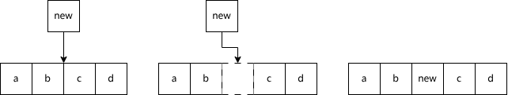
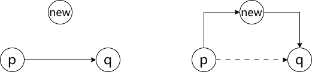
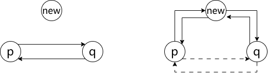

# 数据结构

我们已经学过了 C/C++，知道了 C++ 比 C 更强的一点在于它有着 STL 这个东西。我们在 C++ 相关章节中并未详细介绍 STL 内部究竟具体是什么，但如果知道这些内容的话，能让你对 C++ 和算法都有更深的理解。

数据结构，也就是 STL 中的“容器”部分，是算法的基础。本章就来探讨一下数据结构的相关内容。

有的数据结构理解起来比较复杂，我们推荐一个[网站](https://www.cs.usfca.edu/~galles/visualization/Algorithms.html)，该网站可以可视化地展示各种数据结构的操作过程，帮助理解。

## 线性数据结构

### 顺序表

顺序表是最简单的一种数据结构，可以简单地理解为**一段连续的内存空间**。

在 C++ 中，对应的是下面两个东西：

```cpp
int arr[10];          // C风格的顺序表
std::array<int, 10>;  // C++风格的顺序表
```

顺序表的优点在于它的内存是连续的，所以可以通过下标快速访问任意位置的元素，时间复杂度为 $O(1)$。但是它的缺点也很明显，那就是在中间的插入和删除操作需要移动大量元素，时间复杂度为 $O(n)$。



*顺序表的插入操作示意图*

由此图可见，顺序表的插入需要先把插入位置之后的所有元素向后移动一位，然后再插入新元素。这导致插入非常缓慢，尤其是在顺序表较大时。

那么，`std::vector<T>` 是个什么东西呢？实际上，这东西也是顺序表，但它的实现方式更复杂一些。它会预留一部分内存空间，当需要插入元素时，如果当前容量不够，它会分配一块更大的内存空间，然后把原来的数据拷贝过去，再插入新的元素。这样做的好处是，`std::vector<T>` 在大多数情况下在末尾插入和删除元素的时间复杂度是 $O(1)$，只有在需要扩容的时候才是 $O(n)$；而在中间插入和删除元素的时间复杂度仍然是 $O(n)$。

### 链表

#### 单向链表

链表是另一种简单的线性数据结构，虽然不是一段连续的内存空间，但它通过指针将各个节点连接起来。每个节点包含数据和指向下一个节点的指针。用 C++ 实现一个链表，需要实现节点结构体和链表类：

```cpp
struct Node {
    int data;
    std::shared_ptr<Node> next;
    Node(int val) : data(val), next(nullptr) {}
}; // 平凡且标准的类型，没有自定义析构函数和方法等，因此用结构体更合适
class LinkedList {
private:
    std::shared_ptr<Node> head;
public:
    LinkedList() : head(nullptr) {}
    void insert(int val);
    void remove(int val);
    void display();
};
```

具体的插入、删除和显示方法可以根据需要实现。这个被称作“单向链表”，也就是说每一个元素只能指向下一个节点，不能往回走。要想给上述链表写析构函数，需要遍历链表并释放每个节点的内存。

在链表中删除或插入某一个节点时，需要修改相邻节点的指针。例如，如果要在 p、q 之间插入一个新节点 `newNode`，只需要：

```cpp
// 先前： p->next = q;
newNode->next = p->next;
p->next = newNode;
// 当然这样写起来不是很安全，实际代码中需要检查p是否为空等
// 下同，简单起见不再赘述
```

请试着完成删除节点的代码。

单向链表的插入可用以下图解来理解：



链表的优点在于插入和删除操作的时间复杂度为 $O(1)$，只需要修改指针即可；但缺点是访问任意位置的元素需要从头开始遍历，时间复杂度为 $O(n)$。因此，在根据索引寻找要插入或删除的元素时，虽然插入和删除本身是 $O(1)$，但寻找元素的过程仍然是 $O(n)$。

#### 双向链表

为了解决上述链表只能走单行道的问题，我们引入了双向链表。这个用 C++ 来实现的话，节点结构体需要增加一个指向前一个节点的指针：

```cpp
struct DNode {
    int data;
    std::shared_ptr<DNode> next;
    std::weak_ptr<DNode> prev; // 使用weak_ptr避免循环引用
    DNode(int val) : data(val), next(nullptr), prev(nullptr) {}
};

class DoublyLinkedList {
    ...
};
```

链表内部的操作略有不同，但总体思路类似。双向链表的优点在于可以双向遍历，插入和删除操作仍然是 $O(1)$，但缺点是每个节点需要额外的内存来存储前驱指针。

如果要插入或删除一个节点，也需要修改指针。例如，插入一个新节点 `newNode` 在 p 和 q 之间：

```cpp
// 先前： p->next = q; q->prev = p;
newNode->next = p->next;
newNode->prev = p;
p->next->prev = newNode;
p->next = newNode;
```

双向链表的插入可用以下图解来理解：



在 C++ 标准库中，`std::list<T>` 就是一个双向链表的实现。我们不要自己试图实现一个链表，直接使用标准库中的实现即可。

### 栈和队列

栈（Stack）和队列（Queue）不是数据结构。它们是基于数据结构实现的抽象数据类型，在 C++ 中被叫做“容器适配器”（Container Adapter）。栈是基于顺序表或链表实现的，遵循后进先出（LIFO）的原则；队列也是基于顺序表或链表实现的，遵循先进先出（FIFO）的原则。

#### 栈

栈是一种只能在一端进行插入和删除操作的数据结构。我们可以使用 `std::stack<T>` 来实现栈：

```cpp
#include <stack>
std::stack<int, std::vector<int>> s; // 使用vector作为底层容器
// 也可以使用list作为底层容器：std::stack<int, std::list<int>> s;
// 不指定底层容器时，默认使用deque作为底层容器：std::stack<int> s;
s.push(1);    // 入栈
s.push(2);
int top = s.top(); // 获取栈顶元素
s.pop();      // 出栈
```

栈只能访问其顶元素，其余元素都无法直接访问。我们可以把栈想象成一个装东西的箱子，只能从上面放东西和拿东西，中间的东西是看不到的。因此，栈遵循**后进先出**的原则。

#### 队列

队列和栈类似，但它允许在一端插入元素，在另一端删除元素。我们可以使用 `std::queue<T>` 来实现队列：

```cpp
#include <queue>
std::queue<int, std::list<int>> q; // 使用list作为底层容器
// 也可以使用vector作为底层容器：std::queue<int, std::vector<int>> q;
// 不指定底层容器时，默认使用deque作为底层容器：std::queue<int> q;
q.push(1);    // 入队
q.push(2);
int front = q.front(); // 获取队首元素
q.pop();      // 出队
```

队列也只能访问其首元素，其余元素都无法直接访问。我们可以把队列想象成一条排队买票的队伍，前面的人先买票离开，后面的人只能等着。因此，队列遵循**先进先出**的原则。

#### 双端队列

双端队列是一种特殊的队列，允许在两端进行插入和删除操作。我们可以使用 `std::deque<T>` 来实现双端队列：

```cpp
#include <deque>
std::deque<int> dq; // 双端队列，底层容器即为deque本身
dq.push_back(1);    // 在尾部插入元素
dq.push_front(2);   // 在头部插入元素
int front = dq.front(); // 获取头部元素
int back = dq.back();   // 获取尾部元素
dq.pop_front();     // 删除头部元素
dq.pop_back();      // 删除尾部元素
```

双端队列结合了栈和队列的特点，允许在两端进行操作，适用于需要频繁在两端插入和删除元素的场景。

有的同学可能会疑惑：为什么有了顺序表和链表，还需要栈和队列呢？这是因为栈和队列是对数据结构的抽象，提供了特定的操作接口，方便我们在特定场景下使用。例如，在函数调用时使用栈来保存返回地址，在任务调度时使用队列来管理任务顺序。如果自己维护一个顺序表或链表来实现栈或队列，代码会变得复杂且容易出错。非常常见的两个用法，一个是用栈来替代递归函数，另一个是用队列来实现广度优先搜索（BFS）算法（见后续章节）。下面是一个用栈替代递归函数的例子：

```cpp
void recursiveFunction(int n) {
    if (n <= 0) return;
    // 处理当前节点
    recursiveFunction(n - 1);
    // 处理返回时的操作
} // 普通的递归函数

void iterativeFunction(int n) {
    std::stack<int> s;
    s.push(n);
    while (!s.empty()) {
        int current = s.top();
        s.pop();
        if (current <= 0) continue;
        // 处理当前节点
        s.push(current - 1);
        // 处理返回时的操作
    }
} // 用栈实现的迭代函数
```

那为什么要这么做呢？实际上，递归在底层上本来就是用栈来实现的。如果递归程度过深，则导致栈溢出，俗称“爆栈”。因此，在某些情况下，使用显式的栈来替代递归函数，可以在一定程度上避免栈溢出的问题，也可以更好地控制内存使用。把裸递归写成栈是一种非常常见的技巧，工程上也经常会用到。

但栈和队列也有一些不太好的地方，就是无法在中间访问，即使是简单的查询操作也不行。如果需要频繁在中间访问元素，还是需要使用顺序表或链表。

## 非线性数据结构

非线性数据结构包括树和图等，它们用于表示更复杂的关系。

### 树

树是一种层次化的数据结构，由节点和边组成。每个节点可以有多个子节点，但只有一个父节点（根节点除外）。树的常见应用包括文件系统、XML/HTML 文档等。

C++ 没有内置的树结构，但我们可以通过自定义类来实现。例如，下面是一个简单的树节点结构体：

```cpp
struct TreeNode {
    int data;
    std::weak_ptr<TreeNode> father; // 指向父节点的弱指针，防止循环引用
    std::vector<std::shared_ptr<TreeNode>> children; // 多个子节点
    TreeNode(int val) : data(val), left(nullptr), right(nullptr) {}
};
```

特别的，每一个节点只有至多两个子节点的树，称为二叉树（Binary Tree）。二叉树有很多特殊的性质和操作，例如二叉搜索树（Binary Search Tree, BST）和堆（Heap）等，在后文会详细叙述。这里仅介绍一般树的基本概念和操作。

对于一棵树，我们一般有以下称谓：

- **根节点**：树的顶端节点，没有父节点。
- **叶节点**：没有子节点的节点。
- **内部节点**：有子节点的节点，非叶节点。
- **深度**：节点到根节点的最短路径长度。
- **高度**：树中节点的最大深度。

树的操作包括插入、删除、遍历等。一般情况下，对于一棵树，我们往往用其根节点来称呼整棵树。

树的插入操作通常是将新节点添加为某个节点的子节点。例如，向节点 p 插入一个新节点 `newNode`：

```cpp
p->children.push_back(newNode);
newNode->father = p; // 设置父节点指针
```

树的删除包括删除叶节点和删除内部节点两种情况，删除内部节点时需要考虑如何处理其子节点。因此很少直接删除树节点，更多的是标记该节点不再使用。

而树的遍历（周游）有两种策略：深度优先遍历（Depth-First Search, DFS）和广度优先遍历（Breadth-First Search, BFS）。深度优先遍历又分为前序遍历、中序遍历和后序遍历三种方式。我们以下面这棵树为例：

```text
        A
       / \
      B   C
     / \   \
    D   E   F
```

#### 前序遍历

树的前序遍历指的是：先访问根节点，再访问左子树，最后访问右子树。我们大致为大家写一下过程：

- 访问 A，输出 A，左子树是 B，右子树是 C
- 访问 B，输出 B，左子树是 D，右子树是 E
- 访问 D，输出 D，没有子树，返回 B
- 访问 E，输出 E，没有子树，返回 B，B 已经没有子树，返回 A
- 访问 C，输出 C，没有左子树，右子树是 F
- 访问 F，输出 F，没有子树，返回 C，C 已经没有子树，返回 A，结束

于是就可以得到前序遍历结果：`A B D E C F`。其代码实现大致是：

```cpp
void preOrderTraversal(std::shared_ptr<TreeNode> node) {
    if (!node) return;
    std::cout << node->data << " "; // 访问节点
    for (const auto& child : node->children) {
        preOrderTraversal(child); // 递归访问子节点
    }
}
```

当然也可以用栈来写，但是入栈的过程应该是**逆向压栈**，即先压右子节点，再压左子节点，这样出栈时才能保证左子节点先被访问。

```cpp
#include <stack>
void preOrderTraversalIterative(std::shared_ptr<TreeNode> root) {
    if (!root) return;
    std::stack<std::shared_ptr<TreeNode>> s;
    s.push(root);
    while (!s.empty()) {
        auto node = s.top();
        s.pop();
        std::cout << node->data << " "; // 访问节点
        // 逆向压栈
        for (auto it = node->children.rbegin(); it != node->children.rend(); ++it) {
            s.push(*it);
        }
    }
}
```

其他 DFS 写成栈的形式就不再赘述了，这里留作练习。

#### 中序遍历

中序遍历只能用于二叉树这种有明显的“左子树”和“右子树”概念的树。中序遍历指的是：先访问左子树，再访问根节点，最后访问右子树。对于上面的树，我们写一下过程：

- 访问 A，左子树是 B，右子树是 C
- 访问 B，左子树是 D，右子树是 E
- 访问 D，没有子树，输出 D，返回 B，输出 B
- 访问 E，没有子树，输出 E，返回 B，B 已经没有子树，返回 A，输出 A
- 访问 C，没有左子树，输出 C，右子树是 F
- 访问 F，没有子树，输出 F，返回 C，C 已经没有子树，返回 A，结束

于是就可以得到中序遍历结果：`D B E A C F`。其代码实现大致是：

```cpp
void inOrderTraversal(std::shared_ptr<TreeNode> node) {
    if (!node) return;
    if (node->children.size() > 0)
        inOrderTraversal(node->children[0]); // 访问左子树
    std::cout << node->data << " "; // 访问节点
    if (node->children.size() > 1)
        inOrderTraversal(node->children[1]); // 访问右子树
}
```

#### 后序遍历

后序遍历指的是：先访问左子树，再访问右子树，最后访问根节点。对于上面的树，我们写一下过程：

- 访问 A，左子树是 B，右子树是 C
- 访问 B，左子树是 D，右子树是 E
- 访问 D，没有子树，输出 D，返回 B
- 访问 E，没有子树，输出 E，返回 B，B 已经没有子树，输出 B，返回 A
- 访问 C，没有左子树，右子树是 F
- 访问 F，没有子树，输出 F，返回 C，C 已经没有子树，输出 C，返回 A，A 已经没有子树，结束

于是就可以得到后序遍历结果：`D E B F C A`。其代码实现大致是：

```cpp
void postOrderTraversal(std::shared_ptr<TreeNode> node) {
    if (!node) return;
    for (const auto& child : node->children) {
        postOrderTraversal(child); // 递归访问子节点
    }
    std::cout << node->data << " "; // 访问节点
}
```

#### 广度优先遍历

广度优先遍历指的是：按层次从上到下、从左到右依次访问节点。对于上面的树，我们写一下过程：

- 访问 A，输出 A，入队其子节点 B 和 C
- 访问 B，输出 B，入队其子节点 D 和 E
- 访问 C，输出 C，入队其子节点 F
- 访问 D，输出 D，没有子节点
- 访问 E，输出 E，没有子节点
- 访问 F，输出 F，没有子节点，结束

可以看到树的广度优先遍历需要用到队列来辅助实现。其代码实现大致是：

```cpp
#include <queue>
void breadthFirstTraversal(std::shared_ptr<TreeNode> root) {
    if (!root) return;
    std::queue<std::shared_ptr<TreeNode>> q;
    q.push(root);
    while (!q.empty()) {
        auto node = q.front();
        q.pop();
        std::cout << node->data << " "; // 访问节点
        for (const auto& child : node->children) {
            q.push(child); // 入队子节点
        }
    }
}
```

树的应用非常广泛，例如文件系统就是一种树结构，根目录是根节点，子目录和文件是子节点。我们可以使用树来表示和操作这些层次化的数据。

### 图

图是另一种更复杂的数据结构，由节点（顶点）和边组成。图可以是有向的或无向的，可以包含环或不包含环。图的常见应用包括社交网络、地图导航等，用于表示复杂的关系。

一般的图有多种写法。朴素的图写法可以用许多下面的 `Node` 表示：

```cpp
struct GraphNode {
    int data;
    std::vector<std::shared_ptr<GraphNode>> tos; // 可以前往的节点
    std::vector<std::weak_ptr<GraphNode>> froms; // 可以从哪里来，这里用weak_ptr防止循环引用
    GraphNode(int val) : data(val) {}
};
```

但是这样的写法比较笨拙，无法表示边权重等信息，但在表示无权的小图时使用起来还算方便。

更常见的图的表示方法有两种：邻接矩阵和邻接表。

#### 邻接矩阵

邻接矩阵是一种二维数组，用于表示图中节点之间的连接关系。如果节点 i 和节点 j 之间有边连接，则矩阵中的元素 `A[i][j]` 为 1（或边的权重），否则为 0。对于有向图，`A[i][j]` 表示从节点 i 指向节点 j 的边；对于无向图，`A[i][j]` 和 `A[j][i]` 表示节点 i 和节点 j 之间的边。

```cpp
#include <vector>
class Graph {
private:
    std::vector<std::vector<int>> adjMatrix; // 邻接矩阵
public:
    Graph(int numNodes) : adjMatrix(numNodes, std::vector<int>(numNodes, 0)) {}
    void addEdge(int u, int v, int weight = 1) {
        adjMatrix[u][v] = weight; // 有向图
        // 对于无向图，还需要添加下面这一行
        // adjMatrix[v][u] = weight;
    }
};
```

邻接矩阵的优点是查询边的存在性非常快，时间复杂度为 $O(1)$；但缺点是空间复杂度为 $O(n^2)$，对于稀疏图来说非常浪费。稀疏图是指边的数量远小于节点数量平方的图。

#### 邻接表

邻接表是一种更节省空间的图表示方法。它使用一个数组或向量，每个元素对应一个节点，存储该节点的所有邻接节点。对于有向图，邻接表中的每个节点只存储其出边的邻接节点；对于无向图，则存储所有邻接节点。

```cpp
#include <vector>
#include <list>
class Graph {
private:
    std::vector<std::list<std::pair<int, int>>> adjList; // 邻接表，存储邻接节点和边权重
public:
    Graph(int numNodes) : adjList(numNodes) {}
    void addEdge(int u, int v, int weight = 1) {
        adjList[u].emplace_back(v, weight); // 有向图
        // 对于无向图，还需要添加下面这一行
        // adjList[v].emplace_back(u, weight);
    }
};
```

邻接表的优点是空间复杂度为 $O(n + m)$，其中 n 是节点数量，m 是边的数量，适合表示稀疏图；但缺点是查询边的存在性需要遍历邻接节点列表，时间复杂度为 $O(k)$，其中 k 是节点的度数。

图的遍历也有深度优先遍历（DFS）和广度优先遍历（BFS）两种策略，类似于树的遍历。不同的是，图可能包含环，因此在遍历时需要记录已经访问过的节点，防止重复访问。这里可以用类似的递归或队列来实现 DFS 和 BFS，我就不再赘述了。

## 特殊数据结构

除了上述常见的数据结构外，还有一些特殊的数据结构，如哈希表、堆和 Trie 树、红黑树、B 树等，它们在特定场景下有着重要的应用。

### 二叉树及其变体

刚刚讲树的时候，我们提到了二叉树。二叉树是一种特殊的树结构，每个节点最多有两个子节点，分别称为左子节点和右子节点。二叉树有很多变体，常见的有二叉搜索树（Binary Search Tree, BST）和堆（Heap）。

二叉树的节点可以写得更简略：

```cpp
struct BinaryTreeNode {
    int data;
    std::shared_ptr<BinaryTreeNode> left;  // 左子节点
    std::shared_ptr<BinaryTreeNode> right; // 右子节点
    std::weak_ptr<BinaryTreeNode> father; // 父节点
    BinaryTreeNode(int val) : data(val), left(nullptr), right(nullptr), father(nullptr) {}
};
```

该节点未使用诸如 `vector` 之类的容器，因为二叉树的每个节点最多只有两个子节点，使用两个指针即可，更加高效。

仅仅是二叉树是没什么意思的，我们要对它进行一些限制，才能发挥它的作用。

#### 完全二叉树

完全二叉树是一种特殊的二叉树，除了最后一层外，每一层的节点必须被填满，并且最后一层的节点必须从左到右连续排列。完全二叉树的一个重要性质是它可以用数组来高效地表示。

假设一个完全二叉树的节点按层次顺序存储在数组中，那么对于节点 i：

- 左子节点的索引为 $2i + 1$
- 右子节点的索引为 $2i + 2$
- 父节点的索引为 $(i - 1) / 2$（向下取整）

这种表示方法使得我们可以通过简单的算术运算来访问节点的子节点和父节点，而不需要额外的指针存储。

完全二叉树有什么用处呢？它的主要应用之一是堆（Heap）。

#### 二叉搜索树

二叉搜索树也是一种特殊的二叉树，它满足以下性质：对于每个节点，其左子树中的所有节点的值都小于该节点的值，而其右子树中的所有节点的值都大于该节点的值。这个性质使得二叉搜索树可以高效地进行查找、插入和删除操作。

我们看到，实际二叉搜索树类似于二分法查找的过程。假设我们要查找一个值 x：

- 如果当前节点的值等于 x，查找成功。
- 如果 x 小于当前节点的值，继续在左子树中查找。
- 如果 x 大于当前节点的值，继续在右子树中查找。

这种查找过程的平均时间复杂度是 $O(\log n)$，和二分查找是一样的。

现在的问题就是怎样才能使得二叉树经过插入和删除操作后仍然保持二叉搜索树的性质呢？这就需要在插入和删除时进行适当的调整。

在插入一个新节点的时候，我们按照二叉搜索树的性质找到合适的位置插入即可，从根节点开始比较：

- 如果新节点的值小于当前节点的值，继续在左子树中查找插入位置。
- 如果新节点的值大于当前节点的值，继续在右子树中查找插入位置。

而删除的时候则稍微复杂一些，主要有三种情况：

- 删除的节点是叶节点，直接删除即可。
- 删除的节点有一个子节点，用子节点替代被删除的节点。
- 删除的节点有两个子节点，找到该节点的中序后继（右子树中最小的节点）或中序前驱（左子树中最大的节点），用它来替代被删除的节点，然后删除该后继或前驱节点，形成递归。

但是上述的插入和删除操作可能会导致一些问题：假设我们把输入按升序排列插入到二叉搜索树中，那么树就会退化成一个链表，导致查找、插入和删除操作的时间复杂度变为 $O(n)$。为了解决这个问题，我们需要使用自平衡二叉搜索树，如 AVL 树和红黑树等。

#### AVL 树

AVL 树是一种自平衡二叉搜索树，它通过在每个节点上维护一个平衡因子（Balance Factor）来确保树的高度保持在 $O(\log n)$。平衡因子定义为左子树的高度减去右子树的高度，AVL 树要求每个节点的平衡因子只能是 -1、0 或 1。当插入或删除节点后，如果某个节点的平衡因子变得不符合要求，就需要通过旋转操作来恢复平衡。C++ 中并没有内置 AVL 树的实现，但我们可以通过自定义类来实现 AVL 树的插入和删除操作。

#### 红黑树

红黑树则更是大名鼎鼎，其复杂度也更高一些。红黑树是一种自平衡二叉搜索树，它通过给每个节点染色（红色或黑色）并遵循一系列规则来确保树的平衡。这些规则包括：

- 根节点必须是黑色。
- 所有叶节点（包括 NIL 节点）必须是黑色。NIL 节点指的是空节点，用于表示树的末端，并不存储实际数据。
- 如果一个节点是红色的，则其子节点必须是黑色的。
- 从任一节点到其所有后代叶节点的路径上，必须包含相同数量的黑色节点。

那么研究怎么插入节点就很有意义了。为了简化描述，引入“叔叔”的概念：叔叔节点是指当前节点的父节点的兄弟节点。插入节点的步骤如下：

- 先按二叉搜索树的规则插入节点，并将新节点染成红色。
- 如果父亲是黑的，那么什么都不需要做，插入完成。
- 如果父亲是红的，那么就违反了红黑树“父子不能同红”的规则，需要进行调整：
  - 如果叔叔是红的，那么将父亲和叔叔染成黑色，将祖父染成红色，然后检查祖父节点是否违反红黑树规则，递归调整。
  - 如果叔叔是黑的或没有叔叔，则通过一次或两次旋转：
    - 新节点和父节点是同侧的（左左或右右），进行一次旋转，祖父变父亲的另一个子节点，父亲变祖父。
    - 新节点和父节点是异侧的（左右或右左），先进行一次旋转，使新节点和父节点变成同侧（新节点变成父亲，父亲变成儿子），然后再进行一次第一种情况的旋转。
- 最后，确保根节点是黑色。如果不是，将其染成黑色。

而删除的过程更是复杂，不再赘述。C++ 标准库中的 `std::map<K, V>` 和 `std::set<T>` 就是基于红黑树实现的，我们可以直接使用它们来存储有序的键值对或集合。

### 哈希表

哈希（散列）表是一种基于数组的数据结构，通过哈希函数将键映射到数组的索引位置，从而实现快速的查找、插入和删除操作。哈希表的平均时间复杂度为 $O(1)$，但在最坏情况下可能退化为 $O(n)$。

哈希的基本原理就是将键通过哈希函数转换为一个整数索引，然后将值存储在该索引位置的数组中。

在 C++ 中，哈希表可以通过 `std::unordered_map<K, V>` 和 `std::unordered_set<T>` 来实现：

```cpp
#include <unordered_map>
#include <unordered_set>

std::unordered_map<std::string, int> hashMap; // 哈希映射
hashMap["apple"] = 1; // 插入键值对
int value = hashMap["apple"]; // 查找键对应的值

std::unordered_set<int> hashSet; // 哈希集合
hashSet.insert(10); // 插入元素
bool exists = hashSet.find(10) != hashSet.end(); // 查找元素是否存在
```

在理想状态下，散列函数应该能给每个不同的键生成不同的索引，但实际上可能会出现冲突（Collision），即不同的键被映射到相同的索引位置。为了解决冲突，常用的方法有链地址法和开放地址法。

#### 链地址法

链地址法是将每个数组位置存储为一个链表（或其他数据结构），当发生冲突时，将新元素添加到该位置的链表中。查找时，需要遍历链表以找到目标元素。这样的实现方式在 C++ 的 `std::unordered_map` 和 `std::unordered_set` 中被广泛使用。

#### 开放地址法

开放地址法是当发生冲突时，通过探测（Probing）找到下一个可用的数组位置来存储新元素。常见的探测方法有线性探测、二次探测和双重散列等。查找时，同样需要按照探测序列查找目标元素，直到找到或遇到空位置为止。这样的方法在某些哈希表实现中使用，但 C++ 标准库并未采用这种方法。

### 堆

堆是一种特殊的完全二叉树，满足堆性质（Heap Property）：对于最大堆（Max Heap），每个节点的值都大于或等于其子节点的值；对于最小堆（Min Heap），每个节点的值都小于或等于其子节点的值。堆常用于实现优先队列和排序算法（如堆排序）。

在 C++ 中的堆是通过 `std::priority_queue<T>` 来实现的：

```cpp
#include <queue>
std::priority_queue<int> maxHeap; // 最大堆
std::priority_queue<int, std::vector<int>, std::greater<int>> minHeap; // 最小堆
maxHeap.push(10); // 插入元素
int top = maxHeap.top(); // 获取堆顶元素
maxHeap.pop(); // 删除堆顶元素
```

优先队列实际上也是一个“队列”，但内部并不是简单的先进先出，而是根据元素的优先级来决定出队顺序。最大堆的优先级是值越大越高，最小堆则是值越小越高。在 C++ 中优先队列也是一个容器适配器，底层通常使用 `std::vector<T>` 来存储元素，并通过堆操作来维护堆性质；也可以自定义底层容器，但必须满足随机访问迭代器的要求。

堆的插入操作包括将新元素添加到堆的末尾，然后通过上浮（Bubble Up）操作恢复堆性质。上浮操作是将新元素与其父节点比较，如果违反堆性质，则交换它们的位置，直到堆性质得到恢复或到达根节点为止。这一过程大概是：

- 将新元素添加到堆的末尾。
- 计算新元素的父节点索引。
- 如果新元素违反堆性质（例如在最大堆中，新元素大于父节点），则交换它们的位置。
- 重复上述步骤，直到堆性质得到恢复或到达根节点为止。

这样的上浮是非常高效的，时间复杂度为 $O(\log n)$，比红黑树等自平衡树更快一些。因此在仅需要找到最大或最小元素的场景下，堆是一个非常好的选择。

#### 胜者树和败者树

胜者树（Winner Tree）和败者树（Loser Tree）是两种特殊的树结构，常用于多路归并排序和优先队列的实现。它们通过比较节点的值来确定“胜者”和“败者”，从而高效地进行元素的选择和排序，本质上实际是对“堆”的一种工业性改良。

那么具体是以一种什么方式来实现的呢？首先，先像淘汰赛一样，把所有元素排成一个完全二叉树的叶节点，然后从底向上比较每对节点，较小（或较大）的节点胜出，成为其父节点的值，这个过程一直持续到根节点。这样，根节点就存储了所有元素中的最小值（或最大值），这就是胜者树。而败者树相反，父节点存的是比较过程中“输掉”的那个节点的值，但决出祖父节点的方式依然是两个胜者比较，而不是败者比较；这样设计的好处是，在进行多路归并时，只需要更新败者树中的节点，而不需要重新比较所有节点，从而提高效率；而在根节点上一般也多一个辅助变量（或者专门的节点）来存储当前的最小值（或最大值，实际上就是最终的胜者）。

我们用一个例子来说明胜者树和败者树的构建过程。假设我们有 8 个元素：5, 3, 8, 1, 4, 7, 6, 2。我们知道，8 是 2 的整数次幂（$2^3$），因此可以直接构建一个完整的二叉树，无需考虑“轮空”或“补齐”的问题。对于胜者树，构建过程较为简单。假设我们取较小值为胜者，那么构建过程如下：

```text
       1
    /     \
   1       2
  / \     / \
 3   1   4   2
/ \ / \ / \ / \
5 3 8 1 4 7 6 2
```

而败者树的构建过程则稍微复杂一些。假设我们取较小值为胜者，那么构建过程如下：

```text
       2(1)
    /     \
   3       4
  / \     / \
 5   8   7   6
/ \ / \ / \ / \
5 3 8 1 4 7 6 2
```

胜者树和败者树在多路归并排序中非常有用。假设我们有多个已排序的序列，需要将它们合并成一个有序序列。使用胜者树或败者树可以高效地找到当前最小（或最大）的元素，并将其添加到结果序列中，然后更新树结构以反映新的状态。
