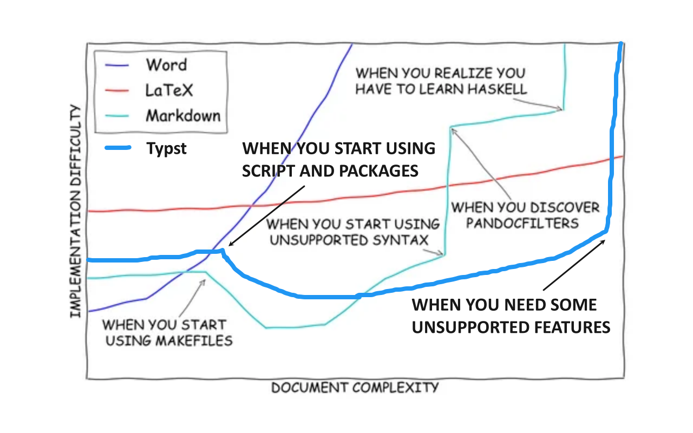

# 文字排版:Markdown 和 Typst

本章介绍了常用的文本排版工具和语言，包括 Markdown、LaTeX 和 Typst。通过学习本章内容，读者将能够掌握基本的文本排版技能，选择合适的排版工具，并能够编写格式良好的文档。

**前置知识**

- 基本的计算机操作技能
- 计算机的联网、获取网络资源（如何使用浏览器、下载文件等）
- 基本的文本编辑技能（如使用记事本、VS Code 等文本编辑器）
- 基本的编程技能（了解代码的基本结构和语法）
- 基本的命令行操作技能（如使用终端等）

文本编辑工具是我们表达思想、传递知识的重要手段。无论是在科研、写作还是展示中，排版都是重要且必要的内容；我们需要选择合适的排版工具，以大大提高作品质量。

目前最常用的排版工具或语言有 Microsoft Word、Markdown、LaTeX 和 Typst 等。每种工具都有其特点：

| 特性 | MS Word | Markdown | LaTeX | Typst |
| --- | --- | --- | --- | --- |
| 安装 | 简单 | 简单 | 难 | 简单 |
| 语法复杂度 | 非常简单 | 简单 | 高 | 中 |
| 编译速度 | 较快 | 快 | 慢 | 快 |
| 排版能力 | 较强 | 一般 | 极强 | 较强 |
| 模板能力 | 几乎没有 | 中等 | 强 | 强 |
| 编程能力 | 无 | 无 | 强，风格古老 | 强，风格现代 |
| 方言 | 无 | 极多 | 有 | 较少 |

*不同排版工具的对比*



## Markdown

Markdown 是一种轻量级的标记语言，可用于在纯文本文档中添加格式化元素。和其他排版工具相比，它仅仅使用十几个记号进行排版。这使得它易于学习，使得使用者能够更专注于内容的同时，快速地进行美观大方的排版。

Markdown 无需安装，用户使用任何文本编辑器都可编写 Markdown 文档。一般的，VS Code 已经集成了 MD 的语法高亮和预览功能，用户只需要安装 Markdown 插件即可。当然，也可以使用一些优秀的 Markdown 专用编辑器，例如 Typora（付费）、Obsidian（免费）等，它们提供了更丰富的功能和更好的用户体验。

### Markdown 的语法

Markdown 的内容输入和纯文本文件几乎一模一样，接下来我们将逐个介绍 Markdown 排版所用到的控制符号。不过，在此之前，请把你的输入法标点符号切换为半角，谨防输入全角标点符号导致 Markdown 无法正确渲染。

!!! note
    Markdown 的语法并不是固定的，不同的 Markdown 渲染器可能会有一些差异，这被称作**方言性**。我们在这里介绍的是最常见也最通用的 Markdown 语法。同时，你在不同的地方看到的 Markdown 渲染结果可能会不同，这也是正常现象，这是因为不同的 Markdown 渲染器往往有着不同的渲染风格。本人在这里讲述的也是几乎所有渲染器都支持的标记风格。

    举一个方言的例子：在 Obsidian 中，有一个语法“CallOut”，可以用来创建带有边框和图标的注释块，例如：

    ```text
    > [!NOTE]
    > 这是一个注释块。
    ```

    但是该语法几乎只有 Obsidian 支持，诸如 Typora、VS Code 等其他渲染器并不支持该语法。因此，在使用 Markdown 时，建议尽量使用通用的语法，以确保在不同的渲染器中都能正确显示；如要使用方言，则应当确保目标渲染器支持该语法。

#### 分段、换行、分割线

在 Markdown 中，必须通过空行来进行分段。也就是说，如果你想要对文件进行分段，需要在两段之间加入一个空行。特别注意，Markdown 不接受缩进或者首行缩进，所以不要使用 Tab 键或者空格进行缩进！（否则会编译为代码块）

而如果希望仅仅换行而不分段，则仅仅在行尾加入两个空格，然后另起一行，在新的行中书写；或者使用 HTML 标记，也就是 `<br>` 符号，该符号无需另起一行也可以进行换行操作。

对于分割线（你经常会在知乎看见这种分割线），请在单独一行上使用三个或多个星号（`***`）、连接号（`---`）或下划线（`___`），并且不能包含其他内容。为了兼容性考虑，请在该分割线前后加上空行。

#### 标题

Markdown 使用井号（`#`）来表示标题。井号的数量表示标题的层级，例如：

```md
# 一级标题
## 二级标题
### 三级标题
```

#### 强调、删除

在 Markdown 中，可以使用星号（`*`）或下划线（`_`）来表示强调。单个星号或下划线表示斜体，两个星号或下划线表示粗体。同时，还可以使用波浪号（`~`）来表示删除线，例如：

```md
*斜体文本*
**粗体文本**
***粗斜体文本***
~~删除线文本~~
```

#### 转义

在 Markdown 中，如果需要输入特殊字符（例如星号、井号等），可以使用反斜杠（`\`）来进行转义。例如，`\*` 代表一个星号。

#### 代码和代码块

在 Markdown 中，可以使用反引号来表示代码。单个反引号表示行内代码，三个反引号表示代码块。例如：

````md
`行内代码`

```
代码块
```
````

如果需要在代码块中打出反引号且防止此反引号被编译，只要保证用于包装的反引号数量比防止编译的反引号数量多就可以了。

#### 引用

在 Markdown 中，可以使用大于号（`>`）来表示引用。引用块也是可以嵌套的，只需要在每一行的开头添加一个大于号即可。例如：

```md
> 这是一段引用文本。
> > 这是一段嵌套的引用文本。
```

#### 列表

在 Markdown 中，可以使用减号（`-`）来表示无序列表。例如：

```md
- 列表项 1
- 列表项 2
- 列表项 3
```

有序列表则使用数字加点的方式表示，例如：

```md
1. 列表项 1
2. 列表项 2
3. 列表项 3
```

#### 表格

在 Markdown 中，可以使用竖线（`|`）来表示表格。表格的第一行是表头，第二行是分隔线，后面的行是表格内容。例如：

```md
| 列表项 1 | 列表项 2 | 列表项 3 |
| -------- | -------- | -------- |
| 内容 1  | 内容 2  | 内容 3  |
```

#### 外部资源：链接、图片

在 Markdown 中，可以使用方括号和圆括号来表示链接。例如：

```md
[链接文本](https://www.example.com)
```

在 Markdown 中，可以使用感叹号、方括号和圆括号来表示图片。例如：

```md

```

#### 数学公式

在 Markdown 中，可以使用美元符号（`$`）来表示行内公式。例如：

```md
这是一个行内公式 $E=mc^2$ 的示例。
```

如果需要输入块级公式，可以使用两个美元符号（`$$`）来包裹公式。例如：

```md
这是一个块级公式的示例：
$$ E=mc^2 $$
```

大多数的 Markdown 编译器都会正确渲染 LaTeX 公式，但是不排除少数编译器不支持渲染 LaTeX。一般而言，不支持渲染的编译器将会原样显示公式内容。开始写作前试试编辑器能否正常渲染公式总是好的选择。

## Typst

Typst 是一种新兴的排版语言，由著名的语言神 Rust 编写，旨在提供一种更直观、更易于使用的排版方式。它的完备性与 LaTeX 类似，但语法更简洁，易于上手，和 Markdown 类似。Typst 的设计理念是让用户能够专注于内容，而不是被复杂的语法和命令所困扰。

Typst 最新潮的一点在于其编译是**增量式**的，而不是 LaTeX 的全量编译。简单地说，Typst 只会重新编译被修改的部分，而不是整个文档，这大大提高了编译速度，尤其是在处理大型文档时。但目前大型文档（几百页以上）依然基本上被 LaTeX 和 Adobe Indesign 占据主导地位，Typst 仍需努力。

### Typst 的安装

官方提供了 Typst 的 WebAPP，我们可以直接使用之，但是其中文字体和版本控制都不优秀。如果希望在本地使用，则可以在 VS Code 中安装插件 Tinymist Typst。安装完成后，用户可以在 VS Code 中创建 `.typ` 文件，并使用 Typst 语法进行排版。

!!! note
    官方提供了 typst 的命令行程序，可以使用 Rust 工具链安装或其他包管理安装。使用 `typst watch main.typ`，之后就可以随意编辑 `main.typ`，在能支持动态加载的 PDF 预览器如 SumatraPDF 和 okular 中预览 PDF 了。这种预览方式相比于 tinymist 预览内存占用小，平时推荐使用 tinymist 插件预览，除非长文本内存占用极大。

### Typst 的语法

Typst 有两类语言模式：标记模式和脚本模式，而本质上都可以归结为脚本模式。

在默认情况下，Typst 使用标记模式进行排版，使用类似于 Markdown 的简单语法来编写文档。如果希望进入脚本模式，可以使用井号 `#` 来切换到脚本模式，例如 `#heading(strong([加粗]))` 是一个合法的语法。大段的脚本代码则可以使用花括号，例如 `#{1+1}`。

在脚本模式中，也可以使用方括号来进入标记模式，这将成为脚本模式的“内容块”或者标记元素。

#### 标记模式

对于 Typst，所有的标记其实都是语法糖。这样能像 Markdown 一样做到内容和格式的彻底分离，也方便了我们的控制。在标记模式中，用户可以使用以下语法来进行排版：

````text
= 一级标题
上述文本等价于
#heading(level: 1, [一级标题])

== 二级标题
上述文本等价于
#heading(level: 2, [二级标题])

*加粗* 等价于 #strong[加粗]
_强调_ 等价于 #emph[强调]
需要注意，没有标记下划线，需要用#underline[下划线]来进行。
#strike[删除线]，没有标记删除线

- 无序列表
+ 有序列表
/术语: 术语列表
上述文本等价于
#list.item[无序列表]
#enum.item[有序列表]
#terms.item[术语][术语列表]

$x^2/a^2 + y^2/b^2 = 1$ 公式两边不空空格是行内公式
$ sum_(k=0)^n k
  &= 1 + ... + n \
  &= (n(n+1)) / 2 $
$ (x+1)/(x) >= 1 => 1/x >= 0 $
公式两边空格是行间公式
你可能注意到了 Typst 公式与 LaTeX 公式有差异。在数学表示上有所形象化，如用>=代替了\ge，>=是gt.equiv的标记。

```py
print("Hello, World!")
```
上述代码块等价于
#raw(lang: "py", block: true, "print("Hello, World!")")

还有一种特殊的语法糖：
#fn(ZZZ)[XXX][YYY] 是 #fn(ZZZ, XXX, YYY) 的语法糖。
````

#### 脚本模式

在脚本模式中，用户可以使用类似于 Python 的语法来编写代码。主要有三个最重要的脚本：set、show 和 let。

set 可以设置样式，也就是“为参数设置默认值”的能力。例如：

```text
#set heading(numbering: "1.")
```

上述代码设置了标题的编号。

show 的本意是进行“显示替换”，也就是把某个内容替换成另一个内容。例如：

```text
#show "大陆": "中国"
```

上述代码可以把整篇文档中的所有“大陆”在编译出的文档都显示成“中国”，例如“哥伦布发现了新大陆”会被编译成“哥伦布发现了新中国”[^1]。

show 还可以用于样式设计：

```text
#show heading.where(level: 1): body =>{
  set align(center)
  body
}
```

这里的 `heading.where()` 有 sqlalchemy 库的影子，大家应该可以意会到它是一个选择器，选择标题中等级为 1 的所有元素。`body` 则是检索到的原始内容，这里的箭头则是一个函数，指的是接受箭头前面的内容，然后返回修改后的内容，也就是大括号内部的东西。在大括号内部，我们使用 `set` 调整了样式，使其居中。

let 用于定义变量和函数等，很像它在 JavaScript 中的亲戚。主要有以下几种使用方式：

```text
// 存储基本值
#let x = 10
#let name = "Typst"
#let is-active = true
The value of x is #x. // 输出: The value of x is 10

// 存储内容块
#let warning = [**Warning:** This is important!]
#warning // 输出: **Warning:** This is important!

// 定义函数
#let add(a, b) = a + b
#let greet(name) = [Hello, #name!]
#add(5, 3) // 输出: 8
#greet("Alice") // 输出: Hello, Alice!

// 定义样式
#let emph-style = set text(red, weight: "bold")
#emph-style
This is *emphasized* text. // 红色加粗

// 多式综合
#let base-style = set text(font: "Helvetica", size: 12pt)
#let title-style = base-style.with(size: 16pt, weight: "bold")
// 这里的*.with()可以扩展或者覆盖原有的样式

#title-style
= This is a title // 使用 Helvetica, 16pt, 加粗
```

默认情况下，该方法定义的变量是有类似 C 系的变量作用域的。let 和 show 结合使用，则可以制作出各种各样的模板。

对于更进一步的使用（例如 Touying 和 Pinit 等著名包的使用），我们不做更多介绍了，感兴趣的同学可以自行查找相关资料进行了解。函数文档可以去查看 [Typst 官方文档](https://typst.app/docs/)，已经发布的包可以在 [Typst Universe](https://typst.app/universe/) 上查看，对于中文问题可以查看 [Typst 中文社区导航](https://guide.typst.dev/FAQ.html)，对了还有 Typst 非官方中文交流群（QQ群号：793548390），欢迎来交流。

[^1]: 该笑话来自台湾网友，显然不是历史事实：实际上是讽刺台当局的“去大陆化”政策。
