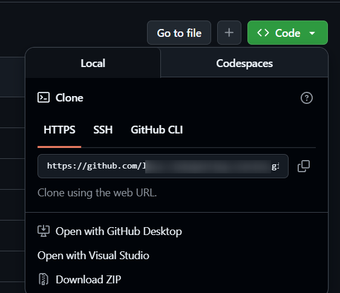
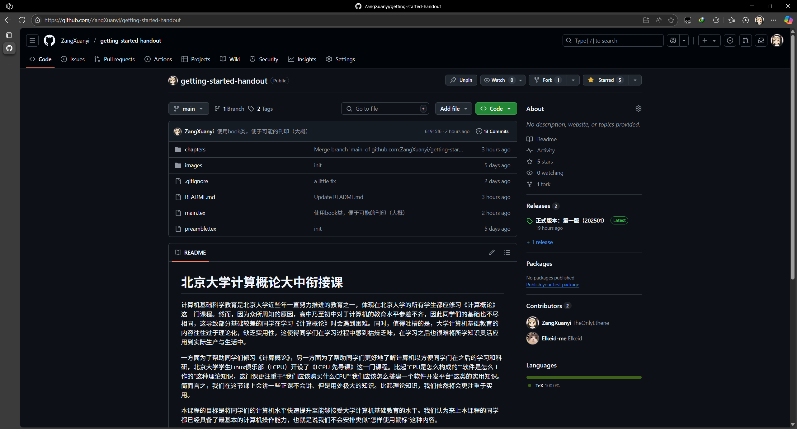

# GitHub与多人协作

## 远程仓库

很多项目无法只在一台机器上进行开发，往往都需要在远程部署一个仓库（例如GitHub、GitLab等，或者公司自建库），然后将本地的代码推送到远程仓库中。这样，我们就可以在不同的机器上从远程仓库中拉取代码，从而保证代码的一致性。

在本节，我们将使用 GitHub 作为远程仓库的示例，介绍如何将本地仓库与远程仓库进行关联、推送和拉取代码。

### 创建仓库
首先，我们需要在 GitHub 上创建一个新的仓库。创建完成后，GitHub 会提供一个远程仓库的 URL，例如：
```
  https://github.com/YourName/example.git
```
我们可以在GitHub上的仓库页面中找到这个 URL，如图所示。


*Figure 5: GitHub 上的仓库页面*

接下来，我们需要将本地仓库与远程仓库关联。可以使用以下命令：
```bash
git remote add origin <your-repo-url>
```
这将把远程仓库的 URL 添加为名为 origin 的远程仓库。origin 是习惯上的远程仓库名称。

现在我们要将这个本地仓库的代码推送到远程仓库中。可以使用以下命令：
```bash
git push -u origin main
```
这里的 `-u` 选项表示将本地的 main 分支与远程的 main 分支关联起来，以后可以直接使用 `git push` 和 `git pull` 命令进行推送和拉取。

如果本地分支名称和远程有区别，（例如本地仓库主要分支是master，而远程仓库的主要分支是main），我们可以使用以下命令来推送代码：
```bash
git push -u origin master:main
```
这将把本地的 master 分支推送到远程的 main 分支。

### 使用仓库

如果你是仓库的使用者，想要从远程仓库中拉取代码（但是本地没有这个仓库），可以使用以下命令：

```bash
git clone <your-repo-url>
```

这样会在本地创建一个**新的**目录，并将远程仓库的代码克隆到该目录中。在克隆代码的时候，Git 会自动创建与远程同名的分支，并把它们与远程的 main 分支关联起来。

如果你已经有了本地仓库，并且想要将远程仓库的代码拉取到本地，经典的操作是以下命令：
```bash
git pull origin main
```
直接使用 `git pull` 命令也是可以的，因为我们之前已经使用 `-u` 选项将本地分支与远程分支关联起来了。然而，需要注意的是现代的拉取操作往往不推荐使用 `git pull` 命令，因为它会自动合并远程分支的代码到本地分支，这可能会导致冲突。更推荐的做法是先使用 `git fetch` 命令拉取远程仓库的代码，然后再手动合并：
```bash
git fetch origin
git merge origin/main
```
这样可以更好地控制合并过程，避免自动合并带来的问题。

如果你在本地做出了一些修改，想要将这些修改推送到远程仓库，可以使用以下命令：
```bash
git push origin main
```
直接使用 `git push` 命令也可以。

如果存在某些提交在远程仓库中，而本地仓库没有这些提交，Git 会提示你先拉取远程仓库的代码，然后再推送本地的修改。这是因为 Git 不允许直接推送到远程仓库，除非本地仓库是最新的。如果你确定你不需要远程仓库的提交，可以使用以下命令强制推送本地的修改：
```bash
git push -f origin main
```
> ⚠️ **警告**
> 强制推送会覆盖远程仓库的代码，可能会导致其他工作丢失，因此请谨慎使用。


## GitHub界面指南

我们打开GitHub的一个仓库的时候，映入眼帘的类似这张图片内容。可以看到，这些图片中有很多不同的概念和功能。我们来逐一介绍一下。


*Figure 6: GitHub 仓库页面*

在上面的一栏中，我们可以看到以code、issues、pull requests等为标题的选项卡。每个选项卡对应着一个功能模块。

-   **Code**：代码模块，显示仓库中的代码文件和目录结构。我们可以在这里浏览代码、下载代码、查看提交历史等。
-   **Issues**：问题模块，用于跟踪和管理项目中的问题和任务。我们可以在这里创建新的问题、查看已有的问题、评论和解决问题等。在Gitea上，问题模块被称为“工单”（Tasks），这与它常用于公司自建库的特点有关。
-   **Pull Requests**：合并请求模块，用于管理代码的合并和审查。我们可以在这里创建新的合并请求、查看已有的合并请求、评论和审查代码等。Pull Request（简称 PR）是 GitHub 和 GitLab 等平台提供的一种代码审查和合并的机制，具体内容可以参考[Pull Request](#pull-request)节。
-   **Actions**：自动化模块，用于管理项目的自动化工作流。我们可以在这里创建新的工作流、查看已有的工作流、运行和调试工作流等。
-   **Projects**：项目模块，用于管理项目的进度和任务。我们可以在这里创建新的项目、查看已有的项目、添加任务和卡片等。
-   **Wiki**：维基模块，用于管理项目的文档和知识库。我们可以在这里创建新的页面、编辑已有的页面、添加图片和链接等。GitHub Wiki 是 GitHub 提供的一种文档管理工具，可以帮助我们编写和维护项目的说明文档。
-   **Security**：安全模块，用于管理项目的安全性和漏洞。我们可以在这里查看项目的安全报告、修复漏洞、配置安全策略等。
-   **Insights**：洞察模块，用于分析项目的活动情况，例如提交历史、问题和合并请求的统计信息等。我们可以在这里查看项目的活跃度、贡献者的统计信息、代码的质量和覆盖率等。
-   **Settings**：设置模块，用于管理项目的设置和配置。我们可以在这里修改项目的名称、描述、权限等属性。

靠下一行就是仓库的名称，右面是仓库的描述和一些操作按钮。Star 用来标记喜欢的仓库，Fork 用来复制仓库到自己的账户下，Watch 用来关注仓库的更新。

再靠下一行，我们可以看到仓库的分支（Branch）和提交（Commit）信息。分支是代码的不同版本，提交是代码的历史记录。我们可以在这里切换分支、查看提交历史、比较不同分支的差异等。同一行的那个绿色的Code按钮是用来下载代码的，可以选择下载为 ZIP 文件或者使用 Git 克隆仓库。我们非常推荐使用 Git 克隆仓库，因为这样可以更方便地管理代码和提交。

页面的左下方部分，在文件目录之下，是仓库的readme文件内容。README 文件是仓库的说明文档，通常包含项目的介绍、安装和使用说明、贡献指南等信息。我们可以在这里查看项目的详细信息。

页面右侧的一列是仓库的统计信息，包括提交历史、分支、标签、贡献者等。我们可以在这里查看项目的活跃度、贡献者的统计信息、代码的质量和覆盖率等。同时，我们也可以在这里找到仓库的发行版等信息。

## 多人协作

成熟的项目往往是由多人协作完成的，因此需要一些规范来管理代码的提交和合并等。GitHub、GitLab等提供了多种方式来支持多人协作，包括分支管理、代码审查、合并请求等。

### Fork

Fork 是 GitHub 和 GitLab 等平台提供的一种代码复制和协作的机制。它允许用户将其他人的仓库复制到自己的账户下，从而可以在自己的仓库中进行修改和提交。这样可以使得修改更加方便（主要是防止权限不够），并且可以避免直接修改原仓库的代码。当然，权限足够的情况下，我们往往会直接在原仓库中创建新分支进行修改。

### Pull Request
Pull Request（简称 PR）是 GitHub 和 GitLab 等平台提供的一种代码审查和合并的机制。它允许开发者在完成某个功能或修复某个问题后，将自己的代码提交到主分支（通常是 main 或 master）之前，先进行代码审查和讨论。

PR 的工作流程通常如下：

1.  开发者fork（分叉）一个仓库，或者在原仓库中创建一个新的分支。
2.  开发者在自己的分支上进行开发，完成某个功能或修复某个问题。
3.  创建一个PR，请求将自己的分支合并到主分支。PR 中可以包含对代码的描述、相关问题的链接等信息。
4.  其他开发者可以对 PR 进行代码审查，提出修改意见或建议。
5.  开发者根据审查意见修改代码，并更新 PR。
6.  当 PR 获得足够的审查和批准后，可以将其合并到主分支。通常会有一个维护者或项目负责人来执行这个操作。
7.  合并后，PR 会被关闭，相关的分支可以被删除；也可以保留，以便后续的开发和维护。

### Lint

在多人协作中，代码风格和规范的一致性非常重要。Lint 工具可以帮助我们检查代码中的潜在问题和不符合规范的地方。常见的 Lint 工具有 ESLint（用于 JavaScript）、Pylint（用于 Python）等。

如果我们在仓库中包含了 Lint 工具的配置文件（例如 `.eslintrc.json` 或 `.pylintrc`)，那么在提交代码时，Git 会自动运行 Lint 工具，对代码进行检查。如果代码不符合规范，Lint 工具会给出相应的错误或警告信息。

Lint 工具通常会在 PR 中自动运行，并将检查结果反馈给开发者。开发者可以根据检查结果修改代码，确保代码符合项目的规范。

### 成熟项目的分支管理策略

在成熟的项目中，一般会采用一些分支管理策略来规范分支的使用和合并等。一般说来，同一个仓库中会有以下几种分支：（以下是Git Flow的工作管理策略）
-   **main/master**：主分支，通常是代码的稳定版本。一般禁止直接提交代码，只能通过合并其他分支来进行更改。
-   **develop/dev**：开发分支，一般是集成了所有的新功能的基准分支，是开发的主要分支。该分支从main分出，最终也要进入main分支。对于一些较为轻量级的项目，有时候会直接使用feature分支来代替develop分支。
-   **feature/*feature-name***：功能分支，每个新功能或改进都在独立的分支上进行开发。不同的开发者可以在不同的功能分支上工作，完成后再合并到develop分支。在功能完成开发后，通常会删除该分支。
-   **hotfix/*hotfix-name***：热修复分支，一般是绕过开发流程，直接从main分支分出，修复完成后再合并回main分支和develop分支。热修复分支通常用于修复生产环境中的紧急问题，在问题彻底解决之后，该分支往往会被删除。
-   **release/*release-name***：发布分支，一般用于准备发布新版本的代码。该分支从develop分出，经过测试和修复后再合并回main分支和develop分支。发布分支通常用于准备发布新版本的代码。在发布完成后，通常会删除该分支。不过现在往往会直接使用打标签的方式来替代发布分支。

开发的一般流程是：在main分支上发布了第一个稳定的版本后，会分出一个dev分支。之后，通常会禁止大多数人对main进行直接提交或者合并，所有新功能都在dev分支上开发，具体的形式是从dev分支上分出多个feature分支来进行多线、多功能的同时开发，且对于大型项目，dev分支往往也只允许合并，禁止小的提交。

有时候合并进dev分支的代码可能存在一些问题，而测试和检查又疏忽，导致合并进main分支之后出现了错误。此时，我们需要直接从main分支分出一个hotfix分支来修复问题，可能会采用一些临时的策略来修复问题。修复完成后，hotfix分支会被合并回main分支。在这之后，main分支会被合并进dev分支以同步代码，然后对hotfix分支上出现的问题加以更稳定的修复。在修复完成后，再将dev分支合并进main分支，此时可以删除hotfix分支。

除了Git Flow，还有其他一些分支管理策略，例如GitHub Flow、GitLab Flow等。GitHub Flow 是 GitHub 提出的分支管理策略，主要用于快速迭代和持续集成，其开发非常轻量级，一般只有 main/master 和 feature 分支。GitLab Flow 则是 GitLab 提出的分支管理策略，多出了产品分支和预发布分支等，分别用于生产环境和预发布环境。
