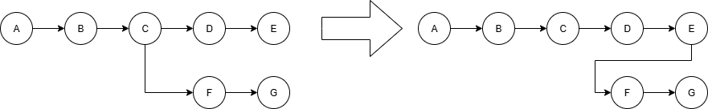

# Git与版本控制

试想以下环境：我们正在写一项作业，开发工作已经基本完成，试运行也能够得到90分。此时我们希望进一步精进代码，使得分数达到95分以上；但是经过一通修改以后，发现程序再也运行不起来了。这时候距离 ddl 只有1小时，我们决定摆烂，提交能够得到90分的代码。然后我们根据记忆改回原来的代码的时候，发现我们再也想不起来旧代码是怎么写的了！这无疑是令人极为懊恼的。

再试想另一个环境：假设我们正在开发一个大型项目，项目中有很多人参与开发。如果使用传统的方式来分发代码，那么每个人都要手动下载代码，修改代码，然后再上传代码。这时候就会出现很多问题，例如代码冲突、版本不一致等。那这就需要专门的一个人或者几个人来管理代码的版本和分发，但是这样就会显著增加工作量和复杂度。

为了避免以上问题，我们引入了版本控制（VCS）系统。一般来说，VCS系统可以分为两类：集中式版本控制系统（CVCS，也叫中心化的）和分布式版本控制系统（DVCS，也叫去中心化的）。集中式版本控制系统的特点是所有的代码都存储在一个中心服务器上，所有的开发者都需要从中心服务器上下载代码，然后再上传代码；而分布式版本控制系统的特点是每个开发者都有一份完整的代码库，所有的操作都是在本地进行的，然后再将修改推送到中心服务器上。这样就可以避免代码冲突、版本不一致等问题。

2002 年以前，Linux 内核开发完全依赖于 Linus 一个人手工检查并合并全世界发来的补丁，这样工作量非常大。于是，Linus 的一个朋友介绍了 BitMover 公司开发的商业 VCS 软件 BitKeeper 免费授权给 Linux 开发团队使用。此举招致了 FSF 的 RMS 等人的批评，认为在自由软件开发中使用非自由软件是“道德上有污点”的行为。但是作为实用主义者的 Linus 并不在意这些事情，BitKeeper 作为去中心化的 VCS，满足了 Linus 的需求。然而好景不长，有 Linux 内核开发者逆向了 BitKeeper 的协议，致使 BitMover 公司在 2005 年决定收回其授权。Git 就是在这种条件下诞生的，据说第一版 Git 是 Linus 利用 1 周休假时间完成的。随着Linux的广泛应用，Git也逐渐成为了最流行的去中心化版本控制系统，也是目前最流行的版本控制系统。


*Figure 1: 一个典型的Git工作流程*

## Git的工作原理

Git有三个目录共同完成版本控制：工作区、暂存区、版本库。工作区是项目目录，暂存区是一个隐藏的文件夹`.git`，版本库是一个隐藏的文件夹`.git/objects`。工作区是我们平时使用的目录，暂存区是Git用来存储修改的地方，版本库是Git用来存储所有版本信息的地方。版本库有一个指针，指向当前版本的某一节点（一般指向最新的节点）。每个节点都有一个唯一的哈希值[^1]，用来标识该节点。每个节点包含了该版本的所有文件和目录的信息，以及指向上一个版本的指针。Git使用哈希值来标识每个版本，这样可以保证每个版本都是唯一的。

这样讲解很难以理解，我们不妨举例说明：现在，Git中有一个版本为X的节点，包括文件A和文件B两个文件。这些文件存储在版本库中。此时，工作区为空，暂存区为空，指针指向X。我现在希望对它们进行修改，这个修改遵循以下过程：

1.  我拿出了这些文件，并且对文件A进行修改。此时，工作区有AB两个文件，但是暂存区依然是空的。我们的任何修改都不会被暂存区记录，Git也不会知道我对这些文件进行了修改。

2.  我觉得修改差不多了，现在把A放进暂存区。现在Git知道我对A进行了一些修改了。
    
    

3.  我又对B进行了类似的修改，此时B也进暂存区了。

4.  我觉得修改差不多了。我认为我应该永久保存目前的状态，于是就把暂存区提交到版本库。此时版本库多了一个Y节点，指针也指向Y节点，有修改过的AB两个文件。此时，暂存区又清空了，而工作区和版本库的Y版本一致。
    
    

[^1]: 哈希（Hash，也叫散列）指的是固定长度、像指纹一样的唯一小串字符，可用于快速校验、查找或加密等功能。

## 下载Git

一个最简单的方式是使用Winget包管理器：

```bash
    winget install Microsoft.git
```

或者你也可以从官方网站上下载并安装之。同样，安装的时候一定要勾选“添加到PATH”这一选项，否则你在命令行中无法使用Git。

## Git信息设置

安装并使用Git的第一步是先编辑本地的一些信息。Git的提交需要一个用户名和一个邮箱，来对应每次提交的作者。我们可以使用以下命令来设置这些信息：

```bash
    git config --global user.name "Your Name"
    git config --global user.email "email@example.com"
```

这样即可设置全局用户名和邮箱。如希望给某个特定仓库设置特定的用户名和邮箱，你需要在该仓库下重新执行上述命令，但是不写`--global`命令。

现代Git一般提倡使用main作为根分支的名称。而Git依然使用旧的master分支作为根分支，你可以使用以下命令修改为main：

```bash
    git config --global init.defaultBranch main
    # 这条命令会修改全局的默认分支名称
```

## Git的最基本使用

### 提交

要具体地在某一目录下进行版本控制，我们需要在命令行中进入到我们希望使用Git的目录下。然后我们可以使用以下命令来初始化一个Git仓库：

```bash
    git init
```

如果你在视窗中开启了“显示隐藏文件”这类功能，你就会发现一个隐藏的文件夹`.git`出现在了你当前的目录下。这个文件夹就是Git用来存储版本信息的地方。

然后你可以使用以下命令来添加文件到Git仓库中（这个命令的实际意义是把文件添加到暂存区）；

```bash
    git add <filename>
```

如果我们忘记了当前状态下有哪些文件被修改了，我们可以使用以下命令来查看当前状态：
```bash
    git status
```

如果你觉得修改差不多了，保存文件以后，你可以使用以下命令来提交文件到Git仓库中（这个命令的实际意义是把暂存区的文件提交到版本库中）：

```bash
    git commit -m "commit message"
```

上述内容中，-m后面是提交信息。提交信息是对本次提交的简要描述。我们建议每次提交都写上简要的提交信息，这样可以帮助我们更好地理解代码的修改历史。

### 回退

如果出现了先前我们说的不小心写坏了的情况，这时候就可以进行版本回退了。我们可以使用以下命令来查看当前的版本信息：

```bash
    git log # 例如版本库是a-b-c-d-e-f-g
```

找到你希望回退到的版本的哈希值（前几位即可），然后使用以下命令来回退到该版本（这个命令会把指针回退到指定的版本，丢弃之后的所有内容，然后丢弃暂存区和工作区的所有东西）：

```bash
    git reset --hard <commit_hash>
    # 请谨慎使用这一命令！该命令不会保留当前的修改！
```

如果你希望回退到某个版本，但是不想丢失当前的修改，你可以使用以下命令来回退到该版本（这个命令会把版本库后面的东西全部丢弃，清空暂存区，但是保留当前工作区）：
```bash
    git reset --mixed <commit_hash>
    # 我们更加推荐这个回退方式，--mixed可以省略，或者用--soft替代。
    # 用--soft替代时，不会清空暂存区。
```

使用图解来表示一下：

*Figure 2: Git的回退操作*

可以看到，回退操作虽然会把指针回退到指定的版本并丢弃之后的版本，但是之后的版本提交依然存在于版本库中，只是被从树上摘下来了。这些提交被称为“孤立提交”。如果希望恢复或者删除这些孤立提交，可以执行以下命令：
```bash
    git fsck --lost-found # 查看孤立提交、孤立分支等
    git checkout <commit_hash> # 进入分离头模式
    git branch <branch_name> # 创建一个分支来恢复孤立提交

    git gc --prune=now # 清理孤立提交
```
即使我们不使用`git gc`手动清理孤立提交，随着时间的推移（一般是90天提交记录过期），孤立提交也会被Git逐渐自动清理掉。

### 排除相关文件

有时候我们版本跟踪的时候不需要跟踪一些文件，例如具有敏感信息的文件（如密码），或者构建文件等。此时，我们可以创建一个文件 `.gitignore` 来阻止跟踪。例如，在Linux下，构建文件往往是`*.o`。那么我们可以在上述文件中加入 `*.o` ,之后git就会忽略这些文件。

## 分支管理

有时候我们想同时开发新功能，并且调优以前的代码，这样可能就需要两条线进行开发。这时，分支相关的功能就会很有帮助。Git 的分支功能允许我们在同一个仓库中创建多个独立的开发线，每个分支可以独立地进行提交和修改。

我们可以做如下假设：已经有一个名为main的分支，并已经有了一列提交记录A、B、C。现在，我希望开发一个新的功能，但是不想影响到main分支上的代码。这时，我们可以创建一个新的分支，例如feature，并在该分支上进行开发。

### 创建和切换分支

可以使用以下命令创建一个新的分支并切换到该分支：
```bash
git checkout -b feature
```

以上等价于执行
```bash
git branch feature <commit-hash of C>
git checkout feature
```

如果我现在想要回到main分支，可以使用以下命令：
```bash
git checkout main
```

### 分支变基

如果我们已经在feature分支上进行了多次提交F、G，同时在main分支上也有了新的提交D、E。现在想要将feature这些提交变基到main分支上，可以使用以下命令：
```bash
  git rebase main
  git checkout main
```
这样会把上述feature上的三个提交从C变基到E，变成F'和G'。我们可以用图解来理解这个过程：


*Figure 3: 分支变基示意图*

变基操作会改变提交的哈希值。

### 合并分支和冲突解决

如果我们想要将feature分支上的代码合并（不是变基）到main分支上，可以使用以下命令：

```bash
git checkout main
git merge feature
```

这时候我们在main分支上，并试图将E和G合并在一起。这时，会自动创建一个特殊的提交Merge，它有两个父提交。之后的提交就会以Merge为父提交，而不是E或G中的任何一个。


*Figure 4: 分支合并示意图*

如果这两个提交没有冲突，那么合并会自动完成。但是如果有冲突（例如两个分支涉及到同一行的修改），Git 会提示我们解决冲突。此时，我们不得不手动解决冲突。我们会看到以下内容（或者其英文版本）：
```bash
  自动合并 example1.txt
冲突（内容）：合并冲突于 example1.txt
自动合并失败，修正冲突然后提交修正的结果。
```
此时，我们需要打开冲突的文件，手动解决冲突。Git 会在冲突的地方插入标记，例如：
```bash
  <<<<<<< HEAD
  这是 main 分支上的内容。
  =======
  这是 feature 分支上的内容。
  >>>>>>> feature
```
我们需要手动编辑这个文件，删除这些标记，并保留我们想要的内容。

如果使用Code等编辑器，通常会有冲突解决的工具，可以帮助我们更方便地解决冲突。

解决完冲突后，我们需要使用以下命令来标记冲突已解决：
```bash
  git add .
  git merge --continue
```

### 删除分支

如果我们已经完成了feature分支上的开发，并且已经将其合并到main分支上，可以使用以下命令删除该分支：
```bash
git branch -d feature
```

一般不建议直接删除分支，而是使用 `-d` 选项来删除已经合并的分支。如果分支没有被合并，可以使用 `-D` 选项强制删除。

### 压缩提交

有时候，我们在开发过程中，可能会有很多小的提交，这些提交可能是一些临时的修改或者调试信息。为了保持代码和版本库的整洁，我们可以使用 Git 的压缩提交功能，将多个提交合并为一个提交。这个压缩功能被称作是**Squash**，但是特别注意：没有`git squash`命令。

我们一般只在分支合并的时候使用压缩提交。可以使用以下命令中的一个来压缩提交：
```bash
git merge --squash feature
```

## 标签管理
标签（Tag）是 Git 中用于标记特定提交的功能。标签通常用于标记版本发布或重要的里程碑。与分支不同，标签是静态的，不会随着提交而移动。

### 创建标签
可以使用以下命令创建一个标签：
```bash
git tag v1.0
```

这将创建一个名为 v1.0 的标签，指向当前的提交。如果需要为特定的提交创建标签，可以在命令中指定提交的哈希值：
```bash
git tag v1.0 <commit-hash>
```

### 查看标签
可以使用以下命令查看所有标签：
```bash
git tag
```

### 删除标签
如果需要删除一个标签，可以使用以下命令：
```bash
git tag -d v1.0
```

## “摘樱桃”

Cherry-Pick（摘樱桃）操作（也叫挑拣）是指从一些提交中选择一些特定的提交（修改），并将这些提交（修改）应用到当前分支上。这适用于当我们只想要一些特定的提交而不是整个分支的所有提交的时候。

一般，CherryPick操作很难使用命令行来操作，其复杂程度过高。我们可以使用VS Code的自带Git视窗或者GitLens等工具来进行这个操作。

使用视窗进行挑拣非常方便，我们只需要在提交列表中选择需要的提交，然后右键点击“Cherry-Pick”（汉化应该是挑拣）即可。这样会将选中的提交应用到当前分支上。
